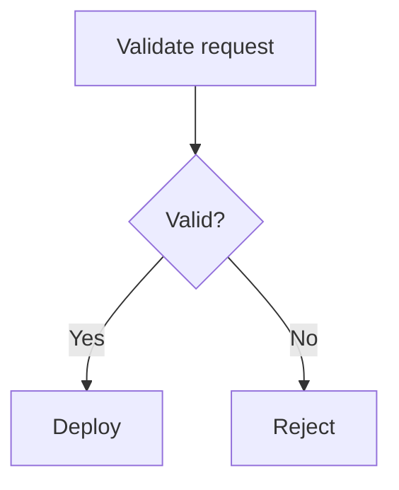

# Documentation Media

User interface instructions, keyboard input, illustrations, and accessibility. The Markdown
linter reports an image without alt text and a table without a header row. The prose checker
reports "click here," the interaction verbs outside the chosen set, and "Image of" in alt
text. This guide holds the decisions those tools cannot judge.

## User interface instructions

An instruction matches the current product. The label's wording, capitalization, and
punctuation are reproduced exactly in bold: `Select **Create project**.` Prose uses sentence
case even when the interface styles a label uppercase. Capitals stay when they are part of
the label. The location comes before the action: `In **Visibility**, select **Private**.` A
navigation path keeps its separator outside the bold: `**Settings** > **Access control**`.

An element is named, never identified only by position or appearance, such as "the green
icon" or "the box below." Layouts move, and appearance is not available to every reader.
Position is a secondary orientation: "In the upper-right corner, select **Account**." A
responsive difference is described only where the action becomes ambiguous, not at every
viewport: "If **Security** is not visible, expand the repository menu."

Before a procedure, state the required role or access level, and the product, plan, or
feature availability. State deployment-mode limits and whether an administrator must enable
the feature. Name the level that directly controls the action, not a role that happens to
include it.

### Interaction verbs

<!-- level: all -->

One project convention covers buttons and menus. `select` covers a button, tab, menu,
checkbox, radio option, or dropdown value. `click` appears only where mouse interaction
matters and the style chooses device-specific language. `enter` is for text in a field, `run`
for a command, and `press` for a key. `open` is for a page, file, or application, `expand` for
a collapsed section, and `deselect` to clear an option.

Self-explanatory fields get "Complete the fields." Only a field with a non-obvious
requirement is explained. Several such fields become a list or a configuration reference
rather than one overloaded step.

## Keyboard input

Each key is an HTML `<kbd>` element. Letters are capitalized and action keys spelled out.
A simultaneous combination has no spaces around its `+`, and a sequence is written
distinctly from a combination. macOS uses `Command`, `Option`, and `Control`; Windows and
Linux use `Ctrl` and `Alt`; arrows are `↑`, `↓`, `←`, and `→`.

```html
Press <kbd>Command</kbd>+<kbd>B</kbd>.
```

Platform variants come in one fixed order, macOS first in an Apple-first project and
otherwise by primary audience. When both an interface path and a shortcut exist, the visible
procedure comes first. The shortcut is documented where it is the primary or faster path.

## Illustrations

An illustration is a screenshot, diagram, chart, or static image. It exists when it
materially clarifies a complex relationship, a multi-step flow, a spatial interface state, an
architecture boundary, or a comparison prose cannot express. It never exists to make a page
look less textual, and it always supplements text rather than replacing it.

A screenshot is captured from a current build in the standard project theme with realistic
fictional data. It holds no personal or secret information. Irrelevant panels and
notifications are closed, and the window is sized to cut empty space. It shows only the
relevant interface with enough context to orient the reader, at one scale per page, without
browser chrome or volatile sidebars. Afterwards it is cropped, checked for legible text,
compressed, previewed at rendered size, and checked in light and dark themes. A highlight
uses the project-standard arrow callout, never color alone, and the highlighted element
appears in the alt text.

Screenshots are PNG. Diagrams and line art are SVG when the source is safe and editable.
Photographs are JPEG or WebP where the renderer supports it and the saving is real. Images
live in a documentation-owned directory, never hotlinked. Names are lowercase kebab-case and
say subject, action, and element: `repository-create-button.png`,
`deployment-request-flow.drawio.svg`, never `image1.png`.

Without a project budget a screenshot targets 1000 by 500 pixels and 100 KB. These are
maintenance targets that never make text unreadable. A version suffix appears only when the
workflow tracks image refreshes by version. Animated GIFs are replaced by a static
screenshot, a short sequence, or an accessible video with text instructions. They distract,
resist inspection, weigh, localize badly, and go stale.

A diagram serves a process, state transition, architecture, or entity relationship hard to
follow in prose. Mermaid is preferred where the renderer supports it, because the source is
searchable, reviewable, and versioned with the text. An editable SVG from an approved tool
serves a layout Mermaid cannot produce, stored with its definition. A diagram holds only
essential elements: rectangles for processes, diamonds for decisions, arrows for direction,
and consistent solid and dotted lines. Shape and label carry meaning rather than color, equal
concepts get equal shapes, and labels stay short with room around them.

A diagram embeds no untestable links and is checked on small screens. A complex diagram
becomes several focused ones. Every diagram changes with the behavior it shows.

````markdown

````

A video reinforces text that already documents the complete procedure. It carries captions,
a transcript for unique information, and a publication date where staleness is likely. It is
linked rather than embedded unless the embed clearly helps, and it uses the platform's
privacy-preserving embed where available. It is not committed to the product repository
without an asset workflow, and it is removed or replaced when outdated.

## Accessibility

Accessibility is a content requirement. Hierarchy is headings, list relationships are lists,
tabular data is a table, and code is code formatting. Alerts carry their defined meanings.
Structure is never imitated with bold, spaces, or blank lines. Essential meaning is never
carried only by color, bold, italics, position, shape, an icon, or an image; the state or
action is named in text.

Instructions use general verbs such as "select" unless a device action matters, because not
every reader has a mouse, touchscreen, or physical keyboard. Steps stay short, prerequisites
come first, and unfamiliar terms are explained. Choices are minimal, names are consistent,
navigation holds no surprises, and a warning sits beside its risky action.

Every meaningful image has alt text that states its purpose in context and the relevant state
or relationship. Alt text is in sentence case, ends with punctuation, uses no formatting
syntax, and does not repeat the surrounding paragraph. It mentions a highlight when it
matters. It opens with the visual type and product context, not "Image of":

```markdown


```

A complex diagram gets a short alt description with the full flow in nearby text. A purely
decorative image gets empty alt text, ``, never a missing
attribute. Links use descriptive text and are not distinguished by color alone. They do not
sit adjacent without separating text, and they open no new window without a platform-standard
reason and a visible indication. Tables have headers, a logical reading order, and no merged
cells or blank cells. Icons are explained in text or accessible labels, and a wide table is
split into smaller structures.
