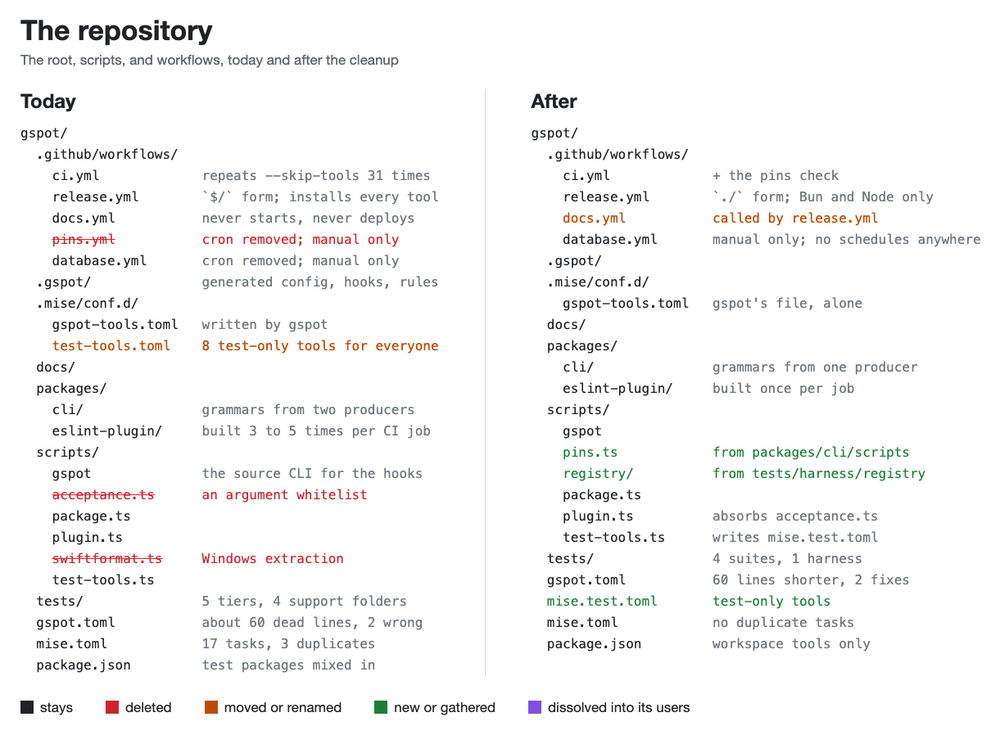
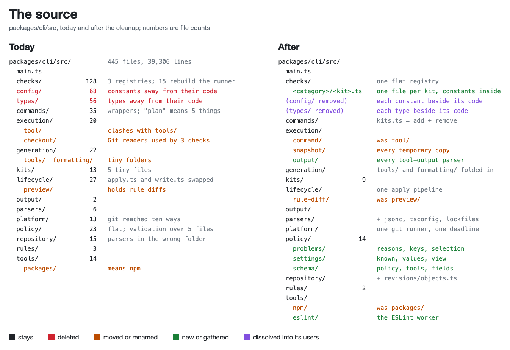
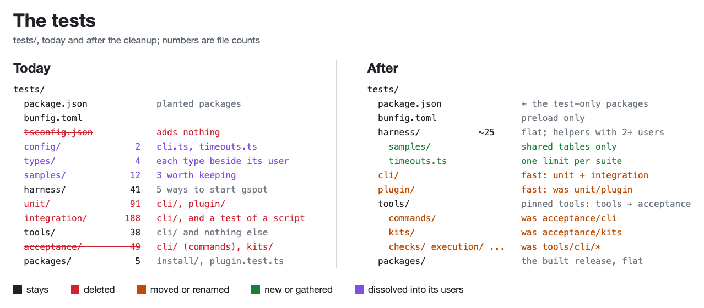
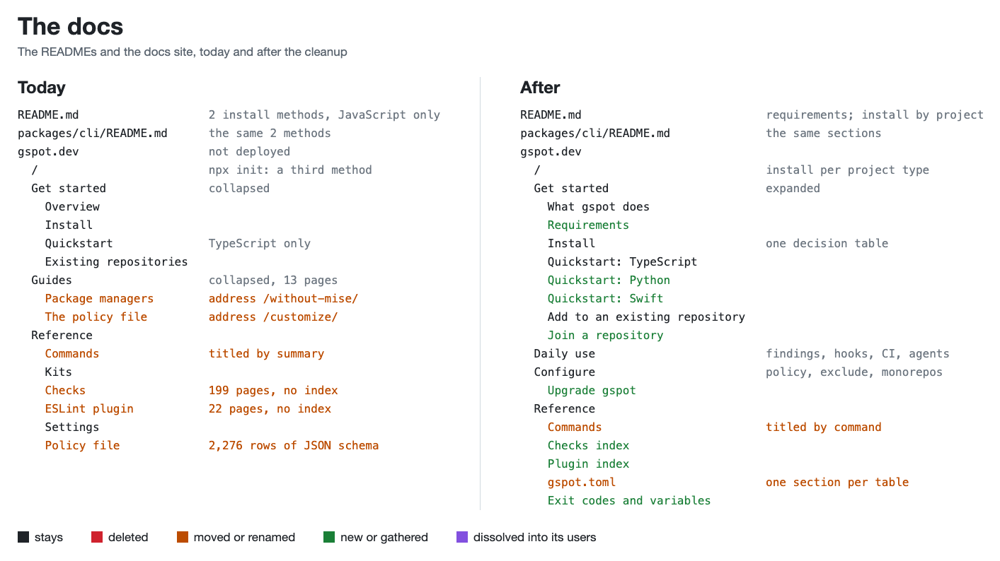
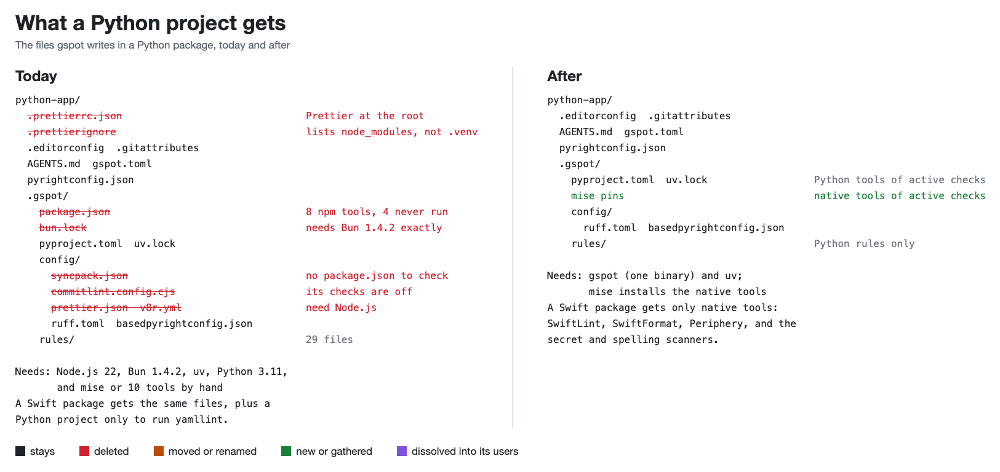

# Findings: What to Clean Up in gspot

October 3, 2026. Twelve audits read the source, the tests, the docs, the kits, and the repository setup. One more tried gspot
in a Python package, a Swift package, a React Native app, and a monorepo. Together they found 820 problems. This file
lists the biggest ones, answers your questions, lists the decisions you need to make, and gives a plan to fix everything.
The detailed findings follow, one section per area, each with the file, the problem, and the fix.

- [The biggest problems](#the-biggest-problems)
- [Answers to your questions](#answers-to-your-questions)
- [Decisions for you](#decisions-for-you)
- [The plan](#the-plan)
- [Diagrams](#diagrams)
- [Findings by area](#findings-by-area)

Some tool claims come from what the auditors know about those tools, not from runs. The checks section marks them. Check
each one before acting on it.

## The biggest problems

**1. Nobody can install gspot today.** Neither `@gspothq/cli` nor `@gspothq/eslint-plugin` is on npm, and gspot.dev
serves a parked page. Every install command and every docs link fails. In a JavaScript project, `init` stops at "bun
lock resolution failed" and leaves a `gspot.toml` behind, which then blocks a second `init`.

**2. Projects in other languages get JavaScript tooling.** A Python package gets an npm tool project with 8 tools, a Bun
lockfile, and Prettier files at its root. Half of those tools serve no check that runs. A Swift package needs Node.js,
Bun 1.4.2 exactly, uv, Python 3.11, and mise or Homebrew. Only Xcode belongs to its stack.

**3. The docs mislead.** They give three install methods and no rule for choosing one. The README sequence fails at its
second command. No page states the real requirements: uv, and either mise or seven native tools. Python and Swift users
get no path, and several guides describe behavior the code does not have.

**4. One project's choices ship to every user.** Examples are `HF_TOKEN` and `CUDA_MODULE_LOADING` in the naming
allowlist, and the helper names of one application in the Semgrep rules. Others are the folder patterns of one project,
the vocabulary of the gspot docs, and 19 house-style Bash checks. The kits also ban folder names that gspot itself
has to allowlist.

**5. Each module is split across three folders.** The `gspot.toml` of this repository turns on `types_directory` and
`config_directory`. As a result, constants and types live in the mirror trees `config/` (68 files) and `types/` (56 files), away
from their code. Of those constants, 84% have one user, and so do 52% of the types. The split breaks a naming rule that
gspot itself ships.

**6. One job has many code paths.** Git is called through about ten entry points. A repository file can be read five
ways, and so can `package.json`. Two modules parse lockfiles. Four checks do one "regenerate and compare" job, and
about 15 checks rebuild the generic tool runner.

**7. Thin layers hide the work.** A `check` run passes through about 10 hops. Install has three nested wrappers, and its
dry run keeps its own copy of the install steps. Policy validation runs through five files with near-synonym names.

**8. Names hide what things do.** `execution/tool/` sits beside `tools/`. "Packages" has three meanings, "plan" five, and
"rules" four. `javascript/rules-off` checks that rules are on. "Skip these paths" is the meaning of thirteen settings, and 18
settings under `tools.` belong to kits that are not tools.

**9. The code has real bugs.** For example, `gspot ignore --remove` reports success when apply fails.
`check --changed main` reads `main` as a path. Level `all` adds no compiler flags, and a symlinked `.gitattributes`
breaks every command. The plan lists them all in phase 1.

**10. Many tests prove little.** Five test tiers exist where three run requirements do. The audits found 187 problems in
single tests. They are duplicates across tiers, tests that cannot fail, mocks of internal gspot code, and
assertions on internals. The 41-file harness has five ways to start gspot and a second implementation of `apply`.

**11. The repository carries ceremony.** Two weekly crons have never run. The docs workflow cannot start and cannot
deploy. The workflows repeat one flag 31 times, every contributor installs eight test-only tools, and `gspot.toml`
holds about 60 dead lines.

## Answers to your questions

### Why `check-state.ts`, `json-schema.ts`, `loosening.ts`, `normalize.ts`, `setting-surface.ts`, and `written-keys.ts` exist

| File                        | What it does                                                                                                                                                                                        | What to do                                                                            |
| --------------------------- | --------------------------------------------------------------------------------------------------------------------------------------------------------------------------------------------------- | ------------------------------------------------------------------------------------- |
| `policy/check-state.ts`     | It holds no policy state. It returns a display string for `gspot list`, and the planner filters checks by comparing that string to `'off (level)'`. It also copies an ignore test from the planner. | Delete it. One status function in the planner returns a cause, and `list` formats it. |
| `policy/json-schema.ts`     | It builds the published JSON Schema of `gspot.toml`. The CLI never imports it; only the docs site and one test do.                                                                                  | Move it to the docs package.                                                          |
| `policy/loosening.ts`       | It decides whether a reason is acceptable and whether a value is weaker than the default. Five callers need it.                                                                                     | Merge it into `policy/problems/reasons.ts`.                                           |
| `policy/normalize.ts`       | It turns the raw TOML into the policy object. It is needed. It also renames keys that `settings.ts` then maps back.                                                                                 | Keep it, and keep the TOML key names.                                                 |
| `policy/setting-surface.ts` | It lists every setting the selected kits declare, with defaults. It is needed, but it was split out of `settings.ts` only to shorten that file.                                                     | Rename it to `policy/settings/known.ts`.                                              |
| `policy/written-keys.ts`    | It lists the keys a table writes. It has one caller.                                                                                                                                                | Merge it into its caller, `policy/problems/keys.ts`.                                  |

### Why there are so many files, why they are not in sensible folders, and why the names are so bad

Three habits caused it. Files were split by length to meet the file-size limit, not by concept. Constants and types moved
into the `config/` and `types/` mirror trees because the `gspot.toml` of this repository turns that layout on. Renames
were done by search and replace: "configuration" became "kit" in the wrong places (`kitName`, `KitDocument`), and
"confined" became "files" in the comments of the file-safety code. The fix is the layout in the
[source diagram](#diagrams), which puts constants and types beside their code, `policy/` in three subfolders, and the
checks in one file per kit. It also applies every merge and rename the area sections list.

### Why `scripts/gspot` is here

The Git hooks run `mise exec -- gspot`. `mise.toml` puts `scripts/` on the mise `PATH`, so `gspot` resolves to
`scripts/gspot`, a two-line file that runs the source CLI. That lets this repository's hooks run the code you are editing,
with no build. Keep it. Delete the `gspot` mise task, which does the same thing a second way.

### Why the repository has `scripts/test-tools.ts`, `.mise/conf.d/test-tools.toml`, and `.mise/conf.d` at all

`.mise/conf.d/` is a product contract: gspot writes its tool pins to `.mise/conf.d/gspot-tools.toml` in every repository
that uses mise, so it never edits your `mise.toml`. `scripts/test-tools.ts` pins eight tools that only the tool and
acceptance suites need, such as Trivy, SwiftLint, and Deno, and reads their versions from the kit manifests. The script
is useful, but its file sits in the folder gspot owns and makes every contributor install those eight tools. Move it to
`mise.test.toml`, loaded with `MISE_ENV=test`.

### What `pins.yml` is for, and why the crons exist

`pins.yml` asks npm, PyPI, crates.io, and GitHub whether every pinned tool release exists. The check is useful; the weekly
cron was ceremony. Pins change only in a commit that edits a manifest, and the workflow never ran. The schedule is gone,
so it runs only by hand. Run the check in CI when a manifest changes, and delete `pins.yml`.

### What the Supabase "database journey" is, and who it is for

`database.yml` runs one test for gspot maintainers. It starts a local Postgres with the Supabase CLI and checks that
`supabase/types-fresh` rejects stale database types. Users never see it. Its weekly cron repeated the same pinned inputs
and never ran. The schedule is gone, so it runs only by hand. Keep it for manual runs, or delete it.

### Whether the workflows are for gspot itself or templates for other repositories

All five workflows serve this repository only. Users get a generated `.github/workflows/gspot.yml` instead. Keep `ci.yml`
and `release.yml`. `docs.yml` never starts, because the release it waits for is created with `GITHUB_TOKEN`, and its
deploy waits for a variable and a Pages site that do not exist. `release.yml` uses a `$/` form that GitHub does not
document.

### Why `grammars` is plural, and whether to gitignore it

Both are right. The folder holds eight tree-sitter grammars. Seven are copies of npm package files, and one is a verified
download, about 9 MB in all. They are copied because the npm packages compile native code at install. The way they are
produced is not simple: setup downloads one, the build copies seven, and a checkout reads different files before and
after a build. Let setup write all eight, and let the CLI read only `grammars/`.

### Where `HF_TOKEN` and `[[config.selectors]]` come from

`HF_TOKEN` and `CUDA_MODULE_LOADING` are in the shipped `packages/cli/kits/general/naming/policy.json`, not in
`gspot.toml`, so every user inherits names from one machine-learning project. Delete them. `[[config.selectors]]` sit in
the NestJS and React Native kits. Most encode framework-wide practice and belong there. The two NestJS rules that forbid
injecting a repository into a controller are a layering choice for each project.

### Which settings are too specific for gspot and belong to each project

The [kits section](#kits-settings-and-names) lists 154 findings. The main ones are below:

- names from one application in the Semgrep rules, such as `supabaseAuthMiddleware`, `createAdminClient`, and
  `validateRequestJson`
- one project's folders, such as `**/api/src/`, `/shared/**`, and `**/features/*/server/**`
- the docs style of gspot itself: its Vale vocabulary, acronyms such as `NVIDIA` and `GRDB`, and its rule disables
- exceptions for one codebase, such as two WebKit prefixes, `CoreGraphics`, and a chosen license allowlist
- naming groups that cannot be removed and ban common React words such as `fallback` and `newValue`
- the house-style checks: shortest-first ordering, the Bash headers and guards, and the Postgres migration boxes

Move each to the project's own `gspot.toml`, or into an opt-in kit.

### Why the README says "JavaScript or TypeScript" and installs locally and then globally

Both are mistakes. gspot serves any stack, and the README offers two install methods without saying when to use which.
A global install also conflicts with the exact version each repository pins in `.gspot/version`, so one machine can serve
only one version. Choose one method per project type, and say it once:

| Your project                          | Install                                                                                     |
| ------------------------------------- | ------------------------------------------------------------------------------------------- |
| Has `package.json`                    | `npm install --save-dev --save-exact @gspothq/cli`, then `npx gspot init`                   |
| Uses mise, any language               | `mise use gspot`, which pins gspot and every native tool for the repository                 |
| Python, Swift, or other, without mise | A decision for you: mise by default, or a compiled binary through `uvx`, Homebrew, and mise |

The [docs section](#documentation-readmes-guides-generated-reference-and-site-structure) gives the full README outline,
the new docs tree, and 99 findings.

### Whether Python, Swift, React Native, and monorepo projects see JavaScript tooling

| Project                        | What gspot writes today                                                                              | What is wrong                                                                                                        |
| ------------------------------ | ---------------------------------------------------------------------------------------------------- | -------------------------------------------------------------------------------------------------------------------- |
| Python package                 | 57 files, including an npm tool project with 8 tools, a Bun lockfile, and Prettier files at the root | 4 of the 8 npm tools serve no active check. The Prettier files sit at the root of a Python project.                  |
| Swift package                  | 56 files, the same JavaScript files, and a Python project only to run yamllint                       | `gspot install` installs 8 of 21 tools. Doctor says "Run: gspot install" for tools install never installs.           |
| React Native app               | `init` failed at lock resolution                                                                     | The ESLint config declares Node.js globals. The agent rules say `Buffer` exists. Expo tools are pinned without Expo. |
| TypeScript and Python monorepo | `init` failed at lock resolution                                                                     | Scoping is right: JavaScript checks stay in `apps/web` and Python checks in `services/api`.                          |

The fix has two parts. First, pin only the tools of checks that run, and avoid Node.js tools for non-JavaScript files.
Second, ship gspot so that a Python or Swift developer needs no Node.js.

### Whether gspot needs a Python or other implementation

No. Keep one TypeScript implementation and fix how it ships:

- **Size:** a second implementation repeats 39,306 lines, 53 kit manifests, 77 templates, and 428 test files.
- **Templates:** the kit templates contain JavaScript expressions, so another language cannot reuse them.
- **Byte-identical output:** gspot compares generated files against stored hashes. Two implementations must produce the
  same bytes. Otherwise, teammates see each other's files as changed.
- **Mixed repositories:** a monorepo with a web app needs Node.js for ESLint anyway.

What Python and Swift developers object to is installing Node.js. A binary built with `bun build --compile` and shipped
through npm, PyPI, Homebrew, and mise removes that. This reopens your September 29 decision against per-platform binaries,
so it is listed under decisions.

### Why `tests/tools` has a `cli` folder, why acceptance and integration exist, what samples are, and how to group tests

- **`tests/tools/cli`:** the `cli` level was copied from `tests/unit`, which tests two packages. `tests/tools` holds
  nothing but `cli/`, so the level adds nothing. `tests/integration/cli` and `tests/harness/cli` repeat it.
- **Acceptance and integration:** the five tiers are ceremony. Only three run requirements exist: no tools, pinned tools
  with a local registry, and a built package.
    - Unit and integration run in one task and one CI job, and only 43 of 188 integration files run the CLI in-process.
    - Tools and acceptance run in one CI job with the same shards.
- **Samples:** they are planted text that tests write into sandboxes. Three files are worth keeping. The rest repeat
  strings, have one user, or copy a harness file.
- **Grouping:** use one folder per suite: `tests/cli` and `tests/plugin` (fast, no tools), `tests/tools` (pinned tools),
  and `tests/packages` (the built release). Inside each, mirror the source. Keep one flat `tests/harness` for shared
  helpers. Test types sit beside the test or helper that uses them, not in the harness.

### Which tests are fake

The audits read every test file and found 187 problems in single tests. These are the patterns:

- the same behavior tested in two or three tiers, such as the typos partial fix and `bash/syntax`
- tests that cannot fail: a value compared with itself, a row that repeats another row, checks for files nothing writes,
  and a test of a cache that does not exist
- acceptance tests that install a whole sandbox to test the built-in checks of gspot, which need no native tool
- mocks of internal gspot functions instead of the process boundary, and assertions on call counts, argv copies, and
  internal fields
- timing races, and whole message sentences pinned where no contract fixes the wording
- many rows that hit one branch, each one running gspot again

Delete the duplicates and the tests that cannot fail. Move each test to the cheapest suite that can run it. Assert
behavior and public output, and mock only the process boundary. The [test sections](#unit-tests-and-check-integration-tests)
list every case.

### What else in this repository, or in what gspot installs, is junk

- Prettier files at the root of Python and Swift projects, and `syncpack` and `commitlint` configurations where nothing runs
  them
- Vale style folders in `.gitignore` when the prose kit is not selected
- an ESLint level table of 1,577 entries, of which 1,274 are never read, written into every generated ESLint config
- `eslint-plugin-jsx-a11y` loaded in React Native with all 39 of its rules off
- a SwiftFormat configuration that enables 19 rules and then disables them
- an ESLint plugin built three to five times in every CI job
- development tasks that import the test harness, which is the wrong direction

## Decisions for you

Each decision blocks part of the plan. The recommendation comes first.

### Product

**1. Install for non-JavaScript projects.** Recommended: ship a compiled binary through npm, PyPI (`uvx`), Homebrew,
and mise, and make mise the default runner when it is installed. Alternative: keep npm only and document mise.

**2. Node.js tools in Python and Swift projects.** Recommended: none. Replace Prettier, markdownlint, and v8r there with
native tools, or drop those checks for those stacks.

**3. House-style checks.** Recommended: move them out of the shipped kits into an opt-in kit. This covers shortest-first
ordering, the Bash contract, the migration boxes, the README template, banned folder names, and the naming groups.

**4. One-project defaults.** Recommended: delete them from the kits: `HF_TOKEN`, one application's helpers, one
project's folders, and the gspot docs vocabulary.

**5. The level `all`.** It is not "all checks": experimental rules stay off. Recommended: keep the name. Make sure each
level adds what it promises, starting with the compiler flags.

**6. Breaking renames.** Many setting and check names change. Recommended: break them now, before the first release.

### Code

**7. `types_directory` and `config_directory`.** Recommended: gspot stops using them, and constants and types move
beside their code. Decide separately whether users keep the settings.

**8. Tools that replace checks.** Recommended: replace a check with a tool gspot already ships when a run confirms the
tool covers the case. The checks section names the candidates.

**9. The `apply --dry-run` rule diff.** It reads generated files back through five parsers and an ESLint process, about
650 lines. Recommended: compare rule data before it is written instead.

**10. `check` flags.** Recommended: one `--hook <name>` replaces `--hook`, the hidden `--push`, and the stage meaning of
`--staged`, and `--changed` takes a `--base <ref>`.

**11. Vale downloads.** Recommended: only `gspot install` downloads Vale packages, not `apply` or `set`.

### Tests

**12. Suites.** Recommended: merge unit with integration into `tests/cli`, and acceptance with tools into `tests/tools`.

**13. Time limits.** Recommended: one default per suite instead of about 110 limits on single tests.

**14. Test packages.** Recommended: move `testdirs`, `verdaccio`, and the rule tester to `tests/package.json`.

### Repository

**15. Docs hosting.** Where will gspot.dev be served? Until a host exists, the deploy job waits.

**16. Release.** Recommended: create the `release` environment with a required reviewer before the first release, and
use `./` instead of `$/`.

**17. Crons.** Done on October 3: both weekly schedules are gone (`f513db1c`), and `pins.yml` and `database.yml` run only by hand. No workflow runs on a schedule, and none will.

**18. Test-only tools.** Recommended: move them to `mise.test.toml`.

**19. `GSPOT_CI_ENABLED`.** No workflow reads it. Recommended: delete it.

Each area section ends with its own questions, which hold the details.

## The plan

Run the phases in order. Each phase lands as commits on `main`. Lint and test them before each push. The area sections
hold the file-level steps.

### Phase 1: fix the bugs

- `gspot ignore --remove` hides an apply failure behind a success line.
- `init --ci github` and `init --ci gitlab` are ignored when the repository has a lint job.
- `check --changed main` reads `main` as a path, and `check --dry-run` without `--fix` does nothing.
- `apply`, `set`, `ignore`, `add`, `remove`, and `init` download Vale packages, although their help says they install no
  tools.
- `init` writes `gspot.toml` before it resolves the tool locks. A failure leaves the file, hides the package manager
  output, and blocks a second `init`.
- `Root.read` refuses links, but reads user files such as `.gitattributes`, so a symlinked one breaks the repository read.
- Doctor says "Run: gspot install" for native tools that install never installs.
- Level `all` adds no compiler flags, `limits.file_kb` has no value at level `recommended`, and setting
  `tools.eslint.restricted_imports` drops the Zustand rule.
- `architecture.contracts` is accepted and never read, and `RUFF_PREVIEW_RULES` contains `null`.
- React Native code gets Node.js globals, and the SwiftFormat configuration enables rules and then disables them.
- In `gspot.toml`, `tools.eslint.node_version` and `architecture.roles.runtime` switch off two checks they mean to keep.
- The comments garbled by the "confined" to "files" replacement in the file-safety code.

### Phase 2: stop shipping one project's choices

Delete the one-project names, helpers, folders, and docs vocabulary from the kits. Move the house-style checks into an
opt-in kit, per decision 3. Source: the [kits section](#kits-settings-and-names) and the
[checks section](#built-in-checks-srcchecks-srcconfigchecks-srctypeschecks).

### Phase 3: install cleanly in every stack

Pin only the tools of checks that run. Write no Prettier files and no npm tool project in projects that need none. Make
`gspot install` install the native tools, or default the runner to mise. Then ship the binary, per decision 1. Source: the
[developer experience section](#developer-experience-in-non-javascript-and-mixed-projects).

### Phase 4: restructure the source

1. Delete the `config/` and `types/` mirrors, and move each constant and type beside its code.
2. Group `policy/` into `problems/`, `settings/`, and `schema/`.
3. Apply the layouts of the commands, lifecycle, and generation section and of the execution, tools, repository, platform,
   and parsers section.
4. Give Git one runner with one deadline, file reads one path, and lockfiles one parser.

See the [source diagram](#diagrams).

### Phase 5: shrink the checks

Use one flat registry and one file per kit. Fold the checks that rebuild the tool runner into manifest commands. Merge the
four freshness checks into one. Replace checks with the tools gspot already ships, after a run confirms each one. Source:
the [checks section](#built-in-checks-srcchecks-srcconfigchecks-srctypeschecks).

### Phase 6: name settings and checks clearly

Give settings one naming rule: `tools.<tool>.*` for tool options and `<kit>.*` for kit options. Use one way to skip paths
(`[[ignore]]` with `paths`) and one way to accept a finding. Rename the vague and wrong check names. Source: the
[kits section](#kits-settings-and-names).

### Phase 7: rebuild the tests

Move to the four suites and one harness of the [tests diagram](#diagrams). Delete the duplicates and the tests that cannot
fail. Move each test to the cheapest suite that runs it, and set one time limit per suite. Move the local registry from
the harness to `scripts/`. Source: the four test sections.

### Phase 8: cut the repository ceremony

Fold the pins check into CI for manifest changes. Keep the Supabase test as a manual workflow. Add no scheduled workflow
anywhere. Fix `docs.yml` and `release.yml`, delete the 31
`--skip-tools` flags, and move the test-only tools to `mise.test.toml`. Remove the dead lines from `gspot.toml`, and give
the grammars one producer. Source: the [repository section](#repository-setup-and-ceremony).

### Phase 9: rewrite the docs

Rewrite the README install section by project type, and state the real requirements. Build the new docs tree with Python
and Swift quickstarts. Title command pages by command, add check and plugin indexes, and replace the raw schema page.
Write every page in plain language (ISO 24495). Source: the
[docs section](#documentation-readmes-guides-generated-reference-and-site-structure).

## Diagrams

Each image compares today with the target. Red means deleted. Orange means moved or renamed. Green means new, or
gathered from several places. Purple means dissolved into the code that uses it.

### Repository



### Source



### Tests



### Docs



### What a Python or Swift project gets



## Findings by area

### Developer experience in non-JavaScript and mixed projects

gspot installs JavaScript tooling into every project, whatever the stack. A Python package gets a Bun-locked npm project with 8 tools, a root `.prettierrc.json` and `.prettierignore`, and a commit linter whose checks are off at its level. A Swift package needs Node.js, Bun 1.4.2 exactly, uv, Python 3.11 or newer, and mise or Homebrew before its checks can pass. `gspot install` installs 8 of its 21 tools. The React Native and monorepo inits failed at lock resolution and left a `gspot.toml` that blocks a second `init`.

One TypeScript implementation is enough. Ship it as a compiled binary through npm, PyPI, Homebrew, and mise. Pin tools per active check, so that a non-JavaScript stack needs no Node.js.

#### Answers to the owner's questions

##### 1. Whether gspot installs cleanly in each kind of project

No for Python and Swift. Both get an npm tool project, a Bun lockfile, and Prettier files at the root. Half of the npm tools serve no check that runs at level `recommended`. The React Native app and the monorepo did not install at all: `init` stopped at `bun lock resolution failed (exit 1)`.

| Sample                             | npm tools pinned | npm tools no active check uses                                                                          | Python tools pinned            | JavaScript files at the root          | `init --yes --no-install --no-hooks` |
| ---------------------------------- | ---------------- | ------------------------------------------------------------------------------------------------------- | ------------------------------ | ------------------------------------- | ------------------------------------ |
| Python package                     | 8                | 4: `@ast-grep/cli`, `@commitlint/cli`, `license-checker-rseidelsohn`, `syncpack`                        | 9                              | `.prettierrc.json`, `.prettierignore` | exit 0                               |
| Swift package                      | 7                | 3: `@ast-grep/cli`, `@commitlint/cli`, `syncpack`                                                       | 1 (`yamllint`)                 | `.prettierrc.json`, `.prettierignore` | exit 0                               |
| React Native app                   | 37               | 4, plus 2 Expo tools in an app without Expo, plus `eslint-plugin-jsx-a11y` with all 39 rules turned off | 2 (`pip-licenses`, `yamllint`) | expected for this stack               | exit 2, partial write                |
| TypeScript app plus Python service | 27               | 4                                                                                                       | 9                              | expected for `apps/web`               | exit 2, partial write                |

Evidence for "no active check uses":

- `gspot list` in the Python sample prints `commits/commitlint off (level)`, `commits/commitlint-range off (level)`, `dependencies/syncpack off (level)`, and `licenses/packages waits for tools.licenses.allowed`.
- `ast-grep` is called only by the Bash kit (`packages/cli/src/checks/language/bash/ast-grep.ts:29`), but the `structure` kit, which every project gets, pins it (`packages/cli/kits/general/structure/manifest.toml:9-16`).
- Tools are collected per selected kit, with no look at the level, the `files` filter, or the `when` condition (`packages/cli/src/tools/pins.ts:38-61`).

The monorepo scoping is correct. `gspot.toml` puts `javascript` and `typescript` under `[[scope]] path = "apps/web"` and `python` under `services/api`. The ESLint, TypeScript, Ruff, and basedpyright configurations land in per-scope folders under `.gspot/config/`. No JavaScript check reads the Python service.

##### 2. How a Python or Swift developer installs and runs gspot today

Today they cannot install it from npm. The README badge reads `npm: unreleased` (`README.md:3`). The only path is a source checkout run with Bun, as in this review.

After publication, the documented path for a repository without `package.json` is `npm install --global @gspothq/cli` (`docs/src/content/docs/guides/install.md:21-23`). The binary starts with `#!/usr/bin/env node` and needs Node.js 22 or newer. The docs list Node.js and Git as the prerequisites. The code needs more:

- `gspot init` resolves both tool locks even with `--no-install` (`packages/cli/src/lifecycle/write.ts:61-62`). That runs `bun install --lockfile-only` and `uv lock`, so init needs registry access, uv, and a Python 3.11 or newer on the host. uv runs with `--no-python-downloads` (`packages/cli/src/tools/python.ts:138`). The Swift sample needs uv and Python only to lock `yamllint`.
- The npm tool project uses Bun when Bun is on the PATH of the person who runs init, and npm otherwise, at that machine's version (`packages/cli/src/tools/packages/identity.ts:77-87`). All four samples recorded `"packageManager": "bun@1.4.2"`.
- Every later install refuses any other version: "The tool project requires bun@1.4.2. Install that package manager version first." (`packages/cli/src/tools/packages/commands.ts:77-85`).
- `gspot install` installs the npm tools and the Python tools only. Native tools (SwiftLint, SwiftFormat, Periphery, gitleaks, TruffleHog, lychee, osv-scanner, taplo, typos, dotenv-linter) are installed only when the runner is mise (`packages/cli/src/commands/install/steps.ts:25`). Init takes the detected runner as the default (`packages/cli/src/commands/init/questions.ts:55-58`), which is `none` for Python and Swift.
- With a PATH of only Bun and `/usr/bin`, `gspot doctor` in the Swift sample reports 18 of 21 tools missing. `gspot install --dry-run` lists only `bun install --frozen-lockfile` and `uv sync --locked`. Doctor tells the user "Run: gspot install" for the native tools that install never installs.
- `.gspot/version` pins the gspot version per repository. A global install serves one version, so two repositories with different pins conflict. The mismatch message offers `gspot apply`, which moves the shared pin to whatever the developer happens to have installed (`packages/cli/src/policy/messages.ts:175-181`).

A Swift developer today needs Node.js 22, Bun 1.4.2 exactly, uv, Python 3.11 or newer, mise or Homebrew for 10 native tools, and Xcode. Only Xcode belongs to their stack.

A clean install story has two parts. Both are needed.

1. **Distribute gspot as one compiled binary, through the channel each ecosystem already uses.** Build it with `bun build --compile` from the same TypeScript source, for macOS, Linux, and Windows, in one release job. Publish it as:
    - the npm package for JavaScript repositories, unchanged
    - a platform wheel on PyPI that holds the binary, so `uvx gspot@<pin> check` and `pipx install gspot` work. The pin then comes from the command, not from global state.
    - a GitHub release that mise installs through its `github:` backend. gspot already writes a mise file per repository, so mise also enforces the pin.
    - a Homebrew formula, for developers who want one global copy

    The pieces are mostly in place. The build already uses `Bun.build` (`packages/cli/scripts/build.ts:20-33`), and every command in this review ran from source on Bun. The work left:
    - Embed the kits, rules, and grammars. Today they are read from the package folder (`packages/cli/src/platform/assets.ts:13-31` and `:61-72`).
    - Write the `ast-grep` rule files to a cache folder, because a tool reads them by path (`packages/cli/src/checks/language/bash/ast-grep.ts:28`).
    - Replace the ESLint preview worker that is started with `process.execPath` and `configuration.js` (`packages/cli/src/lifecycle/preview/eslint/client.ts:23-31`). Only JavaScript repositories use it.

    Size: the Bun 1.4.2 runtime on this Mac is 61.9 MB. The kits, rules, and grammars add 10.2 MB. TypeScript adds up to 23 MB unminified, because 7 modules import it. For comparison, the Node.js 24 folder on this Mac is 199 MB.

2. **Stop pinning tools that no active check runs, and stop needing Node.js tools for non-JavaScript files.** A binary alone still leaves `.gspot/package.json`, Bun, and uv in a Swift package.

    After the fixes in rows 5 to 11 of the findings, a Python repository keeps only Python and native tools, and a Swift package keeps only native tools.

Comparison of the options:

| Option                         | Python or Swift developer needs                   | Version pin per repository          | Cost                                                 |
| ------------------------------ | ------------------------------------------------- | ----------------------------------- | ---------------------------------------------------- |
| npm only (today)               | Node.js 22, npm, and the exact Bun or npm version | One global version per machine      | None added                                           |
| Compiled binary via mise       | mise                                              | Yes, mise reads the repository file | One release job; gspot already writes mise files     |
| Compiled binary via PyPI wheel | uv or pipx                                        | Yes, with `uvx gspot@<pin>`         | One wheel per platform, built from the same binaries |
| Compiled binary via Homebrew   | Homebrew                                          | No, one global version              | One formula per release                              |

##### 3. Whether gspot needs a parallel implementation in another language

No. Keep one TypeScript implementation, and fix distribution and tool selection.

- **Size of what a second implementation duplicates:** 39,306 lines in 446 TypeScript files, 12,091 of them in check engines. The repository also holds 53 kit manifests and 77 templates, a 2,757-line ESLint plugin, and 428 test files.
- **The templates are JavaScript.** The kit templates are Eta templates whose expressions are JavaScript, for example `tool('prettier').exclude` and `.flatMap(...)` in `packages/cli/kits/general/format/prettierignore.tmpl`. A Python implementation cannot reuse them without a JavaScript engine.
- **Two implementations must agree byte for byte.** Generated files carry hashes in `.gspot/state/ownership.json`, and the `gspot/drift` check compares them. When two teammates on different implementations produce different bytes from one `gspot.toml`, each sees drift from the other. Every kit change has to land twice, identically.
- **Mixed repositories need the JavaScript side anyway.** The monorepo sample runs ESLint for `apps/web`. ESLint and the gspot ESLint plugin need Node.js there regardless.
- **What Python and Swift developers object to is Node.js as a prerequisite, not the language gspot is written in.** A compiled binary removes the prerequisite.
- **A binary costs far less than a second codebase.** Its cost is a release matrix of about five targets, a PyPI wrapper, and a Homebrew formula, all built from one tag.

#### What each sample project gets

The samples are under `scratchpad/dx/`: `python-app`, `swift-pkg`, `rn-app`, and `monorepo`, each a Git repository with one commit. The audit ran `init --dry-run --yes`, because a plain `--dry-run` without a terminal exits 2 at the hooks question. Then it ran `init --yes --no-install --no-hooks`. For the two samples where init failed, the audit wrote the policy from the dry-run JSON into the sample. Then it called the generator directly (`scratchpad/dx/emit.ts`, which calls `openSession` and `emitAll` and resolves no lock) to list the files a successful init writes.

Limits of this review:

- The audit did not run `gspot install` or `gspot check`. The ESLint problems listed for React Native come from reading the generated configuration, not from a run.
- The init commands named in the task run `bun install --lockfile-only` and `uv lock`, which can contact the npm registry and PyPI. The audit ran no other networked command, so the cause of the lock failure is not verified.
- The audit read these kits: commits, dependencies, docs (tools only), files, format, licenses, and secrets (tools only). It also read spelling (tools only), structure, markdown, python (through its output), swift, javascript, react, and react-native. It did not read the other kits.

##### Python package (`python-app`)

Written: 57 new files, plus a block in `.gitignore`.

- Root: `.editorconfig`, `.gitattributes`, `.prettierignore`, `.prettierrc.json`, `AGENTS.md`, `gspot.toml`, `pyrightconfig.json`
- `.gspot/`: `bun.lock`, `package.json`, `pyproject.toml`, `uv.lock`, `version`, `state/ownership.json`
- `.gspot/config/` (15 files): `basedpyrightconfig.json`, `commitlint.config.cjs`, `gitleaks.toml`, `licenses.json`, `lychee.toml`, `markdownlint-cli2.mjs`, `markdownlint.jsonc`, `osv-scanner.toml`, `prettier.json`, `ruff.toml`, `syncpack.json`, `taplo.toml`, `typos.toml`, `v8r.yml`, `yamllint.yml`
- `.gspot/rules/`: 29 files

What is wrong:

- `.gspot/package.json` and `.gspot/bun.lock` pin 8 npm tools under `"packageManager": "bun@1.4.2"`. Four serve no active check:
    - `syncpack` checks `package.json` files, and the repository has none.
    - `@commitlint/cli` serves two checks that are off at `recommended`.
    - `license-checker-rseidelsohn` reads npm packages, and its check waits for a setting.
    - `@ast-grep/cli` serves the Bash kit, which is not selected.
- The other four npm tools (Prettier, markdownlint-cli2, v8r, and the editorconfig-checker npm wrapper) run, and all need Node.js.
- `.gspot/config/syncpack.json` and `.gspot/config/commitlint.config.cjs` configure tools that never run here.
- `.prettierrc.json` and `.prettierignore` sit at the root of a Python project. The ignore file lists `node_modules/`, `package-lock.json`, `pnpm-lock.yaml`, `yarn.lock`, and `bun.lockb`, and leaves out `.venv/`.
- `pip-licenses` is pinned, but `licenses/packages` waits for `tools.licenses.allowed`, so nothing runs it.
- The `.gitignore` block lists `.gspot/node_modules/` and 10 Vale style folders. The prose kit is not selected.
- The plan printed before writing leaves out `.editorconfig` and `.prettierignore`, which init then writes at the root.
- The plan says `commits 2 checks`, `structure 9 checks`, and `python 22 checks`. At `recommended`, 0, 4, and 9 of those run.

These fit the stack: `pyrightconfig.json`, `ruff.toml`, `basedpyrightconfig.json`, the Python rules in `AGENTS.md`, `.editorconfig`, and `.gitattributes`.

##### Swift package (`swift-pkg`)

Written: 56 new files, plus a block in `.gitignore`.

- Root and nested: `.editorconfig`, `.gitattributes`, `.prettierignore`, `.prettierrc.json`, `.swiftlint.yml`, `Tests/.swiftlint.yml`, `Tests/GreeterTests/.swiftlint.yml`, `AGENTS.md`, `gspot.toml`
- `.gspot/`: `bun.lock`, `package.json`, `pyproject.toml`, `uv.lock`, `version`, `state/ownership.json`
- `.gspot/config/` (15 files): `commitlint.config.cjs`, `gitleaks.toml`, `lychee.toml`, `markdownlint-cli2.mjs`, `markdownlint.jsonc`, `osv-scanner.toml`, `periphery.yml`, `prettier.json`, `swiftformat`, `swiftlint.yml`, `syncpack.json`, `taplo.toml`, `typos.toml`, `v8r.yml`, `yamllint.yml`
- `.gspot/rules/`: 26 files

What is wrong:

- `.gspot/package.json` pins 7 npm tools, and 3 of them serve no active check: `syncpack`, `@commitlint/cli`, and `@ast-grep/cli`. The other 4 need Node.js only to check `README.md`, the EditorConfig rules, and schema-valid YAML.
- `.gspot/pyproject.toml` and `uv.lock` exist for one tool, `yamllint`. The only YAML it reads here is the `.swiftlint.yml` files that gspot itself writes. A Swift developer needs uv and Python 3.11 or newer to run init, only for this one tool.
- `.prettierrc.json`, `.prettierignore`, `syncpack.json`, and `commitlint.config.cjs` have the same problems as in the Python sample.
- The 10 native tools this package needs are not installed by `gspot install` with the default runner. The doctor hint for each of them is either "Run: gspot install" or a raw multi-line mise error.
- The plan lists `.swiftlint.yml` twice. Init then writes three files, two of them inside `Tests/`. The nested files relax three rules for tests, which is reasonable, but the plan does not name them.
- `.gspot/config/swiftformat` enables `hoistPatternLet` and later disables it. It disables `sortSwitchCases` twice. In all, 19 rules appear as both enabled and disabled, and 6 rules are disabled twice. A Swift developer who reads the file sees contradictions.

##### React Native app (`rn-app`)

Init failed with "gspot did not run: bun lock resolution failed (exit 1)" and exit code 2. It left `gspot.toml`, a block in `.gitignore`, and `.gspot/state/ownership.json`. A second `gspot init` then refuses, with "This repository already has a gspot.toml" as its message. The error tells the user to run `gspot apply`, then `gspot install`, which resolve the same lock. The message hides the package manager output, so the cause is not shown.

Only the two failing samples pin `@gspothq/eslint-plugin@0.1.0`. The local Bun cache holds no copy of it. All 63 npm-cache entries for `@gspothq` came from a test registry on `127.0.0.1`. The likely cause, given the "unreleased" README badge, is that the plugin is not on the public registry. If so, every JavaScript or TypeScript init fails until it is published.

What a successful init writes, from the generator:

- Root: `.editorconfig`, `.gitattributes` block, `.prettierignore`, `.prettierrc.json`, `eslint.config.mjs`, `AGENTS.md` block, `gspot.toml`
- `.gspot/config/` (17 files): `commitlint.config.cjs`, `eslint.config.mjs`, `gitleaks.toml`, `jsconfig.json`, `knip.json`, `licenses.json`, `lychee.toml`, `markdownlint-cli2.mjs`, `markdownlint.jsonc`, `osv-scanner.toml`, `prettier.json`, `syncpack.json`, `taplo.toml`, `tsconfig.json`, `typos.toml`, `v8r.yml`, `yamllint.yml`
- `.gspot/package.json` with 37 npm tools, and `.gspot/pyproject.toml` with `pip-licenses` and `yamllint`
- `.gspot/rules/`: 29 files

JavaScript tooling is expected here. What does not fit React Native:

- The generated ESLint configuration gives all code Node.js globals (`globals.node`, from `packages/cli/kits/language/javascript/eslint.config.mjs.tmpl:322`). It also loads `eslint-plugin-n`. React Native code has no `Buffer` or `require`, but these globals hide that.
- React Native globals such as `__DEV__` are not declared, while `no-undef` is on for JavaScript files. A JavaScript file that reads `__DEV__` is likely to get a false finding.
- `.gspot/rules/language/javascript/NODE.md` tells coding agents that "`process`, `Buffer`, and Node built-ins are available." That is wrong for a React Native app.
- `eslint-plugin-expo` and `expo-doctor` are pinned, and three Expo rules are on at `recommended`, in an app that does not depend on `expo`. The Expo Doctor check skips itself at run time, but the tool is still installed.
- `eslint-plugin-jsx-a11y` is pinned and loaded, and the React Native kit turns off all 39 of its rules.
- `pip-licenses` and `yamllint` make a JavaScript-only app need uv and Python 3.11 or newer.
- The detected runner is npm, but the tool project uses `bun@1.4.2`, because this sample has no lockfile and Bun was on the PATH. Every teammate then needs Bun 1.4.2 exactly.
- `syncpack`, `@commitlint/cli`, `@ast-grep/cli`, and `license-checker-rseidelsohn` serve no active check, as in the Python sample.

##### Monorepo with a TypeScript app and a Python service (`monorepo`)

Init failed the same way as the React Native app, with the same partial write.

What a successful init writes:

- Root: `.editorconfig`, `.gitattributes` block, `.prettierignore`, `.prettierrc.json`, `eslint.config.mjs`, `AGENTS.md` block, `gspot.toml`
- `services/api/pyrightconfig.json`
- `.gspot/config/`: 15 shared files, 6 under `apps/web/` (`jsconfig.json`, `licenses.json`, `markdownlint-cli2.mjs`, `markdownlint.jsonc`, `tsconfig.json`, `typos.toml`), and 6 under `services/api/` (`basedpyrightconfig.json`, `licenses.json`, `markdownlint-cli2.mjs`, `markdownlint.jsonc`, `ruff.toml`, `typos.toml`)
- `.gspot/package.json` with 27 npm tools, and `.gspot/pyproject.toml` with 9 Python tools
- `.gspot/rules/`: 32 files, which hold both the JavaScript and the Python rules

The scoping is right: no JavaScript tool reads `services/api`, and no Python tool reads `apps/web`. What is wrong:

- The partial write and the hidden error, as in the React Native sample.
- The plan says `pyrightconfig.json` is written. The file lands at `services/api/pyrightconfig.json`.
- The tool project uses `bun@1.4.2`, while the detected runner is npm.
- `syncpack` and `@commitlint/cli` are pinned for checks that are off at `recommended`. `syncpack` is useful here at level `all`, because the root declares workspaces.
- `services/api` gets its own Markdown configuration, though it holds no Markdown. This is minor, because the files stay under `.gspot/config/`.

#### Findings

| Where                                                                                                                                                                 | Problem                                                                                                                                                                                                                                                                                                                          | Fix                                                                                                                                                                                                                                                                                                                                  |
| --------------------------------------------------------------------------------------------------------------------------------------------------------------------- | -------------------------------------------------------------------------------------------------------------------------------------------------------------------------------------------------------------------------------------------------------------------------------------------------------------------------------- | ------------------------------------------------------------------------------------------------------------------------------------------------------------------------------------------------------------------------------------------------------------------------------------------------------------------------------------ |
| `packages/cli/src/commands/init/write.ts:79-88`, `packages/cli/src/commands/init/command.ts:62-63`                                                                    | Init writes `gspot.toml` and the `.gitignore` block before it resolves the tool locks. When resolution fails, as in the React Native and monorepo samples, the policy stays, init exits 2, and every later `init` refuses with "already has a gspot.toml".                                                                       | Resolve both locks in the prepare step, in a scratch folder, before anything is written to the repository. Alternatively, remove the policy and the blocks when a later step fails.                                                                                                                                                  |
| `packages/cli/src/tools/packages/commands.ts:92-97`                                                                                                                   | A failed lock resolution prints "Registry credentials and package-manager output are not included" and no cause. Neither failing sample showed which package failed.                                                                                                                                                             | Print the package manager's error output with the credential values replaced. The code already collects those values at `commands.ts:146`. At least name the package that failed to resolve.                                                                                                                                         |
| `packages/cli/src/lifecycle/write.ts:61-62`, `packages/cli/src/tools/python.ts:138`, `packages/cli/src/commands/init/command.ts:106`                                  | `init --no-install` still runs `bun install --lockfile-only` and `uv lock`. So it needs registry access, the exact package manager version, uv, and Python 3.11 or newer, because of `--no-python-downloads`. The flag help says "Skip installing the tools".                                                                    | With `--no-install`, write the manifests and leave lock resolution to `gspot install`. Or state in the flag help that init resolves locks and what that needs.                                                                                                                                                                       |
| `packages/cli/src/tools/packages/identity.ts:77-87`, `packages/cli/src/tools/packages/commands.ts:77-85`                                                              | When the repository declares no package manager and has no lockfile, the tool project uses Bun if Bun is on the PATH of the person who ran init. Its version is that machine's version. Every teammate must then have that exact version. All four samples recorded `bun@1.4.2`, including the two whose detected runner is npm. | Use npm when the repository has no JavaScript package manager, because npm ships with Node.js. Follow the runner answer when there is one. Require the lockfile format, or the major version, instead of the exact patch version.                                                                                                    |
| `packages/cli/src/tools/pins.ts:38-61`                                                                                                                                | Tool pins come from every selected kit. The level, the check's `files` filter, and its `when` condition are not consulted. The Python sample pins `@commitlint/cli` and `syncpack` for checks that are off at `recommended`, and two license tools for a check that waits for `tools.licenses.allowed`.                          | Pin a tool only when a check that uses it is active at the level and its `files` filter matches tracked files. Its `when` condition must also hold. `gspot set level all` and `gspot set tools.licenses.allowed` already rerun apply, which would add the pins.                                                                      |
| `packages/cli/src/generation/outputs.ts:131-132`                                                                                                                      | Configuration files are emitted per kit as well. `.gspot/config/syncpack.json` and `.gspot/config/commitlint.config.cjs` land in the Python and Swift samples, where neither tool runs.                                                                                                                                          | Emit a tool's configuration only when the tool is pinned under the rule in the previous row.                                                                                                                                                                                                                                         |
| `packages/cli/kits/general/structure/manifest.toml:9-16`                                                                                                              | The `structure` kit, which every project gets, pins `ast-grep`. Only the Bash kit runs it (`packages/cli/src/checks/language/bash/ast-grep.ts:29`).                                                                                                                                                                              | Move the `[[tool]]` entry to `packages/cli/kits/language/bash/manifest.toml`.                                                                                                                                                                                                                                                        |
| `packages/cli/kits/general/licenses/manifest.toml:13-27`                                                                                                              | The kit pins the npm and the Python license tools together. A Python package gets `license-checker-rseidelsohn`, and a React Native app gets `pip-licenses`, which needs uv and Python.                                                                                                                                          | Pin `license-checker-rseidelsohn` only when a `package.json` is tracked, and `pip-licenses` only when a `pyproject.toml` is. Splitting `licenses/packages` into an npm check and a Python check, each with its own `files` filter, gives this through the rule in row 5.                                                             |
| `packages/cli/kits/general/format/manifest.toml:86`, `packages/cli/kits/general/files/manifest.toml:47-50`, `packages/cli/kits/language/markdown/manifest.toml:15-19` | Four checks that run in every stack depend on Node.js: Prettier for Markdown, YAML, and JSON, markdownlint-cli2, v8r, and the editorconfig-checker npm wrapper. The wrapper fetches a Go binary from GitHub at install time. A Python or Swift repository needs Node.js and Bun only for these.                                  | When no JavaScript kit is selected, install `ec` as the native binary; the `aqua:` entry already exists at `format/manifest.toml:87`. Evaluate non-Node replacements for those stacks: `check-jsonschema` from PyPI for v8r, `rumdl` from PyPI and Homebrew for the markdownlint rules, and `dprint`, or no formatter, for Markdown. |
| `packages/cli/kits/general/commits/manifest.toml:11-15`                                                                                                               | Commit messages are checked by `@commitlint/cli`, a Node.js tool with a CommonJS configuration. The generated rules are a type list, case, lengths, and blank lines.                                                                                                                                                             | Implement those rules as a built-in gspot check. gspot already receives the message file through `check --message-file`.                                                                                                                                                                                                             |
| `packages/cli/kits/general/format/manifest.toml:98-108`, `packages/cli/kits/general/format/prettierignore.tmpl`                                                       | Python and Swift repositories get `.prettierrc.json` and `.prettierignore` at the root. The ignore file lists npm, pnpm, Yarn, and Bun lockfiles, and leaves out `.venv/` and `.build/`.                                                                                                                                         | Write the root pointer only when a JavaScript kit is selected. The check already passes `--config` and `--ignore-path`. Build the ignore patterns from the selected kits.                                                                                                                                                            |
| `packages/cli/src/tools/inspect.ts:237-240`, `packages/cli/src/commands/install/steps.ts:25`                                                                          | `installHint` returns "Run: gspot install" for any tool with a mise, npm, PyPI, GitHub, or cargo installer. `gspot install` installs native tools only when the runner is mise. With the default runner for Python and Swift (`none`), the hint for SwiftLint, gitleaks, and the others sends the user in a loop.                | When the runner is not mise, return the platform command, such as `brew install swiftlint`, or `mise use swiftlint@0.63.2`.                                                                                                                                                                                                          |
| `packages/cli/src/tools/inspect.ts:33`                                                                                                                                | When a mise shim has no version, doctor puts the raw multi-line mise error into the tool table as the note.                                                                                                                                                                                                                      | Use a fixed note, such as "not installed", with the hint from the previous row.                                                                                                                                                                                                                                                      |
| `packages/cli/src/generation/tools/mise.ts:36`                                                                                                                        | With the mise runner, the mise file pins `npm:@gspothq/cli` and five other `npm:` tools, but not `node`. Prettier stays in `.gspot/package.json` under `bun@1.4.2`. A Python developer on mise still needs Node.js and Bun from somewhere else.                                                                                  | Pin `node`, and `bun` when the tool project uses it, whenever the mise file has an `npm:` entry. After a binary exists, pin gspot through `github:` or `aqua:`.                                                                                                                                                                      |
| `packages/cli/kits/language/javascript/eslint.config.mjs.tmpl:322`, `packages/cli/kits/language/javascript/manifest.toml:283-287`                                     | React Native code gets `globals.node` and the `eslint-plugin-n` rules. React Native globals such as `__DEV__` are not declared, while `no-undef` is on for JavaScript files. `tools.eslint.runtimes` offers only `node`, `browser`, `worker`, and `commonjs`.                                                                    | Add a `react-native` runtime with the React Native globals and without the Node.js globals or `n/*` rules. Have the React Native kit set it for its scope.                                                                                                                                                                           |
| `packages/cli/kits/language/javascript/manifest.toml:335-336`                                                                                                         | `NODE.md` installs with every JavaScript kit. In a React Native app, it tells agents that `process`, `Buffer`, and Node.js built-ins are available. Only `BUN.md` has a condition.                                                                                                                                               | Give `NODE.md` a condition that leaves it out when `react-native` or `expo` is a dependency.                                                                                                                                                                                                                                         |
| `packages/cli/kits/framework/react-native/manifest.toml:27-36`                                                                                                        | `eslint-plugin-expo` and `expo-doctor` are pinned, and three Expo rules are on at `recommended`, in an app without `expo`.                                                                                                                                                                                                       | Pin the Expo tools and turn on the Expo rules only when `expo` is a dependency of the scope.                                                                                                                                                                                                                                         |
| `packages/cli/kits/framework/react/manifest.toml:23-26`, `packages/cli/kits/framework/react-native/manifest.toml:79`                                                  | The React kit pins `eslint-plugin-jsx-a11y`, and the React Native kit turns off all 39 of its rules. The plugin is still installed and loaded.                                                                                                                                                                                   | Leave the plugin out of a scope where the React Native kit is selected.                                                                                                                                                                                                                                                              |
| `packages/cli/src/commands/init/plan/build.ts:140-147`                                                                                                                | The plan's write list comes from the pointer names in the kit manifests, not from the generated paths. It leaves out `.editorconfig` and `.prettierignore`, lists `.swiftlint.yml` twice for three files, and shows `pyrightconfig.json` for `services/api/pyrightconfig.json`.                                                  | Build the write list from the `emitAll` output paths outside `.gspot/`.                                                                                                                                                                                                                                                              |
| `packages/cli/src/commands/init/plan/build.ts:138`                                                                                                                    | The plan counts every check of a kit. Python shows `commits 2 checks`, `structure 9 checks`, and `python 22 checks`, where 0, 4, and 9 run at `recommended`.                                                                                                                                                                     | Count the checks that are active at the selected level, and name the rest as off by level.                                                                                                                                                                                                                                           |
| `packages/cli/src/kits/manifests.ts:150-151`, callers `packages/cli/src/commands/init/write.ts:85` and `packages/cli/src/generation/outputs.ts:74`                    | `gitignoreBlock()` is called without the selection, so every project gets the ignored paths of all kits, including 10 Vale style folders.                                                                                                                                                                                        | Pass the selected manifests.                                                                                                                                                                                                                                                                                                         |
| `packages/cli/src/commands/init/questions.ts:39-41`                                                                                                                   | `init --dry-run` without a terminal exits 2 at the hooks question. A dry run writes nothing, so it does not need the answers.                                                                                                                                                                                                    | In a dry run without a terminal, take the default answers.                                                                                                                                                                                                                                                                           |
| `packages/cli/src/policy/messages.ts:175-181`                                                                                                                         | For a global install, which is the documented path for non-JavaScript repositories, the pin mismatch message offers `gspot apply`. That moves the team's pin to the developer's installed version.                                                                                                                               | Name the command that installs the pinned version first. Present moving the pin as a separate upgrade step.                                                                                                                                                                                                                          |
| `docs/src/content/docs/guides/without-mise.md:22-25`                                                                                                                  | The page says gspot adds its launcher to `devDependencies` for the npm, Bun, pnpm, and Yarn runners. No code does that. The runner changes only the hook line (`packages/cli/src/config/generation/generation.ts:75-81`) and the mise file. The hook line `npm exec --no -- gspot` needs a local install.                        | Write the `devDependencies` entry, or correct the page.                                                                                                                                                                                                                                                                              |
| `docs/src/content/docs/guides/without-mise.md:36-38`, `docs/src/content/docs/guides/troubleshooting.md:25-27`                                                         | The pages say doctor lists the missing native tools with their install commands. Doctor prints "Run: gspot install" or a raw mise error.                                                                                                                                                                                         | Correct the pages after the hint fix in row 12.                                                                                                                                                                                                                                                                                      |
| `docs/src/content/docs/guides/install.md:8-25`, `README.md:9-18`, `packages/cli/README.md:6-16`                                                                       | The prerequisites are Node.js 22 and Git. A Python or Swift repository also needs the exact Bun or npm version, uv, Python 3.11 or newer, registry access during init, and mise or Homebrew for the native tools.                                                                                                                | List the prerequisites per stack, or remove them through rows 3, 4, 5, and 9.                                                                                                                                                                                                                                                        |
| `docs/src/content/docs/guides/generated-files.md:22-25`                                                                                                               | The page calls the pointers "files at the repository root". gspot also writes `Tests/.swiftlint.yml`, `Tests/GreeterTests/.swiftlint.yml`, and `services/api/pyrightconfig.json`.                                                                                                                                                | Say that pointers can land in subfolders and scopes.                                                                                                                                                                                                                                                                                 |
| `packages/cli/kits/language/swift/swiftformat.tmpl:34`, `:87`, `:103`, `:121`                                                                                         | At `recommended`, the generated SwiftFormat file enables rules and later disables them, and disables some twice, such as `hoistPatternLet` and `sortSwitchCases`.                                                                                                                                                                | Compute the effective rule set in the template and write each rule once.                                                                                                                                                                                                                                                             |
| `packages/cli/scripts/build.ts:20-33`, `packages/cli/src/platform/assets.ts:13-31`, `packages/cli/src/lifecycle/preview/eslint/client.ts:23-31`                       | gspot ships only as a Node.js package. Python and Swift developers must install Node.js to run it, and one global install cannot follow per-repository pins.                                                                                                                                                                     | Add a `bun build --compile` target per platform. Embed the kits, rules, and grammars. Extract the `ast-grep` rule files to a cache folder. Replace the `process.execPath` worker. Publish the binaries through GitHub releases for mise, a PyPI wheel, and a Homebrew formula.                                                       |

#### Questions for the owner

- On September 29, 2026 you chose one plain JavaScript package and no per-OS binaries. Do you want to reopen that decision for non-JavaScript stacks, given the prerequisites above?
- Is `@gspothq/eslint-plugin@0.1.0` on the public npm registry? If it is not, every JavaScript or TypeScript `init` fails at lock resolution. The React Native and monorepo samples failed that way.
- Do you want a Python or Swift repository to run any Node.js tool at all? If not, which do you accept as replacements: a built-in commit message check, `check-jsonschema`, `rumdl`, `dprint`, or no Markdown formatter for those stacks?
- Do you want init to default the runner to `mise` when mise is installed, so that `gspot install` installs the native tools? Or do you want `gspot install` to install them without mise?
- Is an exact package manager version for the private tool project a requirement? Is the same lockfile format or major version enough?
- Which install channel matters most to you for Python teams: a PyPI wheel run with `uvx`, mise, or Homebrew?

### Documentation: READMEs, guides, generated reference, and site structure

The docs are written for one reader: a JavaScript or TypeScript developer who already has every native tool installed. README, the npm README, the install guide, the quickstart, and the homepage give three different install methods. The README sequence fails on its second command, because `init` refuses the uncommitted `package.json` change that the first command makes. No page states the real requirements (uv, and either mise or seven native tools).

Python and Swift users get no path. Only a page whose URL is `without-mise` explains mise, which pins gspot and every native tool for each repository. The package is not on npm and gspot.dev does not serve the docs, so every install command and every docs link in the READMEs fails today. The generated reference is complete but hard to use. Command pages are titled by summary, the 199 check pages have no index, and the policy file page is 2,276 rows of raw JSON schema.

#### Target layout

```text
TODAY
README.md                      Install (npm dev dependency, then "or global"), What it catches, Documentation, License
packages/cli/README.md         Install (same two methods), Documentation ("manual" -> gspot.dev), License
packages/eslint-plugin/README.md
CONTRIBUTING.md
docs/README.md                 how to build the site (the README "docs" badge points here)
gspot.dev                      (not deployed; every path returns 404)
├─ /                           hero: "npx @gspothq/cli init" (a third install method), recorded example, 3 features
├─ Get started  (collapsed)
│  ├─ Overview                 /guides/overview/
│  ├─ Install                  /guides/install/
│  ├─ Quickstart               /guides/quick-start/            TypeScript only
│  └─ Existing repositories    /guides/existing-repository/
├─ Guides  (collapsed)
│  ├─ Fix findings             /guides/findings/
│  ├─ The policy file          /guides/customize/
│  ├─ Coding agents            /guides/agents/
│  ├─ Hooks and CI             /guides/hooks/
│  ├─ Generated files          /guides/generated-files/
│  ├─ Monorepos                /guides/scopes/
│  ├─ Team profiles            /guides/profiles/
│  ├─ Package managers         /guides/without-mise/
│  ├─ Custom checks            /guides/project-checks/
│  ├─ Tests and coverage       /guides/testing/
│  ├─ Dependency licenses      /guides/dependency-licenses/
│  ├─ Security                 /guides/security/
│  └─ Troubleshooting          /guides/troubleshooting/
└─ Reference  (collapsed)
   ├─ Commands                 index + 12 pages labeled by summary ("Set up gspot in a repository", ...)
   ├─ Kits                     index + 51 pages
   ├─ Checks                   199 pages in about 50 folder groups, no index, labeled by title, not ID
   ├─ ESLint plugin            22 pages, no index
   ├─ Settings                 one table of about 200 rows
   └─ Policy file              one page, 2,276 rows of JSON-schema fragments (about 250 KB)

AFTER
README.md
  1. What gspot does          3 sentences; no "lints AI-generated code"
  2. Status                   "Not yet on npm" until the first release (then delete)
  3. Requirements             Git; Node.js 22+ (or Bun); uv; mise 2026.8.8+ or the native tools
  4. Install                  per project type (outline below)
  5. Example                  10-line excerpt of a rejected commit; link to the quickstart
  6. Documentation            links that resolve
  7. Contributing, License
packages/cli/README.md        sections 1-4 and 6 of README, word for word (this is the npm page)
packages/eslint-plugin/README.md   link to a real rule index; "Name your own files" -> "Rules that need options"
CONTRIBUTING.md               fix stale test path; say what the example replay covers
gspot.dev
├─ /                          install command per project type (tabs: has package.json / mise / other)
├─ Get started  (expanded)
│  ├─ What gspot does                 /guides/overview/       + Concepts: kit, check, level, stage, scope, runner, policy
│  ├─ Requirements                    /guides/requirements/   NEW
│  ├─ Install                         /guides/install/        decision table, one section per method
│  ├─ Quickstart: TypeScript          /guides/quickstart/typescript/
│  ├─ Quickstart: Python              /guides/quickstart/python/      NEW (uv project, mise runner)
│  ├─ Quickstart: Swift               /guides/quickstart/swift/       NEW (Swift package, macOS)
│  ├─ Add gspot to an existing repository  /guides/existing-repository/
│  └─ Join a repository that uses gspot    /guides/join/       NEW, split from Install
├─ Daily use
│  ├─ Fix findings                    /guides/findings/
│  ├─ Git hooks                       /guides/hooks/          all three hooks, hook managers
│  ├─ CI                              /guides/ci/             split from hooks: GitHub, GitLab, your own pipeline
│  └─ Coding agents                   /guides/agents/
├─ Configure
│  ├─ The policy file                 /guides/policy/         was customize: levels, limits, ignores, enable
│  ├─ Exclude files                   /guides/exclude/        NEW: exclude, generated, vendored, tests
│  ├─ Monorepos                       /guides/monorepos/      was scopes
│  ├─ Runners: mise, npm, pnpm, Yarn, Bun, none  /guides/runners/   was without-mise
│  ├─ Files gspot writes              /guides/generated-files/
│  ├─ Custom checks                   /guides/custom-checks/  was project-checks
│  ├─ Team profiles                   /guides/profiles/
│  └─ Upgrade gspot                   /guides/upgrade/        NEW, moved out of customize
├─ Topics
│  ├─ Tests and coverage
│  ├─ Dependency licenses
│  └─ Security
├─ Troubleshooting                    one section per error message, quoted
└─ Reference
   ├─ Commands                index + pages titled "gspot init", "gspot check", ...; global options on the index only
   ├─ Settings                Direction column explained
   ├─ gspot.toml schema       one section per table: TOML example + key list; JSON schema linked
   ├─ Kits                    index; each page adds "Selected when", "You install", Level column
   ├─ Checks                  NEW index table (ID, kit, stage, level, tool); pages titled by ID
   ├─ ESLint plugin           NEW index; pages titled gspot/<rule>
   └─ Exit codes and environment variables   NEW (0/1/2, GSPOT_JOBS, GITHUB_TOKEN)
Cut or merge: Overview table and README init list and homepage copy say the same thing (keep one, link);
the recorded output appears in 3 hand copies (render from example.json or keep one); level wording exists
in 4 versions (keep one, link).

README INSTALL SECTION (outline)
## Install
gspot is an npm package. You need:
- Git, and Node.js 22 or newer (Bun also works)
- uv, which installs the Python-based linters (every setup has some, such as yamllint)
- mise 2026.8.8 or newer, which installs the native linters (gitleaks, typos, ShellCheck, SwiftLint, ...).
  Without mise, install them yourself; `gspot doctor` lists them with install commands.
Commit or stash your work first: `gspot init` stops when the working tree has changes.

Choose one way, by project:
| Your repository                         | Install and set up                                           | Hooks and CI run    |
| has package.json (JS, TS, any npm repo) | npm install --save-dev --save-exact @gspothq/cli             | npx gspot           |
|                                         | git commit -am "build: Add gspot"  then  npx gspot init      |                     |
|                                         | (pnpm add -D -E / yarn add -D -E / bun add -d --exact)       | pnpm exec / yarn / bunx |
| no package.json (Python, Swift, shell,  | npx @gspothq/cli@<version> init, answer "mise" to            | mise exec -- gspot  |
| Docker, Go, ...): use mise              | "Task runner?"; mise then pins gspot and every native tool   |                     |
| no package.json and no mise             | npm install --global @gspothq/cli@<version>, then gspot init | gspot on PATH       |
|                                         | One machine runs one version; every repository must pin it.  |                     |
Then:
1. Read the plan. It lists the kits, the files it writes and replaces, and the hooks.
2. Accept. gspot writes the files and installs the tools.
3. git add -A && git commit -m "chore: Set up gspot"
4. Teammates: install dependencies (or `mise install`), then run `gspot install` once.
Commands in the docs start with `gspot`; type them with the prefix from the table.
```

#### Findings

| Where                                                                                                                                                                                               | Problem                                                                                                                                                                                                                                                                                                                                                                                                                                                                                                                                                                                              | Fix                                                                                                                                                                                                  |
| --------------------------------------------------------------------------------------------------------------------------------------------------------------------------------------------------- | ---------------------------------------------------------------------------------------------------------------------------------------------------------------------------------------------------------------------------------------------------------------------------------------------------------------------------------------------------------------------------------------------------------------------------------------------------------------------------------------------------------------------------------------------------------------------------------------------------- | ---------------------------------------------------------------------------------------------------------------------------------------------------------------------------------------------------- |
| `README.md:3`                                                                                                                                                                                       | Badge "npm: unreleased" links to `https://gspot.dev/guides/install/`, which returns 404 (gspot.dev serves a GoDaddy page). `npm view @gspothq/cli` and `npm view @gspothq/eslint-plugin` both return 404. The Install section below it describes a package nobody can install.                                                                                                                                                                                                                                                                                                                       | Until the first release, replace Install with one line: "Not on npm yet. To run it from source, see CONTRIBUTING.md." Point the badge at the README Install heading.                                 |
| `README.md:4`                                                                                                                                                                                       | Badge "Documentation source" links to `docs/README.md`, which only explains how to build the site. A reader who clicks "docs" gets contributor instructions.                                                                                                                                                                                                                                                                                                                                                                                                                                         | Link to the deployed site, or to `docs/src/content/docs/guides/overview.md` until then.                                                                                                              |
| `README.md:7` (same claim `packages/cli/README.md:3`, `docs/astro.config.ts:55`, `docs/src/pages/index.astro:14-15`, `overview.md:6`)                                                               | "lints AI-generated code" suggests gspot detects or targets AI output. It lints every file in the repository, whoever wrote it.                                                                                                                                                                                                                                                                                                                                                                                                                                                                      | "gspot sets up linters and checks for the languages in your repository, runs them in Git hooks and CI, and installs rules for AI coding agents."                                                     |
| `README.md:11`                                                                                                                                                                                      | Lists only Node.js 22 or Bun. Every default setup also needs uv: the `files` kit is selected in every repository and installs yamllint from PyPI through `uv` (`packages/cli/src/commands/install/steps.ts:51-65`). Without mise, it also needs 7 native tools from the default kits: gitleaks and trufflehog (`secrets`), typos (`spelling`), lychee (`docs`), taplo and dotenv-linter (`files`), osv-scanner (`dependencies`). gspot installs native tools only through mise (`steps.ts:22-35`); a missing tool makes `check` exit 2 (`execution/run-report.ts:28-38`), which blocks every commit. | Add a Requirements list (see outline): Git, Node.js 22+, uv, and mise 2026.8.8+ or the native tools that `gspot doctor` lists.                                                                       |
| `README.md:13-16`                                                                                                                                                                                   | `npm install --save-dev ...` followed by `npx gspot init` fails. The install edits `package.json` and writes `package-lock.json`, and init stops on any `git status` entry: "The working tree has 2 uncommitted change(s). Commit or stash them before gspot init" (`commands/init/prepare.ts:22-28`).                                                                                                                                                                                                                                                                                               | Add `git commit -am "build: Add gspot"` (with the lockfile added) between the two commands, and say why in one sentence.                                                                             |
| `README.md:11-18`                                                                                                                                                                                   | The guidance covers JavaScript and TypeScript only, then adds a second, conflicting method ("Install it once with npm install --global ...") with no rule for choosing. Python, Swift, Bash, and Docker repositories get no path. mise, which pins gspot itself and every native tool for each repository (`generation/tools/mise.ts:29-39`), is not mentioned.                                                                                                                                                                                                                                      | Replace with the per-project table in the outline: has `package.json` -> dev dependency; no `package.json` -> mise; no mise -> global install at the pinned version.                                 |
| `README.md:18` (also `packages/cli/README.md:15-16`, `install.md:22-23`)                                                                                                                            | A global install serves every repository on the machine, but each repository pins one exact version in `.gspot/version`. `check`, `install`, `set`, `ignore`, `add`, and `remove` refuse any other version (`lifecycle/version-pin.ts:46-49`). Two repositories on different versions cannot both work with one global install. No page says so.                                                                                                                                                                                                                                                     | Keep the global install as the last option. State the one-version-per-machine limit. For joining, write `npm install --global "@gspothq/cli@$(cat .gspot/version)"`.                                 |
| `README.md:31-32`                                                                                                                                                                                   | "An agent adds this file ... and calls it from a new `src/receipt.ts`" never names the file. The output then reports `src/utils.ts`.                                                                                                                                                                                                                                                                                                                                                                                                                                                                 | "An agent adds `src/utils.ts`, a helper that only forwards to `calculateTotal`, and calls it from a new `src/receipt.ts`." Title the code block `src/utils.ts`.                                      |
| `README.md:47-64` (same block `quick-start.md:175-190`, `docs/src/components/home/example.json:72`)                                                                                                 | Presented as what the hook prints, but it is not the literal output. Under a hook, gspot also prints a comparison line ("Staged index ...") first, and "reproduce: ..." and "Bypass this hook once: git commit --no-verify" after the summary (`output/reporter.ts:138-146,176-177`). The replay test compares only the JSON findings (`tests/acceptance/cli/example.test.ts:57-60`). The README and quickstart blocks are hand copies that no test checks.                                                                                                                                          | Record the real hook output into `example.json` and test that README and the quickstart match it, or label the block "excerpt".                                                                      |
| `README.md:56`                                                                                                                                                                                      | The help line tells the reader to run `gspot check --fix`. After the README's local install, `gspot` is not on `PATH`; the working command is `npx gspot check --fix`. All guides use bare `gspot` without saying so.                                                                                                                                                                                                                                                                                                                                                                                | State once, in Install and at the top of the guides, which prefix to type for each method (`npx`, `pnpm exec`, `yarn`, `bunx`, `mise exec --`).                                                      |
| `README.md:67,72-76`                                                                                                                                                                                | All five documentation links point at gspot.dev, which returns 404 for every path.                                                                                                                                                                                                                                                                                                                                                                                                                                                                                                                   | Deploy the site before release, or link to the Markdown sources under `docs/src/content/docs/guides/` until then.                                                                                    |
| `packages/cli/README.md:8-16`                                                                                                                                                                       | Same install problems as README: dirty tree after the install, no uv or native tools, global install against the pin, no mise. This file is the npm package page, the first page most users see.                                                                                                                                                                                                                                                                                                                                                                                                     | Use the README Install section word for word.                                                                                                                                                        |
| `packages/cli/README.md:24-25`                                                                                                                                                                      | "The manual" links to gspot.dev (404). "Manual" is used nowhere else.                                                                                                                                                                                                                                                                                                                                                                                                                                                                                                                                | "The documentation at gspot.dev covers ...", with a link that resolves.                                                                                                                              |
| `packages/eslint-plugin/README.md:95-96`                                                                                                                                                            | "The rule reference lists every rule" links to one rule page (`/reference/plugin/no-client-env/`). No page lists the plugin rules: `docs/src/content/reference/collection.ts:35-70` builds `commands/index.md` and `kits/index.md`, but no `plugin/index.md`.                                                                                                                                                                                                                                                                                                                                        | Generate `reference/plugin/index.md` (rule, summary, configuration that enables it) and link to it.                                                                                                  |
| `packages/eslint-plugin/README.md:54`                                                                                                                                                               | Heading "Name your own files" does not say what the section covers: `require-server-only`, and five rules that report nothing without options.                                                                                                                                                                                                                                                                                                                                                                                                                                                       | "Rules that need options".                                                                                                                                                                           |
| `packages/eslint-plugin/README.md:11`                                                                                                                                                               | `npm install ... @gspothq/eslint-plugin` returns 404 today.                                                                                                                                                                                                                                                                                                                                                                                                                                                                                                                                          | Same status note as README until the release.                                                                                                                                                        |
| `CONTRIBUTING.md:86`                                                                                                                                                                                | Example path `acceptance/cli/hooks` does not exist. `tests/acceptance/cli/` has `commit-hook.test.ts` and no `hooks` folder.                                                                                                                                                                                                                                                                                                                                                                                                                                                                         | `mise run test:acceptance -- acceptance/kits/language/css.test.ts acceptance/cli/commit-hook.test.ts`                                                                                                |
| `CONTRIBUTING.md:107-109`                                                                                                                                                                           | "`config` shared values such as time limits, `samples` the planted sources" drops the verb twice, and "planted" is test jargon.                                                                                                                                                                                                                                                                                                                                                                                                                                                                      | Make a list: "`harness`: shared helpers, such as `runGspot`. `config`: shared values, such as time limits. `samples`: sample sources the tests write into a repository. `types`: shared test types." |
| `CONTRIBUTING.md:118-120`                                                                                                                                                                           | "replays it and checks the recorded findings" is true only for the findings. The test writes the policy directly instead of running `init --yes` and `set level all`, and commits the setup with `--no-verify` (`example.test.ts:44-51`). The quickstart steps, and its claim that the setup commit passes the hook, are never run.                                                                                                                                                                                                                                                                  | Replay the quickstart as written (init, set, commit through the hook), or say exactly what the test covers.                                                                                          |
| `docs/astro.config.ts:75,79,81,82`                                                                                                                                                                  | Labels and URLs disagree: "The policy file" is `/guides/customize/`, "Monorepos" is `/guides/scopes/`, "Package managers" is `/guides/without-mise/`, "Custom checks" is `/guides/project-checks/`. A shared link names the wrong topic.                                                                                                                                                                                                                                                                                                                                                             | Rename the files to `policy.md`, `monorepos.md`, `runners.md`, `custom-checks.md`, and add redirects.                                                                                                |
| `docs/astro.config.ts:75,114`                                                                                                                                                                       | "The policy file" (guide) and "Policy file" (reference) sit in two groups with almost the same name.                                                                                                                                                                                                                                                                                                                                                                                                                                                                                                 | Name the reference page "gspot.toml schema".                                                                                                                                                         |
| `docs/astro.config.ts:61-68`                                                                                                                                                                        | Get started has no Requirements page, no quickstart except TypeScript, and "Join a configured repository" is hidden inside Install.                                                                                                                                                                                                                                                                                                                                                                                                                                                                  | Use the After tree.                                                                                                                                                                                  |
| `docs/astro.config.ts:93-97`, `docs/src/content/reference/commands.ts:69-74`                                                                                                                        | Command pages take the summary as title, so the sidebar lists "Set up gspot in a repository", "Install the locked tools", "Run the checks". A reader looking for `init` or `doctor` cannot find them, and the list is sorted by file name, so the labels look unordered.                                                                                                                                                                                                                                                                                                                             | Title each page `gspot <command>`; keep the summary as the description.                                                                                                                              |
| `docs/astro.config.ts:103-107`, `collection.ts:59-60`                                                                                                                                               | 199 check pages in about 50 folder groups, labeled with titles such as "Lint JavaScript and TypeScript", while reports print IDs such as `javascript/eslint`. There is no index page.                                                                                                                                                                                                                                                                                                                                                                                                                | Title each page with its ID. Add `reference/checks/index.md`: one table of ID, kit, stage, level, tool, summary.                                                                                     |
| `docs/astro.config.ts:108-112`                                                                                                                                                                      | ESLint plugin group has no index. Titles mix styles: "Export layout", "No reexports", "Tests directory contents", "Keep functions substantive".                                                                                                                                                                                                                                                                                                                                                                                                                                                      | Add an index; title pages `gspot/<rule>`.                                                                                                                                                            |
| `install.md:3-5`, `existing-repository.md:3-5`, `findings.md:3-5`, `agents.md:3-5`, `without-mise.md:3-5`                                                                                           | `sidebar.order` front matter has no effect, because `astro.config.ts:59-88` lists every slug. The numbers (1, 2, 3, 5, 6) also disagree with the real order.                                                                                                                                                                                                                                                                                                                                                                                                                                         | Delete the `sidebar` keys.                                                                                                                                                                           |
| `docs/src/components/home/Hero.astro:18`                                                                                                                                                            | "In your repository: `npx @gspothq/cli init`" is a third install method, and it installs nothing. init does not add gspot to `package.json` (`generation/tools/packages.ts:17-44` writes only `.gspot/package.json`). The hooks it writes call `npm exec --no -- gspot` or `gspot` on `PATH`, find no gspot, and fail on the first commit.                                                                                                                                                                                                                                                           | Show the same per-project commands as README, as tabs.                                                                                                                                               |
| `docs/src/components/home/Hero.astro:16`                                                                                                                                                            | "View commands" opens `/reference/commands/check/`, one command, not the list.                                                                                                                                                                                                                                                                                                                                                                                                                                                                                                                       | Link `/reference/commands/`.                                                                                                                                                                         |
| `docs/src/components/home/Hero.astro:15`                                                                                                                                                            | "Get started ↗" uses the external-link arrow for an internal page.                                                                                                                                                                                                                                                                                                                                                                                                                                                                                                                                   | Use "→", as on line 44.                                                                                                                                                                              |
| `overview.md:6-7`                                                                                                                                                                                   | "Git hooks and CI run the checks, and a finding stops the commit." CI cannot stop a commit; it fails the job.                                                                                                                                                                                                                                                                                                                                                                                                                                                                                        | "Git hooks run the checks before each commit and push, and a finding stops it. CI runs them again on each pull request."                                                                             |
| `overview.md:14`                                                                                                                                                                                    | The "Where" of gspot's own checks is `gspot.toml`. The checks ship in the kits; `gspot.toml` only selects them.                                                                                                                                                                                                                                                                                                                                                                                                                                                                                      | Where: "the kits you select", linked to the kit index.                                                                                                                                               |
| `overview.md:16`                                                                                                                                                                                    | The "Where" of the CI job is `.gspot/hooks/`. The CI job is `.github/workflows/gspot.yml` or `.gitlab/ci/gspot.yml`.                                                                                                                                                                                                                                                                                                                                                                                                                                                                                 | Split the row: hooks in `.gspot/hooks/`; CI job in `.github/workflows/gspot.yml` or `.gitlab/ci/gspot.yml`.                                                                                          |
| `overview.md:18` (also `customize.md:37`, `quick-start.md:123`)                                                                                                                                     | "house style" is never defined. The levels are described in 4 different wordings: `customize.md:35-38`, `gspot set --help`, the `level` setting text, and the `AGENTS.md` block (`rules/instructions.ts:49`).                                                                                                                                                                                                                                                                                                                                                                                        | Define the two levels once, in a table with 2 example checks each, and link to it from the other places.                                                                                             |
| `overview.md` (whole page)                                                                                                                                                                          | The core terms are used everywhere but defined nowhere: kit, check, level, stage, scope, runner, managed block, pointer. "stage" first appears in `hooks.md:7`; "runner" only as an init question.                                                                                                                                                                                                                                                                                                                                                                                                   | Add a Concepts section, one sentence and one link per term.                                                                                                                                          |
| `install.md:8-10`                                                                                                                                                                                   | Requirements miss uv and mise or the native tools (see the `README.md:11` row). The Bash 4.4 note concerns one kit but pushes the real requirements off the page.                                                                                                                                                                                                                                                                                                                                                                                                                                    | List Node.js 22+, Git, uv, mise or native tools. Move the Bash note to the Requirements page and the bash kit page.                                                                                  |
| `install.md:14-23`                                                                                                                                                                                  | JavaScript first, then "In a repository without package.json, install it once for your user with npm install --global". No mise, and the version-pin limit of a global install is not stated.                                                                                                                                                                                                                                                                                                                                                                                                        | Start with the decision table, then one section per method.                                                                                                                                          |
| `install.md:29-33`                                                                                                                                                                                  | `npx gspot init` right after the install fails on the dirty tree. This page never says that init needs a clean tree; only `existing-repository.md:30` does.                                                                                                                                                                                                                                                                                                                                                                                                                                          | Add: "Commit the install first. init refuses uncommitted changes, so Git keeps every file it replaces."                                                                                              |
| `install.md:21-23`                                                                                                                                                                                  | Shows pnpm, Yarn, and Bun install commands, but every later command is `npx gspot`.                                                                                                                                                                                                                                                                                                                                                                                                                                                                                                                  | Show the run command beside each: `pnpm exec gspot init`, `yarn gspot init`, `bunx gspot init`.                                                                                                      |
| `install.md:35-36`                                                                                                                                                                                  | "The Git hooks it installs run gspot through your package manager, or through the gspot on your PATH." Leaves out mise (`mise exec -- gspot`, `config/generation/generation.ts:75-81`).                                                                                                                                                                                                                                                                                                                                                                                                              | List the cases: package manager, mise, `PATH`.                                                                                                                                                       |
| `install.md:41-50`                                                                                                                                                                                  | "Join a configured repository" covers npm only. A mise repository needs `mise trust .mise/conf.d/gspot-tools.toml`, `mise install`, then `mise exec -- gspot install`. A global-install repository needs `npm install --global "@gspothq/cli@$(cat .gspot/version)"` first.                                                                                                                                                                                                                                                                                                                          | One short procedure per runner, on its own page.                                                                                                                                                     |
| `quick-start.md:7-8`                                                                                                                                                                                | "You need Git and Node.js 22 or newer." False. On this example, init installs 2 Python tools with uv (dry run: "2 pinned Python tools"), and with runner `npm` the commit hook needs gitleaks, typos, lychee, and taplo on `PATH`. On a machine with Git and Node only, the setup commit in step 3 stops with exit 2.                                                                                                                                                                                                                                                                                | List uv and the native tools (or have the reader choose mise), and add `npx gspot doctor` after init.                                                                                                |
| `quick-start.md:107-113`                                                                                                                                                                            | Commits the install with no reason given. Readers skip it and hit the dirty-tree error.                                                                                                                                                                                                                                                                                                                                                                                                                                                                                                              | Add: "init refuses uncommitted changes, so commit first."                                                                                                                                            |
| `quick-start.md:200-201`                                                                                                                                                                            | `git rm --cached src/utils.ts` then `rm src/utils.ts`. The file was never committed, and step 2 runs `git add -A`, which records the deletion anyway.                                                                                                                                                                                                                                                                                                                                                                                                                                                | `rm src/utils.ts`                                                                                                                                                                                    |
| `quick-start.md:189,229`                                                                                                                                                                            | "1 check skipped" in both runs is never explained.                                                                                                                                                                                                                                                                                                                                                                                                                                                                                                                                                   | Name the skipped check and why.                                                                                                                                                                      |
| `quick-start.md` (whole page)                                                                                                                                                                       | The only tutorial is TypeScript; gspot ships 51 kits.                                                                                                                                                                                                                                                                                                                                                                                                                                                                                                                                                | Add Python and Swift quickstarts with the same shape: create the project, install, init, commit an agent's change, fix it.                                                                           |
| `existing-repository.md:16`                                                                                                                                                                         | `gspot init --dry-run` still asks every question. Without a terminal it exits 2 with "There is no terminal to ask in" (verified with a dry run).                                                                                                                                                                                                                                                                                                                                                                                                                                                     | Show `gspot init --dry-run --yes` to preview the default answers, and say plain `--dry-run` asks first.                                                                                              |
| `existing-repository.md:41-43`                                                                                                                                                                      | "Your Git hooks. They stay in the chain and still receive their arguments and input." There is no chain. When other hooks exist, gspot installs none of its own and prints lines for you to add (`lifecycle/hooks-path.ts:51-55`). Until you add them, no gspot check runs on commit, and `gspot doctor` still reports the hooks as ready (`hooks-path.ts:80-81`).                                                                                                                                                                                                                                   | "If the repository already runs hooks (Husky, Lefthook, a hooks folder), gspot leaves them and prints three lines. Add them, or the checks will not run on commit."                                  |
| `existing-repository.md:26`                                                                                                                                                                         | "Init deletes these files", while `gspot init --help` says "It replaces the configuration files".                                                                                                                                                                                                                                                                                                                                                                                                                                                                                                    | Use one verb: "replaces (deletes, then writes its own)".                                                                                                                                             |
| `findings.md:11-14`                                                                                                                                                                                 | The sample finding (`greet.sh:1  bash/syntax  ...`) does not match the real layout: a check line (`root  bash/syntax  failed  1 file  0.0s`) followed by indented findings (`output/reporter.ts:56-90`).                                                                                                                                                                                                                                                                                                                                                                                             | Show a real excerpt.                                                                                                                                                                                 |
| `findings.md:34-50`                                                                                                                                                                                 | Leaves out `--changed` and `--skip`, the two flags a developer needs on a branch.                                                                                                                                                                                                                                                                                                                                                                                                                                                                                                                    | Add both, with one example each.                                                                                                                                                                     |
| `customize.md` (whole page)                                                                                                                                                                         | The settings `exclude`, `generated`, `vendored`, `tests`, and `enable` (turn on one level-`all` check at `recommended`) appear on no guide. Every real repository needs to exclude build output or vendored code.                                                                                                                                                                                                                                                                                                                                                                                    | New page "Exclude files" with TOML and `gspot set` examples; add `enable` to the levels section.                                                                                                     |
| `customize.md:102-115`                                                                                                                                                                              | "Upgrade gspot" says to move the pin but not how to get the new version for each runner. With mise, `apply` writes the pin from the version that runs, so the reader must first run the new version through mise.                                                                                                                                                                                                                                                                                                                                                                                    | Separate "Upgrade gspot" page with one procedure per runner.                                                                                                                                         |
| `customize.md:104-105`                                                                                                                                                                              | First mention of mise on a user page, with no explanation or link.                                                                                                                                                                                                                                                                                                                                                                                                                                                                                                                                   | Link to the runners page.                                                                                                                                                                            |
| `agents.md:15-17`                                                                                                                                                                                   | "`gspot init` and `gspot apply` delete `CLAUDE.md`" appears as a side note. The page never says which agents read `AGENTS.md`, so a Claude Code user cannot tell whether their agent still sees the rules.                                                                                                                                                                                                                                                                                                                                                                                           | Name the agents that read `AGENTS.md`, state what changes for Claude Code, and show the deletion in the init plan.                                                                                   |
| `agents.md:33-35`                                                                                                                                                                                   | Says the managed block tells the agent "to follow the `help:` line" and to give a reason. The block (`packages/cli/src/config/rules.ts:31`) says neither. It also tells the agent to run bare `gspot check --staged`, which fails in a repository with a local npm install.                                                                                                                                                                                                                                                                                                                          | Quote the block as written, or change the block. Write the runner's command into the block.                                                                                                          |
| `agents.md:26`                                                                                                                                                                                      | `gspot set rules.instructions TEAM.md` uses an invented file name.                                                                                                                                                                                                                                                                                                                                                                                                                                                                                                                                   | Use a real agent file, such as `.github/copilot-instructions.md`.                                                                                                                                    |
| `hooks.md:6-7`                                                                                                                                                                                      | "three points: before a commit, before a push, and in CI" leaves out the commit-msg hook gspot installs (`config/generation/generation.ts:70-74,132`), which runs commitlint from the default `commits` kit.                                                                                                                                                                                                                                                                                                                                                                                         | Add "when you write the commit message".                                                                                                                                                             |
| `hooks.md:23-27`                                                                                                                                                                                    | Shows one line, but `gspot install` prints three (pre-commit, pre-push, commit-msg). A reader who copies the one shown loses the push and message checks.                                                                                                                                                                                                                                                                                                                                                                                                                                            | Show all three lines.                                                                                                                                                                                |
| `hooks.md:62-63`                                                                                                                                                                                    | "Without mise, install the package manager, uv for Python tools, and the native tools on the runner." The generated GitHub job has no place for that. It runs `npm install --global`, `gspot install`, then `gspot doctor` (`generation/ci.ts:25-36`), which exits 1 when a native tool is missing, and the docs forbid editing generated files. With the default kits, the non-mise job fails.                                                                                                                                                                                                      | Say it plainly: "The generated job works with mise. Without mise, write your own job (see Keep your own pipeline)." Or add a setting for setup steps.                                                |
| `hooks.md:68-69`                                                                                                                                                                                    | "install the pinned gspot version and the runtimes" without the command, which init already prints.                                                                                                                                                                                                                                                                                                                                                                                                                                                                                                  | `npm install --global "@gspothq/cli@$(cat .gspot/version)"`, then the three gspot lines.                                                                                                             |
| `hooks.md` (whole page)                                                                                                                                                                             | `ci.platforms` (macOS and Windows jobs) and `hooks.push` (check the whole tree on push) are not mentioned.                                                                                                                                                                                                                                                                                                                                                                                                                                                                                           | One sentence and one command each.                                                                                                                                                                   |
| `generated-files.md:11-20`                                                                                                                                                                          | The table leaves out `.gspot/hooks/`, `.mise/conf.d/gspot-tools.toml`, `.github/workflows/gspot.yml`, `.gitlab/ci/gspot.yml`, and the `.swiftlint.yml` that the xctest kit writes into each `*Tests` folder.                                                                                                                                                                                                                                                                                                                                                                                         | Add the rows.                                                                                                                                                                                        |
| `generated-files.md:34-36`                                                                                                                                                                          | "the private manifests and locks at the root of `.gspot/`" leaves the reader to guess.                                                                                                                                                                                                                                                                                                                                                                                                                                                                                                               | List the paths: `.gspot/package.json` and its lock, `.gspot/pyproject.toml`, `.gspot/uv.lock`, `.gspot/version`, `.gspot/hooks/`.                                                                    |
| `generated-files.md:38-44`                                                                                                                                                                          | `.gspot/state/` is ignored by Git (line 38-39), yet "Without it, gspot cannot tell your edits from its own files". The page does not say what happens in a fresh clone, which never has it.                                                                                                                                                                                                                                                                                                                                                                                                          | Explain the fresh-clone case in one sentence.                                                                                                                                                        |
| `scopes.md:6-8`                                                                                                                                                                                     | "gspot init reads the workspaces your package manager declares and proposes a scope for each." init also proposes a scope for each folder with a project file of a selected language (`repository/scopes.ts:29-45`). A dry run on a repository with `services/api/pyproject.toml` proposed `services/api`.                                                                                                                                                                                                                                                                                           | "...a scope for each workspace and each folder with a project file, such as `pyproject.toml` or `Package.swift`."                                                                                    |
| `scopes.md` (whole page)                                                                                                                                                                            | No walkthrough of the most common case (TypeScript app plus Python API), and no mention of `gspot init --scope path=kits` or `gspot add --scope`.                                                                                                                                                                                                                                                                                                                                                                                                                                                    | Add one worked example.                                                                                                                                                                              |
| `profiles.md:14,50`, `commands/export.ts` example                                                                                                                                                   | Three file names for one thing: `team.profile.toml`, `team.toml` (`gspot export --help`), and `gspot.profile.toml` (the URL default).                                                                                                                                                                                                                                                                                                                                                                                                                                                                | Use `gspot.profile.toml` everywhere.                                                                                                                                                                 |
| `profiles.md:44-45`                                                                                                                                                                                 | `selection = "exact"` and `"detect"` without saying it is a key in the profile file, or that export writes `"exact"` (`policy/profiles/export.ts:64`).                                                                                                                                                                                                                                                                                                                                                                                                                                               | Say where the key goes and its default.                                                                                                                                                              |
| `without-mise.md` (file name, title, body)                                                                                                                                                          | URL "without-mise", title "Package managers", body mostly about task runners and mise. The one page that explains mise is named after avoiding it.                                                                                                                                                                                                                                                                                                                                                                                                                                                   | Rename to "Runners: mise, npm, pnpm, Yarn, Bun, or none" and describe mise first, with what it installs.                                                                                             |
| `without-mise.md:20-21`                                                                                                                                                                             | "With --yes, or without a terminal, it takes the one your repository already uses". Without a terminal and without `--yes`, init exits 2 ("There is no terminal to ask in").                                                                                                                                                                                                                                                                                                                                                                                                                         | Delete "or without a terminal".                                                                                                                                                                      |
| `without-mise.md:22-23`                                                                                                                                                                             | "gspot adds its launcher to your devDependencies" is false: gspot writes only `.gspot/package.json`, and you add `@gspothq/cli` yourself. The init choices read "npm (package.json scripts)" (`commands/init/questions.ts:13-16`) while this page says "no scripts".                                                                                                                                                                                                                                                                                                                                 | Fix the sentence and the four init labels (for example "npm: hooks run npm exec gspot").                                                                                                             |
| `without-mise.md:35-38`                                                                                                                                                                             | The native-tool requirement sits in one sentence under "With no task runner", but it applies to every repository without mise, including the README path.                                                                                                                                                                                                                                                                                                                                                                                                                                            | Move it to Requirements.                                                                                                                                                                             |
| `without-mise.md:29-33`                                                                                                                                                                             | The example `gspot init --kits python --no-runner` gives what a Python repository without mise gets anyway: runner `none` is detected from `pyproject.toml` (`config/repository/repository.ts:216-217`).                                                                                                                                                                                                                                                                                                                                                                                             | Replace with the mise example for Python.                                                                                                                                                            |
| `project-checks.md:11-24`                                                                                                                                                                           | The example needs Bun (`Bun.file`), so it fails for readers who have only Node, which the install page calls enough.                                                                                                                                                                                                                                                                                                                                                                                                                                                                                 | Use `command = ["grep", "-n", "FIXME", "{files}"]`, or a Node script with `node:fs`.                                                                                                                 |
| `testing.md:14,40,53,65`                                                                                                                                                                            | "Select the jest kit" (and vitest, pytest, xctest) without the command.                                                                                                                                                                                                                                                                                                                                                                                                                                                                                                                              | "Run `gspot add jest`."                                                                                                                                                                              |
| `testing.md:65-68`                                                                                                                                                                                  | Tells the reader to run `swiftlint lint` directly, outside gspot.                                                                                                                                                                                                                                                                                                                                                                                                                                                                                                                                    | Say that `gspot check --only swift/swiftlint` reads the nested files; keep the SwiftLint note only for editors.                                                                                      |
| `dependency-licenses.md:6-13`                                                                                                                                                                       | Does not say that `licenses/packages` is skipped until `tools.licenses.allowed` is set (the check page says "Required setting"), or how to set it.                                                                                                                                                                                                                                                                                                                                                                                                                                                   | Start with `gspot set tools.licenses.allowed MIT Apache-2.0 BSD-3-Clause`.                                                                                                                           |
| `troubleshooting.md` (whole page)                                                                                                                                                                   | Missing the errors new users hit first: "The working tree has N uncommitted change(s)", "There is no terminal to ask in", "This repository pins gspot X and this binary is Y", a hook that stops every commit because a native tool is missing, and `npm exec` not finding gspot.                                                                                                                                                                                                                                                                                                                    | One section per message, with the message quoted as the heading or first line.                                                                                                                       |
| `troubleshooting.md:31-34`                                                                                                                                                                          | Advises waiting for the GitHub rate limit first. The CLI itself says "Set GITHUB_TOKEN to a token that reads public releases and retry" (`tools/packages/commands.ts:203`).                                                                                                                                                                                                                                                                                                                                                                                                                          | Lead with setting `GITHUB_TOKEN`.                                                                                                                                                                    |
| `troubleshooting.md:25-27`                                                                                                                                                                          | Link text "package managers" leads to the only mise page.                                                                                                                                                                                                                                                                                                                                                                                                                                                                                                                                            | Fix with the rename to "Runners".                                                                                                                                                                    |
| `docs/src/content/reference/commands.ts:31-43`                                                                                                                                                      | Every command page lists the global options (`--version`, `--json`, `--quiet`, `--verbose`, `--no-color`, `-C`) as its own, so `gspot init --version` looks like an init option.                                                                                                                                                                                                                                                                                                                                                                                                                     | Put global options once on the index; show only the command's own options per page.                                                                                                                  |
| `docs/src/content/reference/commands.ts:44-47`                                                                                                                                                      | The argument "Meaning" column says only `required` or `optional` (`check`, `key`, `kit`, `file`, `subject`, `paths`).                                                                                                                                                                                                                                                                                                                                                                                                                                                                                | Add descriptions to the commander arguments.                                                                                                                                                         |
| `docs/src/content/reference/commands.ts:61-66`                                                                                                                                                      | Order is description, usage, exit codes, example, arguments, options. The first sentence repeats as subtitle and opening. One example per command.                                                                                                                                                                                                                                                                                                                                                                                                                                                   | Usage, arguments, options, examples (two or more), exit codes. Drop the repeated sentence.                                                                                                           |
| `docs/src/content/reference/definitions.ts:129-139`                                                                                                                                                 | Kits with no checks of their own (fastapi, nestjs, react, react-hook-form, tanstack-query, zod, zustand) show an empty "Checks" table.                                                                                                                                                                                                                                                                                                                                                                                                                                                               | When empty, write "This kit adds rules to `javascript/eslint` (or `python/ruff`); it has no checks of its own."                                                                                      |
| `docs/src/content/reference/definitions.ts:93-151`                                                                                                                                                  | Kit pages do not say when init selects the kit, what the user must install (host tools such as `bash`, `xcodebuild`, `docker`, `jest`, `next` are listed with no note), or each check's level.                                                                                                                                                                                                                                                                                                                                                                                                       | Add "Selected when", "You install", and a Level column.                                                                                                                                              |
| `docs/src/content/reference/policy.ts:62-69` (page `reference/configuration`)                                                                                                                       | The "Policy file" page is 2,276 table rows of raw JSON-schema fragments such as `{"default":[],"type":"array"}`, many with an empty Meaning cell; about 250 KB.                                                                                                                                                                                                                                                                                                                                                                                                                                      | One section per top-level table: a TOML example and a plain list of keys. Link the JSON schema for tools.                                                                                            |
| `docs/src/content/reference/policy.ts:109-118` (page `reference/settings`)                                                                                                                          | The "Direction" values (neutral, tightening, floor, ceiling) are never explained. The `level` row reads "recommended: `"recommended"`; all: `"recommended"`".                                                                                                                                                                                                                                                                                                                                                                                                                                        | Explain Direction in the intro ("whether changing it needs a reason"); show one default where it does not vary by level.                                                                             |
| `packages/cli/kits/language/bash/manifest.toml:69,83` (pages `bash/syntax`, `bash/zsh`)                                                                                                             | The "correction" replaces the whole broken script with an unrelated `printf "Hello"` or `print -r -- "Hello"`.                                                                                                                                                                                                                                                                                                                                                                                                                                                                                       | Show the broken `if` and its fixed form, for example `if [ -f "$file" ]; then`.                                                                                                                      |
| `packages/cli/kits/tool/nginx/manifest.toml:48`                                                                                                                                                     | "`nginx-t`" is a typo for `nginx -t`.                                                                                                                                                                                                                                                                                                                                                                                                                                                                                                                                                                | Fix.                                                                                                                                                                                                 |
| 12 manifests, for example `database/postgres/manifest.toml:42`, `language/python/manifest.toml:184`, `language/css/manifest.toml:80`, `tool/docker/manifest.toml:74`, `tool/nginx/manifest.toml:43` | "Turn one rule off with gspot ignore <check> --rule <id> --reason." `--reason` has no value; copied as written, the command fails.                                                                                                                                                                                                                                                                                                                                                                                                                                                                   | `--reason "<why>"`.                                                                                                                                                                                  |
| `packages/cli/kits/general/commits/manifest.toml:5`                                                                                                                                                 | "the corpus limits" is internal jargon.                                                                                                                                                                                                                                                                                                                                                                                                                                                                                                                                                              | "and a subject under 72 characters".                                                                                                                                                                 |
| `packages/cli/kits/language/javascript/manifest.toml:215`, `general/naming/manifest.toml:16`                                                                                                        | "slop" is slang.                                                                                                                                                                                                                                                                                                                                                                                                                                                                                                                                                                                     | "careless code".                                                                                                                                                                                     |
| `packages/cli/kits/general/structure/manifest.toml:88`, `tool/jest/manifest.toml:41`                                                                                                                | The "Why" states no reason: "The suppression census makes hidden findings visible for review"; "Coverage floors expose untested source without changing working-tree build or report files".                                                                                                                                                                                                                                                                                                                                                                                                         | "A suppression with no reason hides a finding nobody reviewed." / "A floor keeps new code from arriving untested."                                                                                   |
| `packages/cli/kits/general/site/manifest.toml:150`                                                                                                                                                  | "Reports SVG byte reductions over 10 percent at recommended, and any reduction at all." reads as "any reduction whatever".                                                                                                                                                                                                                                                                                                                                                                                                                                                                           | "...over 10 percent at level `recommended`, and any reduction at level `all`."                                                                                                                       |
| `packages/cli/kits/general/docs/manifest.toml:93`, `tool/xcode/manifest.toml:54`                                                                                                                    | "use a tracked check exception" and "add a tracked orphan-asset exception" do not name the command.                                                                                                                                                                                                                                                                                                                                                                                                                                                                                                  | Give the `gspot ignore <check> --paths <glob> --reason "<why>"` line.                                                                                                                                |
| `packages/cli/kits/tool/ansible/manifest.toml:25`                                                                                                                                                   | "systemctl restart planted": a test-fixture word in a user example.                                                                                                                                                                                                                                                                                                                                                                                                                                                                                                                                  | Use a real service name, such as `nginx`.                                                                                                                                                            |
| `packages/cli/kits/language/bash/manifest.toml:294`                                                                                                                                                 | `bash/ssh-blocks` says to write "# name - what it does"; `bash/doc-comments` says "# name: what it does".                                                                                                                                                                                                                                                                                                                                                                                                                                                                                            | Use the colon form in both.                                                                                                                                                                          |
| `packages/cli/kits/tool/xcode/manifest.toml:22`, `general/files/manifest.toml:135`                                                                                                                  | Title "Build settings" breaks the verb pattern of the other check titles. The v8r summary says "every kit file", which means nothing to a user.                                                                                                                                                                                                                                                                                                                                                                                                                                                      | "Check build settings files"; "every configuration file".                                                                                                                                            |
| `packages/eslint-plugin/src/rules/types-placement.ts:134`                                                                                                                                           | Title "Place types with their owner", but the rule moves types out of their owner into the types directory.                                                                                                                                                                                                                                                                                                                                                                                                                                                                                          | "Keep types in the types directory".                                                                                                                                                                 |

#### Questions for the owner

- Which path is the default for a repository without `package.json`: mise (pins gspot and every native tool per repository) or a global npm install (one version per machine)? If mise, does `init` need a `--runner mise` flag, so `--yes` can choose mise without an existing `mise.toml`?
- Do you want README to describe `npm install` before the package is on npm, or to show "not released; run from source" until then?
- When will gspot.dev serve the docs? Every gspot.dev link, and the `#:schema https://gspot.dev/schema/gspot.schema.json` line in every generated `gspot.toml`, returns 404 today.
- Is "runs on Bun" true on a machine without Node, given the `#!/usr/bin/env node` shebang (`packages/cli/scripts/build.ts:21`)? Which Bun version is supported?
- Do you want the generated CI job to support repositories without mise? Today it cannot install uv or native tools, and its `gspot doctor` step fails. If not, do you want init to refuse `--ci github` without mise, or to say so in the plan?
- Do you want `gspot doctor` to report hooks as ready when other hooks exist and gspot cannot tell whether the printed lines were added?
- Which agents is `AGENTS.md` for, and is deleting `CLAUDE.md` intended for Claude Code users?
- Does the tagline "lints AI-generated code" stay?
- Python and Swift quickstarts as separate pages, or one quickstart with a tab per language?
- Do you want the init runner labels "(package.json scripts)" changed? gspot adds no scripts.
- gspot has no uninstall command (2026-09-30 decision). Do you want a short "Remove gspot" section in the docs, listing the files and the `core.hooksPath` setting to delete?

#### Not read

- Styles and assets: `docs/src/theme.css`, `docs/src/home.css`, `docs/src/navigation.css`, `docs/src/components/starlight/theme.ts`, `docs/src/types/*.ts`, `docs/src/env.d.ts`, `docs/.stylelintrc.json`, `docs/.semgrepignore`, the images under `docs/public/`, and `docs/public/licenses/turborepo.txt`.
- Generated reference, partly:
    - Check pages were read in a reduced form (title, summary, why, help, stage, level, needs, example). The per-page lines for kit, runs, tool, and "Run it with" were read from the template in `definitions.ts`, not on every page.
    - Settings page: the first 25 of about 200 rows; the rest checked only for count and row length.
    - Policy file page: the first 7 sections; the rest checked only for section list, row count, and size.
    - Plugin pages: all bodies read; the JSON option schemas read on 2 of 22.
- The site was not built. Sidebar order, rendered HTML, and `llms.txt` were judged from the config and generators, not seen.
- The agent rules under `packages/cli/rules/` and each kit's `rules/*.md` (installed into user repositories) were not read.
- Not run: `init` without `--dry-run`, `gspot install`, the hooks, or CI. The claims that a missing native tool blocks a commit, and that the non-mise CI job fails at `gspot doctor`, come from the code paths cited, not from a run.
- Dry runs were done for TypeScript, Python, Python with `mise.toml`, Swift, and a mixed monorepo.

### Kits, settings, and names

The kits ship many defaults that come from the gspot repository itself or from single applications. Examples are Hugging Face and CUDA variable names, the helpers `supabaseAuthMiddleware`, `createAdminClient`, and `validateRequestJson`, and the folders `**/api/src/`, `/shared/**`, and `**/features/*/server/**`. Another is a Vale style, vocabulary, and acronym list tuned to the gspot docs.

The setting namespace has no rule. `tools.` holds real tools and kits alike. One concept often has several names: path skips (13 names), accepted findings (6 names), coverage floors (10 settings in 3 shapes), and "rules" (4 meanings). Several settings duplicate another setting or only switch a check on. Some check names are vague (`ansible/lint`, `nginx/test`, `prose/hidden`) or say the opposite of what the check does (`javascript/rules-off`).

The kit layout mostly works. Still, `structure`, `files`, and `general/site` are grab bags, and environment files, secret detection, and Apple files each have owners in two or more kits.

#### Findings

| Where                                                                                                                                                                                                                                                                                                                                                                                                                                                                                                                            | Problem                                                                                                                                                                                                                                                                                                                                                                                           | Fix                                                                                                                                                                                      |
| -------------------------------------------------------------------------------------------------------------------------------------------------------------------------------------------------------------------------------------------------------------------------------------------------------------------------------------------------------------------------------------------------------------------------------------------------------------------------------------------------------------------------------- | ------------------------------------------------------------------------------------------------------------------------------------------------------------------------------------------------------------------------------------------------------------------------------------------------------------------------------------------------------------------------------------------------- | ---------------------------------------------------------------------------------------------------------------------------------------------------------------------------------------- |
| `packages/cli/kits/general/naming/policy.json:186-187`                                                                                                                                                                                                                                                                                                                                                                                                                                                                           | `HF_TOKEN` and `CUDA_MODULE_LOADING` in the shipped `external` list are names from one machine-learning project. They apply to every repository.                                                                                                                                                                                                                                                  | Delete both. A project that reads them adds them with `gspot set naming.allowed`.                                                                                                        |
| `packages/cli/kits/general/naming/policy.json:174-185`                                                                                                                                                                                                                                                                                                                                                                                                                                                                           | Next.js names (`getStaticProps`, `generateMetadata`, `generateStaticParams`, `generateViewport`), React names (`useSyncExternalStore`, `getSnapshot`, `getServerSnapshot`), and unittest names (`setUp`, `tearDown`) sit in the general list.                                                                                                                                                     | Move them to `[[naming.rules]]` in the nextjs, react, and python kits.                                                                                                                   |
| `packages/cli/kits/general/naming/policy.json:143,160,162,163,204-261`                                                                                                                                                                                                                                                                                                                                                                                                                                                           | `spawnSync` and `ESLint` come from gspot's own code. `HTMLDialogElement` and `URLSession` are single picks from one platform each. The Bash variables (`IFS` to `LINES`) and Python dunder names belong to their language kits.                                                                                                                                                                   | Delete `spawnSync`, `ESLint`, and `HTMLDialogElement`. Move `URLSession` to swift, the Bash variables to bash, and the dunders to python.                                                |
| `packages/cli/kits/general/naming/policy.json:116-123`                                                                                                                                                                                                                                                                                                                                                                                                                                                                           | `reserved` bans `data` and `message` everywhere except "API success envelope field" and "API client message field". That is one application's response envelope.                                                                                                                                                                                                                                  | Delete both entries. Keep the `reserved` mechanism for project policy.                                                                                                                   |
| `packages/cli/kits/general/naming/policy.json:137-140`, `packages/cli/src/checks/general/naming/match.ts:46`, `packages/cli/src/config/checks/general/naming.ts:3-10`                                                                                                                                                                                                                                                                                                                                                            | `reserved[].uses` takes free-text labels. Only the last word counts, and it is matched against a hidden table. "SQL VALUES clause" matches no suffix, so the word `values` is banned everywhere with no exemption.                                                                                                                                                                                | Make `uses` a list of category names such as `properties` and `directories`. Fix or delete the `values` entry.                                                                           |
| `packages/cli/kits/general/naming/policy.json:488-497`                                                                                                                                                                                                                                                                                                                                                                                                                                                                           | The folder skip list names gspot's own tool folders: `.claude`, `.vscode`, `.mise`, `.githooks`.                                                                                                                                                                                                                                                                                                  | Replace the list with one rule that skips folders whose name starts with a dot, and keep `node_modules`, `__pycache__`, `__tests__`, `__mocks__`.                                        |
| `packages/cli/kits/general/naming/policy.json:539-543`                                                                                                                                                                                                                                                                                                                                                                                                                                                                           | `**/.mise/tasks/**` and `**/scripts/steps/**` with the prefix `^\d{2}-` describe one repository's numbered step files.                                                                                                                                                                                                                                                                            | Delete. A project with numbered steps adds its own `[[naming.rules]]` entry.                                                                                                             |
| `packages/cli/kits/general/naming/policy.json:551-557`                                                                                                                                                                                                                                                                                                                                                                                                                                                                           | The rule for `**/ADVANCED.md` exists because "the docs template names the advanced guide", which is a gspot docs convention.                                                                                                                                                                                                                                                                      | Delete.                                                                                                                                                                                  |
| `packages/cli/kits/general/naming/policy.json:44-68,98`                                                                                                                                                                                                                                                                                                                                                                                                                                                                          | Group `marketing` cannot be dropped, yet it holds words that are not marketing: `new`, `old`, `final`, `latest`, `legacy`, `custom`, `plus`, `combined`. They collide with platform names such as `oldValue` and `newValue` (DOM `StorageEvent`, Vue `watch`). `plus` is also in `conjunctions`.                                                                                                  | Move `new`, `old`, `latest`, `legacy`, and `final` to a removable group named `time`. Drop `custom` and `combined`. Keep `plus` in one group.                                            |
| `packages/cli/kits/general/naming/policy.json:69-95`                                                                                                                                                                                                                                                                                                                                                                                                                                                                             | Group `defensive` cannot be dropped and bans `fallback`, `should`, and `transient`. These are React API names (`<Suspense fallback>`, `shouldComponentUpdate`) and common JPA and HTTP terms.                                                                                                                                                                                                     | Make the group removable, or move these three words to a removable group.                                                                                                                |
| `packages/cli/kits/general/naming/policy.json:7-8`, `packages/cli/src/policy/schema.ts:54-55`                                                                                                                                                                                                                                                                                                                                                                                                                                    | The shipped policy says `ban_digits` and `ban_repeats`. gspot.toml says `allow_digits` and `allow_duplicate_words` for the same switches.                                                                                                                                                                                                                                                         | Use `allow_digits` and `allow_repeated_words` in both places.                                                                                                                            |
| `packages/cli/kits/general/naming/policy.json:396,437`, `packages/cli/kits/general/naming/manifest.toml:107`                                                                                                                                                                                                                                                                                                                                                                                                                     | The case names `pascal-plus` and `snake-migration` are invented, and no summary says what they match.                                                                                                                                                                                                                                                                                             | Rename them to `pascal-extension` (as in `String+Format.swift`) and `timestamp-snake`, and describe both in the summary.                                                                 |
| `packages/cli/kits/general/prose/styles/gspot/acronyms.yml:61-64,73,115-118,161,169-173,183-194`                                                                                                                                                                                                                                                                                                                                                                                                                                 | The acronym exceptions hold gspot's and one ML or iOS project's terms: `AWQ`, `TRT`, `NVIDIA`, `CUDA`, `GPU`, `MVVM`, `TCA`, `GRDB`, `JSPB`, `VIPER`, `VIP`, `ABC`, `ASD`, the Ruff codes `FAST`, `SIM`, `PLR`, `TRY`, `ANN`, `ARG`, and the gspot words `ADVANCED`, `MARK`, `RUN`, `NAME`. `LTS`, `CSS`, `PNG`, `CRLF`, and `RLS` appear twice. No setting lets a project add its own.           | Ship a short general list (API, URL, HTTP, JSON, SQL, CLI, CI, ID). Move the rest to gspot's own policy. Feed `prose.vocabulary` into this rule.                                         |
| `packages/cli/kits/general/prose/styles/gspot/heading-case.yml:39,72,86-102`                                                                                                                                                                                                                                                                                                                                                                                                                                                     | The heading exceptions name products from other projects: `Hugging Face`, `Vault`, `CUDA`, `ViewModel`, `ViewModels`, `IndexPath`, `EventSource`, `QueryClient`, `SuperJSON`, `BuildKit`, `Compose`, `ADVANCED`, `gspot`. `Deno` appears twice.                                                                                                                                                   | Keep the language names and the selected kits' product names. Read the rest from `prose.vocabulary`.                                                                                     |
| `packages/cli/kits/general/prose/styles/gspot/title-case.yml:7-11`                                                                                                                                                                                                                                                                                                                                                                                                                                                               | `next-intl` and `gspot` are one project's names.                                                                                                                                                                                                                                                                                                                                                  | Delete them and read `prose.vocabulary`.                                                                                                                                                 |
| `packages/cli/kits/general/prose/styles/gspot/possessives.yml:6`                                                                                                                                                                                                                                                                                                                                                                                                                                                                 | The rule knows only gspot's own tool list: gspot, ESLint, Ruff, SwiftLint, Prettier, Next.js, Vale, Bun, Node.                                                                                                                                                                                                                                                                                    | Build the list from `prose.vocabulary` and the selected kits' tools, or delete the rule.                                                                                                 |
| `packages/cli/kits/general/prose/vocabularies/gspot/accept.txt:1-68`, `packages/cli/kits/general/prose/vale.ini.tmpl:6`                                                                                                                                                                                                                                                                                                                                                                                                          | Every repository gets gspot's 68-word vocabulary under `Vocab = gspot`.                                                                                                                                                                                                                                                                                                                           | Generate the vocabulary from the selected kits and `prose.vocabulary`, and name it `project`.                                                                                            |
| `packages/cli/kits/general/prose/vale.ini.tmpl:62-69,82-83,88-93,118-121,154-155,172-173,188-197`                                                                                                                                                                                                                                                                                                                                                                                                                                | Upstream rules are turned off for reasons that describe gspot's own text: "kit ids are the lowercase tool names", "check ids are written check/name", "ok is the check status", "roadmap is one word here", "auto-mocks and auto-retry", "perf and min name flags", "the rule files use adverbs", "the rule files join clauses with semicolons".                                                  | Keep the disables that remove duplicate rules ("reports the same"). Move the gspot-only ones to `[[ignore]]` entries in gspot's own `gspot.toml`.                                        |
| `packages/cli/kits/general/prose/vale.ini.tmpl:202`                                                                                                                                                                                                                                                                                                                                                                                                                                                                              | The keep-list names a style `links`. The style file is `link-text`, so the name matches nothing.                                                                                                                                                                                                                                                                                                  | Rename it to `link-text`, or delete the entry.                                                                                                                                           |
| `packages/cli/kits/general/prose/styles/gspot/future.yml:14`, `packages/cli/kits/general/prose/vale.ini.tmpl:188-189`                                                                                                                                                                                                                                                                                                                                                                                                            | `gspot.future` bans "roadmap", while `Harper.RoadMap` is off because "roadmap is one word here".                                                                                                                                                                                                                                                                                                  | Drop one of the two.                                                                                                                                                                     |
| `packages/cli/kits/general/prose/styles/gspot/us-english.yml:1-29`, `packages/cli/kits/general/spelling/manifest.toml:61-66`                                                                                                                                                                                                                                                                                                                                                                                                     | The English variant has two owners. `tools.typos.locale` accepts `en-gb`, but the Vale style always forces US spelling.                                                                                                                                                                                                                                                                           | Add one setting, `prose.locale`. It feeds typos and turns the US style on only for `en-us`.                                                                                              |
| `packages/cli/kits/general/structure/manifest.toml:336-355`, `packages/cli/src/config/generation/generation.ts:121-125`                                                                                                                                                                                                                                                                                                                                                                                                          | The three prose length limits are declared in the `structure` kit under `limits.docs.*`, but only the `prose` kit reads them.                                                                                                                                                                                                                                                                     | Move them to the prose kit as `limits.prose.sentence_words`, `limits.prose.list_item_words`, and `limits.prose.paragraph_sentences`.                                                     |
| `packages/cli/kits/general/prose/styles/gspot/banned-headings.yml:6-15`, `packages/cli/src/config/checks/general/docs.ts:7-14`, `packages/cli/kits/general/docs/manifest.toml:109-114`                                                                                                                                                                                                                                                                                                                                           | There are two shipped banned-heading lists, and they differ. `tools.docs.banned_headings` extends only one of them. `docs/headings` bans "Table of contents", while `docs/readme-shape` asks for a "Contents" list.                                                                                                                                                                               | Keep one list in the docs kit and feed Vale from it. Stop banning "table of contents".                                                                                                   |
| `packages/cli/kits/general/security/semgrep/node.yml.tmpl:27-29`                                                                                                                                                                                                                                                                                                                                                                                                                                                                 | `node-no-child-process-exec` runs only under `**/api/src/`, which is one project's folder.                                                                                                                                                                                                                                                                                                        | Delete the `paths.include` block.                                                                                                                                                        |
| `packages/cli/kits/general/security/semgrep/node.yml.tmpl:77-80`                                                                                                                                                                                                                                                                                                                                                                                                                                                                 | `node-no-secret-in-log` knows only an object named `logger`.                                                                                                                                                                                                                                                                                                                                      | Match `$LOGGER.$LEVEL(process.env.$VAR)` and limit `$LEVEL` with a regex.                                                                                                                |
| `packages/cli/kits/general/security/semgrep/node.yml.tmpl:92-134`                                                                                                                                                                                                                                                                                                                                                                                                                                                                | The JWT rules assume the `jsonwebtoken` package imported as `jwt`. The stack-trace rule assumes Express `res`.                                                                                                                                                                                                                                                                                    | Run the JWT rules only when `jsonwebtoken` is a dependency. Move the `res.*` rule to the express kit.                                                                                    |
| `packages/cli/kits/general/security/semgrep/node.yml.tmpl:35`                                                                                                                                                                                                                                                                                                                                                                                                                                                                    | The rule ID `node-no-configured-require` says "configured", but the rule is about a dynamic path.                                                                                                                                                                                                                                                                                                 | Rename it to `node-no-dynamic-require`.                                                                                                                                                  |
| `packages/cli/kits/general/security/manifest.toml:39-43`                                                                                                                                                                                                                                                                                                                                                                                                                                                                         | A JavaScript-only rule file named `node` lives in the language-neutral security kit.                                                                                                                                                                                                                                                                                                              | Move it to the javascript kit as `semgrep/javascript.yml`.                                                                                                                               |
| `packages/cli/kits/language/bash/semgrep/bash.yml.tmpl:2`, `packages/cli/kits/general/security/semgrep/node.yml.tmpl:2`, `packages/cli/kits/language/swift/semgrep/ios.yml.tmpl:2`, `packages/cli/kits/framework/express/semgrep/express.yml.tmpl:2`                                                                                                                                                                                                                                                                             | Semgrep rule IDs use four schemes: `gspot.bash.*`, `node-*`, `ios-*`, `express-*`. Users type these IDs in `gspot ignore --rule`.                                                                                                                                                                                                                                                                 | Use `gspot.<kit>.<rule>` everywhere.                                                                                                                                                     |
| `packages/cli/kits/general/security/semgrep/secrets.yml.tmpl:1-13`, `packages/cli/kits/language/swift/semgrep/ios.yml.tmpl:49-59`, `packages/cli/kits/platform/supabase/semgrep/supabase.yml.tmpl:49-61`, `packages/cli/kits/general/security/manifest.toml:132`                                                                                                                                                                                                                                                                 | Hard-coded token detection appears four more times next to the secrets kit (gitleaks and TruffleHog), including the registry pack `p/secrets`.                                                                                                                                                                                                                                                    | Delete these rules and `p/secrets`. The secrets kit owns secret detection.                                                                                                               |
| `packages/cli/kits/general/security/semgrep/secrets.yml.tmpl:8-10`, `packages/cli/kits/library/i18n/eslint.fragment.js.tmpl:3`, `packages/cli/kits/tool/jest/manifest.toml:11`                                                                                                                                                                                                                                                                                                                                                   | Test paths (`**/tests/**`, `**/*.{test,spec}.*`) are hard-coded instead of read from the root `tests` setting.                                                                                                                                                                                                                                                                                    | Read `tests`.                                                                                                                                                                            |
| `packages/cli/kits/general/security/semgrepignore.tmpl:5-12`                                                                                                                                                                                                                                                                                                                                                                                                                                                                     | The general kit hard-codes language build folders (`.build/`, `DerivedData/`, `Pods/`, `.venv/`). `bun.lock` repeats `*.lock`.                                                                                                                                                                                                                                                                    | Let each language kit add its own build folders. Delete the duplicate line.                                                                                                              |
| `packages/cli/kits/framework/express/semgrep/express.yml.tmpl:53-72`                                                                                                                                                                                                                                                                                                                                                                                                                                                             | `express-auth-routes-must-be-rate-limited` names `supabaseAuthMiddleware` and `createAuthRateLimiter`, which are functions from one application.                                                                                                                                                                                                                                                  | Delete the rule.                                                                                                                                                                         |
| `packages/cli/kits/framework/express/manifest.toml:3`, `packages/cli/kits/framework/fastapi/manifest.toml:3`                                                                                                                                                                                                                                                                                                                                                                                                                     | Both kits require the openapi kit, which does nothing until `tools.openapi.document` is set.                                                                                                                                                                                                                                                                                                      | Change `requires` to `recommends`.                                                                                                                                                       |
| `packages/cli/kits/platform/cloudflare/semgrep/workers.yml.tmpl:47-63`                                                                                                                                                                                                                                                                                                                                                                                                                                                           | `workers-no-unvalidated-request-json` accepts only `validateRequestJson` or `assertValidRequestJson`. Its message names "the landing request validator". These are one site's helper names.                                                                                                                                                                                                       | Delete the rule, or accept any `$X.parse($BODY)` call, as the supabase rule does.                                                                                                        |
| `packages/cli/kits/platform/cloudflare/semgrep/workers.yml.tmpl:17-28`                                                                                                                                                                                                                                                                                                                                                                                                                                                           | A DOM XSS rule runs only under `/shared/**`, in a kit for Workers, which have no DOM.                                                                                                                                                                                                                                                                                                             | Move it to the javascript kit without the path filter.                                                                                                                                   |
| `packages/cli/kits/platform/cloudflare/semgrep/workers.yml.tmpl:10-12,42-44,61-63`                                                                                                                                                                                                                                                                                                                                                                                                                                               | Every Workers rule is limited to `/functions/**` (Pages Functions), so a Worker under `src/` is never scanned.                                                                                                                                                                                                                                                                                    | Drop the path filters, or read the entry file from the wrangler configuration.                                                                                                           |
| `packages/cli/kits/platform/supabase/semgrep/supabase.yml.tmpl:150-159`                                                                                                                                                                                                                                                                                                                                                                                                                                                          | `supabase-rls-bypass-service-role` reports every call of `createAdminClient`, which is one project's helper. It asks for a comment that it never checks.                                                                                                                                                                                                                                          | Delete.                                                                                                                                                                                  |
| `packages/cli/kits/platform/supabase/semgrep/supabase.yml.tmpl:34-47`                                                                                                                                                                                                                                                                                                                                                                                                                                                            | The message points to "the centralized admin client", a project-specific factory. `supabase/admin-key` already guards the key.                                                                                                                                                                                                                                                                    | Delete.                                                                                                                                                                                  |
| `packages/cli/kits/platform/supabase/semgrep/supabase.yml.tmpl:19-31`                                                                                                                                                                                                                                                                                                                                                                                                                                                            | A Supabase rule matches Express `req.body`.                                                                                                                                                                                                                                                                                                                                                       | Move it to the express kit, or delete it.                                                                                                                                                |
| `packages/cli/kits/platform/supabase/semgrep/supabase.yml.tmpl:72-74,86-88,104-106,127-129`, `packages/cli/kits/platform/supabase/manifest.toml:127-132`                                                                                                                                                                                                                                                                                                                                                                         | The rules hard-code `**/supabase/functions/**` and ignore `tools.supabase.functions_directory`.                                                                                                                                                                                                                                                                                                   | Fill in the path from the setting.                                                                                                                                                       |
| `packages/cli/kits/platform/supabase/manifest.toml:134-139`                                                                                                                                                                                                                                                                                                                                                                                                                                                                      | `tools.supabase.admin_key_files` allows `scripts/**` and hard-coded test globs by default. That is one layout, and it is a loose default for a key that bypasses row level security.                                                                                                                                                                                                              | Default to `supabase/functions/**` and the `tests` setting.                                                                                                                              |
| `packages/cli/kits/framework/nextjs/manifest.toml:134`                                                                                                                                                                                                                                                                                                                                                                                                                                                                           | The Next.js kit turns on Tailwind at-rules for stylelint. Tailwind is not part of Next.js.                                                                                                                                                                                                                                                                                                        | Make this depend on the `tailwindcss` dependency.                                                                                                                                        |
| `packages/cli/kits/framework/nextjs/eslint.fragment.js.tmpl:13`                                                                                                                                                                                                                                                                                                                                                                                                                                                                  | `gspot/require-server-only` covers `**/features/*/server/**` and `**/lib/**/server.*`, which is one project's layout.                                                                                                                                                                                                                                                                             | Keep `**/server/**` and `**/*.server.*`. Add a setting for other paths.                                                                                                                  |
| `packages/cli/kits/framework/nextjs/manifest.toml:4`                                                                                                                                                                                                                                                                                                                                                                                                                                                                             | The kit recommends `i18n` for every Next.js app.                                                                                                                                                                                                                                                                                                                                                  | Drop it. The i18n kit detects itself from its dependencies.                                                                                                                              |
| `packages/cli/kits/framework/nextjs/manifest.toml:77-86`                                                                                                                                                                                                                                                                                                                                                                                                                                                                         | `nextjs/version-pairs` checks `react` against `react-dom`.                                                                                                                                                                                                                                                                                                                                        | Move the React pair to the react kit.                                                                                                                                                    |
| `packages/cli/kits/language/css/stylelint.json.tmpl:13`                                                                                                                                                                                                                                                                                                                                                                                                                                                                          | `property-no-vendor-prefix` exempts `-webkit-text-size-adjust` and `-webkit-backdrop-filter`. These are one project's exceptions.                                                                                                                                                                                                                                                                 | Delete the exemptions. A project adds them with `tools.stylelint.rules`.                                                                                                                 |
| `packages/cli/kits/language/css/stylelint.json.tmpl:2-3,11,15-21`                                                                                                                                                                                                                                                                                                                                                                                                                                                                | The base CSS configuration carries Vue and Svelte syntax (`postcss-html`, `deep`, `global`, `slotted`, `v-bind`) and Tailwind's `theme()`.                                                                                                                                                                                                                                                        | Move the component block to the vue and svelte kits, and move `theme` behind the Tailwind dependency.                                                                                    |
| `packages/cli/kits/language/javascript/manifest.toml:28-29`                                                                                                                                                                                                                                                                                                                                                                                                                                                                      | `[[tool.replace]] file = ".whitelizard"` names no ESLint file.                                                                                                                                                                                                                                                                                                                                    | Delete.                                                                                                                                                                                  |
| `packages/cli/kits/language/javascript/eslint.config.mjs.tmpl:72`                                                                                                                                                                                                                                                                                                                                                                                                                                                                | A base selector bans template literals in `message` and `error` fields of `.json()` and `.send()` calls. That is an Express response convention applied to all JavaScript.                                                                                                                                                                                                                        | Move it to the express kit.                                                                                                                                                              |
| `packages/cli/kits/language/javascript/eslint.config.mjs.tmpl:73`                                                                                                                                                                                                                                                                                                                                                                                                                                                                | The logging rule knows only `logger`, `log`, and `console`.                                                                                                                                                                                                                                                                                                                                       | Match any callee whose method is `debug`, `info`, `warn`, `error`, `fatal`, or `trace`.                                                                                                  |
| `packages/cli/kits/language/javascript/eslint.config.mjs.tmpl:101-105,190-193,210-211`                                                                                                                                                                                                                                                                                                                                                                                                                                           | Some rule choices are justified by gspot's own code: "RuleTester", "a linter of file paths", "A command-line tool reads and writes files synchronously".                                                                                                                                                                                                                                          | Decide each rule for any project. Record gspot-only exceptions in gspot's own `gspot.toml`.                                                                                              |
| `packages/cli/kits/language/javascript/knip.json.tmpl:23-24`                                                                                                                                                                                                                                                                                                                                                                                                                                                                     | The template hard-codes `@socketsecurity/bun-security-scanner` (one scanner) and the `mise` binary.                                                                                                                                                                                                                                                                                               | Derive the scanner from `install.scanner` and the binaries from `runner`.                                                                                                                |
| `packages/cli/kits/language/javascript/manifest.toml:2,279`                                                                                                                                                                                                                                                                                                                                                                                                                                                                      | `entry` and `tools.eslint.script_files` default to one layout: `src/server.*`, `scripts/**`, `tests/**`, and `.mise/tasks/**`.                                                                                                                                                                                                                                                                    | Keep knip's defaults and the `tests` setting. Add `.mise/tasks/**` only when the runner is mise.                                                                                         |
| `packages/cli/kits/language/python/ruff.toml.tmpl:1`, `packages/cli/kits/tool/pytest/manifest.toml:42`                                                                                                                                                                                                                                                                                                                                                                                                                           | The base Python list turns on framework families: `AIR` (Airflow), `DJ` (Django), `FAST` (FastAPI), `NPY` (NumPy), and `PT` (pytest). The pytest kit then adds `PT` rules that are already on.                                                                                                                                                                                                    | Move `FAST` to fastapi and `PT` to pytest. Drop `AIR`, `DJ`, and `NPY` while no kit owns them.                                                                                           |
| `packages/cli/kits/tool/pytest/manifest.toml:45`                                                                                                                                                                                                                                                                                                                                                                                                                                                                                 | The pytest kit's `defaults_all` adds the `PTH` (pathlib) family. That family has nothing to do with pytest, and it is already in the Python `conventions` list.                                                                                                                                                                                                                                   | Delete the `PTH` entries.                                                                                                                                                                |
| `packages/cli/kits/language/python/ruff.toml.tmpl:9-10`                                                                                                                                                                                                                                                                                                                                                                                                                                                                          | `quote-style = "double"` and `line-ending = "lf"` ignore `format.quotes` and `format.line_ending`.                                                                                                                                                                                                                                                                                                | Fill both from `[format]`, or say in the `format.quotes` summary that Python always uses double quotes.                                                                                  |
| `packages/cli/kits/language/python/ruff.toml.tmpl:20-24`, `packages/cli/kits/language/swift/swiftformat.tmpl:20`, `packages/cli/kits/language/python/manifest.toml:360-370`, `packages/cli/kits/language/bash/manifest.toml:207-216`                                                                                                                                                                                                                                                                                             | "Shortest first" ordering of imports, `__all__`, and `source` lines is gspot's house style. It is forced in three languages with no setting.                                                                                                                                                                                                                                                      | Add `format.import_order` with the values `alphabetical` and `length`, defaulting to `alphabetical`.                                                                                     |
| `packages/cli/src/config/checks/language/python.ts:11`, `packages/cli/kits/language/python/manifest.toml:384-389`                                                                                                                                                                                                                                                                                                                                                                                                                | `python/singletons` allows `app`, `router`, `logger`, `log`, and `settings` without saying so. The setting shows an empty default.                                                                                                                                                                                                                                                                | Make these names the visible default of the setting.                                                                                                                                     |
| `packages/cli/kits/language/swift/manifest.toml:227-232`, `packages/cli/kits/language/swift/swiftlint.yml.tmpl:50`                                                                                                                                                                                                                                                                                                                                                                                                               | `tools.swiftlint.keep_imports` defaults to `["CoreGraphics"]`, which is one app's exception. The template repeats it.                                                                                                                                                                                                                                                                             | Default to `[]`.                                                                                                                                                                         |
| `packages/cli/kits/language/swift/semgrep/ios.yml.tmpl:176-202`                                                                                                                                                                                                                                                                                                                                                                                                                                                                  | Two JavaScript rules for "CI scripts" sit in the Swift kit. They repeat `node-no-eval` and `node-no-interpolated-exec`.                                                                                                                                                                                                                                                                           | Delete.                                                                                                                                                                                  |
| `packages/cli/kits/language/swift/manifest.toml:66-71`, `packages/cli/kits/language/swift/semgrep/ios.yml.tmpl`                                                                                                                                                                                                                                                                                                                                                                                                                  | The file `ios.yml` and the `ios-` prefix cover all Swift code, including macOS and server Swift.                                                                                                                                                                                                                                                                                                  | Rename the file to `swift.yml` and the IDs to `gspot.swift.*`.                                                                                                                           |
| `packages/cli/kits/language/swift/semgrep/ios.yml.tmpl:161-175`, `packages/cli/kits/tool/xcode/manifest.toml:103-113`                                                                                                                                                                                                                                                                                                                                                                                                            | App Transport Security exceptions are checked twice.                                                                                                                                                                                                                                                                                                                                              | Keep `xcode/ats`. Delete the Semgrep rule.                                                                                                                                               |
| `packages/cli/kits/language/swift/manifest.toml:234-239`, `packages/cli/kits/tool/xcode/manifest.toml:129-134`                                                                                                                                                                                                                                                                                                                                                                                                                   | `tools.swiftformat.swift_version` defaults to `5.9`. `tools.xcode.destination` defaults to `generic/platform=iOS Simulator`, which is wrong for macOS, watchOS, and visionOS apps.                                                                                                                                                                                                                | Detect both at init from `swift-tools-version` and the project SDK.                                                                                                                      |
| `packages/cli/kits/general/dependencies/manifest.toml:150-155`                                                                                                                                                                                                                                                                                                                                                                                                                                                                   | `registry_hosts` allows `github.com` and `codeload.github.com` by default, so a Git dependency passes the host check.                                                                                                                                                                                                                                                                             | Default to `registry.npmjs.org` and `registry.yarnpkg.com`.                                                                                                                              |
| `packages/cli/kits/general/commits/manifest.toml:89`, `packages/cli/kits/general/commits/commitlint.config.cjs.tmpl:4`                                                                                                                                                                                                                                                                                                                                                                                                           | Derived commit scopes always add `root`, `hooks`, and `deps`, which are gspot's own scope names.                                                                                                                                                                                                                                                                                                  | Derive scopes from scope paths only.                                                                                                                                                     |
| `packages/cli/kits/general/commits/commitlint.config.cjs.tmpl:2`, `packages/cli/kits/library/zustand/eslint.fragment.js.tmpl:3`, `packages/cli/kits/language/swift/swiftformat.tmpl:22`, `packages/cli/kits/tool/docker/trivy.yml.tmpl:3`                                                                                                                                                                                                                                                                                        | Templates repeat manifest defaults as fallbacks, so each default has two owners.                                                                                                                                                                                                                                                                                                                  | Read defaults from the manifest only.                                                                                                                                                    |
| `packages/cli/kits/general/files/manifest.toml:9-11,60-64,148,165-178,217`                                                                                                                                                                                                                                                                                                                                                                                                                                                       | The general configuration-file kit claims Cloudflare files (`.dev.vars`, `_headers`, `_redirects`) and Apple files (`.plist`, `.entitlements`, `.xcconfig`, `.xcstrings`, `.storyboard`, `.xib`). It also runs `plutil`, which the xcode kit declares again. `tools.dotenv.templates` defaults to `.dev.vars.example`.                                                                            | Move the Cloudflare files to the cloudflare kit. Move the Apple files and `plutil` to the xcode kit.                                                                                     |
| `packages/cli/kits/general/files/v8r.yml.tmpl:2-12`                                                                                                                                                                                                                                                                                                                                                                                                                                                                              | The template ships a custom schema entry for mise, gspot's own toolchain.                                                                                                                                                                                                                                                                                                                         | Add it only when the runner is mise.                                                                                                                                                     |
| `packages/cli/kits/general/site/manifest.toml:6-7,165-181`, `packages/cli/src/config/checks/general/site.ts:9-15`                                                                                                                                                                                                                                                                                                                                                                                                                | The static-site kit assumes the Netlify and Cloudflare Pages `_headers` format. `dead-assets` reads only a folder named `assets/`. `tools.site.build` defaults to `npm run build`.                                                                                                                                                                                                                | Move the header checks to the hosting kits. Add `tools.site.asset_paths` with `assets/**`, `public/**`, and `static/**`. Derive the build command from the package manager.              |
| `packages/cli/kits/database/postgres/manifest.toml:66-75,143-148`                                                                                                                                                                                                                                                                                                                                                                                                                                                                | `postgres/rls` with `client_schemas = ["public"]` is a Supabase and PostgREST rule, applied to every Postgres project.                                                                                                                                                                                                                                                                            | Default `client_schemas` to `[]`. Set `["public"]` in the supabase kit's `[defaults]`.                                                                                                   |
| `packages/cli/kits/database/postgres/manifest.toml:110-120,150-162`, `packages/cli/src/config/checks/database.ts:17-28`                                                                                                                                                                                                                                                                                                                                                                                                          | `migration-docs` enforces one person's comment layout: boxed `-- ====` separators and `-- Purpose:` and `-- Table:` labels. `tools.postgres.docs` and `tools.postgres.doc_sections` exist only for it.                                                                                                                                                                                            | Delete the check and both settings.                                                                                                                                                      |
| `packages/cli/kits/language/bash/manifest.toml:140-150,285-294,307-327,392-397`, `packages/cli/src/config/checks/language/bash.ts:75,85,141`                                                                                                                                                                                                                                                                                                                                                                                     | `contract`, `boundaries`, `guards`, and `ssh-blocks` enforce gspot's own script conventions. These are the `# Runtime: Bash 4.4+, ...` header, the `# Boundary:` header, `_READY` include guards, and a `run_ssh`-style wrapper.                                                                                                                                                                  | Delete `ssh-blocks` and `tools.bash.remote_functions`. Run the header, boundary, and guard rules only when a project sets them.                                                          |
| `packages/cli/kits/tool/xctest/manifest.toml:46-68,99-104`                                                                                                                                                                                                                                                                                                                                                                                                                                                                       | The snapshot checks assume the swift-snapshot-testing layout (`__Snapshots__`).                                                                                                                                                                                                                                                                                                                   | Make them depend on that library, or split them into a `swift-snapshots` kit.                                                                                                            |
| `packages/cli/kits/framework/react/eslint.fragment.js.tmpl:24`, `packages/cli/kits/framework/vue/eslint.fragment.js.tmpl:27`, `packages/cli/kits/framework/svelte/eslint.fragment.js.tmpl:22`                                                                                                                                                                                                                                                                                                                                    | Testing Library rules run on every test file, even without `@testing-library/*`.                                                                                                                                                                                                                                                                                                                  | Make them depend on that dependency.                                                                                                                                                     |
| `packages/cli/kits/framework/react-native/eslint.fragment.js.tmpl:7-10`, `packages/cli/kits/framework/react-native/manifest.toml:75-77`                                                                                                                                                                                                                                                                                                                                                                                          | Expo rules and Expo required rules apply to bare React Native apps.                                                                                                                                                                                                                                                                                                                               | Make them depend on `expo`, or split out an `expo` kit.                                                                                                                                  |
| `packages/cli/kits/framework/react/eslint.fragment.js.tmpl:12`, `packages/cli/kits/framework/react-native/manifest.toml:79-122`                                                                                                                                                                                                                                                                                                                                                                                                  | The react kit turns on every jsx-a11y rule. React Native then turns 39 of them off with no `files` limit, so in a monorepo the web app loses them too.                                                                                                                                                                                                                                            | Turn jsx-a11y on only with `react-dom`. Delete the React Native list.                                                                                                                    |
| `packages/cli/kits/framework/nestjs/manifest.toml:73-77`                                                                                                                                                                                                                                                                                                                                                                                                                                                                         | `class-methods-use-this` is off for every TS, Vue, and Svelte file in the repository, not only Nest files.                                                                                                                                                                                                                                                                                        | Limit `files` to the Nest scope.                                                                                                                                                         |
| `packages/cli/kits/library/trpc/manifest.toml:17,30-35`                                                                                                                                                                                                                                                                                                                                                                                                                                                                          | Router files are hard-coded (`**/routers/**`, `**/*router*.ts`, `**/trpc/**`).                                                                                                                                                                                                                                                                                                                    | Add `tools.trpc.router_files` with these globs as its default.                                                                                                                           |
| `packages/cli/kits/general/licenses/manifest.toml:51`                                                                                                                                                                                                                                                                                                                                                                                                                                                                            | At level `all`, gspot picks a license allowlist for the project, including `CC-BY-3.0` and `Python-2.0`. That is a legal decision.                                                                                                                                                                                                                                                                | Leave it empty at both levels. Ask at `gspot init`.                                                                                                                                      |
| `packages/cli/src/config/checks/general/structure.ts:41`                                                                                                                                                                                                                                                                                                                                                                                                                                                                         | `structure/config-logic` counts only imports that start with `#config/`, which is one alias convention.                                                                                                                                                                                                                                                                                           | Read the alias from `architecture.config_directory` or from the `imports` map in package.json.                                                                                           |
| `packages/cli/src/config/checks/general/structure.ts:79-99,112-129`                                                                                                                                                                                                                                                                                                                                                                                                                                                              | `structure/folder-names` has its own banned list, which adds `shared` and language names, separate from the naming groups. The general structure code also hard-codes NestJS file kinds.                                                                                                                                                                                                          | Keep one banned list in the naming policy and one exemption setting. Move the NestJS kinds to the nestjs kit.                                                                            |
| `packages/cli/kits/framework/express/manifest.toml:35-40`, `packages/cli/kits/framework/nestjs/manifest.toml:57-62`, `packages/cli/kits/framework/nextjs/manifest.toml:109-114`, `packages/cli/kits/framework/react/manifest.toml:58-63`, `packages/cli/src/config/checks/general/naming.ts:36`                                                                                                                                                                                                                                  | The same `handle` prefix rule is written four times, and the verb is also hard-coded.                                                                                                                                                                                                                                                                                                             | Write it once in the javascript kit.                                                                                                                                                     |
| `packages/cli/kits/library/zustand/eslint.fragment.js.tmpl:5`, `packages/cli/kits/language/javascript/eslint.config.mjs.tmpl:352`                                                                                                                                                                                                                                                                                                                                                                                                | Zustand sets `no-restricted-imports` for all code. The later `tools.eslint.restricted_imports` block replaces it, so setting that list silently drops the Zustand rule.                                                                                                                                                                                                                           | Merge both into one `no-restricted-imports` entry, as the template already does for `no-restricted-syntax`.                                                                              |
| `packages/cli/src/config/policy/policy.ts:211`, `packages/cli/kits/language/bash/manifest.toml:351-404`, and 20 other manifests                                                                                                                                                                                                                                                                                                                                                                                                  | The `tools.` prefix holds kits that are not tools: `bash`, `xcode`, `site`, `postgres`, `xctest`, `supabase`, `docs`, `dependencies`, `licenses`, `html`, `next`, `nestjs`, `express`, `trpc`, `zustand`, `drizzle`, `pip`, `dotenv`. Tool keys also differ from tool names: `tools.osv` (osv-scanner), `tools.dotenv` (dotenv-linter), `tools.editorconfig` (`ec`), `tools.next` (kit `nextjs`). | Name kit settings `<kit>.<setting>`, such as `bash.config_owners` and `nextjs.build_flags`. Keep `tools.<tool>` only for real tool options, under the tool's real name.                  |
| `packages/cli/src/policy/schema.ts:188-201,290`, `packages/cli/src/kits/schema.ts:242-262`                                                                                                                                                                                                                                                                                                                                                                                                                                       | "rules" has four meanings. `[rules]` means agent rule files. `tools.<tool>.rules` means lint rules. `[[naming.rules]]` means path rules. The manifest has `[rules]`, `rules_path`, `rules_off`, and `required_rules`.                                                                                                                                                                             | Rename `[rules]` to `[agent_rules]`, with `install` to `enabled`, `path` to `folder`, `local` to `project_folder`, and `instructions` to `instruction_files`.                            |
| `packages/cli/src/policy/schema.ts:48-59`, `packages/cli/src/kits/schema.ts:145-156`                                                                                                                                                                                                                                                                                                                                                                                                                                             | `[[naming.rules]]` fields are unclear. `structural_prefix` is a prefix the check strips before reading. `exclude` means "skip these names", and the root `exclude` is a path list.                                                                                                                                                                                                                | Rename to `[[naming.paths]]`, with `ignored_prefix` and `skip`.                                                                                                                          |
| `packages/cli/src/policy/schema.ts:69-77`, `packages/cli/kits/general/naming/manifest.toml:55-81`                                                                                                                                                                                                                                                                                                                                                                                                                                | `naming.external` and `naming.allowed` are both exact-name allowlists. `dropped_groups` and `protocol_keys` do not say what they hold.                                                                                                                                                                                                                                                            | Merge `external` into `allowed`, with an optional reason. Rename `dropped_groups` to `groups_off` and `protocol_keys` to `fixed_keys`.                                                   |
| `packages/cli/src/policy/schema.ts:264`                                                                                                                                                                                                                                                                                                                                                                                                                                                                                          | `enable` does not say what it enables: checks of level `all` run at `recommended`.                                                                                                                                                                                                                                                                                                                | Rename to `extra_checks`.                                                                                                                                                                |
| `packages/cli/src/policy/schema.ts:265-268`, `packages/cli/src/commands/init/command.ts:115`                                                                                                                                                                                                                                                                                                                                                                                                                                     | `runner` names the program that launches gspot. `init --no-runner` means "add no task".                                                                                                                                                                                                                                                                                                           | Rename the setting to `run_with` and the flag to `--no-task`.                                                                                                                            |
| `packages/cli/src/policy/schema.ts:181-186,228-231`                                                                                                                                                                                                                                                                                                                                                                                                                                                                              | `hooks.push` and `ci.run` take the same values (`changed`, `all`) for the same choice.                                                                                                                                                                                                                                                                                                            | Rename both to `files`: `hooks.push_files` and `ci.files`.                                                                                                                               |
| `packages/cli/src/policy/schema.ts:174,179,227`, `packages/cli/src/kits/tools.ts:55`, `packages/cli/kits/language/bash/manifest.toml:386-390`                                                                                                                                                                                                                                                                                                                                                                                    | Platforms are `ubuntu`, `macos`, `windows` in `ci.platforms`; `macos`, `linux`, `windows` on checks; `linux-x64` on tools; and free text in `tools.bash.platforms`.                                                                                                                                                                                                                               | Use `linux`, `macos`, and `windows` everywhere. Rename `tools.bash.platforms` to `bash.runtime_line`.                                                                                    |
| `packages/cli/src/policy/schema.ts:96`, `packages/eslint-plugin/src/config/rules.ts:15`                                                                                                                                                                                                                                                                                                                                                                                                                                          | gspot.toml accepts `architecture.contracts`, but nothing reads it. The import-direction rule uses a hard-coded list instead: `index`, `public`, `contracts`.                                                                                                                                                                                                                                      | Delete the key, or wire it to the rule as `architecture.test_imports`.                                                                                                                   |
| `packages/cli/src/policy/schema.ts:85-94`, `packages/cli/kits/general/structure/manifest.toml:385-415`                                                                                                                                                                                                                                                                                                                                                                                                                           | `elements`, `edges_allowed`, and role `harness` are jargon. `*_directory` keys sit next to "folder" in summaries.                                                                                                                                                                                                                                                                                 | Rename to `modules`, `imports_allowed`, `test_support`, `types_folder`, and `config_folder`. Do the same for `functions_directory` and `migrations_directory`.                           |
| `packages/cli/src/policy/schema.ts:106`, `packages/cli/kits/language/python/manifest.toml:384-389`                                                                                                                                                                                                                                                                                                                                                                                                                               | `structure.python` is an untyped table that holds only `singletons_allowed`.                                                                                                                                                                                                                                                                                                                      | Replace it with `python.singletons_allowed`.                                                                                                                                             |
| `packages/cli/src/policy/schema.ts:130-133`, `packages/cli/kits/general/dependencies/manifest.toml:113-169`                                                                                                                                                                                                                                                                                                                                                                                                                      | The dependencies kit spreads its settings over `install.*`, `tools.dependencies.*`, and `tools.osv.*`. `install` is also a command name. The `install` check and settings cover Bun only.                                                                                                                                                                                                         | Put everything under `[dependencies]`: `min_release_age_days`, `bun_scanner`, `registry_hosts`, `ranges_allowed`, and `accepted_advisories`. Rename the check to `bun-install`.          |
| `packages/cli/src/policy/schema.ts:213`                                                                                                                                                                                                                                                                                                                                                                                                                                                                                          | `timeout` does not say what it limits or in what unit.                                                                                                                                                                                                                                                                                                                                            | Rename it to `tool_timeout_seconds`.                                                                                                                                                     |
| `packages/cli/src/policy/schema.ts:164`                                                                                                                                                                                                                                                                                                                                                                                                                                                                                          | The custom check field `count_pattern` is unclear.                                                                                                                                                                                                                                                                                                                                                | Rename it to `finding_count_pattern`.                                                                                                                                                    |
| `packages/cli/src/policy/schema.ts:274-276`, `packages/cli/kits/general/spelling/manifest.toml:54-59`, `packages/cli/kits/general/duplication/manifest.toml:55-60`, `packages/cli/kits/general/security/manifest.toml:135-140`, `packages/cli/kits/language/javascript/manifest.toml:310-315`, `packages/cli/kits/general/docs/manifest.toml:95-107`, `packages/cli/kits/language/python/manifest.toml:425-430`, `packages/cli/kits/language/sql/manifest.toml:97-102`, `packages/cli/kits/general/format/manifest.toml:207-211` | There are 13 ways to skip paths: root `exclude`, `generated`, `vendored`, `[[ignore]]` with `paths`, and `exclude` for typos, jscpd, semgrep, knip, lychee, docs, basedpyright, sqlfluff, and prettier. Only typos says "root-relative". An `[[ignore]]` without `rule` already skips paths for one check.                                                                                        | Keep root `exclude`, `generated`, `vendored`, and `[[ignore]]`. Delete the per-tool `exclude` settings.                                                                                  |
| `packages/cli/kits/general/dependencies/manifest.toml:157-162`, `packages/cli/kits/general/security/manifest.toml:114-119`, `packages/cli/kits/tool/docker/manifest.toml:145-150`, `packages/cli/kits/general/secrets/manifest.toml:117-129`, `packages/cli/kits/general/licenses/manifest.toml:54-59`                                                                                                                                                                                                                           | "Accept this finding with a reason" has six names: `tools.osv.ignore`, `tools.codeql.ignore`, `tools.trivy.ignore`, `tools.gitleaks.allowed`, `tools.gitleaks.baseline_reasons`, and `tools.licenses.exceptions`. All of them sit next to `[[ignore]]`.                                                                                                                                           | Use `[[ignore]]` with `rule` set to the advisory ID or fingerprint, plus an optional `until`. Delete the tool lists.                                                                     |
| `packages/cli/kits/general/secrets/manifest.toml:106-115,124-129`, `packages/cli/src/config/platform/locations.ts:20`                                                                                                                                                                                                                                                                                                                                                                                                            | "Baseline" (`gitleaks-baseline`, `baseline_reasons`, `.gspot/gitleaks-baseline.json`) contradicts decision D-165 that gspot records no old findings. It is also a second allowlist next to `tools.gitleaks.allowed`.                                                                                                                                                                              | Merge it into `tools.gitleaks.allowed`, with a `fingerprint` field. Rename the check.                                                                                                    |
| `packages/cli/kits/general/secrets/gitleaks.toml.tmpl:5-9`                                                                                                                                                                                                                                                                                                                                                                                                                                                                       | Entries take the undocumented fields `description` (which falls back to `reason`), `regex_target`, and `condition`.                                                                                                                                                                                                                                                                               | Drop `description`. Document the other two, or drop them.                                                                                                                                |
| `packages/cli/kits/general/prose/manifest.toml:65-70`, `packages/cli/kits/general/spelling/manifest.toml:47-52`                                                                                                                                                                                                                                                                                                                                                                                                                  | `prose.vocabulary` and `tools.typos.words` are two lists of "words used on purpose".                                                                                                                                                                                                                                                                                                              | Keep one list that feeds Vale and typos.                                                                                                                                                 |
| `packages/cli/kits/tool/jest/manifest.toml:44-74`, `packages/cli/kits/tool/vitest/manifest.toml:52-82`, `packages/cli/kits/tool/pytest/manifest.toml:33-39`, `packages/cli/kits/tool/xctest/manifest.toml:85-90`                                                                                                                                                                                                                                                                                                                 | Coverage floors take 10 settings in three shapes. Summaries say "minimum percentage" in one kit and "smallest share out of 100" in another. pytest has lines only. xctest goes by target.                                                                                                                                                                                                         | Use one table, `coverage.lines`, `.branches`, `.functions`, and `.statements`, read by every test kit. Keep xctest per-target values as overrides.                                       |
| `packages/cli/kits/general/dependencies/manifest.toml:103`, `packages/cli/kits/library/drizzle/manifest.toml:44`, `packages/cli/kits/platform/cloudflare/manifest.toml:61`, `packages/cli/kits/platform/supabase/manifest.toml:109`, `packages/cli/kits/tool/openapi/manifest.toml:39`                                                                                                                                                                                                                                           | "Fresh" is vague, and `gspot/drift` calls the same idea "drift". `openapi/fresh` says nothing on its own.                                                                                                                                                                                                                                                                                         | Use `-current`: `lockfile-current`, `migrations-current`, `types-current`, and `openapi/document-current`.                                                                               |
| `packages/cli/kits/general/commits/manifest.toml:65`, `packages/cli/kits/general/secrets/manifest.toml:53`                                                                                                                                                                                                                                                                                                                                                                                                                       | `commitlint-range` and `gitleaks-history` both read the pushed commits, under two names.                                                                                                                                                                                                                                                                                                          | Rename them to `commitlint-pushed` and `gitleaks-pushed`.                                                                                                                                |
| `packages/cli/kits/language/typescript/manifest.toml:48`, `packages/cli/kits/language/javascript/manifest.toml:219`, `packages/cli/kits/framework/nextjs/manifest.toml:31`, `packages/cli/kits/framework/vue/manifest.toml:53`, `packages/cli/kits/framework/astro/manifest.toml:57`, `packages/cli/kits/framework/svelte/manifest.toml:55`                                                                                                                                                                                      | Type checking has two names, `tsc` and `check`. `check` on its own is vague.                                                                                                                                                                                                                                                                                                                      | Name all six `<kit>/types`.                                                                                                                                                              |
| `packages/cli/kits/tool/ansible/manifest.toml:23`, `packages/cli/kits/tool/nginx/manifest.toml:46`, `packages/cli/kits/framework/nextjs/manifest.toml:67`, `packages/cli/kits/platform/supabase/manifest.toml:41,74`, `packages/cli/kits/general/prose/manifest.toml:56`, `packages/cli/kits/general/licenses/manifest.toml:34`, `packages/cli/kits/general/dependencies/manifest.toml:91`                                                                                                                                       | These check names are vague: `ansible/lint`, `nginx/test`, `nextjs/config`, `supabase/config`, `supabase/admin-key` (the title says "service role key"), `prose/hidden`, `licenses/packages`, `dependencies/manifests`.                                                                                                                                                                           | Rename them to `ansible-lint`, `config-test`, `next-config`, `project-file`, `service-role-key`, `directives`, `allowed`, and `package-json`.                                            |
| `packages/cli/kits/language/bash/manifest.toml:67,81,95,253,297,341`, `packages/cli/kits/language/html/manifest.toml:63`, `packages/cli/kits/language/sql/manifest.toml:112`, `packages/cli/kits/tool/xctest/manifest.toml:23,59`                                                                                                                                                                                                                                                                                                | These check names are vague or uneven: `bash/syntax` next to `bash/zsh` and `bash/bats`; `bash/limits`, `bash/defaults`, `bash/safety`, `html/literals`, `sql/functions`, `xctest/disabled`, `xctest/references`.                                                                                                                                                                                 | Rename them to `bash-syntax`, `zsh-syntax`, `bats-syntax`, `size`, `variable-defaults`, `unsafe-commands`, `template-copy`, `function-size`, `skip-reasons`, and `snapshot-files`.       |
| `packages/cli/kits/language/javascript/manifest.toml:325`, `packages/cli/src/kits/schema.ts:252`                                                                                                                                                                                                                                                                                                                                                                                                                                 | `javascript/rules-off` checks that required rules are on, and its name collides with the manifest field `rules_off`.                                                                                                                                                                                                                                                                              | Rename the check to `required-rules`.                                                                                                                                                    |
| `packages/cli/kits/library/trpc/manifest.toml:20`, `packages/cli/kits/language/bash/manifest.toml:319`                                                                                                                                                                                                                                                                                                                                                                                                                           | `trpc/boundaries` (type-only imports) and `bash/boundaries` (a header comment) are one name for two concepts.                                                                                                                                                                                                                                                                                     | Rename the tRPC check to `type-only-imports`.                                                                                                                                            |
| `packages/cli/kits/language/bash/manifest.toml:253`, `packages/cli/kits/language/python/manifest.toml:241,253`, `packages/cli/kits/language/sql/manifest.toml:80,112`                                                                                                                                                                                                                                                                                                                                                            | Size checks are one check in bash (`limits`) but two in python and sql (`file-lines`, `function-lines`, `functions`).                                                                                                                                                                                                                                                                             | Use `<kit>/file-size` and `<kit>/function-size` everywhere.                                                                                                                              |
| `packages/cli/kits/language/python/manifest.toml:229-238`, `packages/cli/kits/general/structure/manifest.toml:91-100`                                                                                                                                                                                                                                                                                                                                                                                                            | `python/stale-exclusions` and `structure/stale-allowlists` do the same job.                                                                                                                                                                                                                                                                                                                       | Fold the basedpyright entries into `structure/stale-allowlists`.                                                                                                                         |
| `packages/cli/kits/general/structure/manifest.toml:125-130,273-278,308-313`, `packages/cli/kits/language/sql/manifest.toml:104-109`, `packages/cli/kits/language/swift/manifest.toml:220-225`                                                                                                                                                                                                                                                                                                                                    | One value appears in two rows with two defaults. `limits.file_lines` lists bash and sql at 300, while `limits.bash.file_lines` is 140 and `limits.sql.file_lines` is 400. `limits.duplicate_lines` lists bash and swift at 3, while `limits.swift.duplicate_lines` is 4.                                                                                                                          | Keep one row per setting, with the per-language defaults in its summary. Remove those languages from `languages`.                                                                        |
| `packages/cli/kits/general/structure/manifest.toml:235-241`, `packages/cli/kits/general/duplication/manifest.toml:34-53`                                                                                                                                                                                                                                                                                                                                                                                                         | `limits.duplicate_lines` (identical function bodies) and `limits.duplication.min_lines` (jscpd) are near-identical names for different things.                                                                                                                                                                                                                                                    | Rename the first to `limits.identical_function_lines`.                                                                                                                                   |
| `packages/cli/kits/general/structure/manifest.toml:172-177`                                                                                                                                                                                                                                                                                                                                                                                                                                                                      | `limits.positional_arguments` duplicates `limits.function_parameters` for Python and falls back to it.                                                                                                                                                                                                                                                                                            | Delete.                                                                                                                                                                                  |
| `packages/cli/kits/general/structure/manifest.toml:179-225`                                                                                                                                                                                                                                                                                                                                                                                                                                                                      | `limits.branches`, `returns`, `locals`, `boolean_operators`, and `public_methods` look general but apply only to Python.                                                                                                                                                                                                                                                                          | Move them under `limits.python.*`.                                                                                                                                                       |
| `packages/cli/kits/general/structure/manifest.toml:243-249,357-362`, `packages/cli/kits/language/python/manifest.toml:391-396`                                                                                                                                                                                                                                                                                                                                                                                                   | Re-exports have three names: `structure.reexports`, `limits.barrel_reexports`, and `limits.python.package_exports`.                                                                                                                                                                                                                                                                               | Keep `structure.reexports`. Merge the two limits into `limits.index_exports`.                                                                                                            |
| `packages/cli/kits/general/structure/manifest.toml:258-264`                                                                                                                                                                                                                                                                                                                                                                                                                                                                      | `limits.trivial_statements` is a floor named after a judgment.                                                                                                                                                                                                                                                                                                                                    | Rename it to `limits.min_function_statements`.                                                                                                                                           |
| `packages/cli/kits/general/structure/manifest.toml:266-271`, `packages/cli/src/checks/general/structure/large-files.ts:12-13`                                                                                                                                                                                                                                                                                                                                                                                                    | `limits.file_kb` has only `default_all`, so `structure/large-files`, a recommended check, finds nothing at level recommended. Its example still cites "the default 1,024 KiB ceiling".                                                                                                                                                                                                            | Set `default = 1024`.                                                                                                                                                                    |
| `packages/cli/kits/general/files/manifest.toml:154-163,213-225`                                                                                                                                                                                                                                                                                                                                                                                                                                                                  | `tools.dotenv.*` names no tool. `accessor` is vague and holds one name only. The check `env-example` checks "the environment template".                                                                                                                                                                                                                                                           | Rename to `env.templates`, `env.reader_functions` (a list), and `env-template`.                                                                                                          |
| `packages/cli/kits/general/docs/manifest.toml:95-100,130-135`, `packages/cli/kits/general/site/manifest.toml:211-216`                                                                                                                                                                                                                                                                                                                                                                                                            | `tools.lychee.exclude_urls` and `tools.linkinator.exclude_urls` hold the same URL skips.                                                                                                                                                                                                                                                                                                          | Use one `links.skip_urls`, read by both tools.                                                                                                                                           |
| `packages/cli/kits/general/docs/manifest.toml:75-83,116-128`                                                                                                                                                                                                                                                                                                                                                                                                                                                                     | `readme-present` also requires a LICENSE file. `tools.docs.license` and `limits.docs.contents_headings` are unclear.                                                                                                                                                                                                                                                                              | Rename them to `readme-and-license`, `docs.require_license`, and `limits.docs.headings_before_contents`.                                                                                 |
| `packages/cli/kits/general/format/manifest.toml:82-89,126,195-199`                                                                                                                                                                                                                                                                                                                                                                                                                                                               | One tool has three names: tool `ec`, check `editorconfig-checker`, and setting `tools.editorconfig.extra`.                                                                                                                                                                                                                                                                                        | Name the tool `editorconfig-checker`, and name the setting after it.                                                                                                                     |
| `packages/cli/src/policy/tools.ts:13-15`, `packages/cli/kits/general/format/manifest.toml:195-199`                                                                                                                                                                                                                                                                                                                                                                                                                               | `extra` is the raw passthrough table on every tool, and the name says nothing.                                                                                                                                                                                                                                                                                                                    | Rename it to `verbatim`.                                                                                                                                                                 |
| `packages/cli/kits/general/format/manifest.toml:205`, `packages/cli/kits/language/javascript/manifest.toml:266,273,287`, `packages/cli/kits/language/bash/manifest.toml:314`, `packages/cli/kits/general/files/manifest.toml:135`, `packages/cli/kits/framework/nextjs/manifest.toml:73`, `packages/cli/kits/general/commits/manifest.toml:5`, `packages/cli/kits/general/structure/manifest.toml:88`                                                                                                                            | User-facing summaries use internal or wrong words: "config-root paths", "bounded by their declaring scope", "per file class", "every kit owner", "every kit file", "the framework kit turns no build check off", "the corpus limits", "suppression census".                                                                                                                                       | Rewrite them in plain words, for example "the Next.js configuration turns no build check off".                                                                                           |
| `packages/cli/kits/language/bash/manifest.toml:294,351-356`                                                                                                                                                                                                                                                                                                                                                                                                                                                                      | `tools.bash.doc_style` accepts one value, `colon`. The `ssh-blocks` help asks for a dash form instead.                                                                                                                                                                                                                                                                                            | Delete the setting. Use one comment form.                                                                                                                                                |
| `packages/cli/kits/language/bash/manifest.toml:358-384`, `packages/cli/kits/language/bash/manifest.toml:331-338`                                                                                                                                                                                                                                                                                                                                                                                                                 | The configuration owner has two settings, `tools.bash.config_owners` and `architecture.roles.env`. `tools.bash.defaults_allowed` overlaps both. `boundary_roots` is called "architecture roots" in the check summary. `safety_owners` is vague.                                                                                                                                                   | Keep `architecture.roles.env`. Delete `config_owners` and `defaults_allowed`. Rename the others to `bash.boundary_folders` and `bash.destructive_scripts`.                               |
| `packages/cli/kits/language/html/manifest.toml:30-38,79-84`                                                                                                                                                                                                                                                                                                                                                                                                                                                                      | `tools.html.literals_allowed` does the same as removing a path from `tools.html.templates`. The generated `html-validate-templates.json` lints all source HTML, not only templates.                                                                                                                                                                                                               | Delete `literals_allowed`. Rename the file to `html-validate-source.json`.                                                                                                               |
| `packages/cli/kits/language/css/manifest.toml:94-99`                                                                                                                                                                                                                                                                                                                                                                                                                                                                             | `tools.stylelint.ignore_at_rules` duplicates what `tools.stylelint.rules` sets for `at-rule-no-unknown`.                                                                                                                                                                                                                                                                                          | Delete.                                                                                                                                                                                  |
| `packages/cli/kits/language/python/manifest.toml:398-403,418-423`                                                                                                                                                                                                                                                                                                                                                                                                                                                                | `tools.pip.*` names a tool gspot does not run. `tools.ruff.test_ignores` uses "ignore", which is the name of `[[ignore]]`.                                                                                                                                                                                                                                                                        | Rename them to `python.pip_install_allowed` and `tools.ruff.rules_off_in_tests`.                                                                                                         |
| `packages/cli/kits/database/postgres/manifest.toml:129-134`                                                                                                                                                                                                                                                                                                                                                                                                                                                                      | `tools.squawk.frozen_through` controls `postgres/migrations-frozen`, not only squawk.                                                                                                                                                                                                                                                                                                             | Rename it to `postgres.frozen_through`.                                                                                                                                                  |
| `packages/cli/kits/framework/nextjs/manifest.toml:88-93`, `packages/cli/kits/framework/nestjs/manifest.toml:50-55`                                                                                                                                                                                                                                                                                                                                                                                                               | `tools.next.build_on_push` only switches a check on. `tools.nestjs.swagger` can be read from the `@nestjs/swagger` dependency.                                                                                                                                                                                                                                                                    | Delete both. Put `nextjs/build` at level `all`, and detect Swagger from the dependency.                                                                                                  |
| `packages/cli/kits/tool/openapi/manifest.toml:56-61`, `packages/cli/kits/general/site/manifest.toml:176-181`                                                                                                                                                                                                                                                                                                                                                                                                                     | Commands are strings (`tools.openapi.generate`, `tools.site.build`), while `[[check]] command` is an argument list. `generate` is a verb.                                                                                                                                                                                                                                                         | Rename them to `generate_command` and `build_command`, and use argument lists.                                                                                                           |
| `packages/cli/kits/library/i18n/manifest.toml:32-36`                                                                                                                                                                                                                                                                                                                                                                                                                                                                             | `tools.i18n.locales` is a table of `directory` and `base`.                                                                                                                                                                                                                                                                                                                                        | Split it into `i18n.messages_folder` and `i18n.base_locale`.                                                                                                                             |
| `packages/cli/kits/tool/docker/manifest.toml:138-143`                                                                                                                                                                                                                                                                                                                                                                                                                                                                            | `tools.trivy.severity` is a comma-separated string.                                                                                                                                                                                                                                                                                                                                               | Make it a list.                                                                                                                                                                          |
| `packages/cli/kits/tool/jest/manifest.toml:76-81`                                                                                                                                                                                                                                                                                                                                                                                                                                                                                | `tools.jest.test_module` is vague.                                                                                                                                                                                                                                                                                                                                                                | Rename it to `tools.jest.globals_module`.                                                                                                                                                |
| `packages/cli/kits/language/javascript/manifest.toml:247-252,268-273`, `packages/cli/kits/language/typescript/manifest.toml:75-76`                                                                                                                                                                                                                                                                                                                                                                                               | `component_languages` is the `<script lang>` of Vue and Svelte components. `import_style` takes `js`, `ts`, and `extensionless`.                                                                                                                                                                                                                                                                  | Rename them to `component_script_lang` (owned by the vue and svelte kits) and `import_extensions`.                                                                                       |
| `packages/cli/kits/general/security/manifest.toml:121-126`, `packages/cli/kits/general/site/manifest.toml:190-195`, `packages/cli/kits/tool/vitest/manifest.toml:45-50`                                                                                                                                                                                                                                                                                                                                                          | `tools.semgrep.configs`, `tools.site.sizes`, and `tools.vitest.config` do not say what they hold. `sizes` is a limit kept under `tools`.                                                                                                                                                                                                                                                          | Rename them to `semgrep.rule_files`, `limits.site.kilobytes`, and `vitest.config_file`.                                                                                                  |
| `packages/cli/kits/general/files/manifest.toml:1-2`                                                                                                                                                                                                                                                                                                                                                                                                                                                                              | Kit `files` is titled "Configuration Files". "files" says nothing.                                                                                                                                                                                                                                                                                                                                | Rename the kit to `config-files`.                                                                                                                                                        |
| `packages/cli/kits/tool/actions/manifest.toml:2`, `packages/cli/kits/library/i18n/manifest.toml:2`, `packages/cli/kits/tool/xctest/manifest.toml:2`, `packages/cli/kits/general/site/manifest.toml:2`                                                                                                                                                                                                                                                                                                                            | Kit names differ from their titles: `actions` ("GitHub Actions"), `i18n` ("Translations"), `xctest` ("Swift Tests", which also covers Swift Testing), and `site` ("Static Site").                                                                                                                                                                                                                 | Rename them to `github-actions`, `translations`, `swift-tests`, and `static-site`. Move `static-site` out of `general`, because it is a project type.                                    |
| `packages/cli/kits/general/gspot/manifest.toml:1-14`, `packages/cli/kits/general/structure/manifest.toml:3`                                                                                                                                                                                                                                                                                                                                                                                                                      | Kit `gspot` holds one check, `drift`. It is neither auto nor proposed, and `structure` requires it.                                                                                                                                                                                                                                                                                               | Make `drift` part of the core and delete the kit, or rename the kit to `generated`.                                                                                                      |
| `packages/cli/kits/language/bash/manifest.toml:2-13`                                                                                                                                                                                                                                                                                                                                                                                                                                                                             | Kit `bash` also covers zsh and Bats. The file tag calls the same files `shell`.                                                                                                                                                                                                                                                                                                                   | Rename the kit to `shell`.                                                                                                                                                               |
| `packages/cli/kits/tool/`                                                                                                                                                                                                                                                                                                                                                                                                                                                                                                        | Category `tool` mixes test runners (jest, vitest, pytest, xctest), infrastructure formats (docker, nginx, ansible, actions, openapi), and an IDE project (xcode).                                                                                                                                                                                                                                 | Split it into `test` and `infra` categories.                                                                                                                                             |
| `packages/cli/kits/general/files/manifest.toml:140-163`, `packages/cli/kits/general/secrets/manifest.toml:95-104`                                                                                                                                                                                                                                                                                                                                                                                                                | Environment files have two owners. `dotenv-linter`, `env-example`, and `tools.dotenv.*` sit in one kit, and `secrets/env-files` sits in another and reads the same templates.                                                                                                                                                                                                                     | Move all four into one kit, either `env` or secrets.                                                                                                                                     |
| `packages/cli/kits/general/structure/manifest.toml:1-4`                                                                                                                                                                                                                                                                                                                                                                                                                                                                          | `structure` is a grab bag. It holds language size limits, prose limits, architecture settings, Git hygiene (`large-files`, `tracked-dependencies`), and policy audits (`suppressions`, `stale-allowlists`).                                                                                                                                                                                       | Move prose limits to prose, Git hygiene to a `repository` kit, and the policy audits to the core.                                                                                        |
| `packages/cli/src/kits/schema.ts:210-213`                                                                                                                                                                                                                                                                                                                                                                                                                                                                                        | `auto`, `proposed`, and `check_references` do not say what they do. They mean selected in every repository, not added by `init --yes`, and checks taken from another kit.                                                                                                                                                                                                                         | Rename them to `always_selected`, `opt_in`, and `borrowed_checks`.                                                                                                                       |
| `packages/cli/src/kits/schema.ts:76-82,103-104,122-125,130`, `packages/cli/src/kits/tools.ts:52-53`                                                                                                                                                                                                                                                                                                                                                                                                                              | These manifest fields are vague: `rules_path`, `pointer`, `header`, `components`, `isolated_files`, `file_prefix`, `nested_config`, `searched`, `floor`, `host`.                                                                                                                                                                                                                                  | Rename them to `rule_keys`, `stub_file`, `generated_header`, `component_globs`, `run_in_copy`, `path_prefix`, `nested_config_file`, `alternatives_checked`, `min_version`, and `system`. |
| `packages/cli/src/kits/schema.ts:162-163,233-235`                                                                                                                                                                                                                                                                                                                                                                                                                                                                                | `default_all` on a setting and the `[defaults_all]` table are one letter apart and do different jobs.                                                                                                                                                                                                                                                                                             | Rename the tables to `[set]` and `[set_all]` ("values this kit sets for other kits' settings").                                                                                          |
| `packages/cli/src/kits/schema.ts:251-262`                                                                                                                                                                                                                                                                                                                                                                                                                                                                                        | `rules_off` has a `tool` field that can only be `eslint`. `required_rules` keys are file extensions with no hint.                                                                                                                                                                                                                                                                                 | Rename them to `eslint_rules_off` (and drop `tool`) and `required_eslint_rules`.                                                                                                         |
| `packages/cli/src/kits/schema.ts:161`, `docs/src/content/reference/policy.ts:114`                                                                                                                                                                                                                                                                                                                                                                                                                                                | `direction` values `neutral` and `per-rule` are not directions. The column appears on the public settings page.                                                                                                                                                                                                                                                                                   | Rename `per-rule` to `rule-options`, drop `neutral`, and label the column "Loosens when".                                                                                                |
| `packages/cli/src/commands/check/command.ts:131-141`                                                                                                                                                                                                                                                                                                                                                                                                                                                                             | There are four ways to act as a hook: `--staged`, `--hook commit` or `--hook push`, the hidden `--push`, and `--message-file`. The hook values (`commit`, `push`) differ from Git's hook names and from the stage `message`.                                                                                                                                                                      | Use one flag, `--hook pre-commit`, `pre-push`, or `commit-msg`. Merge the hidden `--push` into it. Keep `--staged` for people.                                                           |
| `packages/cli/src/commands/init/command.ts:105`, `packages/cli/src/commands/add.ts:54`                                                                                                                                                                                                                                                                                                                                                                                                                                           | `--scope` takes `path=kits` in `init` but only `path` in `add`.                                                                                                                                                                                                                                                                                                                                   | Rename the init flag to `--scope-kits`.                                                                                                                                                  |
| `packages/cli/src/commands/list.ts:134`                                                                                                                                                                                                                                                                                                                                                                                                                                                                                          | `list [kind]` is a positional argument with one allowed value, `settings`.                                                                                                                                                                                                                                                                                                                        | Replace it with `gspot list --settings`.                                                                                                                                                 |

#### Questions for the owner

- Several fixes rename keys that existing `gspot.toml` files use: the `tools.` prefix for kit settings, `[rules]`, `[[naming.rules]]`, `enable`, `hooks.push`, and `ci.run`. Do you accept the break, or do you want gspot to read the old names for one release?
- Do you want the per-tool `exclude` and `ignore` lists to go, so that `[[ignore]]` with `paths` or `rule` is the only way to skip paths or accept a finding?
- The house-style checks run at level `all` with no way to opt out. These are shortest-first ordering, the Bash headers and guards, `ssh-blocks`, Postgres migration boxes, and the banned words of the Vale style. Keep them at `all`, move them behind a setting, or delete them?
- The level `all` is not "all checks": experimental rules stay off. Do you want the value renamed (for example, to `strict`), given that the levels themselves stay?
- Check names follow two schemes, tool names (`python/ruff`) and purpose names (`python/file-lines`). Which scheme do you want every check to follow?
- `remove` means three things: the command removes a kit, `set --remove` removes list items, and `ignore --remove` deletes an ignore. Is that acceptable?
- `.whitelizard` in the javascript kit matches no tool the audit knows. Is it a real configuration file?
- Do you want gspot to ship a license allowlist at level `all`, or the project to always choose one?
- The docs style of gspot itself has its own vocabulary, acronyms, and Vale disables. Do you want it to stay the shipped `gspot` Vale style? The alternative splits it into a general style for users and a corpus style for this repository.

#### Not read

- The 61 kit rule files (`packages/cli/kits/**/rules/*.md`). The audit only searched them for setting names.
- `packages/cli/src/config/generation/eslint-levels.json` (1,579 lines), most of `packages/cli/src/config/repository/repository.ts`, `packages/cli/src/config/checks/general/naming.ts` after line 40, and `packages/cli/src/config/checks/language/bash.ts` apart from its constant names.
- The check engines under `packages/cli/src/checks/**`, except `general/structure/large-files.ts` and one line of `general/naming/match.ts`.
- `packages/eslint-plugin`, except `src/config/rules.ts:6-21`.
- The policy code other than `schema.ts`, `fields.ts`, `tools.ts`, and `config/policy/policy.ts:100-215`; and `packages/cli/src/kits/*` other than `schema.ts`, `tools.ts`, `output.ts`, and `command.ts`.
- The docs guides other than `customize.md`, and the docs reference generators other than `policy.ts`.
- The command sources other than `check/command.ts:90-145`, `program.ts:80-105`, and single grep lines. The audit read the help text of every command through `--help`.
- The audit ran no `gspot list settings` and no `gspot explain`.
- The repository holds 53 kit folders, not 51. The audit read every `manifest.toml` and every `*.tmpl` file, plus `naming/policy.json`, the Vale styles, the Vale vocabulary, and the Bash ast-grep rules.

### Built-in checks (src/checks, src/config/checks, src/types/checks)

gspot implements 153 built-in checks in 128 files and 12,091 lines. Two more trees, `config/checks` (37 files) and `types/checks` (25 files), copy the same folder layout to hold the constants and types of those checks. As a result, one check is spread over three folders. The registry and the manifests match one to one: every built-in check ID in a manifest has an implementation, and no implementation is orphaned. The problems are elsewhere:

- About 15 engines re-implement the generic tool runner that manifests already drive.
- Several checks re-implement tools that gspot already installs: jscpd, ShellCheck, eslint-plugin-boundaries, markdownlint, lychee, semgrep, and SwiftFormat.
- The same house rule is written once per language, which makes four or five copies.
- A large share of the checks encodes one team's conventions, not general practice. The Bash contract, the migration header layout, the README template, the hard-coded `#config/` alias, the `/dev/shm` cleanup rules, and the NestJS and React special cases are examples.

#### Target layout

```text
Today
packages/cli/src/
├── checks/                              128 files, 12,091 lines
│   ├── registry.ts                      ENGINES + RUNNERS, 7 spread maps from other files, 23 structureEngine() wrappers
│   ├── drift.ts                         gspot/drift; the only check outside a category/kit folder
│   ├── database/postgres/               access, foreign-keys, history, migration-docs, migrations, schema
│   ├── framework/                       express.ts, react-native.ts, svelte.ts, nextjs/{build,source}.ts
│   ├── general/
│   │   ├── commits.ts duplication.ts files.ts licenses.ts
│   │   ├── dependencies/{install,manifests}.ts + dependencies/lockfile/{fresh,hosts}.ts
│   │   ├── docs/{headings,readme,stale-paths}.ts
│   │   ├── naming/{cases,identifiers,match,paths,policy,problems,split}.ts + extractors/{bash,python,sql,swift,typescript}.ts
│   │   ├── prose/{hidden,vale}.ts
│   │   ├── secrets/{env-files,trufflehog}.ts + secrets/gitleaks/{baseline,history}.ts
│   │   ├── security/{codeql,sarif}.ts
│   │   ├── site/{build,output,source}.ts
│   │   └── structure/                   9 checks + 4 shared helpers (context, comments, directories, statements)
│   ├── language/
│   │   ├── css.ts html.ts markdown.ts sql.ts typescript.ts
│   │   ├── bash/                        21 files: 19 house-style checks + ast-grep.ts, code-lines.ts, scripts.ts
│   │   ├── javascript/                  imports.ts (import graph), rules-off.ts, tsc.ts (implements typescript/tsc)
│   │   ├── python/                      9 files; structure.ts is a second registry
│   │   └── swift/                       8 files; structure.ts is a third registry
│   ├── library/                         drizzle.ts i18n.ts trpc.ts
│   ├── platform/                        cloudflare.ts, supabase/{admin-key,deno,project,types-fresh}.ts
│   └── tool/                            actions.ts ansible.ts jest.ts openapi.ts, docker/ nginx/ xcode/ xctest/
├── config/checks/                       37 files, 1,030 lines: the same tree again, constants only
└── types/checks/                        25 files, 402 lines: the same tree a third time, types only

After
packages/cli/src/
├── checks/
│   ├── registry.ts                      one flat map: check ID -> function; no spread maps, no wrappers
│   ├── <category>/<kit>.ts              one file per kit; each function named after its check ID
│   └── <category>/<kit>/<check>.ts      only when a kit passes ~300 lines; one file per check, named after the check
│                                        constants and types sit in the file that uses them
├── execution/tool/formats.ts            + `sarif` output format (from security/sarif.ts); every tool-output parser lives here
├── parsers/
│   ├── comments.ts                      from checks/general/structure/comments.ts
│   ├── statements.ts                    from checks/general/structure/statements.ts
│   └── shell.ts                         bash/scripts.ts + code lines taken from the tree-sitter tree (code-lines.ts deleted)
└── repository/scopes.ts, platform/paths.ts   + inScope()/fromScope(); + directoryOf/stemOf/prefixOf/directoryTree

Deleted (a tool, a manifest command, or another check already does the job)
  config/checks/**, types/checks/**                  -> into the files that use them
  checks/general/structure/context.ts                -> bash checks take EngineInput like every other check
  checks/language/css.ts                             -> eslint-plugin-css-modules
  checks/library/trpc.ts                             -> eslint-plugin-boundaries rule from the trpc kit
  checks/language/javascript/imports.ts              -> no caller left once trpc and express go
  checks/framework/express.ts                        -> question 1
  checks/language/bash/duplicate-functions.ts        -> duplication/jscpd (also swift/bodies.ts duplicateFunctions)
  checks/general/prose/hidden.ts                     -> Vale suppression entry in the prose manifest + sql/block-comments
  checks/language/python/basedpyright.ts             -> structure/stale-allowlists already covers it
  checks/language/swift/swiftlint.ts                 -> SwiftFormat blockComments; swift/swiftlint becomes a manifest command
  checks/tool/jest.ts                                -> manifest command, as vitest/coverage and pytest/coverage are
  checks/general/security/sarif.ts                   -> sarif output format
  checks/tool/nginx/arguments.ts                     -> merged into nginx/test.ts
  checks/language/bash/ast-grep.ts                   -> merged into bash/limits.ts
  bash house-style checks, postgres/migration-docs, docs/headings, readme-shape rules -> questions 4 and 9

Merged
  drizzle/migrations-fresh, cloudflare/types-fresh, supabase/types-fresh, openapi/fresh -> one generated-output freshness check
  bash, python, sql file-lines                       -> one structure/file-lines
  secrets/env-files + structure/tracked-dependencies -> one tracked-files check
  files/env-example + secrets/env-files              -> one env kit (or both under secrets)
  cloudflare _headers parser + site security-headers parser -> one reader

Moved or renamed
  checks/drift.ts                                    -> checks/general/gspot.ts
  checks/language/javascript/tsc.ts                  -> checks/language/typescript.ts
  checks/general/dependencies/lockfile/*.ts          -> dependencies/lockfile-fresh.ts, lockfile-hosts.ts
  checks/general/secrets/gitleaks/*.ts               -> secrets/gitleaks-baseline.ts, gitleaks-history.ts
```

#### Findings

| Where                                                                                                                                                                                                                                                                                                                                                                              | Problem                                                                                                                                                                                                                                                                                                                                                                                                                                                                                                                                                                               | Fix                                                                                                                                                                                                                                                                         |
| ---------------------------------------------------------------------------------------------------------------------------------------------------------------------------------------------------------------------------------------------------------------------------------------------------------------------------------------------------------------------------------- | ------------------------------------------------------------------------------------------------------------------------------------------------------------------------------------------------------------------------------------------------------------------------------------------------------------------------------------------------------------------------------------------------------------------------------------------------------------------------------------------------------------------------------------------------------------------------------------- | --------------------------------------------------------------------------------------------------------------------------------------------------------------------------------------------------------------------------------------------------------------------------- |
| `src/config/checks/**` (37 files), `src/types/checks/**` (25 files)                                                                                                                                                                                                                                                                                                                | Every check is spread over three mirrored trees. To read `bash/contract` you open `checks/language/bash/contract.ts`, `config/checks/language/bash.ts` (186 lines of constants for 19 checks), and `types/checks/language/bash.ts`. The mirrors also do not match. For example, `config/checks/database.ts` corresponds to `checks/database/postgres/`. `types/checks/general/general.ts` holds the types of licenses and duplication. `types/checks/checks.ts` holds the Bash `StructureInput`.                                                                                      | Delete both trees. Put each constant and type in the file that uses it. Export only what two files share. See question 2.                                                                                                                                                   |
| `config/checks/general/duplication.ts:3` `JSCPD`, `security.ts:3` `CODEQL`, `licenses.ts:3` `LICENSE_CHECKER`, `general/general.ts:3` `SCRIPT_TAG`, `library.ts:3` `TABLE`, `language/language.ts:4`, `language/python.ts:21` `PYDOCLINT_COMMAND`, `tool/actions.ts:3`, `language/swift.ts:3`                                                                                      | Several files hold a single constant. Some constants are the tool name, written once. Some command arrays are kept apart from the only code that runs them.                                                                                                                                                                                                                                                                                                                                                                                                                           | Inline each constant at its call site.                                                                                                                                                                                                                                      |
| `config/checks/checks.ts:13` and `config/checks/general/site.ts:16` `SHOWN_LINES`; `checks.ts:32` `HEADER_LINES`; `checks.ts:16` `LINE_ABOVE`                                                                                                                                                                                                                                      | Two constants share the name `SHOWN_LINES` but hold 3 and 10. `site/build.ts` uses `SHOWN_LINES` for an output tail (line 38) and for the number of differences it reports (line 114). The Bash header check and the Postgres migration header check share `HEADER_LINES`. `LINE_ABOVE = 2` hides `line - 2`.                                                                                                                                                                                                                                                                         | Give each check a local, specific constant. Inline `LINE_ABOVE`.                                                                                                                                                                                                            |
| `config/checks/language/bash.ts:45-46`, `:74-78`                                                                                                                                                                                                                                                                                                                                   | Doc comments were copied to the wrong place. "A bare or braced positional parameter read." sits orphaned above `SPREAD_READ`. The `BOUNDARY_HEADER` doc is repeated on `BOUNDARY_HEADER_WINDOW`.                                                                                                                                                                                                                                                                                                                                                                                      | Fix the comments when the constants move.                                                                                                                                                                                                                                   |
| `checks/registry.ts:96-223`                                                                                                                                                                                                                                                                                                                                                        | The registry uses three registration styles: literal IDs, seven spread maps from other files, and `structureEngine(...)` wrappers. The spread maps are `DRIZZLE_ANALYSES`, `ANALYSES`, `HTML_ANALYSES`, `PYTHON_ANALYSES`, `SWIFT_ANALYSES`, `SQL_ANALYSES`, and `NAMING_ENGINES`. You cannot find `python/singletons` by reading the registry.                                                                                                                                                                                                                                       | List all 153 IDs in one flat map in `registry.ts`. Delete the per-file maps.                                                                                                                                                                                                |
| `checks/general/structure/context.ts`, `types/checks/checks.ts`                                                                                                                                                                                                                                                                                                                    | `structureEngine` wraps 23 checks in a second input type. That type has `bashText`, `bashList`, and `bashSetting` closures and a lazy `scripts()` thunk. Four of the wrapped checks never touch Bash: lone-files, prefix-collisions, stem-collisions, and folder-names. A Bash adapter lives in the structure kit.                                                                                                                                                                                                                                                                    | Delete `context.ts` and `StructureAnalysis`. Make the structure checks plain engines. Bash checks call `scriptIndex(input)` and read `input.view.tool('bash')`.                                                                                                             |
| `language/python/structure.ts:22-129`, `language/swift/structure.ts:18-64`                                                                                                                                                                                                                                                                                                         | These files are a second and a third registry, each with an `analysis()` wrapper. Six check bodies are written inline in the map, while sibling checks live in other files. `pythonModules` parses every Python file again for each of the 13 Python checks. Bash caches its parse in `scriptIndex`.                                                                                                                                                                                                                                                                                  | Export plain engines from the family files. Parse once per run with a cache, as `bash/scripts.ts` does.                                                                                                                                                                     |
| `StructureProblem`, `MarkupProblem`, `DocProblem`, `ShapeProblem` (a tuple, `docs/readme.ts`), `NameProblem`, ad hoc `{number,text}` (`cloudflare.ts:37`), `{line,message}` (`config-logic.ts:49`)                                                                                                                                                                                 | Each check family invents an intermediate problem type and then converts it to a `Finding` with `findingAt`.                                                                                                                                                                                                                                                                                                                                                                                                                                                                          | Call `findingAt` where the problem is found. Delete the intermediate types.                                                                                                                                                                                                 |
| `execution/engines.ts:88-99`, `checks/drift.ts`; `config/execution/execution.ts:21` `HISTORY_CHECKS`                                                                                                                                                                                                                                                                               | `EngineInput.generatedDrift` is set only when `spec.name === GENERATED_DRIFT_CHECK`. The engine layer knows one check by name, and the execution layer hard-codes three history check IDs.                                                                                                                                                                                                                                                                                                                                                                                            | Let the drift check call `computeDrift` itself. Move it to `general/gspot.ts`. Declare history checks in the manifest, for example `runs = "history"`.                                                                                                                      |
| `cloudflare.ts:25`, `tool/xcode/project.ts:141`, `tool/docker/trivy-image.ts:103`, `tool/nginx/test.ts:94`, `javascript/rules-off.ts:40`, `python/deptry.ts:63`, `postgres/migrations.ts:48`, `javascript/imports.ts:164`                                                                                                                                                          | Each of these checks filters `input.files` by scope again with `scopeOf(...).path === input.scope`. The contract of `input.files` is unclear, so each check guesses.                                                                                                                                                                                                                                                                                                                                                                                                                  | Have the planner pass only the scope's own files. Delete the re-filters.                                                                                                                                                                                                    |
| `` input.scope === '' ? x : `${input.scope}/${x}` `` (25 places, for example `express.ts:21-32` four times in one function, `trpc.ts:20-21`, `admin-key.ts:18`, `licenses.ts:136`, `site/output.ts:20`)                                                                                                                                                                            | The same path arithmetic is copied by hand.                                                                                                                                                                                                                                                                                                                                                                                                                                                                                                                                           | Add `inScope(scope, path)` and `fromScope(scope, path)` to `repository/scopes.ts`.                                                                                                                                                                                          |
| About 45 `as` casts on `input.view.tool(...)[...]` and `settings[...]` (for example `express.ts:13-14` `as string[]` with no undefined case, `xctest/references.ts:15`, `site/output.ts:174`, `licenses.ts:129`)                                                                                                                                                                   | Manifests declare a type for each setting, but checks cast the value without checking it. A wrong type in gspot.toml crashes deep inside a check.                                                                                                                                                                                                                                                                                                                                                                                                                                     | Parse each kit's settings once with a schema built from its `[[setting]]` entries. Give checks typed values.                                                                                                                                                                |
| `language/bash/ast-grep.ts`                                                                                                                                                                                                                                                                                                                                                        | This is a generic ast-grep runner. It sits in the Bash folder and has one caller (`bash/limits.ts:37`).                                                                                                                                                                                                                                                                                                                                                                                                                                                                               | Merge it into `limits.ts`.                                                                                                                                                                                                                                                  |
| `tool/nginx/arguments.ts`                                                                                                                                                                                                                                                                                                                                                          | One caller (`nginx/test.ts:60`).                                                                                                                                                                                                                                                                                                                                                                                                                                                                                                                                                      | Merge into `test.ts`.                                                                                                                                                                                                                                                       |
| `general/security/sarif.ts`                                                                                                                                                                                                                                                                                                                                                        | A 154-line SARIF reader with one caller, CodeQL. SARIF is also the output of semgrep, Trivy, and hadolint.                                                                                                                                                                                                                                                                                                                                                                                                                                                                            | Make it a `sarif` output format in `execution/tool/formats.ts`. CodeQL then keeps only its database steps.                                                                                                                                                                  |
| `general/structure/statements.ts`, `comments.ts`, `directories.ts`                                                                                                                                                                                                                                                                                                                 | Shared parsers and path helpers live inside one kit's folder. Bash, Python, Swift, SQL, and `bash/wrappers.ts` import them.                                                                                                                                                                                                                                                                                                                                                                                                                                                           | Move them to `parsers/statements.ts`, `parsers/comments.ts`, and `platform/paths.ts`.                                                                                                                                                                                       |
| `language/bash/code-lines.ts`                                                                                                                                                                                                                                                                                                                                                      | A hand-written Bash comment and quote scanner. `scripts.ts:93` already parses every script with tree-sitter, and `structure/comments.ts` reads Bash comments with tree-sitter. The code has two ways to find a Bash comment.                                                                                                                                                                                                                                                                                                                                                          | Take code lines from the tree in `scripts.ts`. Delete the scanner.                                                                                                                                                                                                          |
| `language/bash/trivial-functions.ts:30-46`                                                                                                                                                                                                                                                                                                                                         | Parses every script a second time; `scriptIndex` already parsed and freed it.                                                                                                                                                                                                                                                                                                                                                                                                                                                                                                         | Decide trivial-file inside `scriptFunctions` while the tree is open.                                                                                                                                                                                                        |
| `language/bash/contract.ts:172-201`                                                                                                                                                                                                                                                                                                                                                | The same closure `(line, rule, text) => findings.push(findingAt(...))` is written 7 times.                                                                                                                                                                                                                                                                                                                                                                                                                                                                                            | Define one `report` constant.                                                                                                                                                                                                                                               |
| `general/naming/cases.ts`, `split.ts`, `match.ts`                                                                                                                                                                                                                                                                                                                                  | Modules of 40, 31, and 60 lines with one or two callers, all inside naming.                                                                                                                                                                                                                                                                                                                                                                                                                                                                                                           | Merge them into `problems.ts`.                                                                                                                                                                                                                                              |
| `general/naming/extractors/{bash,python,swift,typescript}.ts`                                                                                                                                                                                                                                                                                                                      | Four near-identical `add()` functions build the same `Identifier`.                                                                                                                                                                                                                                                                                                                                                                                                                                                                                                                    | Use one builder in `identifiers.ts`.                                                                                                                                                                                                                                        |
| `python/modules.ts:24`, `swift/sources.ts:26`, `bash/scripts.ts:38`, `html.ts:105`, `xctest/sources.ts:18`, `structure/config-logic.ts:70`                                                                                                                                                                                                                                         | The same loop is written six times: parse each file with tree-sitter, run, delete the tree.                                                                                                                                                                                                                                                                                                                                                                                                                                                                                           | Add one `withTrees(input, grammar, files, fn)` to `parsers/tree-sitter.ts`.                                                                                                                                                                                                 |
| `scratchCopy(input.root, input.files.map(...), input.scopeEntries.map(...))` in `nextjs/build.ts:61,84`, `codeql.ts:34`, `site/build.ts:24`, `drizzle.ts:64`, `cloudflare.ts:177`, `openapi.ts:58`, `jest.ts:147`                                                                                                                                                                  | The same call with the same three arguments, written 8 times.                                                                                                                                                                                                                                                                                                                                                                                                                                                                                                                         | Add a `scratchCopy(input)` overload.                                                                                                                                                                                                                                        |
| `result.stderr.trim().split('\n').at(-1) ?? ''` (11 places)                                                                                                                                                                                                                                                                                                                        | `toolOutputDetail` (`execution/tool/findings.ts:222`) does this job, but only trivy and openapi use it.                                                                                                                                                                                                                                                                                                                                                                                                                                                                               | Use `toolOutputDetail` everywhere.                                                                                                                                                                                                                                          |
| `tool/ansible.ts`, `tool/openapi.ts:18` spectral, `python/import-linter.ts`, `supabase/deno.ts:36` deno lint, `framework/svelte.ts`, `framework/react-native.ts`                                                                                                                                                                                                                   | These engines run a tool, parse its stdout, and throw when it exits non-zero with no findings. The generic runner (`execution/tool/runner.ts`, `formats.ts`) does the same from manifest data, with `{setting:...}` placeholders and `when` conditions. Tool parsers now live in both `checks/` and `execution/tool/reports.ts`.                                                                                                                                                                                                                                                      | Make each one a manifest command where an output format fits. ansible-lint pep8 output and Spectral text output fit `regex`. lint-imports output fits `regex` with `^(?<message>.+) BROKEN$`. deno lint `--json` fits `json`. Keep an engine only where real logic is left. |
| `tool/jest.ts` (153 lines)                                                                                                                                                                                                                                                                                                                                                         | `vitest/coverage` and `pytest/coverage` are one manifest command each, with regex output (`kits/tool/vitest/manifest.toml:38`, `kits/tool/pytest/manifest.toml:25`). Jest got a 153-line engine instead.                                                                                                                                                                                                                                                                                                                                                                              | Use a manifest command `jest --ci --coverage --coverageThreshold=...` with regex output. Delete `jest.ts` and `types/checks/tool/jest.ts`.                                                                                                                                  |
| `general/commits.ts:11-19` vs `general/secrets/trufflehog.ts:19-26`; base results in `commits.ts:29`, `secrets/gitleaks/history.ts:15`, `trufflehog.ts:108`                                                                                                                                                                                                                        | `pushedCommits` and `scannedCommits` are the same function. All three history runners repeat the same empty `CheckResult` setup and Git check.                                                                                                                                                                                                                                                                                                                                                                                                                                        | Write one `pushedCommits(session, planned)` in `repository/revisions`. Also apply the next two rows.                                                                                                                                                                        |
| `general/commits.ts`                                                                                                                                                                                                                                                                                                                                                               | Writes each commit message to a temporary file and runs commitlint once per commit. commitlint lints a range by itself: `commitlint --from <base> --to HEAD`.                                                                                                                                                                                                                                                                                                                                                                                                                         | Use a manifest command with the push base. Keep the loop only if an explicit commit list is required.                                                                                                                                                                       |
| `general/secrets/trufflehog.ts` (124 lines)                                                                                                                                                                                                                                                                                                                                        | Rebuilds a Git enumerator: diff-tree for each commit, blob reads, a JSONL file, then `trufflehog json-enumerator`. `trufflehog git file://. --since-commit <base> --results=verified` scans the range natively.                                                                                                                                                                                                                                                                                                                                                                       | Use the native Git source. See question 5.                                                                                                                                                                                                                                  |
| `language/css.ts` (151 lines; builds a TypeScript program)                                                                                                                                                                                                                                                                                                                         | eslint-plugin-css-modules has `no-unused-class` and `no-undef-class`, and ESLint already runs.                                                                                                                                                                                                                                                                                                                                                                                                                                                                                        | Add the plugin to the css kit and delete `css.ts`. Check the plugin's maintenance first.                                                                                                                                                                                    |
| `library/trpc.ts` + `language/javascript/imports.ts` (171 lines)                                                                                                                                                                                                                                                                                                                   | Re-implements an import boundary with its own import graph. eslint-plugin-boundaries is already installed and configured from `architecture.elements` (`kits/language/javascript/eslint.config.mjs.tmpl:6`, `generation/eslint/configuration.ts:22`), and `trpc.ts:13` reads that same setting.                                                                                                                                                                                                                                                                                       | Have the trpc kit add a boundaries rule that forbids value imports into the server element. Delete `trpc.ts`. Delete `imports.ts` once express is settled.                                                                                                                  |
| `language/bash/duplicate-functions.ts`, `language/swift/bodies.ts:32-62`                                                                                                                                                                                                                                                                                                           | The duplication kit runs jscpd over every language file (`languages = true`), and that includes `.sh` and `.swift`.                                                                                                                                                                                                                                                                                                                                                                                                                                                                   | Delete both checks.                                                                                                                                                                                                                                                         |
| `language/bash/safety.ts:27` unchecked-cd                                                                                                                                                                                                                                                                                                                                          | ShellCheck SC2164 already reports a `cd` without a failure path, and ShellCheck already runs.                                                                                                                                                                                                                                                                                                                                                                                                                                                                                         | Delete the rule.                                                                                                                                                                                                                                                            |
| `language/bash/safety.ts`, `embeds.ts`, `wrappers.ts:26` inline-node                                                                                                                                                                                                                                                                                                               | These are line regexes over Bash scripts. The bash kit already ships semgrep rules (`kits/language/bash/semgrep/bash.yml.tmpl`). The inline-node rule repeats the `node -e` and `node <<` patterns of embeds (`config/checks/language/bash.ts:115` vs `:135-136`).                                                                                                                                                                                                                                                                                                                    | Move the patterns you keep into the semgrep file. Delete the inline-node rule.                                                                                                                                                                                              |
| `language/swift/swiftlint.ts` (113 lines) + `kits/language/swift/swiftlint.yml.tmpl:76` `doc_comment_style`                                                                                                                                                                                                                                                                        | Runs SwiftLint twice, the second time on a masked copy, to recover findings of a gspot custom regex rule. SwiftFormat already runs in the kit, and its `blockComments` rule rewrites block comments, doc comments included, as `///` lines.                                                                                                                                                                                                                                                                                                                                           | Enable `blockComments`. Drop the custom rule. Make `swift/swiftlint` a plain manifest command.                                                                                                                                                                              |
| `general/prose/hidden.ts`                                                                                                                                                                                                                                                                                                                                                          | Its vale-directive half re-implements `structure/suppressions`: that check refuses any marker a manifest declares with `forbidden = true` (as the security kit does for `nosemgrep`), but the prose manifest declares no Vale marker. Its SQL half is the same rule as `sql/block-comments` (`sql.ts:163`).                                                                                                                                                                                                                                                                           | Declare the Vale marker with `forbidden = true` in the prose manifest. Delete `hidden.ts` and the `prose/hidden` ID.                                                                                                                                                        |
| `language/python/basedpyright.ts`                                                                                                                                                                                                                                                                                                                                                  | `structure/stale-allowlists` already reports every `tools.*` entry whose `paths` match nothing (`stale-allowlists.ts:23-29`), and that covers `tools.basedpyright.exclude`.                                                                                                                                                                                                                                                                                                                                                                                                           | Delete `python/stale-exclusions`.                                                                                                                                                                                                                                           |
| `general/docs/readme.ts:93-97` one-h1                                                                                                                                                                                                                                                                                                                                              | markdownlint MD025 already reports a second H1 in the markdown kit.                                                                                                                                                                                                                                                                                                                                                                                                                                                                                                                   | Drop the rule.                                                                                                                                                                                                                                                              |
| `general/site/output.ts:36-81`, `registry.ts:139-140`                                                                                                                                                                                                                                                                                                                              | The docs kit checks links with lychee (`kits/general/docs/manifest.toml:34`). The site kit adds a second link checker, linkinator. lychee also reads folders of HTML.                                                                                                                                                                                                                                                                                                                                                                                                                 | Use lychee for the built output as a manifest command. Delete `brokenLinks` and the two lambdas.                                                                                                                                                                            |
| `tool/xcode/pbxproj.ts` (269 lines)                                                                                                                                                                                                                                                                                                                                                | A hand-written OpenStep plist tokenizer and parser. On macOS, where the Xcode kit runs, `plutil -convert json -o - project.pbxproj` gives the same object. The `@bacons/xcode` npm package parses it too.                                                                                                                                                                                                                                                                                                                                                                             | Replace `parse()`. Keep only the target and source resolution.                                                                                                                                                                                                              |
| `general/dependencies/lockfile/hosts.ts`                                                                                                                                                                                                                                                                                                                                           | lockfile-lint (`--allowed-hosts`, `--validate-https`) does this for npm and yarn lockfiles.                                                                                                                                                                                                                                                                                                                                                                                                                                                                                           | Use lockfile-lint for npm and yarn. See question 11.                                                                                                                                                                                                                        |
| `library/i18n.ts`                                                                                                                                                                                                                                                                                                                                                                  | i18n-check (`@lingual/i18n-check`) reports missing keys and invalid ICU messages across locale files.                                                                                                                                                                                                                                                                                                                                                                                                                                                                                 | See question 6.                                                                                                                                                                                                                                                             |
| `platform/cloudflare.ts:132-155` wrangler                                                                                                                                                                                                                                                                                                                                          | Wrangler ships a JSON schema (`config-schema.json`) for its configuration files.                                                                                                                                                                                                                                                                                                                                                                                                                                                                                                      | Validate against that schema. Drop the hand-written checks.                                                                                                                                                                                                                 |
| `framework/nextjs/build.ts:32-76`, `config/checks/framework/nextjs.ts:13`                                                                                                                                                                                                                                                                                                          | Runs tsc itself and parses it with its own `TSC_LINE` regex. `typescript/tsc` already has a runner, and three manifests carry the same regex.                                                                                                                                                                                                                                                                                                                                                                                                                                         | Reuse the `typescript/tsc` runner with a `next typegen` step first.                                                                                                                                                                                                         |
| `library/drizzle.ts:57`, `platform/cloudflare.ts:174`, `platform/supabase/types-fresh.ts`, `tool/openapi.ts:52`                                                                                                                                                                                                                                                                    | Four checks do one job: run a generator, often in a scratch copy, and compare its output with the tracked files.                                                                                                                                                                                                                                                                                                                                                                                                                                                                      | Make one generated-output freshness check. Each kit supplies the command and the output paths as defaults.                                                                                                                                                                  |
| `platform/cloudflare.ts:78` and `general/site/source.ts:36`                                                                                                                                                                                                                                                                                                                        | Two parsers read the same `_headers` file format.                                                                                                                                                                                                                                                                                                                                                                                                                                                                                                                                     | Use one reader.                                                                                                                                                                                                                                                             |
| `bash/limits.ts:68`, `python/structure.ts:38`, `sql.ts:183`                                                                                                                                                                                                                                                                                                                        | Three code-line counters with three different comment rules. SwiftLint `file_length` and ESLint `max-lines` cover the other languages.                                                                                                                                                                                                                                                                                                                                                                                                                                                | Make one `structure/file-lines` check driven by `COMMENT_STYLE_BY_EXTENSION`.                                                                                                                                                                                               |
| Private before public: `bash/visibility.ts:54`, `python/exports.ts:43`, `swift/order.ts:11`, eslint-plugin `private-before-public`. Import comments: `bash/sources.ts:25`, `python/imports.ts:61`, `swift/order.ts:71`, eslint `no-import-comments`. Env owner: `bash/env-owner.ts`, `swift/order.ts:43`, eslint `env-owner`. Trivial functions: bash, python, swift, sql, eslint. | Each house rule is written again for every language, four or five times in all.                                                                                                                                                                                                                                                                                                                                                                                                                                                                                                       | See question 4. If the rules stay, write each one once, with a tree-sitter query per language.                                                                                                                                                                              |
| `structure/stale-allowlists.ts:88-96`, `python/deptry.ts:55`                                                                                                                                                                                                                                                                                                                       | Lockfile names are hard-coded inline, while `LOCKFILE_CLIENTS` exists (`config/repository/repository.ts:43`).                                                                                                                                                                                                                                                                                                                                                                                                                                                                         | Use `LOCKFILE_CLIENTS`.                                                                                                                                                                                                                                                     |
| `structure/stale-allowlists.ts:78-126` `licenseFindings`                                                                                                                                                                                                                                                                                                                           | License exception checks live inside a structure check.                                                                                                                                                                                                                                                                                                                                                                                                                                                                                                                               | Move them into `licenses/packages`.                                                                                                                                                                                                                                         |
| `general/licenses.ts:39-60` `readAllowlist`                                                                                                                                                                                                                                                                                                                                        | Reads the generated config, fails unless it deep-equals the policy, and then uses it. The policy is the data. The file round trip only adds a way to fail.                                                                                                                                                                                                                                                                                                                                                                                                                            | Read `allowed` and `exceptions` from `input.view.tool('licenses')`.                                                                                                                                                                                                         |
| `secrets/env-files.ts`, `structure/tracked-dependencies.ts`                                                                                                                                                                                                                                                                                                                        | Both report tracked files that belong in `.gitignore`, and both call `indexedPaths`.                                                                                                                                                                                                                                                                                                                                                                                                                                                                                                  | Make one tracked-files check fed by a pattern list that kits extend.                                                                                                                                                                                                        |
| `general/files.ts` (kit `files`, check `env-example`, settings `tools.dotenv`) and `secrets/env-files`                                                                                                                                                                                                                                                                             | One topic has three names and is spread over two kits.                                                                                                                                                                                                                                                                                                                                                                                                                                                                                                                                | Make one `env` kit, or move env-example into secrets.                                                                                                                                                                                                                       |
| `naming/cases.ts:10` `snake-migration`, `naming/paths.ts:49` `MIGRATION_PREFIX` vs `supabase/project.ts:109`                                                                                                                                                                                                                                                                       | Supabase migration naming is built into the general naming engine and is also checked by the supabase kit.                                                                                                                                                                                                                                                                                                                                                                                                                                                                            | Have the supabase kit add a naming rule. Delete `snake-migration`.                                                                                                                                                                                                          |
| `language/bash/safety.ts`, `config/checks/language/bash.ts:144-163` (level recommended)                                                                                                                                                                                                                                                                                            | The patterns come from one deployment project: sweeping `/dev/shm/*`, `/root/.cache`, and `${HOME}/.cache`, and sourcing files named `state`, `snapshot`, `last_config`, or `.env`. They also ban "or true", `pkill -f`, and `killall`.                                                                                                                                                                                                                                                                                                                                               | Delete them from gspot. The project can keep them as its own semgrep rules.                                                                                                                                                                                                 |
| `language/bash/contract.ts`, `boundaries.ts`, `guards.ts`, `ssh.ts`, `sources.ts`, `visibility.ts`, `doc-comments.ts`, `env-owner.ts`, `wrappers.ts`, `embeds.ts`                                                                                                                                                                                                                  | One team's shell conventions: a `# Runtime: Bash N.N+, <platforms>.` header, `main "$@"` as the last line, `readonly` on every top-level name, a `# Boundary:` header of four or more words, an include guard followed by `readonly NAME=1`, `remote_functions` blocks, a `# name - what it does` line above each ssh heredoc, source statements shortest first, an underscore prefix for file-local functions, a `# name: summary` format with a vague-word list, and wrapper or deprecated-alias wording. These are 19 of the 21 Bash files, and 16 of the checks run at level all. | Delete them, or move them into an opt-in kit the owner maintains (question 4). Keep unused-functions, unread-arguments, and limits if you want them.                                                                                                                        |
| `database/postgres/migration-docs.ts`, `config/checks/database.ts:3-28`                                                                                                                                                                                                                                                                                                            | Requires a boxed `-- ====` header, `-- Migration: <name>`, `-- Purpose:`, and fixed section names. This is one project's migration template.                                                                                                                                                                                                                                                                                                                                                                                                                                          | Delete it.                                                                                                                                                                                                                                                                  |
| `general/structure/config-logic.ts`, `config/checks/general/structure.ts:41`                                                                                                                                                                                                                                                                                                       | `CONFIG_IMPORT_PREFIXES = ['#config/']` hard-codes one project's import alias. gspot's own configuration imports use `#cli/config/`, and gspot sets no config role.                                                                                                                                                                                                                                                                                                                                                                                                                   | Delete the check, or make the prefix a required setting.                                                                                                                                                                                                                    |
| `general/structure/prefix-collisions.ts:20-26,48`, `config/checks/general/structure.ts:101-144`                                                                                                                                                                                                                                                                                    | A general check hard-codes NestJS file kinds, tool prefixes (tsconfig, vite, eslint, playwright, pnpm), and hook folders (`.husky`, `.mise/tasks/hook`).                                                                                                                                                                                                                                                                                                                                                                                                                              | Have each kit add `structure.prefix_collisions_allowed` defaults, as the svelte kit already does for `lone_files_allowed`.                                                                                                                                                  |
| `general/structure/folder-names.ts`, `config/checks/general/structure.ts:79-99`                                                                                                                                                                                                                                                                                                    | Bans `bash`, `python`, `swift`, `js`, `ts`, `node`, and `sh` as folder names. gspot needs allowlist entries for its own tree (`gspot.toml:546-564`).                                                                                                                                                                                                                                                                                                                                                                                                                                  | Drop the language names. Keep the vague names such as `utils`, `helpers`, and `misc`.                                                                                                                                                                                       |
| `language/typescript.ts:24`                                                                                                                                                                                                                                                                                                                                                        | The TypeScript kit checks `input.view.kits.includes('nestjs')`.                                                                                                                                                                                                                                                                                                                                                                                                                                                                                                                       | Have the NestJS kit declare the compiler options it needs.                                                                                                                                                                                                                  |
| `naming/problems.ts:78` callback-verb, `REACT_FILE`; `config/checks/general/naming.ts:42-47` `WRAPPERS` (`[id]`, `(group)`, `@slot`, `_private`)                                                                                                                                                                                                                                   | React and Next.js or SvelteKit route quirks are hard-coded in the general naming engine.                                                                                                                                                                                                                                                                                                                                                                                                                                                                                              | Let framework kits add naming rules through `naming.rules` in their manifests. `naming/policy.ts:115` already supports this.                                                                                                                                                |
| `python/imports.ts:39` singletons, `config/checks/language/python.ts:11`; `python/structure.ts:95` lazy-exports; `python/exports.ts`                                                                                                                                                                                                                                               | FastAPI-style names (`app`, `router`, `logger`, `log`, `settings`) are hard-coded. The lazy-exports ban, the package-export ceiling, exports-at-bottom, and private-prefix rules are matters of taste.                                                                                                                                                                                                                                                                                                                                                                                | See question 4.                                                                                                                                                                                                                                                             |
| `tool/xctest/sources.ts:119` recording, `tool/xctest/references.ts`                                                                                                                                                                                                                                                                                                                | Rules for pointfreeco swift-snapshot-testing (`isRecording`, `record: .all`, the snapshot folder layout) sit in the generic xctest kit, and recording runs at level recommended.                                                                                                                                                                                                                                                                                                                                                                                                      | Move them to a snapshot-testing kit, or delete them.                                                                                                                                                                                                                        |
| `framework/express.ts` untested-routes                                                                                                                                                                                                                                                                                                                                             | Requires that some test imports each route file. An import is not a test, and coverage tools measure what is tested.                                                                                                                                                                                                                                                                                                                                                                                                                                                                  | See question 1.                                                                                                                                                                                                                                                             |
| `general/docs/headings.ts`, `docs/readme.ts:33-47`                                                                                                                                                                                                                                                                                                                                 | Bans headings such as "table of contents" and "project structure". At the same time, readme-shape requires a "Contents" heading after 6 H2s and a section named install, setup, start, or requirements. This is one team's README template.                                                                                                                                                                                                                                                                                                                                           | Delete it, or make it opt-in.                                                                                                                                                                                                                                               |
| `general/docs/stale-paths.ts:15,45,98`, `config/checks/general/docs.ts:3`                                                                                                                                                                                                                                                                                                          | Task lookup reads mise files and `mise\|bun\|npm\|pnpm\|yarn run`, and reads only the root `package.json` scripts.                                                                                                                                                                                                                                                                                                                                                                                                                                                                    | Let kits supply the task sources. Read each scope's `package.json`.                                                                                                                                                                                                         |
| `general/dependencies/install.ts`                                                                                                                                                                                                                                                                                                                                                  | Checks only the Bun `bunfig.toml` settings `minimumReleaseAge` and the scanner, yet it is named `dependencies/install`. pnpm and npm have equivalent settings.                                                                                                                                                                                                                                                                                                                                                                                                                        | Rename it `dependencies/bun-release-age`, or cover every client.                                                                                                                                                                                                            |
| `framework/nextjs/source.ts:44-73`                                                                                                                                                                                                                                                                                                                                                 | Finds `env:` with `indexOf` and cuts at the first `}` after it, so a nested object breaks it. It flags keys by a SECRET/TOKEN/PASSWORD name pattern.                                                                                                                                                                                                                                                                                                                                                                                                                                  | Use the TypeScript AST (`typescript` is already a dependency), or delete it.                                                                                                                                                                                                |
| `general/site/source.ts:93-96` webmanifest                                                                                                                                                                                                                                                                                                                                         | Any file ending in `/manifest.json` counts as a web app manifest. Browser extension manifests and Vite build manifests do too.                                                                                                                                                                                                                                                                                                                                                                                                                                                        | Check `.webmanifest` files and the path in `<link rel="manifest">` only.                                                                                                                                                                                                    |
| `general/site/source.ts:53` dead-assets, `config/checks/general/site.ts:9,15`                                                                                                                                                                                                                                                                                                      | Matches the asset's base name as a substring of every text file. The `assets/` folder name and the `npm run build` default are hard-coded, and the check runs at level recommended.                                                                                                                                                                                                                                                                                                                                                                                                   | Move it to level all. Take the build command from the package manager the repository uses.                                                                                                                                                                                  |
| `tool/docker/dockerignore.ts`, `config/checks/tool/docker.ts:3`                                                                                                                                                                                                                                                                                                                    | Requires `node_modules` in every `.dockerignore`, including images with no JavaScript.                                                                                                                                                                                                                                                                                                                                                                                                                                                                                                | Take the required entries from the selected kits.                                                                                                                                                                                                                           |
| `platform/supabase/project.ts:83-101` storage-policies                                                                                                                                                                                                                                                                                                                             | Searches the whole text of each migration for `policy`, `storage.objects`, and `'bucket'`.                                                                                                                                                                                                                                                                                                                                                                                                                                                                                            | Use the parsed migrations. `postgres/schema.ts` already reads `CreatePolicyStmt`.                                                                                                                                                                                           |
| `registry.ts` imports: `lint` (`ansible.ts:35`), `test` (`nginx/test.ts:87`), `check` (`supabase/deno.ts:91`), `build` and `types` (`nextjs/build.ts`), `fresh` (`openapi.ts:52`), `install`, `banned`, `defaults`, `coverage`, `references`, `assets`, `sizes`, `ANALYSES` (`cloudflare.ts:199`)                                                                                  | Generic names: the registry reads `'supabase/deno-check': check`.                                                                                                                                                                                                                                                                                                                                                                                                                                                                                                                     | Name each function after its check ID, for example `ansibleLint`, `nginxTest`, `denoCheck`, `nextBuild`, `nextTypes`, and `openapiFresh`.                                                                                                                                   |
| `getDirectories` (`folder-names.ts:13`), `moduleLogic`, `manifestPolicy`, `projectValid` (`supabase/config`), `nextOptions` (`nextjs/config`), `deadSelectors` (`site/purgecss`), `brokenLinks`, `docComment`, `scriptBoundaries`                                                                                                                                                  | Each of these checks has two names. `getDirectories` also reads as a getter.                                                                                                                                                                                                                                                                                                                                                                                                                                                                                                          | Use the check ID.                                                                                                                                                                                                                                                           |
| `swift/order.ts`, `python/deptry.ts`, `bash/guards.ts`, `python/basedpyright.ts`, `docs/readme.ts`, `javascript/tsc.ts`                                                                                                                                                                                                                                                            | The file names hide what the files hold. `order.ts` holds envOwner and importComments. `deptry.ts` holds pipInstalls. `guards.ts` holds defaults. `basedpyright.ts` holds staleExclusions. readme-present also reports a missing LICENSE. `javascript/tsc.ts` implements `typescript/tsc` and `vue/tsc`.                                                                                                                                                                                                                                                                              | Use one file per check named after it, or name the file after the whole family.                                                                                                                                                                                             |
| `tools.*` settings: `tools.postgres`, `tools.docs`, `tools.site`, `tools.dependencies`, `tools.i18n`, `tools.html` vs `tools.squawk`, `tools.linkinator`, `tools.purgecss`; `postgres/history.ts:93` reads `tools.squawk.frozen_through`; `files.ts` reads `tools.dotenv`                                                                                                          | The `tools` namespace mixes kit names with tool names, so a user cannot guess where a setting lives.                                                                                                                                                                                                                                                                                                                                                                                                                                                                                  | See question 7.                                                                                                                                                                                                                                                             |
| `docs/stale-paths.ts:55`, `duplication.ts:27`, `licenses.ts:38`, `swift/cache.ts:77,100`; `bash/limits.ts:31`; `structure/comments.ts:175`                                                                                                                                                                                                                                         | Comments were garbled by a word replace: "A token owners to be a path", "in a owned file", "the files filesystem", "the files compiler directory". Other comments are stale: `limits.ts:31` mentions `MissingToolError`, which does not exist, and `comments.ts:175` mentions "inline filtering", which has no caller.                                                                                                                                                                                                                                                                | Rewrite the comments.                                                                                                                                                                                                                                                       |
| `checks/drift.ts`                                                                                                                                                                                                                                                                                                                                                                  | The only check file outside the category/kit layout. Its kit is `general/gspot`.                                                                                                                                                                                                                                                                                                                                                                                                                                                                                                      | Move it to `checks/general/gspot.ts`.                                                                                                                                                                                                                                       |
| `dependencies/lockfile/{fresh,hosts}.ts`, `secrets/gitleaks/{baseline,history}.ts`                                                                                                                                                                                                                                                                                                 | These kits have one more folder level than any other kit, for two files each, while `trufflehog.ts` sits beside `gitleaks/`.                                                                                                                                                                                                                                                                                                                                                                                                                                                          | Flatten to `lockfile-fresh.ts`, `gitleaks-history.ts`, and so on, to match the check IDs.                                                                                                                                                                                   |
| `tool/actions.ts` (94 lines)                                                                                                                                                                                                                                                                                                                                                       | Rewrites `$/` self-repository references so that actionlint can parse them, and copies the whole repository to a temporary folder when any workflow uses that syntax.                                                                                                                                                                                                                                                                                                                                                                                                                 | Check whether the pinned actionlint supports the syntax now, and delete the rewrite once it does.                                                                                                                                                                           |
| `language/python/pydoclint.ts`                                                                                                                                                                                                                                                                                                                                                     | 56 lines that copy Ruff's docstring convention into pydoclint's `--style` when `pyproject.toml` sets none.                                                                                                                                                                                                                                                                                                                                                                                                                                                                            | Use a manifest command with `--style {setting:tools.ruff.docstring_convention}`.                                                                                                                                                                                            |
| `tool/nginx/*` (267 lines)                                                                                                                                                                                                                                                                                                                                                         | A custom nginx tokenizer plus a Docker run with a throwaway certificate and fake hosts, all to run `nginx -T` from a Git hook.                                                                                                                                                                                                                                                                                                                                                                                                                                                        | See question 8.                                                                                                                                                                                                                                                             |
| `framework/nextjs/source.ts:15` route-segments                                                                                                                                                                                                                                                                                                                                     | `next build` already refuses this conflict, and the manifest says so ("the framework refuses the build when a segment holds two").                                                                                                                                                                                                                                                                                                                                                                                                                                                    | See question 10.                                                                                                                                                                                                                                                            |

#### Questions for the owner

1. Delete `express/untested-routes`? It counts imports, not tests. Coverage tools answer the real question.
2. The three mirrored trees (`checks/`, `config/checks/`, `types/checks/`) follow the types-placement and config-logic rules of gspot itself. Do you want check code to keep its constants and types in the same file instead? Co-locating removes 62 files.
3. The "shortest first" order for imports, `__all__`, and Bash `source` lines is your own design. It is the reason RUF022 is off (`ruff.toml.tmpl:21`). Keep it, or adopt the order the tools already enforce?
4. Are the house rules a gspot product feature or your projects' conventions? The house rules are these:
    - the 19 Bash checks
    - the Python export, singleton, and lazy-export rules
    - the Swift order rules
    - the ESLint twins of these rules
    - migration-docs, readme-shape, headings, folder-names, prefix-collisions, lone-files, and config-logic

    If they are a feature, implement each rule once across languages. If they are yours, move them into an opt-in kit or a per-repository rules folder.

5. `secrets/trufflehog` builds its own commit enumerator so it can scan an exact, possibly non-contiguous commit list. Is that list needed, or is a `base..HEAD` range enough for TruffleHog's native Git source?
6. Replace `library/i18n` with i18n-check, or keep the engine?
7. Pick one rule for setting names: `tools.<tool>.*` for tool options and `<kit>.*` for kit options. Today `tools.postgres`, `tools.docs`, `tools.site`, and `tools.squawk.frozen_through` (a migration rule) mix the two.
8. Does an nginx test that needs Docker, OpenSSL, and a pulled image belong in a commit or push hook? Or do you want gspot to run gixy or crossplane, or to drop the kit check?
9. Whose policy are the banned naming terms (the naming kit's example bans `shell`) and the banned folder names? If they are yours, move them out of the shipped defaults.
10. Keep `nextjs/route-segments` (already reported by `next build`) and `nextjs/config` (partly covered by the gspot ESLint rule `no-client-env`)?
11. `dependencies/lockfile-hosts`: support only what lockfile-lint supports (npm and yarn), or keep gspot code for pnpm and Bun lockfiles?

#### Not read

- Read in full: all 128 files in `packages/cli/src/checks`, all 37 files in `src/config/checks`, all 25 files in `src/types/checks`, `src/execution/engines.ts`, and `src/execution/finding.ts`.
- `packages/cli/kits/**/manifest.toml`: read only in part (bash, postgres, sql, svelte, docs, naming, structure, vitest, pytest, jest, duplication) plus `swiftlint.yml.tmpl`, `ruff.toml.tmpl`, `shellcheckrc.tmpl`, and the bash semgrep rules.
- Other kit manifests and templates: checked only by grep. The registry-to-manifest ID match was verified with a script over every manifest.
- `src/execution/tool/runner.ts`, `reports.ts`, `json.ts`, `batches.ts`, and `placeholders.ts`: grep only. `formats.ts`: about half read. `workspace.ts`: lines 110 to 192 only.
- `src/parsers/**`, `src/policy/**`, `src/kits/**`, and the `src/repository/**` helpers that checks call: not read.
- `packages/eslint-plugin`: rule file names only, plus the header of `no-client-env.ts`.
- Tests of the checks: not read.
- The tool claims below come from knowledge of those tools, not from runs in this audit. Verify them before acting. The claims cover these:
    - SC2164, RUF022, MD025, and SwiftFormat `blockComments`
    - eslint-plugin-css-modules and eslint-plugin-boundaries `importKind`
    - lockfile-lint, i18n-check, and plutil
    - the Wrangler schema, and the native ranges of commitlint and TruffleHog

### Policy, kits, rules, config, and types (packages/cli/src)

`policy/` has 23 files. They grew by splitting on file length, not by concept. Validation alone spreads over five files with near-synonym names (`validate.ts`, `problems.ts`, `audit.ts`, `written-keys.ts`, `loosening.ts`), and settings over four (`settings.ts`, `setting-surface.ts`, `merge.ts`, `check-state.ts`).

The `config/` tree (68 files) and the `types/` tree (56 files) mirror the source tree only because `gspot.toml` opts into the `types_directory` and `config_directory` settings that gspot itself offers. That breaks the repository's own rule in `.gspot/rules/code/NAMING-FILES.md`. Of the exported names, 84% of the 616 constants and 52% of the 374 types have exactly one user.

The split causes duplicate tables and parallel definitions: four copies of the naming-rule shape, two `LOCKS`, seven copies of the level union, and setting defaults repeated as dead TypeScript fallbacks. It also causes circular type imports and copy-paste headers. `kits/` and `rules/` are in better shape, but they carry tiny one-export files, leftovers of a botched "configuration" to "kit" rename, and a hand-written `ToolPin` copy of the zod schema.

#### Target layout

```text
Today
packages/cli/src/
├── config/                 68 .ts + eslint-levels.json; one constants file per source folder
│   ├── policy/{policy,profiles,toml}.ts
│   ├── kits.ts  rules.ts  output.ts
│   └── checks/** commands/** execution/** generation/** lifecycle/** parsers/** platform/** repository/** tools/**
├── types/                  56 .ts; one types file per source folder
│   ├── policy/{policy,profiles,toml}.ts
│   ├── kits.ts  rules.ts  output.ts
│   └── checks/** commands/** execution/** generation/** lifecycle/** parsers/** platform/** repository/** tools/**
├── policy/                 23 files
│   ├── audit.ts  check-state.ts  fields.ts  json-schema.ts  loosening.ts  merge.ts  messages.ts
│   ├── mutations.ts  normalize.ts  problems.ts  read.ts  schema.ts  setting-surface.ts  settings.ts
│   ├── tools.ts  validate.ts  written-keys.ts
│   ├── profiles/{export,parse,schema}.ts
│   └── toml/{nodes,tables,width}.ts
├── kits/                   13 files
│   ├── command.ts  detect.ts  listing.ts  manifests.ts  messages.ts  output.ts  owners.ts
│   └── problems.ts  schema.ts  select.ts  takeover.ts  targets.ts  tools.ts
└── rules/                  3 files
    └── assemble.ts  instructions.ts  sections.ts

After
packages/cli/src/
├── (config/ deleted)       each constant moves, unexported, into the one module that reads it.
│                           Real shared tables go to their owner: config/platform/locations.ts -> platform/locations.ts;
│                           EXTENSION_TAGS, FILENAME_TAGS, SHEBANG_TAGS -> repository/tags.ts; the five lockfile tables
│                           -> one repository/lockfiles.ts; eslint-levels.json -> generation/eslint/ ("all" rules only).
├── (types/ deleted)        each type moves beside its producer; zod-backed types become z.infer / z.output
│                           in the schema file.
├── policy/                 14 files in 3 folders (was 23 + 3 config + 3 types)
│   ├── read.ts             read.ts; strict reader absorbs assertPolicyComplete; one throw helper
│   ├── normalize.ts        normalize.ts + the Policy types + repositoryCheckSpec (from check-state.ts);
│   │                       keeps the TOML key names
│   ├── edit.ts             was mutations.ts; plain functions, no closure factories; + Mutation, Proposal, TomlTable
│   ├── toml-layout.ts      toml/nodes.ts + toml/tables.ts + toml/width.ts + types/policy/toml.ts + config/policy/toml.ts
│   ├── profiles.ts         profiles/export.ts + parse.ts + schema.ts + config/policy/profiles.ts
│   │                       + types/policy/profiles.ts; one path walker
│   ├── schema/
│   │   ├── policy.ts       was schema.ts (rulesSchema moves to rules/assemble.ts)
│   │   ├── tools.ts        was policy/tools.ts (the [tools.*] tables)
│   │   └── fields.ts       was fields.ts (kept: it breaks the policy.ts <-> tools.ts import cycle)
│   ├── problems/
│   │   ├── reasons.ts      loosening.ts + the reason checks of problems.ts + the reason messages
│   │   ├── keys.ts         audit.ts + written-keys.ts: unknown and loosened keys; one unknown-key message
│   │   │                   shared with commands/set.ts
│   │   └── selection.ts    validate.ts + the scope-folder checks of problems.ts
│   └── settings/
│       ├── known.ts        was setting-surface.ts (exposedSettings -> knownSettings) + TOOL_DEADLINE
│       ├── values.ts       was settings.ts
│       └── view.ts         was merge.ts (mergeForScope -> scopeView, MergedView -> ScopeView)
│   deleted: check-state.ts -> execution/planning/skips.ts + normalize.ts; messages.ts -> its callers;
│            json-schema.ts -> the docs package, its only caller; shippedPolicy -> kits/naming-terms.ts
├── kits/                   9 files (was 13 + config/kits.ts + types/kits.ts)
│   ├── schema.ts           schema.ts + output.ts + manifest types (Manifest, CheckSpec, SettingSpec, Level, NamingRule)
│   ├── tool-schema.ts      tools.ts + command.ts; ToolPin derived from zod; INSTALLER_KEYS, TOOL_PLATFORMS
│   ├── manifests.ts        manifests.ts + listing.ts + targets.ts (kitName -> configName);
│   │                       gitignoreBlock moves to generation
│   ├── problems.ts         + the three checks now inline in parseManifest
│   ├── select.ts           + unknownKit, circularRequires (kits/messages.ts deleted)
│   ├── detect.ts  owners.ts  takeover.ts
│   └── naming-terms.ts     shippedPolicy from policy/audit.ts, renamed namingTerms()
└── rules/                  2 files (was 3 + config/rules.ts + types/rules.ts)
    ├── assemble.ts         assemble.ts + sections.ts + its constants and types + rulesSchema
    │                       (RuleSettings = z.output)
    └── instructions.ts     + AREA_BY_LAYER and all managed-block text inline
```

No folder in "After" holds a single file, so the lone-files check stays satisfied.

#### Findings

| Where                                                                                                                                                                                                                                                                                                                                                                                                                         | Problem                                                                                                                                                                                                                                                                                                                                                                                                                                                                                                                                                                                                                                                                                                                                                                         | Fix                                                                                                                                                                                                                                                                                                                                                                                                  |
| ----------------------------------------------------------------------------------------------------------------------------------------------------------------------------------------------------------------------------------------------------------------------------------------------------------------------------------------------------------------------------------------------------------------------------- | ------------------------------------------------------------------------------------------------------------------------------------------------------------------------------------------------------------------------------------------------------------------------------------------------------------------------------------------------------------------------------------------------------------------------------------------------------------------------------------------------------------------------------------------------------------------------------------------------------------------------------------------------------------------------------------------------------------------------------------------------------------------------------- | ---------------------------------------------------------------------------------------------------------------------------------------------------------------------------------------------------------------------------------------------------------------------------------------------------------------------------------------------------------------------------------------------------- |
| `gspot.toml:284-285`, `.gspot/rules/code/NAMING-FILES.md:80-83`                                                                                                                                                                                                                                                                                                                                                               | The repository sets `types_directory = "types"` and `config_directory = "config"`. That turns on `gspot/types-placement`: every type alias, even a private one, must sit under `types/`. This is why `src/config` and `src/types` exist; commit 846394d7 laid them out on 2026-10-02. The repository's own rule says: "Keep constants, types, and schemas with their behavioral owner. Do not require top-level config or types buckets." The rule's own doc says "Types otherwise live beside their behavioral owners."                                                                                                                                                                                                                                                        | Remove both keys from `gspot.toml`. Move each constant and type to its owner (see Target layout). Delete `src/config` and `src/types`, and drop the `config/**` and `types/**` paths from each `[[architecture.elements]]` entry.                                                                                                                                                                    |
| `src/config/**`, `src/types/**`                                                                                                                                                                                                                                                                                                                                                                                               | Measured ceremony: 520 of 616 exported constants and 195 of 374 exported types have exactly one user file. Private helpers became public just to cross a folder, for example `SelectionWalk`, `CheckRule`, and `Layout` (`types/kits.ts`), and `PolicyScopeLayer` and `SettingState` (`types/policy/policy.ts`). The convention is not even applied consistently. `SYMLINK_MODE = '120000'` sits in `config/checks/tool/xcode.ts:6`, but `execution/checkout/revision.ts:41,72-73` writes `'120000'` inline. `POLICY_FILE` (`config/checks/general/structure.ts:7`) exists, yet the literal `'gspot.toml'` appears 35 times in 22 files. The word "config" already means `.gspot/config`, a kit `[[config]]`, the `{config:name}` placeholder, and `architecture.roles.config`. | Move single-user names into the user file, unexported. Keep a shared module only for real shared contracts.                                                                                                                                                                                                                                                                                          |
| 67 of 68 `config/` files, 56 of 56 `types/` files                                                                                                                                                                                                                                                                                                                                                                             | Each file opens with a boilerplate line that says nothing: "The literal values X reads: names, patterns, limits, and tables." or "The types of X in this package." Copy-paste left wrong headers: `config/execution/checkout.ts:4` and `types/execution/checkout.ts:3` name repository/revisions, and `config/execution/tool.ts:4` repeats line 1.                                                                                                                                                                                                                                                                                                                                                                                                                              | Delete these lines during the move.                                                                                                                                                                                                                                                                                                                                                                  |
| `config/checks/database.ts:34`, `config/repository/repository.ts:11`, `config/checks/language/bash.ts:45-46` and `:74,:77`, `types/lifecycle/preview.ts:3,7`                                                                                                                                                                                                                                                                  | Comments orphaned when code moved. One sits above an unrelated constant, one has nothing under it, two doc comments are stacked on one constant, one doc comment is repeated on two constants, and two comments describe `vale.ts` and `shellcheck.ts`.                                                                                                                                                                                                                                                                                                                                                                                                                                                                                                                         | Delete them. They return to sense once the constants sit beside their code.                                                                                                                                                                                                                                                                                                                          |
| `types/policy/policy.ts:5`, `config/policy/policy.ts:3`, `types/kits.ts:4`, `config/generation/generation.ts:4`, `types/generation/generation.ts:3`                                                                                                                                                                                                                                                                           | Circular type imports created by the split. `types/policy/policy.ts` imports `typeof policySchema` from `policy/schema.ts`. That module imports `config/policy/policy.ts`, which imports `types/policy/policy.ts`. `types/kits.ts` and `kits/schema.ts` form the same loop. `HOOK_FILES` (config) and `HookName` (types) import each other.                                                                                                                                                                                                                                                                                                                                                                                                                                     | Declare `z.infer` types in the schema file, and `HookName` beside `HOOK_FILES`.                                                                                                                                                                                                                                                                                                                      |
| `policy/check-state.ts` (owner asked)                                                                                                                                                                                                                                                                                                                                                                                         | This file holds no policy state. It has three unrelated exports. `checkState()` returns a display string (`'on'`, `'off (level)'`, `'waits for X'`) for `gspot list`, and `execution/planning/plan.ts:123` filters checks by comparing that display string to `'off (level)'`. `waitingSetting()` serves `skips.ts:56`. The whole-check ignore test at `check-state.ts:14-18` copies `ignoreSkip` in `execution/planning/skips.ts:26-29`. `repositoryCheckSpec()` turns a `[[check]]` into a CheckSpec.                                                                                                                                                                                                                                                                         | Delete the file. Put one status function in `execution/planning/skips.ts` that returns a cause (level, ignore, or setting) and reuses the ignore test. `list.ts` formats the cause, and `plan.ts` tests the cause instead of a string. Move `repositoryCheckSpec` into `normalize.ts` so that `Policy.checks` already holds CheckSpec, and `plan.ts:68` and `explain/checks.ts:180` stop converting. |
| `policy/json-schema.ts` (owner asked)                                                                                                                                                                                                                                                                                                                                                                                         | It builds the published JSON Schema of `gspot.toml`: the zod schema plus every kit's tool settings, served at `gspot.dev/schema/gspot.schema.json` and named by the `#:schema` line. The schema is needed, but the CLI never imports this file. Its only callers are `docs/src/pages/schema/gspot.schema.json.ts`, `docs/src/content/reference/policy.ts`, and `tests/unit/cli/policy/json-schema.test.ts`. `SchemaNode` (`types/policy/policy.ts:151`) exists only for it.                                                                                                                                                                                                                                                                                                     | Move it, with `SchemaNode` and its test, into the docs package beside its callers. If the owner wants it in the CLI, put it at `policy/schema/json.ts`.                                                                                                                                                                                                                                              |
| `policy/loosening.ts` (owner asked)                                                                                                                                                                                                                                                                                                                                                                                           | It holds two shared predicates. `isReasonAccepted` refuses placeholders such as "todo" and needs at least two words. `isLoosening` tells whether a value is weaker than the shipped default for its direction. Both are needed by five callers: `audit.ts`, `problems.ts`, `commands/set.ts`, `commands/edit.ts`, and `checks/general/structure/suppressions.ts`. The name covers only half the file, and its constants sit in `config/policy/policy.ts:184-200`.                                                                                                                                                                                                                                                                                                               | Merge it with the reason checks of `problems.ts` and the reason messages into `policy/problems/reasons.ts`.                                                                                                                                                                                                                                                                                          |
| `policy/normalize.ts:149-150`, `policy/settings.ts:154-159` (owner asked)                                                                                                                                                                                                                                                                                                                                                     | `normalize()` turns validated raw TOML into `Policy`. It fills defaults, splits limits and naming into root and per-language groups, wraps values as `{value, reason}`, and trims scope paths. That job is needed (one caller, `read.ts`). But it also renames `enable` to `extraChecks` and `require_reasons` to `requireReasons`, while other keys stay snake_case (`dropped_groups`, `edges_allowed`). `settings.ts` `ROOT_SETTING_READERS` then maps the renamed keys back to their TOML names to read them: a round trip.                                                                                                                                                                                                                                                  | Keep the file. Keep the TOML names in `Policy` and delete the matching `ROOT_SETTING_READERS` entries. Move the `Policy` types here.                                                                                                                                                                                                                                                                 |
| `policy/setting-surface.ts` (owner asked)                                                                                                                                                                                                                                                                                                                                                                                     | It builds the registry of every setting the selected kits declare. The registry adds gspot's own root, hooks, ci, rules, and timeout settings, takes defaults at the chosen level, and records conflicts between kits. It is needed by `execution/session.ts` (per scope) and `validate.ts`. Commit 03bd6f75 (2026-09-26) split it out of `settings.ts` to cut file length, not along a concept. "Surface" is jargon: `exposedSettings()` returns `SettingSurface`.                                                                                                                                                                                                                                                                                                             | Rename it to `policy/settings/known.ts`, with `knownSettings()` returning `KnownSettings`. Move `TOOL_DEADLINE` and `OVERRIDING_KINDS` in from `config/policy/policy.ts`.                                                                                                                                                                                                                            |
| `policy/written-keys.ts` (owner asked)                                                                                                                                                                                                                                                                                                                                                                                        | It lists the dotted keys that a root or scope table writes: `limits.*`, `naming.<lang>.*`, `tools.<tool>.<slot>` with nested groups, and `format.*`. It has one caller, `audit.ts:204`, so it is a private step of one check. Commit 03bd6f75 split it out with `setting-surface.ts`.                                                                                                                                                                                                                                                                                                                                                                                                                                                                                           | Merge it into `policy/problems/keys.ts`.                                                                                                                                                                                                                                                                                                                                                             |
| `policy/` flat (owner asked)                                                                                                                                                                                                                                                                                                                                                                                                  | Validation runs as a chain across five files with near-synonym names. `read.ts` calls `problems.ts` and `validate.ts`. `validate.ts` calls `audit.ts`, which calls `written-keys.ts` and `loosening.ts`. From the names alone, a reader cannot tell which file holds which check.                                                                                                                                                                                                                                                                                                                                                                                                                                                                                               | Group the files into `problems/`, `settings/`, and `schema/` (see Target layout).                                                                                                                                                                                                                                                                                                                    |
| `policy/audit.ts:22,176-179` `shippedPolicy()`                                                                                                                                                                                                                                                                                                                                                                                | This is the cached reader of `kits/general/naming/policy.json`. It lives in "audit" because commit 846394d7 needed a low layer. The naming check imports it from `policy/audit.ts` (`checks/general/naming/identifiers.ts:4`, `policy.ts:3`). `ShippedPolicy` and `POLICY_ASSET` read like `gspot.toml` defaults, but they hold the naming term lists.                                                                                                                                                                                                                                                                                                                                                                                                                          | Move it to `kits/naming-terms.ts` as `namingTerms()`. Rename `ShippedPolicy`, `ShippedLanguage`, and `ShippedRule` to `NamingTerms`, `NamingLanguage`, and `NamingTermRule`, and `POLICY_ASSET` to `NAMING_TERMS_FILE`.                                                                                                                                                                              |
| `policy/messages.ts`                                                                                                                                                                                                                                                                                                                                                                                                          | It holds 23 one-line message functions, each with a 5-line doc comment, so the reader must open another file to see one sentence. 15 of them have one caller. Five are not about policy: `dirtyTree` (init), `versionMismatch` (`lifecycle/version-pin.ts`), `withoutRequired` and `kitNotListed` (`commands/remove.ts`), and `unknownCheck` (explain, ignore).                                                                                                                                                                                                                                                                                                                                                                                                                 | Delete the file. Inline single-use messages at the caller. Keep shared ones with their owner: `refusedReason` and `missingReason` in `problems/reasons.ts`, `settingNotExposed` in `problems/keys.ts`, and `fileMissing` and `tomlSyntax` in `read.ts`.                                                                                                                                              |
| `policy/audit.ts:24-41`, `commands/set.ts:44-55`                                                                                                                                                                                                                                                                                                                                                                              | Two implementations of "which keys exist under this table". Both compute the `TOOL_KEY_DEPTH` prefix and the list of known keys. One sorts by similarity, and the other falls back to the first 12 keys.                                                                                                                                                                                                                                                                                                                                                                                                                                                                                                                                                                        | Export one function from `problems/keys.ts` and call it from `set.ts`.                                                                                                                                                                                                                                                                                                                               |
| `policy/problems.ts:149` `policyLayers`, `policy/settings.ts:181` `policyTables`, `types/policy/policy.ts:139,148`                                                                                                                                                                                                                                                                                                            | Two functions list the root table plus the scope tables, each with its own element type. The type named `PolicyLayer` is what `policyTables` returns, not what `policyLayers` returns. `PolicyScopeLayer` is not a layer at all: it bundles three arguments for `merge.ts` `limitOf`.                                                                                                                                                                                                                                                                                                                                                                                                                                                                                           | Rename `policyTables` to `tablesFor(policy, scope)` (root, then ancestor scopes), `policyLayers` to `everyTable(policy)`, and `PolicyLayer` to `PolicyTable`. Delete `PolicyScopeLayer` and pass the three values directly.                                                                                                                                                                          |
| `policy/read.ts:24,35,120,157,170,184,190,199` and `:146-150`, `:164-168`                                                                                                                                                                                                                                                                                                                                                     | The block "map problems to text, then throw `GspotError('policy')`" is written 8 times. One problem list (reasons, paths, completeness) is assembled twice.                                                                                                                                                                                                                                                                                                                                                                                                                                                                                                                                                                                                                     | Add one local `throwProblems(problems, path)` and one function that collects the three lists.                                                                                                                                                                                                                                                                                                        |
| `policy/read.ts` `assertPolicyComplete`, `execution/session.ts:23,36`                                                                                                                                                                                                                                                                                                                                                         | `openSession` runs the completeness check again, after `readPolicy` already ran it (`read.ts:149,167`). The one caller that passes its own policy, `commands/edit.ts:80`, already ran it through `proposePolicy` (`mutations.ts:62`). Each run rebuilds every scope's settings registry, and `session.ts:23` builds them a third time. Both other callers (`commands/init/prepare.ts:71-72`, `mutations.ts:61-62`) pair `parsePolicyText` with this check.                                                                                                                                                                                                                                                                                                                      | Delete the call in `openSession`. Fold `assertPolicyComplete` into the strict reader.                                                                                                                                                                                                                                                                                                                |
| `policy/read.ts` names, `types/policy/policy.ts:107`                                                                                                                                                                                                                                                                                                                                                                          | `parsePolicyText` throws on any problem, and `readPolicyText` drops bad entries and returns them. The difference is strictness, not "parse" versus "read". `PolicyFiles` names a single file.                                                                                                                                                                                                                                                                                                                                                                                                                                                                                                                                                                                   | Rename `parsePolicyText` to `parseStrictPolicy` with completeness folded in, and `PolicyFiles` to `PolicyFile`.                                                                                                                                                                                                                                                                                      |
| `policy/merge.ts`                                                                                                                                                                                                                                                                                                                                                                                                             | It builds the per-scope `MergedView` that templates and checks read. "merge" collides with `lifecycle/merge/`, which merges config files. Line 1 is a comment about `coversScope`, placed as the file header.                                                                                                                                                                                                                                                                                                                                                                                                                                                                                                                                                                   | Rename the file to `policy/settings/view.ts`, `mergeForScope` to `scopeView`, and `MergedView` to `ScopeView`. Move the comment onto `coversScope`.                                                                                                                                                                                                                                                  |
| `policy/settings.ts:252-253`, `audit.ts:47`, `problems.ts:115-116`, `validate.ts:12-48,84-88`, `config/policy/policy.ts:8-150`                                                                                                                                                                                                                                                                                                | Special cases for single tools are hidden in generic policy code. `tools.licenses.allowed` drops the shipped default. A `tools.typos.words` reason may equal the word. Stylelint skips the rule-off check. Ruff and basedpyright preview options are refused against a 140-code list. These are hard to find and to keep in step with the kits.                                                                                                                                                                                                                                                                                                                                                                                                                                 | Declare each as data on the setting in its kit manifest, for example a "replace" merge mode or a list of refused values. At least collect them in one file. See the questions.                                                                                                                                                                                                                       |
| `config/policy/policy.ts:149`                                                                                                                                                                                                                                                                                                                                                                                                 | `RUFF_PREVIEW_RULES` contains `null`, carried over in 846394d7.                                                                                                                                                                                                                                                                                                                                                                                                                                                                                                                                                                                                                                                                                                                 | Remove the entry and check the script that produced the list.                                                                                                                                                                                                                                                                                                                                        |
| `config/policy/policy.ts:153`, `execution/tool/runner.ts:99,298`, `execution/fixers.ts:55`                                                                                                                                                                                                                                                                                                                                    | `TOOL_DEADLINE` defines the timeout setting outside the schema. Three callers read `settings['timeout'] ?? TOOL_DEADLINE.default`, but the view always holds `timeout` (`setting-surface.ts:86`), so the fallback is dead.                                                                                                                                                                                                                                                                                                                                                                                                                                                                                                                                                      | Drop these fallbacks. Keep one in `tools/command.ts:29`, where the view is optional.                                                                                                                                                                                                                                                                                                                 |
| `policy/mutations.ts`                                                                                                                                                                                                                                                                                                                                                                                                         | Each export (`setKey`, `deleteKey`, `addToList`, `removeFromList`, `addIgnore`, `removeMatching`) is a factory that returns a closure for `proposePolicy`. Each has one caller, `commands/set.ts` or `commands/ignore.ts`. `removeMatching` reports its count by mutating a `counter` argument. `getTable` serves `lifecycle/preview/compare.ts`.                                                                                                                                                                                                                                                                                                                                                                                                                               | Rename the file to `edit.ts`. Make these plain functions on the raw table, called inside the command's own mutate callback, and return the removed count. Move `addIgnore` and `removeMatching` into `commands/ignore.ts`.                                                                                                                                                                           |
| `policy/profiles/` (3 files), `config/policy/profiles.ts`, `types/policy/profiles.ts`                                                                                                                                                                                                                                                                                                                                         | One concept spreads over five files. `export.ts:10-45` (`hasPath`, `stripPaths`) and `parse.ts:40-49` (`pathProblems`) each walk the TOML tree for the same `isRepositoryPath` test. The private `pathProblems` shares its name with `problems.ts:189` `pathProblems`, which checks scope folders.                                                                                                                                                                                                                                                                                                                                                                                                                                                                              | Merge the five files into `policy/profiles.ts`, with one walker that returns path locations. Export strips them, and parse reports them.                                                                                                                                                                                                                                                             |
| `policy/toml/` (3 files), `config/policy/toml.ts`, `types/policy/toml.ts`                                                                                                                                                                                                                                                                                                                                                     | Five files serve two exports, `wrapLongArrays` and `getIndent`.                                                                                                                                                                                                                                                                                                                                                                                                                                                                                                                                                                                                                                                                                                                 | Merge them into `policy/toml-layout.ts`.                                                                                                                                                                                                                                                                                                                                                             |
| `policy/fields.ts`                                                                                                                                                                                                                                                                                                                                                                                                            | 20 lines: `reasoned()` and `relativeDirectory`, used by `schema.ts` and `tools.ts`. Folding it into `schema.ts` would create a `schema.ts` <-> `tools.ts` import cycle.                                                                                                                                                                                                                                                                                                                                                                                                                                                                                                                                                                                                         | Keep it, inside `policy/schema/`.                                                                                                                                                                                                                                                                                                                                                                    |
| `policy/tools.ts`, `kits/tools.ts`, `src/tools/`, `types/tools/tools.ts`                                                                                                                                                                                                                                                                                                                                                      | The name "tools" means four different things: the `[tools.*]` table schema, the `[[tool]]` pin schema, the install layer, and a types file that holds `Session`.                                                                                                                                                                                                                                                                                                                                                                                                                                                                                                                                                                                                                | Move `policy/tools.ts` to `policy/schema/tools.ts`, and `kits/tools.ts` to `kits/tool-schema.ts`.                                                                                                                                                                                                                                                                                                    |
| `config/policy/policy.ts:172,174,183,203`, `policy/schema.ts:38-42,69-77`, `types/policy/policy.ts:11-17,170-174`                                                                                                                                                                                                                                                                                                             | The keys `max_chars`, `max_words`, and `case` are written four times: `NAMING_SCALARS`, `CATEGORY_KEYS`, `namingCategoryShape`, and `NamingTable`. `NAMING_LIST_KEYS` repeats the keys of `namingLists`. `STRUCTURE_DEFAULTS` and `StructureSettings` repeat `structureSchema`.                                                                                                                                                                                                                                                                                                                                                                                                                                                                                                 | Derive them from the zod shapes: `Object.keys(namingCategoryShape)`, `Object.keys(namingLists.shape)`, and `z.infer`.                                                                                                                                                                                                                                                                                |
| `policy/schema.ts:48-59`, `kits/schema.ts:145-156`, `types/policy/policy.ts:43-54,56-67`                                                                                                                                                                                                                                                                                                                                      | The naming-rule shape is kept by hand in four places: `namingRule`, `manifestNamingRule`, `ShippedRule`, and `NamingRule`.                                                                                                                                                                                                                                                                                                                                                                                                                                                                                                                                                                                                                                                      | Keep one `namingRule` in `kits/schema.ts`, the lowest layer. The manifest form requires `reason`, and the types come from `z.infer`.                                                                                                                                                                                                                                                                 |
| `config/policy/policy.ts:210-212`                                                                                                                                                                                                                                                                                                                                                                                             | `LIMITS_PREFIX`, `TOOL_PREFIX`, and `RESERVED_SLOTS` are one-use constants for `'limits.'`, `'tools.'`, and `'extra'`. The same literals are also written inline in `audit.ts:33`, `written-keys.ts:45-46`, and `commands/set.ts:49`.                                                                                                                                                                                                                                                                                                                                                                                                                                                                                                                                           | Inline the literals.                                                                                                                                                                                                                                                                                                                                                                                 |
| `policy/settings.ts:197` `asRecord`                                                                                                                                                                                                                                                                                                                                                                                           | This one-line wrapper around platform's `isRecord` keeps a suppression that claims "about twenty values". Five files use it.                                                                                                                                                                                                                                                                                                                                                                                                                                                                                                                                                                                                                                                    | Move it beside `isRecord` in `platform/text.ts`, or narrow with `isRecord` at the call sites.                                                                                                                                                                                                                                                                                                        |
| `types/kits.ts:56-76`, `config/kits.ts:22-38`, `kits/manifests.ts:21-30,105-115`                                                                                                                                                                                                                                                                                                                                              | The `[[tool]]` shape is kept three times: the zod `toolSchema`, a hand-written 15-field `ToolPin`, and a 15-key copy list `OPTIONAL_TOOL_KEYS`.                                                                                                                                                                                                                                                                                                                                                                                                                                                                                                                                                                                                                                 | Reshape installers in a zod `.transform`, and derive `ToolPin` with `z.output`. Then delete `OPTIONAL_TOOL_KEYS` and `installerPins`.                                                                                                                                                                                                                                                                |
| `types/kits.ts:13-15` `KitHeader`                                                                                                                                                                                                                                                                                                                                                                                             | It makes `check_references` optional, although the schema defaults it to `[]` (`kits/schema.ts:210`). Only test fixtures build kits without it. The optional type forces `?? []` in `kits/problems.ts:66,80`, `kits/listing.ts:12`, and `execution/planning/plan.ts:47`.                                                                                                                                                                                                                                                                                                                                                                                                                                                                                                        | Delete `KitHeader`, use the schema type, and fix the fixtures.                                                                                                                                                                                                                                                                                                                                       |
| `kits/listing.ts:9-19`, `kits/problems.ts:62-70`                                                                                                                                                                                                                                                                                                                                                                              | Two functions build the same map, check name to owning kit with references left out: `allChecks` and `checkOwners`.                                                                                                                                                                                                                                                                                                                                                                                                                                                                                                                                                                                                                                                             | Have `checkOwners` use `allChecks`.                                                                                                                                                                                                                                                                                                                                                                  |
| `kits/manifests.ts:88-98`                                                                                                                                                                                                                                                                                                                                                                                                     | Three manifest checks sit inline in `parseManifest`, while the others live in `kits/problems.ts` `manifestProblems`.                                                                                                                                                                                                                                                                                                                                                                                                                                                                                                                                                                                                                                                            | Move them into `manifestProblems`.                                                                                                                                                                                                                                                                                                                                                                   |
| `kits/command.ts`, `kits/output.ts`, `kits/messages.ts`, `kits/listing.ts`, `kits/targets.ts`                                                                                                                                                                                                                                                                                                                                 | Five tiny files of 11 to 32 lines, each with one or two exports. `circularRequires` has one caller, `select.ts`.                                                                                                                                                                                                                                                                                                                                                                                                                                                                                                                                                                                                                                                                | Merge `command.ts` with `tools.ts` into `tool-schema.ts`, `output.ts` into `schema.ts`, `messages.ts` into `select.ts`, and `listing.ts` and `targets.ts` into `manifests.ts`.                                                                                                                                                                                                                       |
| `kits/targets.ts:5,25`, `types/lifecycle/merge.ts:29`                                                                                                                                                                                                                                                                                                                                                                         | The "configuration" to "kit" rename (b7a2891f) hit the wrong words. `kitName()` returns a config target's placeholder name; its own doc says so. The config-file editor became `KitDocument`, and `lifecycle/merge/document.ts:8` aliases it back to `Document`. `GSPOT_DIRECTORY` holds `.gspot/config/`, not `.gspot`.                                                                                                                                                                                                                                                                                                                                                                                                                                                        | Rename `kitName` to `configName`, `KitDocument` to `ConfigDocument`, and `GSPOT_DIRECTORY` to `CONFIG_PREFIX`.                                                                                                                                                                                                                                                                                       |
| `kits/manifests.ts:66,98`, `kits/problems.ts:169`, `policy/messages.ts:223`, `kits/select.ts:6,31-35,55-56`, `kits/detect.ts:94-120`, `policy/validate.ts:51,72,91`                                                                                                                                                                                                                                                           | The same rename missed other places, where "configuration" still means "kit". Some are user-facing: "The configuration name is already registered.", "which no configuration declares", "A configuration has the setting".                                                                                                                                                                                                                                                                                                                                                                                                                                                                                                                                                      | Say "kit" where a kit is meant. Keep "configuration" for generated config files.                                                                                                                                                                                                                                                                                                                     |
| `types/kits.ts:34-35`                                                                                                                                                                                                                                                                                                                                                                                                         | `Owners` is the `[files]` matcher table (extensions, filenames, tags, paths). `ConfigurationTarget` is a whole `[[config]]` entry, not a target path.                                                                                                                                                                                                                                                                                                                                                                                                                                                                                                                                                                                                                           | Rename them to `FileMatch` and `KitConfig`.                                                                                                                                                                                                                                                                                                                                                          |
| `kits/owners.ts:62-68` `ownerOf`                                                                                                                                                                                                                                                                                                                                                                                              | It returns every owning kit, but its doc reads "Every kit that owners a file" and "@returns the ownerOf". `policy/read.ts:43` has a private `ownerOf` with an unrelated meaning.                                                                                                                                                                                                                                                                                                                                                                                                                                                                                                                                                                                                | Rename it to `ownersOf` and fix the doc.                                                                                                                                                                                                                                                                                                                                                             |
| `kits/detect.ts:48,93,101-104`, `types/commands/init.ts:4`                                                                                                                                                                                                                                                                                                                                                                    | `planFor` returns evidence, and init then renames `KitEvidence` to `Plan`, beside `InitPlan`, `ReplacePlan`, and `Planning`. The extension count is computed twice.                                                                                                                                                                                                                                                                                                                                                                                                                                                                                                                                                                                                             | Rename `planFor` to `evidenceFor`, drop the alias, and compute the count once.                                                                                                                                                                                                                                                                                                                       |
| `kits/manifests.ts:149-152` `gitignoreBlock`                                                                                                                                                                                                                                                                                                                                                                                  | `.gitignore` text lives in the manifest reader. Its callers are init and apply.                                                                                                                                                                                                                                                                                                                                                                                                                                                                                                                                                                                                                                                                                                 | Move it, with `PRIVATE_PATHS` (`config/kits.ts:53`), to generation.                                                                                                                                                                                                                                                                                                                                  |
| `kits/schema.ts:135,192-200,219-228`                                                                                                                                                                                                                                                                                                                                                                                          | `checkFields.extend({ command: commandSchema.optional() })` declares again a field that already exists at `:102`. Two defaults list every inner field literally.                                                                                                                                                                                                                                                                                                                                                                                                                                                                                                                                                                                                                | Drop the `extend`, and use `.prefault({})` so zod fills the inner defaults.                                                                                                                                                                                                                                                                                                                          |
| `types/rules.ts:18`, `kits/schema.ts:51,99`, `policy/schema.ts:258`, `policy/setting-surface.ts:37,68`, `types/generation/generation.ts:32`, `config/generation/generation.ts:26`                                                                                                                                                                                                                                             | The "recommended" or "all" level union is written seven times.                                                                                                                                                                                                                                                                                                                                                                                                                                                                                                                                                                                                                                                                                                                  | Keep one `levelSchema` and one `Level` in `kits/schema.ts`.                                                                                                                                                                                                                                                                                                                                          |
| `types/rules.ts:9-15`, `policy/schema.ts:188-201`                                                                                                                                                                                                                                                                                                                                                                             | `RuleSettings` is a hand-written copy of `rulesSchema`.                                                                                                                                                                                                                                                                                                                                                                                                                                                                                                                                                                                                                                                                                                                         | Move `rulesSchema` to `rules/assemble.ts`, and declare `RuleSettings` with `z.output`. The policy schema imports it, which the layers allow.                                                                                                                                                                                                                                                         |
| `rules/instructions.ts:10-12,22,47-51`, `config/rules.ts:15,30-33`                                                                                                                                                                                                                                                                                                                                                            | The managed block hard-codes `agent/WORKING.md` and `prose/WRITING.md`, which `FIRST_READ` also lists. Two block paragraphs sit in config while the others are inline. The area key is computed twice.                                                                                                                                                                                                                                                                                                                                                                                                                                                                                                                                                                          | Build the sentence from `FIRST_READ`, and keep all block text in `instructions.ts`.                                                                                                                                                                                                                                                                                                                  |
| `rules/sections.ts`                                                                                                                                                                                                                                                                                                                                                                                                           | 43 lines with one importer, `assemble.ts`. It still uses "guide", the old word for a rule file (`guideSections`, "the authored Markdown guide").                                                                                                                                                                                                                                                                                                                                                                                                                                                                                                                                                                                                                                | Merge it into `assemble.ts` and rename `guideSections` to `ruleSections`. Optionally rename `managedBlock` to `agentInstructions`.                                                                                                                                                                                                                                                                   |
| `config/checks/language/python.ts:8-9`, `config/checks/language/language.ts:4`, `config/checks/language/sql.ts:4`, `config/checks/general/dependencies.ts:8`, `config/generation/generation.ts:46`, `config/generation/eslint.ts:10`                                                                                                                                                                                          | Setting defaults are repeated as dead code fallbacks. `FILE_LINES`, `FUNCTION_LINES`, `TRIVIAL_STATEMENTS`, and `FUNCTION_PARAMETERS` repeat limit defaults from the structure manifest (`:125-137`, `:259`), and the python, sql, swift, and bash kits all require structure. `RELEASE_AGE_DAYS` and `DEFAULT_RELEASE_AGE_DAYS` repeat `install.min_release_age_days = 7`. `DEFAULT_NODE_VERSION` repeats `tools.eslint.node_version`. Each fallback is a second source for the same number.                                                                                                                                                                                                                                                                                   | Delete the fallbacks. The manifest default is the one source.                                                                                                                                                                                                                                                                                                                                        |
| `config/generation/generation.ts:8-23`                                                                                                                                                                                                                                                                                                                                                                                        | `COMPILER_OPTIONS` spreads `RECOMMENDED_OPTIONS`, then repeats the same four keys with the same values. Its doc says "Additional compiler diagnostics required at all", but level all adds nothing (`generation/templates.ts:185`, `checks/language/typescript.ts:25`).                                                                                                                                                                                                                                                                                                                                                                                                                                                                                                         | This is a bug or a dead distinction. Ask the owner, then delete one of the two.                                                                                                                                                                                                                                                                                                                      |
| `config/generation/generation.ts` (135 lines, 28 importers)                                                                                                                                                                                                                                                                                                                                                                   | A grab bag of CI action pins, hook arguments, runner commands, managed-block markers, a Vale grammar map, and mise paths. `.gspot/rules/code/CONFIGURATION.md:23` says to group constants by domain, not in one bag.                                                                                                                                                                                                                                                                                                                                                                                                                                                                                                                                                            | Split by owner: CI pins into `generation/ci.ts`, hooks into `generation/hooks.ts`, markers into `generation/markers.ts`, and `PROSE_GRAMMARS` into `generation/vale-styles.ts`.                                                                                                                                                                                                                      |
| `config/generation/eslint-levels.json` (1,577 entries)                                                                                                                                                                                                                                                                                                                                                                        | Only the value "all" is ever read: the template tests `ruleLevels[name] === 'all'`, and so does `checks/language/javascript/rules-off.ts:21`. The 1,274 "recommended" entries do nothing, yet the whole map is written into every generated `eslint.config.mjs`. About 200 entries name plugins that no kit installs (`@stylistic`, `@babel`, `babel`, `flowtype`). The 22 `gspot/*` entries repeat the `meta.docs.level` each plugin rule already declares.                                                                                                                                                                                                                                                                                                                    | Ship a list of the 303 "all" rules, and read the `gspot/*` levels from the plugin. Move the file to `generation/eslint/`.                                                                                                                                                                                                                                                                            |
| `config/execution/checkout.ts:14`, `config/tools/packages.ts:41`, `config/repository/repository.ts:43,209`, `config/checks/general/dependencies.ts:16,30`                                                                                                                                                                                                                                                                     | Two exports named `LOCKS` have different shapes (an array and a map). `LOCKFILE_CLIENTS`, `RUNNER_LOCKS`, `LOCKFILES`, and `FROZEN_INSTALLS` cover the same files again.                                                                                                                                                                                                                                                                                                                                                                                                                                                                                                                                                                                                        | Keep one lockfile table in `repository/lockfiles.ts`, with the client, the runner, and the frozen command for each file.                                                                                                                                                                                                                                                                             |
| `config/tools/packages.ts:36` vs `config/lifecycle/lifecycle.ts:7`, `config/platform/platform.ts:55` vs `config/checks/general/naming.ts:40` vs `config/parsers/parsers.ts:11`, `config/execution/checkout.ts:7` vs `config/execution/tool.ts:39`, `config/kits.ts:10` vs `config/execution/tool.ts:10`, `config/kits.ts:13` vs `repository/tags.ts:31`, `config/platform/platform.ts:21` vs `config/platform/locations.ts:7` | Parallel copies: `CONFLICT_MARKER` and `CONFLICT_MARKERS`. Three spellings of the `.d.ts` extensions. `NEWLINE` and `LINE_FEED`, both 10. Two `{config:name}` regexes. `SHEBANG_TAG` beside a literal `shebang:` in its producer. `LIFECYCLE_PRIVATE_PATH` hard-codes `.gspot/state` next to `STATE_DIRECTORY`.                                                                                                                                                                                                                                                                                                                                                                                                                                                                 | Keep one of each, in the module that owns the concept.                                                                                                                                                                                                                                                                                                                                               |
| `config/parsers/parsers.ts:14` `SWIFT_GRAMMAR`                                                                                                                                                                                                                                                                                                                                                                                | Runtime source holds data that only the build script `packages/cli/scripts/grammars.ts:6` reads.                                                                                                                                                                                                                                                                                                                                                                                                                                                                                                                                                                                                                                                                                | Move it into that script.                                                                                                                                                                                                                                                                                                                                                                            |
| `types/tools/tools.ts:12,17,63`, `types/tools/packages.ts:22,26`, `types/repository/repository.ts:44,63`                                                                                                                                                                                                                                                                                                                      | `InstallationKind` and `PrivateKind` are the same union in one file. `Session.packageClient` repeats the `z.infer` that `PackageTool` already names. `DependencyMap` equals `Dependencies`. `Runner` repeats the runner enum of `policy/schema.ts:266` and is used only inside `types/`.                                                                                                                                                                                                                                                                                                                                                                                                                                                                                        | Keep one of each, and derive `Runner` from the schema.                                                                                                                                                                                                                                                                                                                                               |
| `types/generation/generation.ts:10,95,108,110`, `types/execution/checkout.ts:4`, `types/commands/check.ts:16`, `types/commands/explain.ts:27`                                                                                                                                                                                                                                                                                 | `Pointer` and `PointerSpec` are identical. `BlockOutput.style` repeats `BlockStyle`. Two unrelated types are both named `Revision`. `DeclaredCheck` derives `RepositoryCheck` again through `Session`.                                                                                                                                                                                                                                                                                                                                                                                                                                                                                                                                                                          | Delete the duplicates, and rename one `Revision`, for example to `CheckoutSource`.                                                                                                                                                                                                                                                                                                                   |
| `types/tools/tools.ts:14` `Session` (40 importers), `types/kits.ts:19` `GeneratedFile`                                                                                                                                                                                                                                                                                                                                        | `execution/session.ts` opens the session, but `Session` is declared among the tools types. The reason is that `tools/*` takes the whole session and the tools layer may not import execution. `GeneratedFile` is a generation output declared in kits for the same reason.                                                                                                                                                                                                                                                                                                                                                                                                                                                                                                      | Let tools functions take the narrow `ToolSearch` they read, then declare `Session` in `execution/session.ts` and `GeneratedFile` in generation.                                                                                                                                                                                                                                                      |

#### Questions for the owner

- Do you want gspot to keep offering `architecture.types_directory` and `architecture.config_directory` to users at all? The shipped rule text and the `types-placement` rule's own doc both say that types belong beside their owners. Whatever you decide for users, this audit recommends that gspot itself stops using them.
- `policy/json-schema.ts` is code for the docs build only. Do you want it to move to the docs package, or to stay in the CLI (for example, for a future command that prints the schema)?
- `COMPILER_OPTIONS` equals `RECOMMENDED_OPTIONS`. Was level all meant to add compiler flags? If so, which ones?
- `eslint-levels.json`: are the 1,274 "recommended" entries a deliberate record that every preset rule was reviewed, or can the file shrink to the 303 "all" rules? Are the `@stylistic`, `@babel`, and `flowtype` entries there because `eslint-config-prettier` names them?
- Tool special cases (licenses list replace, typos word-as-reason, stylelint zero, Ruff and basedpyright preview): move them into manifest data, or keep them in code but in one file?
- `Policy` field names are half camelCase and half TOML snake_case. Do you want them to keep the TOML names everywhere (the recommendation of this audit), or to switch fully to camelCase?
- `naming.banned` (load, fetch, resolve, and others) pushes code toward names like `getProfile`, `fetched()`, `exposedSettings`, and `getTooling`. Is a `read*` or `get*` prefix the accepted replacement, or does the list need to change?
- `packages/eslint-plugin/src` has the same `config/` and `types/` split (`#plugin/config/rules.ts`, `#plugin/types/rules.ts`). Do you want the same change there? It is outside this area.

#### Not read

- `config/generation/eslint-levels.json`: the audit read the first 30 of 1,579 lines. It checked the rest by script (key count, value counts, plugin prefixes, readers), not line by line.
- Files outside the area: the audit read only the cited lines and functions, not whole folders. These are `execution/planning/plan.ts` and `skips.ts`, `execution/session.ts`, `commands/set.ts`, `commands/list.ts`, `generation/eslint/configuration.ts`, the `eslint-plugin` rules `types-placement` and `registry-instances`, the `config-logic` check, and the cited manifest settings.
- The audit ran no tests or builds. The claims about dead fallbacks, repeated validation, and inert JSON entries come from reading the code and grepping callers, not from running anything.

### Commands, lifecycle, generation, and output (packages/cli/src)

The area is 84 files and about 9,050 lines. Each file is short. The problem is how the work is split: one flow often runs through four to six thin layers. Several jobs have two code paths: the install dry run, the trivial-statement ESLint rule, the error printing, and the ownership state reads.

Many names hide what a file does. Examples are `edit.ts`, `print-result.ts`, `lifecycle/apply.ts` versus `lifecycle/write.ts`, `preview/`, and `generation/kits.ts`. Others are the doctor "changes" and the word "plan" with its five different meanings.

The area also has real bugs. `gspot ignore --remove` hides an apply failure. `init --ci` is ignored when the repository already has a lint job. `check --changed main` treats `main` as a path. `apply` downloads Vale packages even though its help says it installs no tools. Some code is dead: the Owner methods only tests call, `InitPrepared.runner`, about 60 lines of `formatting/selectors.ts`, and one branch each in `check` and in `program.ts`.

#### Target layout

```text
Today
src/
  main.ts
  commands/
    program.ts  print-result.ts  prompts.ts  edit.ts
    add.ts  remove.ts  set.ts  ignore.ts  apply.ts  export.ts  list.ts
    check/    command.ts  run.ts  content.ts  push.ts  selection.ts
    doctor/   command.ts  report.ts  changes.ts
    explain/  command.ts  subjects.ts  checks.ts  path.ts
    init/     command.ts  prepare.ts  propose.ts  questions.ts  selection.ts
              detection.ts  replaced.ts  write.ts
              plan/  build.ts  text.ts
    install/  command.ts  steps.ts
  lifecycle/
    apply.ts  write.ts  drift.ts  hooks-path.ts  version-pin.ts
    merge/      document.ts  plan.ts
    ownership/  owner.ts  apply.ts  plans.ts  log.ts  schema.ts
                installations.ts  restoration.ts  claude-file.ts
    preview/    compare.ts  gixy.ts  javascript.ts  shellcheck.ts
                sqlfluff.ts  swiftformat.ts  vale.ts
                eslint/  client.ts  declarations.ts  diff.ts  protocol.ts  worker.ts
  generation/
    outputs.ts  kits.ts  templates.ts  registry.ts  fragments.ts  pointers.ts
    headers.ts  json-format.ts  markers.ts  hooks.ts  ci.ts  bunfig.ts
    ignore-patterns.ts  javascript.ts  vale-styles.ts
    eslint/      blocks.ts  configuration.ts
    formatting/  selectors.ts  settings.ts
    tools/       environment.ts  mise.ts  packages.ts
  output/
    messages.ts  reporter.ts

After
src/
  main.ts                    unchanged (bin entry; program.ts stays importable by docs and tests)
  commands/
    program.ts               + printCommand from print-result.ts; one place maps errors to output and exit codes
    policy-edit.ts           was edit.ts: preparePolicy, writePolicy, commitPolicy, requireReason
    kits.ts                  add.ts + remove.ts merged, + installSelection (only add and remove use it)
    set.ts  ignore.ts        both gain --dry-run (commitPolicy already supports it)
    apply.ts  export.ts  list.ts
    check/
      command.ts             + run.ts (routing to staged, push, or tree); each guard runs once
      tree.ts                was content.ts (checkContent -> checkTree)
      push.ts  selection.ts
    doctor/
      command.ts             command.ts + report.ts merged; DoctorOptions deleted
      suggestions.ts         was changes.ts (getChanges/Changes -> getSuggestions/Suggestions)
    explain/
      command.ts             command.ts + subjects.ts merged (dispatch, kit, setting)
      check.ts               was checks.ts
      path.ts
    init/
      command.ts  prepare.ts  selection.ts  detection.ts  replaced.ts  write.ts
      questions.ts           + prompts.ts (only init asks questions)
      policy-text.ts         was propose.ts, + plan() from plan/build.ts renamed draftPolicy()
      plan.ts                plan/build.ts + plan/text.ts; folder plan/ deleted
    install/
      command.ts
      steps.ts               each step has run() and preview(); the dry run reads the same list
  lifecycle/
    apply.ts                 write.ts + apply.ts merged: one apply pipeline
    drift.ts  hooks-path.ts  version-pin.ts
    managed-block.ts         was generation/markers.ts (only lifecycle imports it)
    merge/       document.ts  plan.ts
    ownership/   owner.ts (test-only members removed)  commit.ts (was apply.ts)
                 plans.ts  log.ts  schema.ts  installations.ts  restoration.ts  claude-file.ts
    rule-diff/               was preview/: compare.ts, the five config readers, eslint-diff.ts (was eslint/diff.ts)
  tools/eslint/              was lifecycle/preview/eslint/{client,declarations,protocol,worker}.ts;
                             checks/language/javascript/rules-off.ts uses the worker too
  generation/
    outputs.ts               emitAll(session)
    configurations.ts        was kits.ts (name clashed with src/kits/)
    templates.ts             + eta from registry.ts, if the owner relaxes the registry rule
    fragments.ts  pointers.ts  headers.ts  json-format.ts  hooks.ts  ci.ts  bunfig.ts
    ignore-patterns.ts  vale-styles.ts
    jsconfig.ts              was javascript.ts; aliasesFor moves to repository/aliases.ts
    formatting.ts            formatting/settings.ts + the live part of selectors.ts; folder deleted
    tool-projects.ts         tools/environment.ts + mise.ts + packages.ts; folder deleted
    eslint/      blocks.ts  configuration.ts
  output/
    messages.ts  reporter.ts colors read from the module, not passed through every function
```

84 files become about 75. The four ESLint worker files move to `tools/`, which the layer edges in `gspot.toml` allow: `checks` and `lifecycle` may both import `tools`. The plan does not move `tools/` generators out of `generation/`, because `tools` may not import `generation/headers.ts`.

#### Findings

| Where                                                                                                                                                             | Problem                                                                                                                                                                                                                                                                                                                                                                                                                                                                                                                                        | Fix                                                                                                                                                                                                                                         |
| ----------------------------------------------------------------------------------------------------------------------------------------------------------------- | ---------------------------------------------------------------------------------------------------------------------------------------------------------------------------------------------------------------------------------------------------------------------------------------------------------------------------------------------------------------------------------------------------------------------------------------------------------------------------------------------------------------------------------------------- | ------------------------------------------------------------------------------------------------------------------------------------------------------------------------------------------------------------------------------------------- |
| `commands/ignore.ts:49-70` (`deleteIgnore`)                                                                                                                       | Bug. `--remove` replaces the whole text that `commitPolicy` returns with "removed N ignore entries". When apply fails after the write, the user sees a success line, exit code 2, and no reason. Any apply notes are lost too. The `counter` out-parameter exists only to build this text.                                                                                                                                                                                                                                                     | Count the matching entries in `policy.ignores` before the commit. Pass the finished description to `commitPolicy`. Delete the `counter` argument of `removeMatching`.                                                                       |
| `commands/init/questions.ts:44-46` (`askCi`)                                                                                                                      | Bug. If the repository has any lint job, an explicit `--ci github` or `--ci gitlab` is ignored without a message.                                                                                                                                                                                                                                                                                                                                                                                                                              | Check `options.ci` first, or refuse the flag and name the lint job that blocks it.                                                                                                                                                          |
| `lifecycle/write.ts:16-24, 77`, `tools/vale.ts:149-156`                                                                                                           | `writeOutputs` runs `vale sync` over the network when no Vale packages are present. So `apply`, `set`, `ignore`, `add`, `remove`, and `init` all download packages. The help of `apply` and `set` says "installs no tools".                                                                                                                                                                                                                                                                                                                    | Remove `noteProsePackages` from `writeOutputs`. Add the Vale install as one more entry in `installations` in `install/steps.ts`.                                                                                                            |
| `commands/install/command.ts:18-56` vs `install/steps.ts:17-67`                                                                                                   | Two hand-kept lists of the install steps: one for `--dry-run` (`preparation`, `previewInstallation`) and one for the real run (`installations`). They use different tests for "Python needed": `toolEnvironment(...).length > 0` builds the whole pyproject just to test it, while the real run uses `pythonPins(...).length === 0`. The hook line in the dry run is not what `installHooks` does.                                                                                                                                             | Give each `InstallationStep` a `preview(session)` next to `run`. Build the dry run from the same array. Delete `preparation` and `previewInstallation`.                                                                                     |
| `install/command.ts:59-68, 97-118`, `install/steps.ts:99-131`                                                                                                     | Wrapper chain: `installCommand` → `installEverything` → `installTools(session, true)`, and `finishInstall(session, isInstalling)` → `installTools`. The `isInstalling` flag is false only for `init --no-install`. `installCommand` turns every error into exit 2 with a hard-coded `2`, so programming errors skip the shared error path in `printCommand`.                                                                                                                                                                                   | Keep one `installTools(session)` that returns `{ note, exitCode }`. Let `init` check `options.install` itself. Delete `installEverything` and the boolean. Let unknown errors reach `printCommand`.                                         |
| `commands/check/command.ts:17-29, 98`, `types/commands/check.ts` `CheckFlags.changed`                                                                             | `CheckCommand.parseOptions` rewrites `--changed` to `--changed=`, so `flags.changed` is `''` and never `true`. That makes `flags.changed === true ? undefined : ...` dead. I verified this with commander. Help shows `--changed [ref]`, but `gspot check --changed main` turns `main` into a path and fails with "Path main matches no repository files".                                                                                                                                                                                     | Make `--changed` a boolean and add `--base <ref>`, or show `--changed[=ref]` in the usage line. Delete the dead branch and the `true` member of the type.                                                                                   |
| `check/command.ts:139`, `config/commands/check.ts:5`, `config/generation/generation.ts:70-74`                                                                     | Four flags choose what `check` reads: `--staged`, `--hook commit` or `--hook push`, the hidden `--push`, and `--message-file`. The hook scripts call `--staged`, `--push`, and `--message-file`, never `--hook`. Yet the help for `--hook` says "as that hook does". `--hook push` does not read the pushed refs. The `--hook` choices `commit` and `push` do not match the hook names `pre-commit` and `pre-push`.                                                                                                                            | One `--hook <pre-commit or pre-push or commit-msg>` that the scripts call, which replaces `--push` and the stage meaning of `--staged`. Or delete `--hook`. See the questions.                                                              |
| `execution/execute.ts:155-162` via `check/command.ts:138`                                                                                                         | `gspot check --dry-run` without `--fix` is silently ignored.                                                                                                                                                                                                                                                                                                                                                                                                                                                                                   | Refuse it, the same way `--staged --fix` is refused (`check/run.ts:14-17`).                                                                                                                                                                 |
| `commands/check/command.ts`, `run.ts`, `content.ts`, `selection.ts`                                                                                               | One run passes through about 10 hops: action → `runCheck` → `printCommand` → `checkedCommand` → `checkCommand` (`run.ts`) → `checkStaged`, `checkPush`, or `checkContent` → `selectionsFor` → `changedSet` → `revisionSelection` → `getChanged`. `checkedCommand` and `checkCommand` differ by two letters. `run.ts` is 52 lines of routing. `changedSet` → `revisionSelection` → `getChanged` is a wrapper on a wrapper.                                                                                                                      | Merge `run.ts` into `command.ts`. Inline `revisionSelection` into `changedSet`. Rename `content.ts`/`checkContent` to `tree.ts`/`checkTree`, `unknownSelection` to `refuseUnknownChecks`, and `checkedCommand` to `runOrCancel`.            |
| `check/run.ts:47-48` and `selection.ts:110-111`; `check/command.ts:51` and `push.ts:87`; `run.ts:20` and `content.ts:173`                                         | Three guards run twice: "Revision selection requires a Git repository.", `assertPushOptions`, and `refusalFor` on `--staged` runs (once before the index checkout and once inside it).                                                                                                                                                                                                                                                                                                                                                         | Run each guard once, in the router.                                                                                                                                                                                                         |
| `commands/edit.ts`                                                                                                                                                | The name says nothing. The file holds the shared policy-edit pipeline (`preparePolicy`, `writePolicy`, `commitPolicy`, `requireReason`) plus `installSelection`, which only `add` and `remove` use. It sits beside real commands, so it reads like an `edit` command.                                                                                                                                                                                                                                                                          | Rename to `policy-edit.ts`. Move `installSelection` into `kits.ts`. The layer edges do not allow a move to `policy/`, because `policy` may not import `lifecycle`.                                                                          |
| `commands/add.ts`, `commands/remove.ts`                                                                                                                           | Two 69-line files with the same imports, the same `findRoot` + `assertPinMatches` + mutation + `commitPolicy` + `installSelection` flow, and the same flags. The action parameters are named `configurations` and `configuration` (`add.ts:56`, `remove.ts:56`). The `removeCommand` JSDoc says "drops one configuration". These are kits.                                                                                                                                                                                                     | Merge into `commands/kits.ts` and rename the parameters to `kits` and `kit`.                                                                                                                                                                |
| `set.ts:190-195, 213-220`, `ignore.ts:61, 88`                                                                                                                     | `commitPolicy` takes `isDryRun`. `add`, `remove`, `apply`, `init`, and `install` offer `--dry-run`, but `set` and `ignore` hard-code `false`.                                                                                                                                                                                                                                                                                                                                                                                                  | Add `--dry-run` to `set` and `ignore`. Each needs one line.                                                                                                                                                                                 |
| `commands/print-result.ts`, `commands/program.ts:64-69`                                                                                                           | The file name `print-result` hides its export, `printCommand`. Errors print from three functions in two files: `failureOf` and `printError` here, `exitCodeFor` in `program.ts`. The `code === 'prompt'` branch in `exitCodeFor` is dead, because `KNOWN_ERRORS` contains `'prompt'` (`config/commands/commands.ts:12`), so `printCommand` handles prompt errors first. The literal `2` appears in `print-result.ts:17`, `explain/command.ts:12`, and `install/command.ts:116`, though `EXIT_ERROR` exists.                                    | Move `printCommand` into `program.ts`. Keep one function that turns an error into output and an exit code. Delete the prompt branch. Use `EXIT_ERROR`.                                                                                      |
| `commands/prompts.ts`                                                                                                                                             | Only `init/command.ts` and `init/questions.ts` use it. `askConfirmation` and `askChoice` repeat the same "no terminal" and "cancelled" errors. `askChoice` and `askChoices` repeat the same mapping into clack options.                                                                                                                                                                                                                                                                                                                        | Move into `init/questions.ts`. Share one `requireTerminal()` and one `toOptions()`.                                                                                                                                                         |
| `init/command.ts:21-24`, `init/questions.ts:39-53`, `types/commands/init.ts:43-45, 77-82, 116-118`                                                                | The rules answer goes from a boolean flag to `'yes'` or `'no'` (`ruleAnswer`), back to a boolean (`askRules`), then to `isRules`, then to `rules`. The hooks question is a yes/no question, but it is asked as a choice between `'gspot'` and `'none'`.                                                                                                                                                                                                                                                                                        | Make `InitOptions.rules` and `InitOptions.hooks` booleans and ask both with `askConfirmation`. Delete `ruleAnswer` and `HOOK_CHOICES`. Rename `isRules` to `rules`.                                                                         |
| `types/commands/init.ts:88`, `init/prepare.ts:109`                                                                                                                | Dead field: `InitPrepared.runner` is written and never read.                                                                                                                                                                                                                                                                                                                                                                                                                                                                                   | Delete it.                                                                                                                                                                                                                                  |
| `types/commands/init.ts:4, 112, 123`, `init/plan/build.ts:94, 118`, `init/selection.ts`, `doctor/changes.ts:92`                                                   | "Plan" has many meanings. `InitPlan` is the gspot.toml draft. `ReplacePlan` is the plan the user sees. `plan()` and `buildInitPlan()` build the two. `KitEvidence` is imported `as Plan`, so detections become `rootPlans` and `DetectionSummary.plans`. `scopePlans` holds kit id lists. Detections are filtered as `(plan) => ...`.                                                                                                                                                                                                          | Rename `InitPlan` to `PolicyDraft` and `plan()` to `draftPolicy()`, and move it to `policy-text.ts`. Rename `ReplacePlan` to `InitPlan`, `rootPlans` to `detected`, and `scopePlans` to `scopeKits`. Drop the `as Plan` alias.              |
| `commands/init/plan/`                                                                                                                                             | A subfolder holds two files for one concept. The header of `text.ts:1` mentions an "upgrade" plan, but no upgrade command exists.                                                                                                                                                                                                                                                                                                                                                                                                              | Merge into `init/plan.ts` (about 220 lines) and fix the header.                                                                                                                                                                             |
| `init/selection.ts:148-155` (`closure`)                                                                                                                           | Loops over ids and calls `selectKits([id])` once per id, though `selectKits` takes a list.                                                                                                                                                                                                                                                                                                                                                                                                                                                     | Use `new Set(selectKits([...ids], manifests).map((m) => m.kit.name))` and delete `closure`.                                                                                                                                                 |
| `init/selection.ts:93-104, 172-175`                                                                                                                               | `heldAtRoot` and `rootLanguagesKept` apply the same rule twice: a language stays at the root only when it has source outside every scope.                                                                                                                                                                                                                                                                                                                                                                                                      | Compute it in one pass.                                                                                                                                                                                                                     |
| `init/command.ts:41-53, 68`, `types/commands/init.ts:40`                                                                                                          | `initCommand` prints the plan and the dry-run line with `print()` directly. It carries `InitOptions.json` only to suppress those prints, but `output/messages.ts` already knows about `--json`.                                                                                                                                                                                                                                                                                                                                                | Make `print` (or a `printRecord`) respect the global `--json` state. Delete `InitOptions.json`.                                                                                                                                             |
| `init/detection.ts:39-45`, `init/prepare.ts:49`                                                                                                                   | The header "already configured" lists the tools whose configuration gspot will replace (`isReplaced`), which is close to the opposite meaning. The two rows pad with 3 and 6 spaces, so the columns do not line up with `DETECTION_LABEL_WIDTH`.                                                                                                                                                                                                                                                                                               | Use "gspot replaces" and "no kit for" and one width.                                                                                                                                                                                        |
| `init/write.ts:36, 53`, `ownership/plans.ts:130, 215`, `ReplacePlan`, `ReplaceRemovalResult`                                                                      | Leftover "replace" wording from the takeover days. Users see "No replace read exists" and "Configuration changed after replace was planned", but no replace command exists.                                                                                                                                                                                                                                                                                                                                                                    | Say "changed after init read it". Rename the types as in the plan-naming row.                                                                                                                                                               |
| `doctor/changes.ts`, `types/commands/doctor.ts`, `config/commands/doctor.ts:8-13`, `types/commands/commands.ts:72`, `config/commands/init.ts` `ALREADY_INSTALLED` | `getChanges`, `Changes`, `ChangeRow`, `ChangeKey`, and `CHANGE_SECTIONS` return detected kits, recommended kits, unowned configurations, existing lint jobs, and double pins. None of these is a change. The section "changed outside gspot" lists "an authored lint job". The doctor help and `ALREADY_INSTALLED` promise "what changed since the install". `ChangeKey` lives in the general command types file.                                                                                                                              | Rename to suggestions (`doctor/suggestions.ts`, `Suggestions`), retitle the section "existing lint jobs", fix both texts, and move `ChangeKey` next to doctor.                                                                              |
| `doctor/changes.ts:106-114`                                                                                                                                       | Warns about `gspot.local.toml`, a file that decision D-173 removed, in a product that has no users to migrate.                                                                                                                                                                                                                                                                                                                                                                                                                                 | Delete it (see questions).                                                                                                                                                                                                                  |
| `doctor/command.ts`                                                                                                                                               | 46 lines. `DoctorOptions` is `{ cwd }`. `doctorCommand` only calls `buildReport` and `formatReport`.                                                                                                                                                                                                                                                                                                                                                                                                                                           | Merge with `report.ts` into `doctor/command.ts`, pass `cwd` directly, and delete `DoctorOptions`.                                                                                                                                           |
| `explain/command.ts`, `explain/subjects.ts`, `explain/checks.ts`, `explain/path.ts`                                                                               | `command.ts` is a 35-line wrapper around `explain()`. Explain returns `{ error }` objects, while every other command throws `GspotError`. In `checks.ts:36`, `getPin` (a tool pin) shares a name with `lifecycle/version-pin.ts` `getPin` (the gspot version). In the kit JSON, `rules` holds guide paths (`subjects.ts:37`) and the type is `ListingRow`. `explainCheck` → `buildCheckExplanation` → `describeCheck` plus `getFacts` passes 5 or 6 parameters at each step.                                                                   | Merge `command.ts` into `subjects.ts` as `explain/command.ts`. Throw `GspotError`. Rename `getPin` to `findToolPin`, the field `rules` to `guides`, and `ListingRow` to `KitExplanation`. Fold `buildCheckExplanation` into `explainCheck`. |
| `commands/list.ts` (output checked on this repo)                                                                                                                  | `gspot list` prints every check once per scope: all nine `structure/*` checks appear twice here. `list settings` repeats every root row for every scope and prints whole JSON arrays, which breaks the `VALUE_WIDTH` columns. The heading "not a slot" (`list.ts:42`) is jargon. `list [kind]` has only one choice. The variables are named `configuration` (`list.ts:81-90`).                                                                                                                                                                 | Print one row per check with its scopes. Show a scope row only where the scope sets the value, and shorten long values. Rename the heading to "extra tables gspot does not check". Accept `list kits` and `list settings`.                  |
| `commands/set.ts`                                                                                                                                                 | `shown` is computed twice (189, 212). `assertReason` (155-168) repeats the placeholder refusal that `requireReason` already makes. The file header (line 1) describes one helper. `assertRuleNotOff` prints the literal placeholder `<the check that runs X>` instead of the check name (136). The `--default` flag becomes a field called `reset`.                                                                                                                                                                                            | Compute `shown` once. Let `requireReason` do the refusal. Look up the check name. Rename the field `toDefault`. Fix the header.                                                                                                             |
| `program.ts:22`, `apply.ts:14`, `init/write.ts:19`, `lifecycle/version-pin.ts:10`, `execution/session.ts:17`                                                      | `const { version: RUNNING_VERSION } = packageManifest` appears five times. "Pin" means both the gspot version pin (`getPin`, `setPin`) and tool pins.                                                                                                                                                                                                                                                                                                                                                                                          | Export the version once from `version-pin.ts`. Rename to `readVersionPin`, `writeVersionPin`, and `assertVersionPin`.                                                                                                                       |
| `apply.ts:39`, `doctor/changes.ts:85`, `init/write.ts:59`, `lifecycle/write.ts:57`, `execution/engines.ts:96`                                                     | Five production calls (and three in `tests/harness/cli/generated.ts`) pass the same four session fields to `emitAll`. `init/write.ts:57-65` (`generatedPaths`) runs generation once more, and `writeOutputs` runs it again on line 88. The "every output path" list is built in three places: `init/write.ts:63`, `drift.ts:87-92`, and `outputs.ts:100`.                                                                                                                                                                                      | Change the signature to `emitAll(session)`. Have `writeOutputs` return the generated paths. Add one `outputPaths(generated)`.                                                                                                               |
| `apply.ts:39`, `outputs.ts:84, 98`, `generation/kits.ts:81, 119, 141`                                                                                             | A `Generated` value is called `plan`, `rendered`, `out`, or `outputs`, while "plan" also means `Planned`, `MergePlan`, `InitPlan`, and `ReplacePlan`.                                                                                                                                                                                                                                                                                                                                                                                          | Name every `Generated` value `generated`.                                                                                                                                                                                                   |
| `lifecycle/apply.ts`, `lifecycle/write.ts`, `lifecycle/ownership/apply.ts`                                                                                        | The names are swapped. `apply.ts` exports `writeGenerated`, and its only caller is `write.ts:66`. `write.ts` exports `writeOutputs`, which is the apply. A third file, `ownership/apply.ts`, applies plans.                                                                                                                                                                                                                                                                                                                                    | Merge both into `lifecycle/apply.ts`. Rename `ownership/apply.ts` to `ownership/commit.ts`.                                                                                                                                                 |
| `ownership/owner.ts:20-62`, `types/lifecycle/lifecycle.ts:46-71`                                                                                                  | `buildOwner` is a facade. Of its 18 members, 14 are one-line forwards to functions that take `log`. `proposeReplacement` and `replace` unpack the `ReplacementRequest` object into six positional parameters and pack it again, so callers pass a bare `true` (`edit.ts:46-51`, `init/write.ts:79-84`, `version-pin.ts:31-36`). Four members only tests use: `applyPlan` (no caller in src), `paths`, `beginInstallation`, and `finishInstallation`. The last two repeat `setInProgress` in `installations.ts`.                                | Delete the four test-only members, and change those tests to use `installTree`, `replace`, and `getOwnership`. Pass `ReplacementRequest` through unchanged. See the questions on removing the facade.                                       |
| `ownership/owner.ts:18, 105-123` (`asOwner`)                                                                                                                      | `AsyncLocalStorage` makes `asOwner` re-entrant only so that nested helpers (`writePolicy`, `writeOutputs`, `setPin`, `retireReplaced`) can reopen it instead of receiving the owner. `commitPolicy` (`edit.ts:78`) and init `write` (`init/write.ts:75`) hold the lock while those helpers reopen it, so the reader cannot see who owns the lock.                                                                                                                                                                                              | Pass `owner` explicitly and open it once per command. See the questions.                                                                                                                                                                    |
| `ownership/log.ts:27-30`, `ownership/owner.ts:131-137`                                                                                                            | `ownership.json` is parsed in two functions with the same empty default. No caller passes a different `stateDirectory` to `getOwnership` or `openLog`.                                                                                                                                                                                                                                                                                                                                                                                         | Keep one parse function and drop the parameter.                                                                                                                                                                                             |
| `ownership/schema.ts:71-73`                                                                                                                                       | `installations` (in progress) and `installs` (finished) are near-identical names for opposite states.                                                                                                                                                                                                                                                                                                                                                                                                                                          | Rename to `installing` and `installed`.                                                                                                                                                                                                     |
| `log.ts` (3), `schema.ts` (2), `ownership/apply.ts:24`, `generation/outputs.ts:103`, `policy/problems.ts`                                                         | `path.normalize('NFC').toLowerCase()` is written 8 times as the path key.                                                                                                                                                                                                                                                                                                                                                                                                                                                                      | Add one `pathKey()` in `platform/paths.ts`.                                                                                                                                                                                                 |
| `generation/markers.ts`                                                                                                                                           | Only lifecycle files import it (`drift.ts`, `claude-file.ts`, `plans.ts`, `restoration.ts`). `currentBlock` (64-70) parses the markers again without the checks that `blockSpan` makes.                                                                                                                                                                                                                                                                                                                                                        | Move it to `lifecycle/managed-block.ts` and build `currentBlock` on `blockSpan`.                                                                                                                                                            |
| `lifecycle/preview/`                                                                                                                                              | The folder name does not match the content. It holds rule diffs for `apply --dry-run`. Its `eslint/` worker also serves the `coverage` operation for `checks/language/javascript/rules-off.ts`. The worker source is `worker.ts`, but it builds as `configuration.js` (`client.ts:23`, `scripts/build.ts:22`). `sqlfluff.ts` exports `parseIni` only for a test. `compare.ts:128` and `eslint/diff.ts:52` format the same "Rule comparison failed" text.                                                                                       | Rename the folder to `rule-diff/`. Move `client`, `declarations`, `protocol`, and `worker` to `tools/eslint/`, and build the worker as `eslint-worker.js`. Make `parseIni` private. Keep one error formatter.                               |
| `generation/formatting/selectors.ts:24-86`                                                                                                                        | Dead code. The only caller of `rebaseOverrides` passes `sourceDirectory` as `''` (`settings.ts:112`). So `folderOverrides`, the basename branch of `exclusionsOf`, and the `!hasSlash` checks in `rebaseGroup` never run (about 60 lines).                                                                                                                                                                                                                                                                                                     | Delete them and the parameter. Merge the rest into `settings.ts` as `generation/formatting.ts` and delete the folder.                                                                                                                       |
| `generation/registry.ts`                                                                                                                                          | A 5-line file that holds one `new Eta(...)`. It exists for the `gspot/registry-instances` rule (`REGISTRY_FILES` in `config/generation/eslint.ts:37`). Its header comment was copied into `templates.ts:1`.                                                                                                                                                                                                                                                                                                                                    | Move `eta` into `templates.ts` if the owner allows it (see the questions). Fix the header in `templates.ts`.                                                                                                                                |
| `generation/templates.ts:67-115, 160-210`                                                                                                                         | `templateInputs` hands about 40 keys to every template. It exposes both `view` and eight of its members (`format`, `settings`, `tool`, `limit`, `rulesOff`, `ignoresFor`, `extra`, `kits`), so a template can read the same value two ways. `eslintPolicy` is computed eagerly for every scope of every kit, while `eslint` and `prettierConfig` are lazy. The markdownlint defaults (123-148) are markdown-kit data hard-coded in TypeScript.                                                                                                 | Expose either `view` or its members, not both. Make `eslintPolicy` lazy. Move the markdownlint defaults into the markdown kit template.                                                                                                     |
| `eslint/configuration.ts:118-125`, `eslint/blocks.ts:63-84`, `kits/language/javascript/eslint.config.mjs.tmpl:357-363`                                            | Three sources set the options of `gspot/no-trivial-functions` and `gspot/no-trivial-files`: `gspotRules`, `structuralRuleBlocks` (level all, per scope and language), and a JavaScript block in the template. Also, `blocks.ts:70` tests the level inside the inner loop.                                                                                                                                                                                                                                                                      | Keep `structuralRuleBlocks` for every level, delete the other two, and return early on the level test.                                                                                                                                      |
| `generation/tools/`                                                                                                                                               | Three files, 121 lines. `environment.ts` `toolEnvironment` writes the Python tool `pyproject`, which its name hides. `install/command.ts:22` calls it only to test whether the list is empty.                                                                                                                                                                                                                                                                                                                                                  | Flatten into `generation/tool-projects.ts` with `pythonProject`, `npmProject`, and `miseFile`. They cannot move to `tools/`, because `tools` may not import `generation/headers`.                                                           |
| `generation/javascript.ts`                                                                                                                                        | Mixes import-alias resolution (`aliasesFor`, used by `eslint/configuration.ts` and `templates.ts`) with jsconfig generation. Lines 57-59 stack a comment on top of a JSDoc block.                                                                                                                                                                                                                                                                                                                                                              | Rename to `jsconfig.ts`. Move `aliasesFor` to `repository/aliases.ts`.                                                                                                                                                                      |
| `generation/kits.ts`                                                                                                                                              | The name clashes with `src/kits/`. The file emits each kit's configuration targets and pointers.                                                                                                                                                                                                                                                                                                                                                                                                                                               | Rename to `generation/configurations.ts`.                                                                                                                                                                                                   |
| `generation/outputs.ts:23`, `templates.ts:1`, `set.ts:1`, `init/plan/text.ts:1`                                                                                   | Wrong comments. `outputs.ts:23` says "Integrations for the selected hook tool" above the CI workflow writer. The other three are copied or stale headers.                                                                                                                                                                                                                                                                                                                                                                                      | Rewrite them.                                                                                                                                                                                                                               |
| `outputs.ts:26, 143`, `lifecycle/write.ts:71`, `tools/vale.ts:151`, `generation/bunfig.ts:16`, `explain/checks.ts:85`                                             | "Is kit X selected in some scope" is written 6 times as nested `.some(...)` calls.                                                                                                                                                                                                                                                                                                                                                                                                                                                             | Add `isKitSelected(scopes, name)` in `kits/select.ts`.                                                                                                                                                                                      |
| `output/reporter.ts:26, 56, 70, 81, 95, 106, 128`, `doctor/report.ts:17, 49`                                                                                      | Nine functions take `colors` as a parameter, though it is the module singleton from `output/messages.ts`. In `doctor/report.ts`, the parameter shadows the import. `statusWord` and `stateLabel` are 5- and 6-case switches that only pick a color.                                                                                                                                                                                                                                                                                            | Use the import directly and replace each switch with a status-to-color map.                                                                                                                                                                 |
| `output/reporter.ts:188-196`, `check/command.ts:102`                                                                                                              | `progress()` writes failed-check lines to stdout even when stdout is not a terminal, and the final report then repeats them. `messages.ts:1` says run messages go to stderr.                                                                                                                                                                                                                                                                                                                                                                   | Send progress to stderr.                                                                                                                                                                                                                    |
| `generation/ci.ts:27, 31, 97, 99`, `config/generation/generation.ts:36-39`                                                                                        | Each action pin is split across two files: the SHA in config, and the version comment that pinact verifies as a string literal in `ci.ts`.                                                                                                                                                                                                                                                                                                                                                                                                     | Keep `{ sha, version }` together in one constant.                                                                                                                                                                                           |
| `types/{commands,lifecycle,generation}/`, `config/{commands,lifecycle,generation}/`, `types/output.ts`, `config/output.ts`                                        | 26 files and about 1,040 lines mirror this area's folders, and most of them serve one owner. Examples: `config/commands/check.ts` holds two constants. `types/output.ts` is 5 lines. `OUTPUT_JSON_INDENT` lives in `config/lifecycle/ownership.ts`, but command output uses it (`print-result.ts:9, 15`). The `gspot.toml` settings `types_directory = "types"` and `config_directory = "config"` (lines 284-285) force this layout. That contradicts `.gspot/rules/code/NAMING-FILES.md`: "Do not require top-level config or types buckets". | See the questions. If the owner agrees, move each type and constant next to its only user.                                                                                                                                                  |

#### Questions for the owner

- The `types/` and `config/` mirror folders exist because `gspot.toml` sets `types_directory` and `config_directory`, but the `NAMING-FILES.md` rule of this repository bans such buckets. Do you want gspot to drop both settings for itself and move each type and constant next to its owner?
- `gspot/registry-instances` forces a 5-line `generation/registry.ts` for one `Eta` instance. Do you want the rule to allow one module-level instance in the file that owns it?
- The `apply --dry-run` rule diff reads generated configuration back through five hand-written parsers, a TypeScript literal reader, and an ESLint subprocess (about 650 lines), just to list the rules that change. Is that worth keeping?
    - One alternative is to render the previous `gspot.toml` from Git and compare rule data before it is serialized.
- Owner: do you want the `buildOwner` façade to go, so that callers call `proposeReplacement(owner, request)` and the other functions directly? Do you want `asOwner` to stop being re-entrant, with the owner passed explicitly?
- `check`: do you want one `--hook <pre-commit or pre-push or commit-msg>` to replace `--hook`, the hidden `--push`, and the stage meaning of `--staged`, with the hook scripts calling it?
- `check --changed`: do you want it to become a boolean plus `--base <ref>`, or to stay `--changed=<ref>` with the usage line changed to match?
- Do you want `apply` and the other policy-editing commands to download Vale packages at all, or only `gspot install`?
- The doctor warning about `gspot.local.toml` (D-173): can it be deleted?
- `progress()` on stdout: is the duplicated failed-check line in non-terminal runs intended?
- The `ownership.json` fields `installations` and `installs`: is renaming them acceptable before release? It changes the state file format.

#### Not read

- Nothing in this area. The audit read all 84 files in full: 35 under `commands/`, 27 under `lifecycle/`, 22 under `generation/`, 2 under `output/`, and `main.ts`.
- Outside the area, the audit read only parts, to check callers and claims: `types/commands/*.ts`, `types/lifecycle/lifecycle.ts`, `types/tools/tools.ts` (`ToolOwner`), `config/commands/*.ts`, `config/generation/generation.ts` (hook arguments, action pins), `tools/vale.ts`, `kits/select.ts` (`selectKits`), `execution/execute.ts:145-170`, `platform/filesystem.ts:118-160`, the JavaScript ESLint template, and `gspot.toml` (architecture and layer edges).
- Commands the audit ran: `gspot --help`, `gspot check --help`, `gspot list --help`, `gspot list`, `gspot list settings`, and a commander parse probe for `--changed`. It ran no tests, builds, or installs.

### Execution, tools, repository, platform, parsers

These five folders hold about 9,100 lines in 69 files. The split is roughly right: platform holds OS primitives, repository says what the repository holds, tools installs and finds linters, execution runs checks, and parsers reads source languages. The trouble sits inside and between them.

The same job is done two to five ways. Examples are calling Git, reading a repository file, reading package.json, and parsing lockfiles. Others are copying a tree into a temporary folder, deciding whether a tool can run, and building an empty check result.

Names mislead. `execution/tool/` sits beside `tools/`, five functions are called `run…` with the words swapped, and "packages" means three things. A mechanical rename (commit 7e81c0f5, "confined" to "files") garbled the comments of the file-safety code. Some modules sit in the wrong folder: Git object readers live under `execution/checkout`, file-format parsers live in `repository/`, and a Swift build-cache helper lives in `platform/paths.ts`.

#### Target layout

```text
Today                                   After
execution/                              execution/
  checkout/installed.ts                   snapshot/dependencies.ts   was checkout/installed.ts; shares the tree copy with workspace.ts
  checkout/revision.ts                    snapshot/revision.ts       checkOutRevision only; Git object readers move to repository/revisions/objects.ts
  tool/workspace.ts                       snapshot/workspace.ts      every temporary copy a check runs in sits in one folder
  tool/runner.ts                          command/runner.ts          folder renamed: "tool" clashed with tools/; runCommandCheck, runEngineTool
  tool/placeholders.ts                    command/placeholders.ts
  tool/batches.ts                         command/batches.ts
  tool/findings.ts                        command/failures.ts        renamed: five of its seven exports classify failures
  tool/formats.ts                         output/parse.ts            output parsers get their own folder; ESLint parser moves to reports.ts
  tool/json.ts                            output/json.ts
  tool/reports.ts                         output/reports.ts          + parseEslintJson from formats.ts
  engines.ts                              engines.ts                 toolCheck wrapper deleted
  execute.ts                              run.ts                     uses plan.ts isActive instead of a copy
  run-report.ts                           report.ts                  takes the unstaged count instead of writing 0
  finding.ts, fixers.ts, reproduce.ts,    (unchanged)
  session.ts, planning/*
parsers/                                parsers/
  references.ts                           markdown.ts                renamed: it reads Markdown prose
  tree-sitter.ts                          tree-sitter.ts
  sql/pg.ts                               sql/pg.ts
  sql/source.ts                           sql/lexer.ts               renamed: it is the psql lexer
  sql/statements.ts                       sql/statements.ts
  sql/modules.d.ts                        (moved to types/modules.d.ts; it also declares two spdx modules)
                                          jsonc.ts                   from repository/
                                          tsconfig.ts                from repository/
                                          lockfiles.ts               repository/locked-packages.ts + the readers in tools/packages/locks.ts
platform/                               platform/
  filesystem.ts                           root/open.ts               openRoot, walkRoot; readText moves to repository/sources.ts
  root/reads.ts                           root/reads.ts
  root/writes.ts                          root/writes.ts
  safe-paths.ts                           root/rules.ts              the path rules of the root, beside it
                                          scratch.ts                 scratchFolder, from filesystem.ts
  code-points.ts                          (merged into text.ts)
  git.ts                                  git.ts                     one deadline everywhere, stdin option, gitTrimmed deleted
  paths.ts                                paths.ts                   buildFolder moves to checks/language/swift/cache.ts
  environment.ts                          environment.ts             miseHome returns the default folder
  assets.ts, errors.ts, quoting.ts,       (unchanged)
  spawn.ts, text.ts
repository/                             repository/
  tree.ts                                 read.ts                    renamed: "tree" clashes with Git trees and tree-sitter trees; Swift tags move to tags.ts
  tracked.ts                              tracked.ts                 file inventory only; one stage listing
                                          root.ts                    findRoot and isGitRepository, from tracked.ts
  packages.ts                             manifests.ts               renamed: it reads every manifest kind
  sources.ts                              sources.ts                 + readText from platform/filesystem.ts
  revisions/changes.ts                    revisions/changes.ts
  revisions/push.ts                       revisions/push.ts          + refspecs.ts (its only importer)
  revisions/refspecs.ts                   (merged into push.ts)
                                          revisions/objects.ts       getEntries, getCachedEntries, getHeadEntries, getBlobs from execution/checkout/revision.ts
  jsonc.ts, tsconfig.ts                   (moved to parsers/)
  locked-packages.ts                      (moved to parsers/lockfiles.ts)
  kind.ts, scopes.ts, selectors.ts,       (unchanged files)
  survey.ts, tags.ts
tools/                                  tools/
  command.ts                              run.ts                     runTool; every tool process goes through it, Vale included
  inspect.ts                              inspect.ts                 toolPin moves to pins.ts, locateTool deleted, one version reader
  locate.ts, mise.ts, pins.ts,            (unchanged files)
  installed-files.ts, python.ts, vale.ts
                                          credentials.ts             the registry-password guard npm and uv both copy today
  packages/                               npm/                       renamed: "packages" also means Vale packages and manifests
    commands.ts                             install.ts
    environment.ts                          registry.ts              clashed with platform/environment.ts
    identity.ts                             manager.ts               PackageTool becomes PackageManager
    locks.ts                                locks.ts                 lockMatches and the URL rewrites only
    project.ts, yarn.ts                     project.ts, yarn.ts
```

#### Findings

| Where                                                                                                                                                                                                                                                                                                                                                                                  | Problem                                                                                                                                                                                                                                                                                                                                                                                                                                                                                                                | Fix                                                                                                                                                                                                                           |
| -------------------------------------------------------------------------------------------------------------------------------------------------------------------------------------------------------------------------------------------------------------------------------------------------------------------------------------------------------------------------------------- | ---------------------------------------------------------------------------------------------------------------------------------------------------------------------------------------------------------------------------------------------------------------------------------------------------------------------------------------------------------------------------------------------------------------------------------------------------------------------------------------------------------------------- | ----------------------------------------------------------------------------------------------------------------------------------------------------------------------------------------------------------------------------- |
| `platform/filesystem.ts:1,26,34,46,73,80,114,116`, `platform/root/reads.ts:1,71,91,111`, `platform/root/writes.ts:1,135,162`, `types/platform/platform.ts:105`, `tools/locate.ts:38`, `execution/tool/workspace.ts:25`                                                                                                                                                                 | Commit 7e81c0f5 replaced "confined" with "files" by search and replace. The comments of the safety-critical file code now read as nonsense: "A reader and writer files to one directory", "a files entry", "Removes a files file", "every path is files to".                                                                                                                                                                                                                                                           | Rewrite each comment ("confined", "inside the root").                                                                                                                                                                         |
| `platform/filesystem.ts`, `platform/root/reads.ts`, `platform/root/writes.ts`, `platform/safe-paths.ts`                                                                                                                                                                                                                                                                                | One concept, the confined root, is spread over four files in two folders. `root/` holds only the two halves that nothing but `filesystem.ts` imports. The module that exports `openRoot` and the path rules sit outside that folder.                                                                                                                                                                                                                                                                                   | Move everything into `platform/root/`: `open.ts` (was filesystem.ts), `reads.ts`, `writes.ts`, `rules.ts` (was safe-paths.ts). Move `scratchFolder` to `platform/scratch.ts`.                                                 |
| `platform/root/writes.ts:139` `afterWrite`, `platform/root/reads.ts:75` `parentPath`, `platform/safe-paths.ts:76,86` `privateTarget`/`mutationTarget`, `platform/filesystem.ts:136-137` `read`/`readEntry`                                                                                                                                                                             | The names say the wrong thing. `afterWrite` is the write itself. `parentPath` returns the entry's own path. `privateTarget` and `mutationTarget` throw but read as nouns (`mutationTarget` has 10 callers). `read` and `readEntry` differ only in whether a link is read as itself.                                                                                                                                                                                                                                    | Rename to `replaceEntry`, `checkedPath`, `assertNotPrivate`, `assertMutationTarget`, and `read`/`readKeepingLinks`.                                                                                                           |
| `platform/root/reads.ts:33-38` used from `repository/kind.ts:124`, `execution/planning/plan.ts:176`, `repository/survey.ts:64`, `repository/scopes.ts:74,101`, `tools/mise.ts:73`, `execution/tool/placeholders.ts:99`, `execution/tool/runner.ts:144`                                                                                                                                 | `Root.read` is the lifecycle reader. It refuses links and hard-linked files and says "Lifecycle destination is not a private regular file". Yet it reads user files such as `.gitattributes`, `.prettierignore`, `package.json`, `mise.toml` and nested configurations. `readSource` (`repository/sources.ts:38`) follows links inside the root. The same file passes one reader and fails the other. Reading the code, a symlinked `.gitattributes` makes `readRepository` throw a lifecycle error. I did not run it. | Read user files only through `readSource`/`readText`. Keep `Root.read` for files gspot owns. Error text for general reads should not say "lifecycle".                                                                         |
| `platform/filesystem.ts:185` `readText`, `repository/packages.ts:10` `manifestText`, `repository/tsconfig.ts:12` `configurationText`, `execution/fixers.ts:19` `sourceBytes`                                                                                                                                                                                                           | There are five ways to read one repository file: `readText` in platform, `readSource` in repository, about 55 inline `.read(path)?.bytes.toString('utf8')` calls, plus the private copies `manifestText` (`readText` with native paths) and `sourceBytes` (`readSource` without the cache).                                                                                                                                                                                                                            | Put `readSource` (bytes) and `readText` (checked UTF-8) together in `repository/sources.ts`. Delete `manifestText` and `sourceBytes`.                                                                                         |
| `platform/git.ts:63,77,90,110`                                                                                                                                                                                                                                                                                                                                                         | Inside the Git wrapper file, `readGitSetting` and `hooksDirectory` call `runBlocking` directly, without the Git deadline that `runGitBlocking` adds three lines above. `gitText` calls `run` directly instead of `runGit`. `gitTrimmed` is a one-line wrapper around `gitText(...).trim()`.                                                                                                                                                                                                                            | Send every call through `runGit`/`runGitBlocking`. Delete `gitTrimmed`; callers write `.trim()`.                                                                                                                              |
| `execution/checkout/revision.ts:19,213-226`                                                                                                                                                                                                                                                                                                                                            | A private `gitText` duplicates `platform/git.ts` `gitText` with a stdin parameter and a different message. `getHeadEntries` builds its own options: a hard-coded `30_000` (the same as `GIT_TIMEOUT_MS`) and a `cwd` that `runGit` then overwrites.                                                                                                                                                                                                                                                                    | Add a `stdin` option to the platform `gitText` and delete the local copy. Call `runGit(root, argv, { cancelSignal })`.                                                                                                        |
| `execution/checkout/revision.ts:21,126,158`, `repository/revisions/changes.ts:35`, `repository/revisions/refspecs.ts:87`, `execution/checkout/installed.ts:112`                                                                                                                                                                                                                        | Each call spreads `...(cancelSignal === undefined ? {} : { cancelSignal })` into Git options that already accept `undefined` (`types/platform/platform.ts:61`). This is ceremony.                                                                                                                                                                                                                                                                                                                                      | Pass `{ cancelSignal }`.                                                                                                                                                                                                      |
| `platform/paths.ts:150` `buildFolder`                                                                                                                                                                                                                                                                                                                                                  | It has one caller (`checks/language/swift/plan.ts:25`). It names a cache folder, not a path rule.                                                                                                                                                                                                                                                                                                                                                                                                                      | Move it beside `openBuildCache` in `checks/language/swift/cache.ts`.                                                                                                                                                          |
| `platform/environment.ts:20` `miseHome`, `tools/locate.ts:61,144`                                                                                                                                                                                                                                                                                                                      | `miseHome` returns `undefined` for the default, so both callers append the same `join(homedir(), '.local', 'share', 'mise')`.                                                                                                                                                                                                                                                                                                                                                                                          | Return the default from `miseHome`.                                                                                                                                                                                           |
| `platform/code-points.ts`                                                                                                                                                                                                                                                                                                                                                              | A 12-line file holds one 3-line loop with three callers.                                                                                                                                                                                                                                                                                                                                                                                                                                                               | Merge it into `platform/text.ts`.                                                                                                                                                                                             |
| `platform/text.ts`                                                                                                                                                                                                                                                                                                                                                                     | The file is a grab bag: typo suggestions, list wording, object helpers (`compact`, `isRecord`, `valueAt`), hashing and UTF-8 checks.                                                                                                                                                                                                                                                                                                                                                                                   | Move the object helpers to `platform/objects.ts`. Keep text, hash and bytes helpers in `text.ts`. Low priority.                                                                                                               |
| `parsers/sql/modules.d.ts:9-15`                                                                                                                                                                                                                                                                                                                                                        | The SQL folder declares types for `spdx-expression-parse` and `spdx-satisfies`, which only `checks/general/licenses.ts` uses.                                                                                                                                                                                                                                                                                                                                                                                          | Move all three declarations to `types/modules.d.ts`.                                                                                                                                                                          |
| `parsers/references.ts`                                                                                                                                                                                                                                                                                                                                                                | The name says nothing. The file finds path-like tokens in Markdown prose for two checks.                                                                                                                                                                                                                                                                                                                                                                                                                               | Rename it to `parsers/markdown.ts`.                                                                                                                                                                                           |
| `parsers/sql/source.ts:1,48`                                                                                                                                                                                                                                                                                                                                                           | "source" names a psql lexer. The file header is really `lineEnd`'s comment. `escapedStringAt`'s comment trails a closing brace on line 48.                                                                                                                                                                                                                                                                                                                                                                             | Rename to `sql/lexer.ts`. Add a header and put each comment on its function.                                                                                                                                                  |
| `repository/jsonc.ts`, `repository/tsconfig.ts`                                                                                                                                                                                                                                                                                                                                        | These are generic file-format parsers used by generation, kits, lifecycle and checks. They do not describe the repository.                                                                                                                                                                                                                                                                                                                                                                                             | Move them to `parsers/`.                                                                                                                                                                                                      |
| `parsers/tree-sitter.ts:9`, `parsers/sql/statements.ts:8`, `execution/checkout/revision.ts:17`                                                                                                                                                                                                                                                                                         | Three per-run memo caches each keep a `WeakMap<ReadCache, Map>` with their own get-or-create code and three signatures (`context?: ParseReads`, `read?: ReadCache`, `reads?: ReadCache`).                                                                                                                                                                                                                                                                                                                              | Add one `memo` map to `ReadCache` and one helper. Use it in all three.                                                                                                                                                        |
| `repository/tree.ts:39-66,89-94`                                                                                                                                                                                                                                                                                                                                                       | The repository builder parses Swift itself with `parserFor` and `tree.delete()` instead of `parseSource`. Tag logic lives here instead of in `tags.ts`. "tree" also clashes with Git trees and tree-sitter trees.                                                                                                                                                                                                                                                                                                      | Move `swiftSourceTags` to `repository/tags.ts` and use `parseSource`. Rename `tree.ts` to `read.ts`.                                                                                                                          |
| `repository/locked-packages.ts`, `tools/packages/locks.ts`                                                                                                                                                                                                                                                                                                                             | Two modules parse npm, Bun, pnpm and Yarn lockfiles with separate zod schemas. `locked-packages.ts` has one caller (`checks/general/structure/stale-allowlists.ts`).                                                                                                                                                                                                                                                                                                                                                   | Put the per-format readers in `parsers/lockfiles.ts`. Keep only `lockMatches` and the registry rewrites in the npm tool code.                                                                                                 |
| `repository/packages.ts`                                                                                                                                                                                                                                                                                                                                                               | The file is named for packages but reads every manifest kind (package.json, pyproject.toml, Pipfile, requirements, Package.swift). Its export is `readManifests`.                                                                                                                                                                                                                                                                                                                                                      | Rename it to `repository/manifests.ts`.                                                                                                                                                                                       |
| `repository/packages.ts:227`, `repository/survey.ts:62-68`, `repository/scopes.ts:108`, `tools/inspect.ts:67`, `tools/locate.ts:69-80`                                                                                                                                                                                                                                                 | package.json is read five ways: validated (`readPackageManifest`), raw `JSON.parse`, inline schema parse, and two casts `as Package`.                                                                                                                                                                                                                                                                                                                                                                                  | Read repository manifests through `readPackageManifest`, with a passthrough for `simple-git-hooks`. Read installed package.json through one `installedPackage(path)` in `tools/locate.ts`.                                    |
| `repository/tracked.ts:45,208`, `execution/checkout/revision.ts:125`                                                                                                                                                                                                                                                                                                                   | `git ls-files --stage -z` runs and is parsed twice in `tracked.ts`. On Windows, one `trackedEntries` call runs it twice. `revision.ts` parses the same output a third way.                                                                                                                                                                                                                                                                                                                                             | One stage-listing reader that returns mode and path, used by all three.                                                                                                                                                       |
| `repository/tracked.ts:145-219`                                                                                                                                                                                                                                                                                                                                                        | The same block appears four times: exit 0 splits on NUL, outside Git returns nothing, else throw "Git X failed in root". It is in `listedPaths`, `indexedPaths`, `submodulePaths` and `isGitRepository`.                                                                                                                                                                                                                                                                                                               | One helper.                                                                                                                                                                                                                   |
| `repository/tracked.ts:86-96` `isOutsideGit`                                                                                                                                                                                                                                                                                                                                           | A default parameter spawns Git, and an eslint-disable comment justifies it.                                                                                                                                                                                                                                                                                                                                                                                                                                            | Make the probe result a required argument. Add `probeWorkTree(root)` for callers without one.                                                                                                                                 |
| `repository/tracked.ts:159,174`                                                                                                                                                                                                                                                                                                                                                        | `findRoot` (12 importers) and `isGitRepository` find the repository root. They do not list tracked files. Importers import `findRoot` from "tracked".                                                                                                                                                                                                                                                                                                                                                                  | Move both to `repository/root.ts`.                                                                                                                                                                                            |
| `repository/tree.ts:103-111`, `repository/scopes.ts:19,196-197,222-224,238-243,37`, `repository/packages.ts:248`                                                                                                                                                                                                                                                                       | Scope entries are built in three places, with the root scope literal written twice. The dedupe-by-path loop is written twice. The `.gspot`/`node_modules` filter is copied between scopes and manifests.                                                                                                                                                                                                                                                                                                               | `scopes.ts` exports `scopeEntry()`, `ROOT_SCOPE` and `uniqueByPath()`. Add one `isToolingPath` predicate.                                                                                                                     |
| `repository/revisions/refspecs.ts`, `repository/revisions/changes.ts:1`                                                                                                                                                                                                                                                                                                                | `refspecs.ts` has one importer, `push.ts`; merged they are about 264 lines. The header of `changes.ts` covers staged files only, but the file also holds `getChanged` and `getPushBase`.                                                                                                                                                                                                                                                                                                                               | Merge `refspecs.ts` into `push.ts`. Fix the header of `changes.ts`.                                                                                                                                                           |
| `tools/packages/`                                                                                                                                                                                                                                                                                                                                                                      | "packages" also means Vale packages (`tools/vale.ts`) and manifests (`repository/packages.ts`). `environment.ts` clashes with `platform/environment.ts`. `identity.ts` and `commands.ts` say nothing.                                                                                                                                                                                                                                                                                                                  | Rename to `tools/npm/` with `registry.ts`, `manager.ts`, `install.ts`.                                                                                                                                                        |
| `tools/packages/identity.ts:55,67,90`, `execution/session.ts:53`, `tools/packages/commands.ts`, `tools/packages/project.ts`                                                                                                                                                                                                                                                            | "Package manager" has four names: `PackageTool`, `packageTool()`, `packageClient`, `client`. In this codebase "tool" already means a linter.                                                                                                                                                                                                                                                                                                                                                                           | Use `PackageManager`, `packageManager()` and `parsePackageManager` everywhere.                                                                                                                                                |
| `tools/packages/commands.ts:143,191`                                                                                                                                                                                                                                                                                                                                                   | `packageCommand` runs the manager. `packageInstallCommand` only returns argv. The names suggest the opposite.                                                                                                                                                                                                                                                                                                                                                                                                          | Rename them to `runPackageManager` and `installArgv`.                                                                                                                                                                         |
| `tools/packages/commands.ts:148-151`, `tools/packages/yarn.ts:17`                                                                                                                                                                                                                                                                                                                      | The Yarn Berry test runs twice in a row. `YARN_REGISTRY` is deleted, then `yarnSettings` deletes it again.                                                                                                                                                                                                                                                                                                                                                                                                             | Use one branch and one delete.                                                                                                                                                                                                |
| `tools/packages/commands.ts:51-62,156`, `tools/python.ts:120-131,151`                                                                                                                                                                                                                                                                                                                  | npm and uv each copy the registry-password guard: `[url.password, decodeURIComponent(url.password)]` and `lock.includes(v) \|\| lock.includes(encodeURIComponent(v))`.                                                                                                                                                                                                                                                                                                                                                 | Put `registryPasswords()` and `assertLockHasNoCredentials()` in `tools/credentials.ts`.                                                                                                                                       |
| `tools/python.ts:103-117,256-263,274-280`                                                                                                                                                                                                                                                                                                                                              | The same relative-URL resolution is written twice, for `find-links` and `index`. `pythonInstallSteps` and `installPythonProject` repeat the read, validate, match-or-throw-SETUP block.                                                                                                                                                                                                                                                                                                                                | Use one local helper for each.                                                                                                                                                                                                |
| `tools/inspect.ts:44`, `tools/packages/commands.ts:79,121`, `tools/packages/identity.ts:85`                                                                                                                                                                                                                                                                                            | A tool's `--version` is run four ways: sync with `VERSION_TIMEOUT_MS` and only `NO_COLOR`, async with the tool deadline, and twice as `<manager> --version` for the same manager in one install.                                                                                                                                                                                                                                                                                                                       | One `readToolVersion` in `inspect.ts`. `runPackageManager` reuses the version `packageManager()` already read.                                                                                                                |
| `tools/inspect.ts:1,224,237`                                                                                                                                                                                                                                                                                                                                                           | The header covers only version parsing. The file also locates tools, looks up pins and builds install hints. `installHint` is exported, but no other file or test uses it.                                                                                                                                                                                                                                                                                                                                             | Move `toolPin` to `pins.ts`. Unexport `installHint`. Fix the header.                                                                                                                                                          |
| `tools/inspect.ts:182-190`, `tools/vale.ts:131`                                                                                                                                                                                                                                                                                                                                        | `locateTool` reads `gspot.toml` and every kit manifest again to find one executable. It copies the `isExternal`/roots logic of `inspectUncached` (`inspect.ts:110-111`). Its only caller, `installPackages`, is called only by `installProsePackages`, which already holds the session.                                                                                                                                                                                                                                | Pass the session and use `inspectTool`. Delete `locateTool`.                                                                                                                                                                  |
| `tools/vale.ts:137`                                                                                                                                                                                                                                                                                                                                                                    | `vale sync` runs through raw `spawn.run`, with no deadline and no tool environment. Every other tool run goes through `runToolCommand`.                                                                                                                                                                                                                                                                                                                                                                                | Use `runToolCommand` (`runTool`).                                                                                                                                                                                             |
| `tools/vale.ts:102` `styleFiles`                                                                                                                                                                                                                                                                                                                                                       | It hand-rolls the recursive walk that `walkRoot` provides. `generation/vale-styles.ts:29` exports another `styleFiles` with a different meaning.                                                                                                                                                                                                                                                                                                                                                                       | Build it on `walkRoot` and rename it `listStyleFiles`.                                                                                                                                                                        |
| `tools/vale.ts:14,29,80,90,119,130`                                                                                                                                                                                                                                                                                                                                                    | `packageDirectories`, `packageFolder` and `packageFolders` are three different things. At call sites (`lifecycle/apply.ts`, `checks/general/prose/vale.ts`), `hasPackages`, `installPackages` and `removePackages` read as npm.                                                                                                                                                                                                                                                                                        | Rename to `configuredPackages`, `folderOfFile`, `installedPackageFolders` and `hasValePackages`/`installValePackages`/`removeValePackages`.                                                                                   |
| `types/tools/tools.ts:12,63`, `tools/pins.ts:12`, `tools/installed-files.ts:55`                                                                                                                                                                                                                                                                                                        | `InstallationKind` and `PrivateKind` are the same `'npm' or 'python'` union. Two more files spell it inline.                                                                                                                                                                                                                                                                                                                                                                                                           | Keep one type.                                                                                                                                                                                                                |
| `execution/tool/` and `tools/`, `platform/spawn.ts:213`, `tools/command.ts:14`, `execution/tool/runner.ts:252,283`, `execution/engines.ts:113`                                                                                                                                                                                                                                         | `execution/tool/` sits beside `tools/`. Five run functions swap the same words: `run`, `runToolCommand`, `runToolCheck`, `runCheckCommand`, `runEngineCheck`. The word "adapter" (`adapterTool`) appears only in `runner.ts`; the registry says engines and runners.                                                                                                                                                                                                                                                   | Rename `execution/tool/` to `execution/command/` and `execution/output/`. Rename `runToolCommand` to `runTool`, `runToolCheck` to `runCommandCheck`, `runCheckCommand` to `runEngineTool`, and `adapterTool` to `engineTool`. |
| `execution/tool/formats.ts:121-142`, `execution/tool/reports.ts`, `execution/tool/json.ts`                                                                                                                                                                                                                                                                                             | Output parsing is split over three files. The ESLint parser is a named-tool report, like markdownlint, typos and TruffleHog, yet it sits in `formats.ts`.                                                                                                                                                                                                                                                                                                                                                              | `execution/output/parse.ts` (dispatcher, regex, grouped, lines), `json.ts`, and `reports.ts` with ESLint added.                                                                                                               |
| `execution/tool/findings.ts:93,113,177`, `execution/tool/runner.ts:74`, `execution/finding.ts`                                                                                                                                                                                                                                                                                         | Five of seven exports classify failures, not findings. `isCrash` only wraps `isToolBroken`, which is exported only for tests. Both files define a private `parsedFindings` with different meanings. `finding.ts` and `tool/findings.ts` sit one folder apart.                                                                                                                                                                                                                                                          | Rename the file `command/failures.ts` and fold `isCrash` into `isToolBroken`. Rename the private function in `runner.ts` to `findingsOrNote`.                                                                                 |
| `execution/tool/runner.ts:128-131,188-194`, `execution/fixers.ts:135`                                                                                                                                                                                                                                                                                                                  | Three places decide whether a tool can run, each with its own state list and message.                                                                                                                                                                                                                                                                                                                                                                                                                                  | One `toolProblem(tool, inspection)` used by all three.                                                                                                                                                                        |
| `execution/tool/runner.ts:160,163,199-202,269`, `execution/fixers.ts:98-102,133,145`                                                                                                                                                                                                                                                                                                   | `prepareCommand` runs once only to learn `env` and `cwd`, then again for the real run, and a third time for the reported argv. Each run substitutes and batches every file. The isolated-workspace file list is built the same way in both files.                                                                                                                                                                                                                                                                      | Split `commandEnvironment(session, planned)` from argv building. Add one `isolatedFiles(session, planned, command)`.                                                                                                          |
| `tools/command.ts:29`, `execution/tool/runner.ts:99,298`, `execution/fixers.ts:55`                                                                                                                                                                                                                                                                                                     | `Number(view.settings['timeout'] ?? TOOL_DEADLINE.default)` is written four times.                                                                                                                                                                                                                                                                                                                                                                                                                                     | One `toolDeadline(view)`. Let `executionFailure` take the view.                                                                                                                                                               |
| `execution/engines.ts:120`, `execution/execute.ts:57`, `execution/tool/runner.ts:259`                                                                                                                                                                                                                                                                                                  | The empty passed `CheckResult` literal is built three times. For engines, `failureOf` runs in two nested catches.                                                                                                                                                                                                                                                                                                                                                                                                      | One `emptyResult(planned)`. Leave failure mapping to `runOne`.                                                                                                                                                                |
| `execution/engines.ts:24` `toolCheck`                                                                                                                                                                                                                                                                                                                                                  | A forwarding wrapper exists only because `runToolCheck` takes `command` third while `Executable.run` passes `staged` third.                                                                                                                                                                                                                                                                                                                                                                                            | Give `runToolCheck` an options object (`{ command, workspace }`) and register it directly.                                                                                                                                    |
| `execution/execute.ts:192-198`, `execution/planning/plan.ts:159-166`                                                                                                                                                                                                                                                                                                                   | The "has work" filter in `executeRun` is a copy of the private `isActive`.                                                                                                                                                                                                                                                                                                                                                                                                                                             | Export `isActive` and use it.                                                                                                                                                                                                 |
| `execution/planning/plan.ts:174-183,222-231`                                                                                                                                                                                                                                                                                                                                           | The generic planner hard-codes the check id `format/prettier` and reads `.prettierignore` itself.                                                                                                                                                                                                                                                                                                                                                                                                                      | Make it a manifest field, such as an ignore file, applied in `restrictIgnoredPaths`.                                                                                                                                          |
| `execution/planning/files.ts:28,32,70,141`, `execution/planning/plan.ts:210`                                                                                                                                                                                                                                                                                                           | `children.every((child) => !isInScope(file.path, child))` is written five times.                                                                                                                                                                                                                                                                                                                                                                                                                                       | One `outsideChildren(files, children)`.                                                                                                                                                                                       |
| `execution/checkout/revision.ts:104-229`, `revision.ts:91,107,108,154`, `execution/tool/reports.ts:56`                                                                                                                                                                                                                                                                                 | `getEntries`, `getCachedEntries`, `getHeadEntries` and `getBlobs` read Git objects for three checks (postgres history, trufflehog, xcode project). They have nothing to do with checkout. The hash regex is written five times, though `config/repository/revisions.ts:4` already has `HASH_PATTERN`.                                                                                                                                                                                                                  | Move them to `repository/revisions/objects.ts`. Build the regexes from `HASH_PATTERN`. Rename `checkout/` to `snapshot/`, the word the comments and tests use (`tests/integration/cli/repository/snapshot/`).                 |
| `execution/checkout/installed.ts:135-160,214`, `execution/tool/workspace.ts:24,39,120,156`, `platform/filesystem.ts:168`                                                                                                                                                                                                                                                               | Two exported `copyDependencies` copy dependency trees with the same `cp` options and different link rules. Temporary copies have four names: checkout, workspace, scratch copy, scratch folder.                                                                                                                                                                                                                                                                                                                        | Put both in `execution/snapshot/` and share one tree copy. Rename to `snapshotDependencies` and `copyWorkingDependencies`. Use one word for temporary copies.                                                                 |
| `execution/tool/workspace.ts:51-57` `relocated`                                                                                                                                                                                                                                                                                                                                        | It reimplements `isInside` from `platform/paths.ts:127`.                                                                                                                                                                                                                                                                                                                                                                                                                                                               | Use `isInside`.                                                                                                                                                                                                               |
| `execution/run-report.ts:70`, `commands/check/content.ts:95`                                                                                                                                                                                                                                                                                                                           | The report builder writes `unstagedChanges: 0`. The caller then patches the real value into the finished report.                                                                                                                                                                                                                                                                                                                                                                                                       | Pass the unstaged count in `RunOptions`.                                                                                                                                                                                      |
| `types/tools/tools.ts:14`                                                                                                                                                                                                                                                                                                                                                              | `Session` is declared under tools types, but `execution/session.ts` builds it and every command uses it.                                                                                                                                                                                                                                                                                                                                                                                                               | Move it to `types/execution/session.ts`.                                                                                                                                                                                      |
| `tools/command.ts:6`, `tools/packages/locks.ts:23`, `execution/checkout/installed.ts:122`, `repository/kind.ts:130`; missing blank line before doc comments at `repository/tags.ts:62`, `repository/tree.ts:66`, `execution/planning/files.ts:104`, `execution/planning/plan.ts:183`, `execution/tool/placeholders.ts:135,162,181`, `execution/tool/runner.ts:243`, `tools/vale.ts:84` | Comments were moved or stranded by an automated reorder. A JSDoc sits on an import line, so the file has no header. A function's comment trails a `const`. `copyTree`'s comment sits above `copyDirectoryLink`. A section comment has nothing under it.                                                                                                                                                                                                                                                                | Put each comment back on its declaration. Add the missing file headers.                                                                                                                                                       |

#### Questions for the owner

- `execution/engines.ts:91` injects `generatedDrift` for one check id. That makes `engines.ts` import `generation/outputs.ts` and `lifecycle/drift.ts`. Does an import boundary force this? If not, let `checks/drift.ts` call `computeDrift` itself, and delete the hook.
- Do you want `Root.read` to keep refusing links and hard-linked files? That only matters if it stays the reader for user files such as `.gitattributes`, `.prettierignore`, and `package.json`. The finding above assumes it does not read user files at all.
- These exports exist only for tests: `engineInput`, `runEngineCheck`, `applyIgnores`, `isToolBroken`, `workspaceScopes`, `shebangInterpreter`, `acquisitionNote`, the Vale `installPackages` and `GRAMMAR_NAMES`. Do you want them to stay exported, or the tests to go through the public functions?
- Renaming `execution/tool/` touches about 35 importers of `runner.ts`, and `runCheckCommand` is used in 26 check files. Is that churn acceptable in one PR?
- May one `parsers/lockfiles.ts` serve both the repository's locks (allowlist check) and the private npm tool project's lock?
- Do you want the `tests/` folders to follow the moves, for example `tests/integration/cli/repository/snapshot/` if the snapshot code stays under `execution/`?

#### Not read

- Nothing in the five folders. The audit read all 69 files in full.
- Outside the area, the audit read only excerpts to check claims: `types/platform/platform.ts`, `types/tools/tools.ts`, `types/tools/packages.ts`, `types/execution/{tool,planning,checkout}.ts`, `checks/registry.ts` (head), `checks/drift.ts`, `checks/language/swift/{cache,plan}.ts`, `commands/check/content.ts` (head) and `config/platform/platform.ts` (`GIT_TIMEOUT_MS`). It did not read the `config/` constant files in full.
- The audit ran nothing. Every behavior claim (for example the symlinked `.gitattributes`) comes from reading the code.

### Repository setup and ceremony

The repository setup works, but three parts are broken or do nothing. `docs.yml` never starts from a release, because `release.yml` creates the release with `GITHUB_TOKEN`. Its deploy job waits for a variable that is not set and a Pages site that does not exist. `gspot.toml` turns off two checks it means to keep on: the Node version is raised past what the CLI package promises, and the runtime role matches no CLI or plugin file.

The rest is duplication. It includes two weekly crons that have never run, 31 `--skip-tools` flags that repeat a mise setting, and two copies of the same pins. It also includes three ways to run the source CLI and about 60 dead lines in `gspot.toml`. The one-project names the owner asked about (`HF_TOKEN`, `CUDA_MODULE_LOADING`) live in the shipped naming policy, not in `gspot.toml`.

#### Answers to the owner's questions

**Why is `scripts/gspot` here?** The Git hooks that gspot writes run `mise exec -- gspot ...` (`.gspot/hooks/pre-commit:4`). `mise.toml:15-16` puts `scripts/` on the mise `PATH`, so `gspot` resolves to `scripts/gspot`, a two-line Bun file that imports `packages/cli/src/main.ts`. `mise.toml:5` stops mise from installing the published `@gspothq/cli` that the generated `.mise/conf.d/gspot-tools.toml` pins. As a result, this repository's hooks run the source CLI with no build and no published package.

Keep it. The `gspot` task (`mise.toml:30-33`) does the same thing a second way, so delete the task. The comment at `mise.toml:14` describes the mechanism wrongly.

**Why `scripts/test-tools.ts`, `.mise/conf.d/test-tools.toml`, and `.mise/conf.d/` at all?** `.mise/conf.d/` exists because the product writes its tool pins to `.mise/conf.d/gspot-tools.toml` in every repository that uses mise, so gspot never edits the user's `mise.toml`. mise loads every `.toml` file in that folder (`mise config ls` confirms it). That folder is a product contract and stays.

`scripts/test-tools.ts` reads every kit manifest and writes mise pins for the tools of the kits this repository does not select: Deno, Hadolint, Periphery, Spectral, Squawk, SwiftFormat, SwiftLint, and Trivy. The tool and acceptance suites need them, and the manifests stay the one owner of their versions. CI checks that the file is current (`ci.yml:60-61`).

The file is useful, but it sits in the folder gspot owns, and it makes every contributor's `mise install` download eight tools that only those suites run. Moving it to a `mise.test.toml` loaded with `MISE_ENV=test` fixes both. The "one pin owner" claim is also false for `ruff` and `sqlfluff`, which `mise.toml:26-27` copies by hand.

**What is `pins.yml` for, and why a cron?** It runs `packages/cli/scripts/pins.ts`. For every tool pin in the kit manifests, the script asks npm, PyPI, crates.io, or GitHub whether that release exists. It also checks that each pinned ESLint plugin accepts the pinned ESLint. It runs weekly because it makes one request per pin, and the author kept it out of pull requests.

The check is useful, but the schedule is ceremony. Pins change only in a pull request that edits a manifest. Between edits, a weekly run can only find a release that an upstream project deleted. CI already installs every mise pin on three systems. The workflow has never run. Run the check in the `check` job of `ci.yml` (or on pull requests that touch a manifest), and delete `pins.yml`.

**What are `database.yml` and the "Supabase database journey" for?** It runs one test, `tests/tools/cli/checks/supabase/types.test.ts`. The test plants a repository, runs `supabase init` and `supabase start` (a local Postgres container), and checks that the `supabase/types-fresh` check rejects stale database types and accepts regenerated ones. The test is for gspot maintainers. It proves that one check of the Supabase kit works against a real database. Users never see it.

`DATABASE_JOURNEYS=1` lets the test run in CI, where it is otherwise skipped (`types.test.ts:86-88`). The comment says the pull request jobs skip it because pulling the image on every run hits the registry rate limit. The weekly cron is ceremony: every input is pinned, so a weekly run repeats the same result. Run it on pull requests that touch the Supabase kit, its check, or the test, and on demand. The Supabase CLI version (2.72.7) is pinned only in this workflow and in `CONTRIBUTING.md:78`; it belongs in `mise.toml`. The workflow has never run.

**What does each workflow do, and which are needed?** All five belong to the gspot repository. None is a template. Users get `.github/workflows/gspot.yml`, which `packages/cli/src/generation/ci.ts` generates.

- `ci.yml` runs on pull requests, merge groups, and pushes to `main`. It runs the repository checks, the docs build, the package test, unit and integration tests on three systems, and the tool and acceptance suites in 12 shards. Needed.
- `release.yml` reruns CI, builds, publishes both packages to npm with trusted publishing, and creates the GitHub release. Needed, after the fixes below.
- `docs.yml` builds the site from a release tag and deploys it to GitHub Pages. As written, it never runs from a release and never deploys. It is needed only once the owner picks a host.
- `pins.yml`: fold it into `ci.yml`.
- `database.yml`: keep it, but give it path-filtered triggers instead of a cron, or delete it.

**`packages/cli/grammars`: plural, gitignored, how produced?** The plural is right. The folder holds eight tree-sitter grammars (bash, css, html, javascript, python, swift, tsx, typescript) and their licenses. Gitignoring it is right too. Seven files are copies of files in npm packages, and `swift.wasm` is a download verified against a SHA-256 digest, about 9 MB in all. The grammars are copied instead of declared as runtime dependencies, so that users compile no native code: each `tree-sitter-*` package runs `node-gyp-build` at install.

The production path is not the simplest one. `mise run setup` downloads only Swift (`grammars.ts:24`), and `build:cli` copies the other seven (`build.ts:16`). At run time, `grammarPath` looks in `grammars/` and, in a checkout, falls back to `node_modules` (`assets.ts:68-73`). A checkout therefore reads different files before and after a build. Simplest: setup writes all eight with `copyGrammars`, the CLI reads only `grammars/`, and the Commander wrapper and the `prepareSwift` helper go.

**Every entry in `gspot.toml`.** Every path and protocol key in the file still exists; a script checked all 94. `HF_TOKEN` and `[[config.selectors]]` are not in `gspot.toml`. `HF_TOKEN` and `CUDA_MODULE_LOADING` sit in the shipped `packages/cli/kits/general/naming/policy.json:186-187`, so every user inherits names from one machine-learning project. Delete them there.

`[[config.selectors]]` sit in the NestJS and React Native kit manifests. Most encode framework-wide practice and belong in the kit. The two NestJS selectors that forbid injecting a repository into a controller are a layering choice (question below).

In `gspot.toml`, these entries are this repository's own decisions and belong here: `naming.banned`, `naming.allowed`, `naming.protocol_keys`, `[architecture]`, `[structure]`, `[[ignore]]`, `tools.codeql`, `tools.osv` (with review dates), `tools.licenses`, `tools.knip`, `tools.commitlint.scopes`, and `[[scope]]`. Two entries are wrong: `tools.eslint.node_version` raises the Node version past what the CLI promises, and `architecture.roles.runtime` matches no CLI or plugin file. These entries do nothing and can go: seven empty tables, `[rules]` with default values, and two banned British spellings that typos already rejects. Three unused allow-words or vocabulary terms and a default that `script_files` repeats can go too. Seven `docs.exclude` blocks can become two.

**Other root files and `.gspot/`.** These root files are generated by gspot and stay: `.editorconfig`, `.prettierignore`, `.prettierrc.json`, `.semgrepignore`, and the `eslint.config.mjs` pointer. Three templates repeat values. `.gitattributes` line 1 already sets `eol=lf` for every text file, which makes the managed lines redundant here; the product writes them for repositories without that line, so no change. `bunfig.toml` sets a 7-day minimum release age and exact versions; the Socket scanner is a question.

Root `package.json` has no scripts, because tasks live in `mise.toml`, and its four workspaces are right. Its devDependencies mix workspace tools with test inputs.

`.gspot/` commits 113 files: generated tool configuration (`config/`), three hooks, 42 installed rule files, the npm tool project (`package.json`, `bun.lock`), the Python tool project (`pyproject.toml`, `uv.lock`), and `version`. It ignores `node_modules/`, `.venv/`, `state/`, and the downloaded Vale styles. That split is the product contract: users commit what makes checks reproducible and ignore what installs rebuild. In this repository it has one cost. Every rule exists twice, in `packages/cli/rules` or a kit and in `.gspot/rules`.

#### Target layout

```text
Today
.
├── .editorconfig                 generated
├── .gitattributes
├── .github/workflows/
│   ├── ci.yml
│   ├── database.yml              weekly cron, one Supabase test, never run
│   ├── docs.yml                  release trigger never fires, deploy gated off
│   ├── pins.yml                  weekly cron, never run
│   └── release.yml               `$/` reference, installs every tool
├── .gitignore
├── .gspot/
├── .mise/conf.d/
│   ├── gspot-tools.toml          written by gspot
│   └── test-tools.toml           written by scripts/test-tools.ts
├── .prettierignore               generated
├── .prettierrc.json              generated copy of .gspot/config/prettier.json
├── .semgrepignore                generated
├── AGENTS.md  CONTRIBUTING.md  LICENSE.md  README.md
├── bun.lock  bunfig.toml
├── docs/
├── eslint.config.mjs             generated pointer
├── gspot.toml
├── mise.toml                     17 tasks
├── package.json
├── packages/
│   ├── cli/                      scripts/{build,grammars,pins}.ts, tsconfig.json
│   └── eslint-plugin/            build.ts at the package root, tsconfig.json
├── scripts/
│   ├── acceptance.ts
│   ├── gspot
│   ├── package.ts
│   ├── plugin.ts
│   ├── swiftformat.ts
│   └── test-tools.ts
├── tests/
└── tsconfig.json

After
.
├── .editorconfig                 generated; template drops the repeated shell values
├── .gitattributes                unchanged
├── .github/workflows/
│   ├── ci.yml                    + check:pins step, no --skip-tools, setup steps written once
│   ├── database.yml              pull_request on Supabase paths + dispatch, no cron (or deleted)
│   ├── docs.yml                  workflow_call + dispatch, no release trigger
│   └── release.yml               `./` reference, calls docs.yml, installs only Bun and Node
├── .gitignore                    drops *.local, two debug-log lines, .dist-* staging
├── .gspot/                       unchanged
├── .mise/conf.d/
│   └── gspot-tools.toml          gspot's file, alone in gspot's folder
├── .prettierignore  .prettierrc.json  .semgrepignore   generated
├── AGENTS.md  CONTRIBUTING.md  LICENSE.md  README.md
├── bun.lock  bunfig.toml
├── docs/
├── eslint.config.mjs
├── gspot.toml                    about 60 lines shorter; node_version and roles.runtime fixed
├── mise.test.toml                was .mise/conf.d/test-tools.toml, loaded with MISE_ENV=test (question)
├── mise.toml                     no gspot, apply, check:release tasks, no dev alias; install → install:checks
├── package.json                  workspace tools only; test inputs move to tests/package.json
├── packages/
│   ├── cli/                      scripts/{build,grammars}.ts; no tsconfig.json
│   └── eslint-plugin/            scripts/build.ts (moved); no tsconfig.json
├── scripts/
│   ├── gspot                     source CLI on the mise PATH for the hooks
│   ├── pins.ts                   moved from packages/cli/scripts/
│   └── test-tools.ts             writes mise.test.toml
├── tests/
│   └── runners/                  acceptance.ts, package.ts, plugin.ts moved from scripts/
└── tsconfig.json                 excludes packages/*/dist

Deleted: .github/workflows/pins.yml, scripts/swiftformat.ts (if SwiftFormat is declared macOS and Linux only)
```

#### Findings

| Where                                                                                                                                                                             | Problem                                                                                                                                                                                                                                                                                                                                                   | Fix                                                                                                                                                                                                                                                  |
| --------------------------------------------------------------------------------------------------------------------------------------------------------------------------------- | --------------------------------------------------------------------------------------------------------------------------------------------------------------------------------------------------------------------------------------------------------------------------------------------------------------------------------------------------------- | ---------------------------------------------------------------------------------------------------------------------------------------------------------------------------------------------------------------------------------------------------- |
| `.github/workflows/docs.yml:4-5`                                                                                                                                                  | The `release: published` trigger never fires for a release from this repository. `release.yml:55` creates the release with `github.token`, and GitHub starts no workflow from an event that token causes.                                                                                                                                                 | Add `workflow_call` with a `release_tag` input. Call it from a last job in `release.yml` (`needs: publish`). Delete the `release` trigger and keep `workflow_dispatch` for rollback.                                                                 |
| `.github/workflows/docs.yml:44-61`, `CONTRIBUTING.md:173-179`                                                                                                                     | The deploy job waits for `vars.PAGES_ENABLED`, which is not set. The repository has no Pages site (`gh api repos/stefanionescu/gspot/pages` answers 404) and no environments, so the reviewer CONTRIBUTING describes does not exist. The job has never run.                                                                                               | The owner picks the host. For GitHub Pages: enable it, add the `github-pages` reviewer, and delete the `if:` gate. Otherwise: delete the deploy job and the CONTRIBUTING section.                                                                    |
| `.github/workflows/release.yml:16`                                                                                                                                                | `uses: $/.github/workflows/ci.yml`. GitHub documents `./.github/workflows/ci.yml`, and this line read `./` until commit 18cb3c54. `$/` needs an actionlint shim (`packages/cli/src/checks/tool/actions.ts:32-65`) and a CodeQL ignore (`gspot.toml:667-670`). The workflow has never run, so nothing shows that GitHub accepts `$/`.                      | Change to `./.github/workflows/ci.yml`. See the question on the shim.                                                                                                                                                                                |
| `.github/workflows/release.yml:14-15`                                                                                                                                             | Grants `actions: read` and `security-events: write` to `ci.yml`, whose jobs declare only `contents: read` and upload no results.                                                                                                                                                                                                                          | Delete both lines.                                                                                                                                                                                                                                   |
| `.github/workflows/release.yml:30-34`                                                                                                                                             | mise-action installs every tool from three mise files, with no cache: the CodeQL CLI, Trivy, Deno, SwiftLint, and the rest. The job only builds and publishes two JavaScript packages.                                                                                                                                                                    | Set `install: false` and add `mise install bun node`, as `docs.yml:24-31` does.                                                                                                                                                                      |
| `.github/workflows/release.yml:51`                                                                                                                                                | `--access public` repeats `publishConfig.access` in `packages/cli/package.json:4-6` and `packages/eslint-plugin/package.json:4-6`.                                                                                                                                                                                                                        | Delete the flag.                                                                                                                                                                                                                                     |
| `.github/workflows/pins.yml`                                                                                                                                                      | A weekly cron re-checks pins that change only in pull requests that edit a manifest. CI already installs every mise pin on three systems. The workflow has never run.                                                                                                                                                                                     | Delete the file. Add `mise run check:pins` to the `check` job in `ci.yml`, or give it a `pull_request` trigger with `paths: packages/cli/kits/**/manifest.toml`.                                                                                     |
| `.github/workflows/database.yml:4-7`                                                                                                                                              | A weekly cron runs one test. Its inputs change only with the Supabase kit, its check, the test, or the Supabase CLI pin. The workflow has never run.                                                                                                                                                                                                      | Replace the schedule with `pull_request` and `paths:` (`packages/cli/kits/platform/supabase/**`, the check source, the test), plus `workflow_dispatch`. Or delete the workflow and run the test locally.                                             |
| `.github/workflows/database.yml:16`, `tests/tools/cli/checks/supabase/types.test.ts:86-88`                                                                                        | `DATABASE_JOURNEYS` and "database journey" name one test of one check.                                                                                                                                                                                                                                                                                    | Rename the variable to `GSPOT_SUPABASE_TEST`, and say "the Supabase test". If the workflow goes, delete the variable and keep `hasLinuxDocker && !isCI`.                                                                                             |
| `.github/workflows/database.yml:30-31`, `CONTRIBUTING.md:78`                                                                                                                      | Supabase CLI 2.72.7 is pinned by hand in the workflow and the guide. The kit has only `floor = "2.0.0"` (`packages/cli/kits/platform/supabase/manifest.toml:25-31`). `mise use --global` also edits the runner's global configuration.                                                                                                                    | Pin `supabase = "2.72.7"` in `mise.toml` `[tools]` beside `bats`. Delete the step.                                                                                                                                                                   |
| `.github/workflows/database.yml:25-35`                                                                                                                                            | The job installs every tool and this checkout's checks. The test plants its own repository (`types.test.ts:26-75`) and runs only `supabase/types-fresh`.                                                                                                                                                                                                  | Use `install: false` and `mise install bun node supabase`. Delete "Install the repository checks" after one dispatched run passes without it.                                                                                                        |
| `.github/workflows/*.yml` (31 places)                                                                                                                                             | `--skip-tools` follows every `mise run`. `mise.toml:8-9` sets `task.run_auto_install = false`, which `mise run --help` names as the same switch.                                                                                                                                                                                                          | Delete every `--skip-tools`.                                                                                                                                                                                                                         |
| `.github/workflows/ci.yml:28-52, 100-119, 135-165, 195-231`                                                                                                                       | Each job repeats checkout, mise-action, the cache block, the apt or brew step, setup, and install. The workflows repeat the mise version `2026.8.8` nine times.                                                                                                                                                                                           | Write the repeated steps once with YAML anchors in `ci.yml`. A composite action shared by all workflows is the alternative.                                                                                                                          |
| `mise.toml:30-33`                                                                                                                                                                 | The `gspot` task repeats what `scripts/gspot` provides on the mise `PATH`.                                                                                                                                                                                                                                                                                | Delete the task. CI and `CONTRIBUTING.md:25, 74` use `mise exec -- gspot <command>`.                                                                                                                                                                 |
| `mise.toml:14`                                                                                                                                                                    | The comment says "the package bin resolves it to the source CLI". The `PATH` entry is `scripts/`, and `scripts/gspot` imports the source.                                                                                                                                                                                                                 | Write: "The hooks run `mise exec -- gspot`. `scripts/gspot` on this `PATH` runs the source CLI."                                                                                                                                                     |
| `mise.toml:35-38`                                                                                                                                                                 | `apply` runs through `scripts/plugin.ts`, which builds the plugin, starts Verdaccio, and publishes the plugin. `gspot apply` installs nothing (`packages/cli/src/commands/apply.ts:78`).                                                                                                                                                                  | Delete the task. Use `mise exec -- gspot apply` (`CONTRIBUTING.md:125`).                                                                                                                                                                             |
| `mise.toml:40-42`                                                                                                                                                                 | `mise run install` reads like `mise install`, which installs tools.                                                                                                                                                                                                                                                                                       | Rename to `install:checks`, and update the five CI calls.                                                                                                                                                                                            |
| `mise.toml:45`                                                                                                                                                                    | The description says "synchronize Astro types", a term on this repository's own banned list. It leaves out the plugin build that `depends_post` runs.                                                                                                                                                                                                     | "Install locked dependencies, write the grammars, build the ESLint plugin, and generate the Astro types."                                                                                                                                            |
| `mise.toml:26-27`                                                                                                                                                                 | `ruff` 0.16.8 and `pipx:sqlfluff` 4.3.0 copy by hand the pins in `packages/cli/kits/language/python/manifest.toml:21` and `.../sql/manifest.toml:18`. `scripts/test-tools.ts:1` claims one pin owner.                                                                                                                                                     | Make `scripts/test-tools.ts` also write the PyPI tools that the tool tests run from `PATH`. Delete both lines.                                                                                                                                       |
| `mise.toml:62-65`                                                                                                                                                                 | `check:release` is a one-line test that only `release.yml:37-41` uses.                                                                                                                                                                                                                                                                                    | Inline the test in the release step. Delete the task.                                                                                                                                                                                                |
| `mise.toml:93`                                                                                                                                                                    | `test:package` depends on `build:plugin`, but `publishRelease` builds both packages itself (`tests/harness/package/published.ts:22-36`).                                                                                                                                                                                                                  | Delete the `depends` line.                                                                                                                                                                                                                           |
| `mise.toml:109`                                                                                                                                                                   | No document uses the alias `dev`.                                                                                                                                                                                                                                                                                                                         | Delete.                                                                                                                                                                                                                                              |
| `mise.toml:114-116`, `scripts/swiftformat.ts`, `.github/workflows/ci.yml:161-163, 226-228`                                                                                        | Windows CI downloads the SwiftFormat MSI and copies the executable into mise's folder. `gspot install` has no MSI step, so a Windows user cannot get SwiftFormat through gspot. CI tests a setup that no user gets.                                                                                                                                       | Add `platforms = ["macos", "linux"]` to the `swiftformat` tool (`packages/cli/kits/language/swift/manifest.toml:35-41`), as SwiftLint has. Delete the script, the task, and both CI steps. The alternative is an MSI step in the product (question). |
| `mise.toml:11-12`                                                                                                                                                                 | `npm.package_manager = "npm"` has no stated reason. mise's default is `auto`.                                                                                                                                                                                                                                                                             | State the reason in a comment, or delete the setting if `auto` installs the `npm:` tools (question).                                                                                                                                                 |
| `scripts/acceptance.ts:10-38`                                                                                                                                                     | 29 lines limit the arguments to paths under `tests/acceptance`, `-t`, and `--shard`. Bun already rejects unknown options.                                                                                                                                                                                                                                 | Pass the arguments to `bun test` unchanged, with `./acceptance` as the default. About 10 lines remain.                                                                                                                                               |
| `scripts/acceptance.ts`, `scripts/package.ts`, `scripts/plugin.ts`                                                                                                                | These are test runners that import `#tests/*`. They are why `gspot.toml:25-26` marks `scripts/**` as tests.                                                                                                                                                                                                                                               | Move them to `tests/runners/`. Update `mise.toml:38, 42, 90, 96`. Delete `"scripts/**"` and its comment from `gspot.toml:25-26`.                                                                                                                     |
| `packages/cli/scripts/pins.ts`                                                                                                                                                    | Repository tooling for a CI check sits beside two package build scripts.                                                                                                                                                                                                                                                                                  | Move it to `scripts/pins.ts`. Update `mise.toml:55` and the comment at `pins.ts:1-2`.                                                                                                                                                                |
| `.mise/conf.d/test-tools.toml`, `scripts/test-tools.ts:8`                                                                                                                         | The repository writes its own file into the folder that gspot owns. Every contributor's `mise install` fetches eight tools that only the tool and acceptance suites run.                                                                                                                                                                                  | Write `mise.test.toml`, and set `MISE_ENV=test` in CI and for the tool suites. Keep the drift check at `ci.yml:60-61` (question).                                                                                                                    |
| `packages/cli/scripts/grammars.ts:15-29`                                                                                                                                          | A Commander wrapper (help text, excess-argument check, exit-code mapping) wraps a script that takes no arguments and runs only from `mise run setup`.                                                                                                                                                                                                     | Replace it with `if (import.meta.main) await copyGrammars(...)`. See the question on `CLI.md`.                                                                                                                                                       |
| `packages/cli/scripts/grammars.ts:31-36`, `packages/cli/scripts/build.ts:15-16`, `packages/cli/src/platform/assets.ts:68-73`                                                      | Two writers fill `grammars/`: setup downloads Swift, and the build copies seven more. The CLI reads `grammars/` first and falls back to `node_modules` in a checkout, so a checkout reads different files before and after a build.                                                                                                                       | Setup calls `copyGrammars` for all eight. `grammarPath` reads only `grammars/`: delete `assets.ts:70-72`. Delete `prepareSwift` and its `eslint-disable`, and stop exporting `prepareInput`. Update `CONTRIBUTING.md:55-57`.                         |
| `tsconfig.json:27`, `packages/cli/scripts/build.ts:4`                                                                                                                             | The alias `#scripts/*` points at `packages/cli/scripts/`, not the root `scripts/`. One file uses it.                                                                                                                                                                                                                                                      | Delete the alias after the build stops copying grammars, or rename it to `#cli-scripts/*`.                                                                                                                                                           |
| `packages/cli/package.json:35-37`                                                                                                                                                 | `sideEffects` is a bundler hint for importable libraries. This package has only a `bin`.                                                                                                                                                                                                                                                                  | Delete.                                                                                                                                                                                                                                              |
| `packages/cli/package.json:41-44`, `packages/eslint-plugin/package.json:25-28`, `packages/cli/tsconfig.json`, `packages/eslint-plugin/tsconfig.json:3-6`                          | Two mechanisms map `#cli/*` and `#plugin/*`: the root `tsconfig.json:22-31` paths and each package's `imports`. Both published manifests point `imports` at `./src/*`, which neither package ships. `packages/cli/tsconfig.json` only extends the root. The plugin's `paths: {}` blocks CLI imports, which `gspot.toml:397-399, 483-485` already forbids. | Keep the root paths. Delete both `imports` blocks and both package `tsconfig.json` files. Then run `check:types`, `build:cli`, and `build:plugin`.                                                                                                   |
| `packages/eslint-plugin/package.json:16`                                                                                                                                          | No Node or ESLint resolver reads `module`. `exports` already covers ESM.                                                                                                                                                                                                                                                                                  | Delete.                                                                                                                                                                                                                                              |
| `packages/eslint-plugin/build.ts:44-78`                                                                                                                                           | Parses `--help` and `--version` for an internal build script.                                                                                                                                                                                                                                                                                             | Delete `main()` and call `build()`.                                                                                                                                                                                                                  |
| `packages/eslint-plugin/build.ts:10-40`, `.gitignore:36`                                                                                                                          | A staging folder and per-file renames exist so that "two checks in one run" can build at once. The CLI build (`packages/cli/scripts/build.ts:19`) deletes `dist` and builds.                                                                                                                                                                              | If no task runs two plugin builds at once, build into `dist` directly and delete `.gitignore:36` (question).                                                                                                                                         |
| `packages/eslint-plugin/build.ts`                                                                                                                                                 | The build sits at the package root. The CLI keeps its build in `scripts/`, and `gspot.toml:498` must list the plugin build by name.                                                                                                                                                                                                                       | Move it to `packages/eslint-plugin/scripts/build.ts`. Set `gspot.toml:495-500` to `["packages/*/scripts/**", "docs/src/content/reference/**"]`. Update `mise.toml:73` and `tests/harness/package/published.ts:24`.                                   |
| `tsconfig.json:33-34`                                                                                                                                                             | `include` type-checks the generated `packages/eslint-plugin/dist/plugin.d.ts` (`tsc --showConfig` lists it). `exclude` names `packages/cli/.build`, which no longer exists and nothing writes. Its `dist` entry matches only a root folder.                                                                                                               | `"exclude": ["**/node_modules", "packages/*/dist"]`.                                                                                                                                                                                                 |
| `package.json:16-49`                                                                                                                                                              | One list holds three groups: workspace tools, test libraries (`ajv`, `testdirs`, `verdaccio`, `@typescript-eslint/rule-tester`), and lint packages that tests link into planted repositories (`tests/harness/cli/modules.ts:5`). `tests/package.json:4` says the planted packages live there. `@gspothq/eslint-plugin` is in both files.                  | Move the test libraries and planted packages to `tests/package.json`. Keep TypeScript, the type packages, and the install scanner at the root. Run the suites once to confirm.                                                                       |
| `package.json:11`                                                                                                                                                                 | Bun 1.4.2 is pinned four times: `packageManager`, `engines.bun` (read by `tests/harness/runtime.ts:4`), `mise.toml:20`, and `@types/bun`.                                                                                                                                                                                                                 | Delete `packageManager` if gspot still detects Bun from `bun.lock`.                                                                                                                                                                                  |
| `.gitignore:18, 25-26`                                                                                                                                                            | `*.local` matches nothing this repository writes. `npm-debug.log*` and `bun-debug.log*` repeat `*.log`.                                                                                                                                                                                                                                                   | Delete the three lines.                                                                                                                                                                                                                              |
| `.gitignore:28-29, 31`                                                                                                                                                            | The note about the managed block sits 11 lines above the block. "Files copied from packages at build time" is wrong for `swift.wasm`, which setup downloads.                                                                                                                                                                                              | Move the note to line 39, or delete it. Write "Grammar files that setup writes".                                                                                                                                                                     |
| `.prettierrc.json`, `.gspot/config/prettier.json`                                                                                                                                 | The two files are identical. The check reads one, and editors read the other.                                                                                                                                                                                                                                                                             | Point the check at `.prettierrc.json`, or make the root file a `prettier.config.mjs` that re-exports the generated file, as `eslint.config.mjs` does. This is a product change.                                                                      |
| `packages/cli/kits/general/format/editorconfig.tmpl:11-13`, `packages/cli/kits/general/security/semgrepignore.tmpl:11`, `packages/cli/kits/general/format/prettierignore.tmpl:12` | The shell section repeats `indent_style` and `indent_size`. `bun.lock` and `yarn.lock` repeat `*.lock`.                                                                                                                                                                                                                                                   | Delete those lines, then run `gspot apply`.                                                                                                                                                                                                          |
| `gspot.toml:501`                                                                                                                                                                  | `node_version = ">=24.2.0"` lets eslint-plugin-n accept Node 24 APIs in `packages/cli/src`. The package promises Node 22 (`packages/cli/package.json:38-40`, `README.md:11`). The kit default is `>=22.0.0`.                                                                                                                                              | Delete the line.                                                                                                                                                                                                                                     |
| `gspot.toml:490`                                                                                                                                                                  | `runtime = ["src/**"]`. In the root scope, `import-direction` matches paths from the root (`packages/eslint-plugin/src/rules/import-direction.ts:100-103`). No file under `packages/*/src` gets the runtime role, so "runtime never imports tests" is off for the CLI and the plugin.                                                                     | `runtime = ["src/**", "packages/*/src/**"]`. `src/**` still serves the docs scope.                                                                                                                                                                   |
| `gspot.toml:62, 68, 70, 122, 127, 542, 585`                                                                                                                                       | Seven empty table headers. The `[[...]]` headers below them create these tables anyway.                                                                                                                                                                                                                                                                   | Delete.                                                                                                                                                                                                                                              |
| `gspot.toml:64-66`                                                                                                                                                                | `install = true` and `path = ".gspot/rules"` are the defaults (`packages/cli/src/policy/schema.ts:189-190`).                                                                                                                                                                                                                                              | Delete the `[rules]` table.                                                                                                                                                                                                                          |
| `gspot.toml:29, 34, 149-155`                                                                                                                                                      | The file bans `materialise` and `synchronise`, then allows both in typos. typos runs with `locale = "en-us"` and already rejects them. Only this file and the Vale substitution list, which typos skips (line 134), spell them.                                                                                                                           | Delete both banned terms and both typos words.                                                                                                                                                                                                       |
| `gspot.toml:141-143`                                                                                                                                                              | No tracked text file contains the typos word `axe`.                                                                                                                                                                                                                                                                                                       | Delete.                                                                                                                                                                                                                                              |
| `gspot.toml:644`                                                                                                                                                                  | No document uses `Nx` or `EditorConfig Checker`.                                                                                                                                                                                                                                                                                                          | Delete both.                                                                                                                                                                                                                                         |
| `gspot.toml:72-120`                                                                                                                                                               | Seven `[[tools.docs.exclude]]` blocks. Five list paths in a user's repository that `docs/src/content/docs/guides/*.md` and `CONTRIBUTING.md` name, and their reasons overlap. The reason at line 120 says "the rules" introduce the paths. The guides do (`project-checks.md`, `scopes.md`, `findings.md`).                                               | Keep two blocks: the rule folders (lines 95-96), and "paths in a user's repository or ignored build outputs that the guides name", with a correct reason.                                                                                            |
| `gspot.toml:496`                                                                                                                                                                  | `"scripts/**"` repeats the kit default (`packages/cli/kits/language/javascript/manifest.toml:279`). The generated list keeps the defaults (`.gspot/config/eslint.config.mjs:42-49`).                                                                                                                                                                      | Delete.                                                                                                                                                                                                                                              |
| `gspot.toml:546-564`                                                                                                                                                              | Two `folder_names_allowed` blocks give the same reason.                                                                                                                                                                                                                                                                                                   | Merge them.                                                                                                                                                                                                                                          |
| `packages/cli/kits/general/naming/policy.json:186-187`                                                                                                                            | `HF_TOKEN` and `CUDA_MODULE_LOADING` in the shipped `external` list come from one machine-learning project. No file in this repository uses them, and every user inherits them.                                                                                                                                                                           | Delete both. A project adds its own names with `naming.external` in its `gspot.toml`.                                                                                                                                                                |
| `packages/cli/kits/general/licenses/manifest.toml:23-27`, `.gspot/pyproject.toml:5`                                                                                               | The licenses kit always installs `pip-licenses`. This repository has no Python, but it still installs it into `.gspot/.venv`.                                                                                                                                                                                                                             | Install it only when the Python kit is selected.                                                                                                                                                                                                     |
| `packages/cli/kits/framework/nestjs/manifest.toml:38-48`                                                                                                                          | Two selectors forbid a controller to inject `Repository`, `DataSource`, `EntityManager`, `PrismaClient`, or `PrismaService`. That is a layering choice with a fixed list of ORM names, not a NestJS rule.                                                                                                                                                 | Owner decides: keep it in the kit, or leave layering to each project.                                                                                                                                                                                |

#### Questions for the owner

- `$/` in `release.yml:16`: where does GitHub document it? If GitHub does not, use `./`, and delete the product's actionlint shim (`actions.ts:32-65`), its tests (`tests/unit/cli/checks/tool/actions.test.ts`, `tests/tools/cli/execution/parse-output/actionlint.test.ts`), and the CodeQL ignore at `gspot.toml:667-670`.
- Where will gspot.dev be served? GitHub Pages is not enabled, and the repository has no environments. Do you want the deploy job to wait until a host exists?
- Create the `release` environment with a required reviewer before the first release? GitHub creates it on the first run, without protection, so anyone who can start a workflow can publish to npm.
- Supabase test: run it on pull requests that touch the Supabase files, or only locally (delete `database.yml`)?
- `check:pins` on every pull request (one registry request per pin, so a registry outage fails the run), or only on manifest changes?
- SwiftFormat on Windows: do you want `gspot install` to support it? That means extracting a Windows Installer (MSI) package in the product. The alternative is that the kit declares macOS and Linux only.
- Do you want the test tool pins to move to `mise.test.toml`, loaded with `MISE_ENV=test`? Contributors who do not run the tool suites then skip Trivy, Deno, SwiftLint, and five more tools.
- `CLI.md:19-20` says "any executable" needs `--help` and `--version`. Only two of nine repository scripts comply. Do you want the rule to cover only shipped programs?
- `packages/eslint-plugin/build.ts:10-11`: which two builds run at once and need the staging folder?
- The NestJS controller selectors (`manifest.toml:38-48`) and the React Native `AsyncStorage` key heuristic (`react-native/manifest.toml:58-61`): kit-wide, or a project choice?
- Keep the Socket install scanner (`bunfig.toml:5-6`) beside osv-scanner? It runs on every `bun install`.
- `release.yml` reruns all 17 CI jobs (up to 90 minutes) on a commit that `main` CI already tested. Keep that, or require a green `main` run for the tagged commit?
- Each rule exists twice here: in `packages/cli/rules` or a kit, and in `.gspot/rules`. Do you accept that as the cost of running gspot on itself?
- `npm.package_manager = "npm"` (`mise.toml:11-12`): what breaks with mise's default, `auto`?
- No workflow reads the repository variable `GSPOT_CI_ENABLED`, which was set on 2026-09-28. Delete it?

#### Not read

- `LICENSE.md` (license text).
- `bun.lock`, `.gspot/bun.lock`, `.gspot/uv.lock`: searched, not read.
- `.gspot/config/**`, except `eslint.config.mjs` lines 1 to 80 and 196 to 240, `typos.toml` lines 1 to 35, and `prettier.json`.
- `.gspot/rules/**`, except `agent/WORKING.md`, `prose/WRITING.md`, and `code/CLI.md`.
- `docs/`, except `docs/package.json` and `docs/tsconfig.json`. The guides were searched for the excluded paths only.
- `tests/`, except `tests/package.json`, `tests/harness/runtime.ts`, `tests/harness/registry/plugin.ts`, `tests/tools/cli/checks/supabase/types.test.ts`, `tests/harness/cli/platforms.ts` lines 59 to 76, and excerpts of `tests/harness/package/published.ts`.
- `packages/cli/src/**`, `packages/cli/kits/**`, and `packages/eslint-plugin/src/**`, except the excerpts cited above.
- No suite, build, or `gspot check` was run. Because of that, these fixes need one run each to confirm: the `roles.runtime` change, the move of test packages to `tests/package.json`, and the deletion of the `imports` blocks and package tsconfig files.

### Test structure: tiers, harness, samples, and the files that run them

The tests have five tiers (`unit`, `integration`, `tools`, `acceptance`, `packages`) and four support folders (`harness`, `config`, `types`, `samples`). Only three run requirements exist: no tools and no network, pinned tools and a local registry, and a built package. The tier lines in `CONTRIBUTING.md:98-109` do not hold. Only 43 of 188 integration files run the CLI in-process, integration spawns gspot and runs bash, and `tools` files run gspot end to end like acceptance.

The harness has 41 files. Many of them have one user, wrap Bun or testdirs, or reimplement something another file or the product already does. The harness has at least five ways to start gspot and five ways to build an engine input. The registry that `mise run apply` and `mise run install` need lives in `tests/harness`, so the development workflow depends on the tests, and the ESLint plugin is built three to five times in every CI job.

#### Answers to the owner's questions

**Why is there a `cli` folder inside `tests/tools`?** `CONTRIBUTING.md:107` says the folders below each tier follow the source they test. `unit` tests two packages (`cli`, `plugin`), and the other tiers copied the `cli` level from it. `tests/tools` holds nothing but `cli/`, so the level tells the reader nothing and lengthens 38 paths.

`tests/integration/cli` is the same: its only sibling is `package-runner.test.ts`, which tests a script, not the CLI. `tests/harness/cli` repeats the level a third time. In `tests/acceptance`, `cli` means "commands" next to `kits`, so one word names two things. Drop the level wherever a folder tests one package.

**Are the acceptance, integration, and tools splits meaningful?** Two of the three lines are ceremony. `unit` and `integration` run in one task (`mise.toml:79`) and one CI job (`ci.yml:166-167`), so nothing acts on the difference.

The definition is not held either. `unit/cli/output/reporter.test.ts:128` calls `main()`. Integration spawns gspot as a child process (`commands/cancellation.test.ts:30`, `commands/push.test.ts:22`, `commands/check/refusals.test.ts:41`), runs the generated CI script through bash (`commands/ci.test.ts:122`), and registers tests only when the Swift toolchain is present (`checks/language/swift/build/analyzer.test.ts:13`). Three subjects have the same file name in both tiers: `sql-parser`, `checks/general/copied-blocks`, and `checks/language/python/docstrings`.

`tools` and `acceptance` both need pinned tools and the network, and they run in the same CI job with the same shards (`ci.yml:232-236`). Eight `tools` files run gspot end to end with `toolsPath`, which is what acceptance does. `acceptance/cli/spelling.test.ts` and `prose-ignore.test.ts` never install anything and do not need the registry.

One real difference exists: acceptance files import no CLI internals and run under the plugin registry. Nothing enforces that difference, and no runner selects by it. Keep three suites: fast (no tools), tools (pinned tools and registry), and packages (built release).

**What are samples, and are they useful?** They are planted text: scripts, compiler options, manifests, policies, and two case tables that tests write into sandboxes. Three are worth keeping because one table feeds two suites: `bash.ts` (split by whether a check runs a tool), `formatting.ts`, and `javascript.ts`.

The rest is weak. `components.ts:2` and `:10` are byte-identical. Four copies of one strict `tsconfig` exist (`components.ts:6`, `react.ts:10`, `react.ts:14`, `acceptance/kits/framework/nextjs.test.ts:19-37`). `python.ts:2` repeats `initArgs(['python'])`. `client-environment.json` and most of `python.ts` and `react.ts` have one user. `site.ts` has the same two users as `harness/cli/site.ts`.

The most used sample, `script` (61 files), lives in `harness/planted/cases.ts:75` instead. Keep the shared tables, move them into `tests/harness/samples`, and delete the duplicates and the one-user samples.

**Do the test folders need a different grouping?** Yes. Group by suite at the top level, because that is the only line a task or CI job uses. Bun picks test files by path, so the suite has to show in the path. Inside each suite, mirror the source folder or kit, with no package-name level when the suite tests one package.

Do not move tests next to the code. One harness serves about 300 test files. The tests workspace's `node_modules` is linked into every planted repository. Many tests cross several source folders (session, generation, and execution together).

Do not group by kind either, for example all Bash tests in one folder. That puts fast and tool-dependent files side by side, and every run then needs a file-name convention and filter to separate them.

**What senior engineers do.** They keep one folder per run requirement: `tests/cli` and `tests/plugin` (fast), `tests/tools` (pinned tools), and `tests/packages` (release). They keep one flat support folder, `tests/harness`, holding only helpers with two or more users, the shared samples, the types, and the shared time limits. They keep one way to start the CLI for each need: `runGspot` in-process, and `spawnGspot` as a child, with stdin support.

Engine calls test check logic. Tests call `apply` instead of rewriting it. Development tooling (registry, publishing) lives in `scripts/`, and tests import it, not the other way round. They build the plugin once per job and write no tests of the test runner. They set one default timeout per suite instead of passing a time limit to almost every test.

**Is `tests/harness` a pile of helpers?** It is all four things the question names. One-user helpers: `cli/nextjs.ts`, `planted/push.ts`, `cli/tooling.ts` (two unrelated one-user exports), `planted/secrets.ts` (three one-user functions), `registry/packages.ts` (its only user is `tools/npm.ts`), `installSemgrep`, `writeSwiftlint`, and `publishRelease` (its only user is `scripts/package.ts`).

Wrappers: `failure()` wraps `expect(fn).toThrow()` in 42 files. `plantedRoot` wraps testdir and `afterAll`. `swiftInput` wraps `sessionInput` around a module-level `Set`. `emitted` wraps `emitAll`, and the same file still calls `emitAll` twice by hand.

Two runners are justified: `runGspot` (fast, mockable) and `spawnGspot` (signals, hooks, real environment). The parallel ones are not. Because `spawnGspot` has no stdin, about ten tests and two harness files build `[process.execPath, gspot, ...]` by hand. Three files recompute the CLI path, and `installPrivateTools` spawns gspot a third way. Five functions build an engine input.

`writeConfigs`, `writeSwiftlint`, `installSemgrep`, and 13 tests write emitted files by hand, which is a second implementation of `apply`. Duplicated setup: `installAtLevel` and `sandbox.ts` `installTools` do the same thing. Init flag lists exist in four support files and about 20 tests. The repository root is computed six times in the harness. Two harness files also hold test code (`describe`, `test`, `expect`), which `TESTING.md` forbids. About 25 files remain after the fixes below.

**What about `tests/config`, `tests/types`, `package.json`, `bunfig.toml`, and `tsconfig.json`?** `config/cli.ts` holds two constants. It imports the harness, which inverts the dependency, and `MINIMAL_POLICY` is a constant made from a one-line call. `config/timeouts.ts` is one bag of 13 limits: nine have one user, and `WINDOWS_SLOWDOWN` is exported with no user. Fold both files into the harness, and move each one-user limit to its user.

`tests/types` exists because `gspot/types-placement` forbids type aliases outside a `types` folder. It holds a duplicate (`InstalledConsumer` is `CreateConsumerResult`), one-user types named after functions, and a type file that imports a harness function. Delete the folder and the duplicates. As the owner decided, each type moves beside the helper or test that uses it, not into the harness.

`tests/package.json` lists the planted packages. The packages the tests themselves need (`testdirs`, `verdaccio`, `@typescript-eslint/rule-tester`) sit in the root `package.json`, and `which`, `@types/which`, and `std-env` are not planted packages. That is a question below.

`bunfig.toml` needs its preload, but `root = "."` repeats the Bun default when the tasks run from `tests/`. `tsconfig.json` extends the root file and adds nothing. The root `tsconfig.json` already includes `tests/**`, and `check:types` uses it. Delete it after one run confirms that Bun still resolves `#tests/*`.

#### Target layout

```text
Today
tests/
├── package.json          planted packages for sandboxes
├── bunfig.toml           preload runtime.ts; root = "."
├── tsconfig.json         extends ../tsconfig.json, nothing else
├── config/               cli.ts (QUIET_INIT, MINIMAL_POLICY), timeouts.ts (13 limits)
├── types/                cli.ts, package.ts, registry.ts, tools.ts
├── samples/              12 files of planted text
├── harness/              41 files: cli/ 17, planted/ 6, registry/ 6, tools/ 3, package/ 3, plugin/ 2, root 4
├── unit/                 cli/ 67, plugin/ 24
├── integration/          cli/ 187, package-runner.test.ts
├── tools/                cli/ 38
├── acceptance/           cli/ 11, kits/ 38
└── packages/             install/ 4, plugin.test.ts
scripts/
├── acceptance.ts         argument whitelist, then bun test ./acceptance under the plugin registry
├── package.ts            registry, publish, bun test ./packages
├── plugin.ts             gspot apply/install under the plugin registry
└── test-tools.ts         writes .mise/conf.d/test-tools.toml

After
tests/
├── package.json          planted packages (plus the test-only packages, if the owner agrees)
├── bunfig.toml           preload only
├── harness/              the one support folder, flat, about 25 files
│   ├── samples/          was tests/samples; duplicates and one-user samples removed; `script` moved here from planted/cases.ts
│   ├── timeouts.ts       was config/timeouts.ts; only limits with two or more users
│   ├── policy.ts         policyOf, policyProblems, initArgs, initOptions, QUIET_INIT (was cli/policy.ts + config/cli.ts + planted/init.ts)
│   ├── command.ts        runGspot, spawnGspot with stdin, gspot, root (the one root constant)
│   ├── sandbox.ts        installSandbox, install with a level, toolsPath, leaveOut, installPrivateTools, linkInstalledModules (was planted/sandbox.ts + tools/install.ts + cli/modules.ts)
│   ├── planted.ts        plantedCases, runPlanted, plant (was planted/cases.ts + planted/preservation.ts)
│   ├── generated.ts      emitted, generatedFile, generatedEslint; writeConfigs deleted
│   ├── input.ts          one engine-input builder (replaces checkInput, sessionInput, scopeInput, siteInput, swiftInput)
│   ├── package.ts        consumer and release reading (was package/consumer.ts + packages.ts + published.ts without publishRelease)
│   ├── npm.ts            was tools/npm.ts + registry/packages.ts
│   ├── uv.ts             was tools/python.ts + registry/python.ts (same two users)
│   ├── rule-tester.ts    was plugin/tester.ts
│   └── git.ts, process.ts, platforms.ts, expectations.ts, environment.ts, runtime.ts, spelling.ts,
│       correction.ts, migrations.ts, pins.ts, tracked.ts, python-modules.ts (was cli/python.ts)
├── cli/                  fast suite: unit/cli + integration/cli merged by source folder; the 3 same-name pairs become one file each
├── plugin/               fast suite: was unit/plugin
├── tools/                tool suite: was tools/cli/* (cli level dropped) + acceptance/*
│   ├── commands/         was acceptance/cli without the kit tests
│   ├── kits/             was acceptance/kits + acceptance/cli/{spelling,prose-ignore,commits}.test.ts
│   └── checks/ execution/ generation/ lifecycle/ packages/   was tools/cli/*
└── packages/             release suite: install/*.test.ts and plugin.test.ts in one flat folder
scripts/
├── registry/             was tests/harness/registry/{lifecycle.ts, server.ts, config.yaml}
├── plugin.ts             runs any command with the workspace plugin served (absorbs harness/registry/plugin.ts and scripts/acceptance.ts)
├── package.ts            absorbs publishRelease
└── test-tools.ts         unchanged

Deleted: tests/config/, tests/samples/ (moved into harness), tests/types/ (each type beside its user), tests/unit/, tests/integration/,
tests/acceptance/ (merged), tests/tsconfig.json (after one check), tests/integration/package-runner.test.ts,
scripts/acceptance.ts, harness/cli/{nextjs,tooling,site,swift}.ts and harness/planted/{push,secrets}.ts
(moved into their tests), harness/plugin/planted.ts (inlined).
Tasks: test = bun test ./cli ./plugin; test:tools = bun ../scripts/plugin.ts bun test ./tools;
test:acceptance deleted; test:package drops `depends = ["build:plugin"]`.
CI: the tools-and-acceptance job runs one sharded step instead of two.
Also update CONTRIBUTING.md:98-109 and the test paths in gspot.toml (lines 92, 264-279, 548-553, 567, 575, 652-658).
```

#### Findings

| Where                                                                                                                                                                                                                                                                                                                                                                                                     | Problem                                                                                                                                                                                                                                                                                                                                                                               | Fix                                                                                                                                                                                                                                              |
| --------------------------------------------------------------------------------------------------------------------------------------------------------------------------------------------------------------------------------------------------------------------------------------------------------------------------------------------------------------------------------------------------------- | ------------------------------------------------------------------------------------------------------------------------------------------------------------------------------------------------------------------------------------------------------------------------------------------------------------------------------------------------------------------------------------- | ------------------------------------------------------------------------------------------------------------------------------------------------------------------------------------------------------------------------------------------------ |
| `tests/tools/cli/`, `tests/integration/cli/`, `tests/harness/cli/`                                                                                                                                                                                                                                                                                                                                        | Each holds a `cli` level with no sibling package. The level repeats the package name and adds a directory to every path. In `tests/acceptance/cli`, the same word means "commands".                                                                                                                                                                                                   | Drop the level in `tools` and `harness`. Rename the merged fast suite `tests/cli` (it names the package under test there). Rename `acceptance/cli` to `tools/commands`.                                                                          |
| `CONTRIBUTING.md:100-101`, `mise.toml:79`, `ci.yml:166-167`                                                                                                                                                                                                                                                                                                                                               | `unit` and `integration` run in one task and one job, so no runner uses the split. The definition is not held: 145 of 188 integration files never call `runGspot`, integration spawns gspot (`commands/cancellation.test.ts:30`, `commands/push.test.ts:22`) and needs Swift (`swift/build/analyzer.test.ts:13`), and `unit/cli/output/reporter.test.ts:128` calls `main()`.          | Merge both into `tests/cli` and `tests/plugin`, mirroring the source folders. Rewrite `CONTRIBUTING.md:98-109` to describe three suites by what they need.                                                                                       |
| `unit/cli/sql-parser.test.ts` + `integration/cli/sql-parser.test.ts`; `unit/cli/checks/general/copied-blocks.test.ts` + `integration/cli/checks/general/copied-blocks.test.ts`; `unit/.../python/docstrings.test.ts` + `integration/.../python/docstrings.test.ts`                                                                                                                                        | One subject split across two tiers under the same file name. These are the only path collisions the merge creates.                                                                                                                                                                                                                                                                    | Merge each pair into one file.                                                                                                                                                                                                                   |
| `ci.yml:232-236`, `mise.toml:81-90`                                                                                                                                                                                                                                                                                                                                                                       | `tools` and `acceptance` need the same things (pinned tools, network), run in the same job with the same shards, and overlap. Eight tools files run gspot end to end with `toolsPath` (`tools/cli/generation/javascript.test.ts:44-56`, `tools/cli/checks/bash-syntax.test.ts`), and some acceptance files never install (`acceptance/cli/spelling.test.ts`, `prose-ignore.test.ts`). | Merge them into `tests/tools`, run it once under the plugin registry, and delete `test:acceptance`. If the black-box rule for acceptance matters, see the first question below.                                                                  |
| `acceptance/cli/spelling.test.ts`, `prose-ignore.test.ts`, `commits.test.ts`; `integration/cli/doctor.test.ts`                                                                                                                                                                                                                                                                                            | Kit tests sit under `cli` while the other general kits sit under `acceptance/kits/general`. `doctor.test.ts` sits at the root, but the source is `commands/doctor`.                                                                                                                                                                                                                   | Move the three kit tests to `tools/kits/general/`, and move `doctor.test.ts` to `cli/commands/`.                                                                                                                                                 |
| `harness/planted/cases.ts:10,127-157`, `harness/planted/push.ts:57-61`                                                                                                                                                                                                                                                                                                                                    | Harness files register `describe`, `test`, and `beforeAll`, and call `expect`. `TESTING.md` says support code has no assertions and no test blocks.                                                                                                                                                                                                                                   | Move `push.ts` into `integration/cli/commands/push.test.ts`, its only user. For `cases.ts`, see the second question below.                                                                                                                       |
| `harness/cli/command.ts:67-78`; `harness/tools/install.ts:85`; `harness/planted/push.ts:37-48`; `acceptance/cli/commits.test.ts:47,150`; `acceptance/kits/general/secrets/pushed.test.ts:29,74,116`; `integration/cli/repository/snapshot/hash-formats.test.ts:45`, `links.test.ts:78`; `tools/cli/packages/locks.test.ts:27,40`, `native.test.ts:18`; `tools/cli/lifecycle/mise-execution.test.ts:51,61` | Tests build `[process.execPath, gspot, ...]` and call `processes.run` because `spawnGspot` cannot pass stdin or options. That makes a third and fourth way to start the CLI beside `runGspot` and `spawnGspot`.                                                                                                                                                                       | Give `spawnGspot` an options argument with `stdin` and `timeoutMs`. Replace every hand-built command with it.                                                                                                                                    |
| `integration/cli/commands/cancellation.test.ts:13`, `tools/cli/lifecycle/mise-execution.test.ts:19`, `tools/cli/lifecycle/python-project.test.ts:54`; `locks.test.ts:12` and `native.test.ts:9` (`gspot as CLI`)                                                                                                                                                                                          | The CLI entry path is recomputed in three files and renamed in two, beside the exported `gspot`.                                                                                                                                                                                                                                                                                      | Import `gspot` from `harness/command.ts` everywhere. For tests that signal a live child, add one `startGspot(cwd, argv)` that returns the subprocess.                                                                                            |
| `harness/cli/command.ts:75`                                                                                                                                                                                                                                                                                                                                                                               | `spawnGspot` merges `environmentVariables()` into the child environment, and `packages/cli/src/platform/spawn.ts:20` merges it again.                                                                                                                                                                                                                                                 | Pass only the overrides.                                                                                                                                                                                                                         |
| `harness/cli/command.ts:14`, `harness/package/packages.ts:7`, `harness/registry/lifecycle.ts:9`, `harness/registry/plugin.ts:9`, `harness/tools/install.ts:17`, `harness/cli/modules.ts:5-10`                                                                                                                                                                                                             | The repository root is computed six times in the harness, and 19 times across tests and scripts.                                                                                                                                                                                                                                                                                      | Export one `root` from `harness/command.ts` and import it.                                                                                                                                                                                       |
| `harness/cli/input.ts:11,40,56`, `harness/cli/site.ts:8`, `harness/cli/swift.ts:19`, `harness/cli/nextjs.ts:21`; `integration/cli/checks/general/licenses.test.ts:21-29` and `tools/cli/checks/licenses.test.ts:14-22`                                                                                                                                                                                    | Five builders of an `EngineInput`, each with its own way to find the scope and the check. The licenses `input()` function is copied word for word between two tiers.                                                                                                                                                                                                                  | Keep one builder: `engineInputOf(root, check, { scope, paths })`. Delete `siteInput` and `swiftInput`, and delete both `input()` copies.                                                                                                         |
| `harness/cli/generated.ts:21-24,42-45,58-61,69-72`, `harness/cli/swift.ts:38-42`, `harness/tools/install.ts:121-131`, and 13 tests (`tools/cli/generation/*.test.ts`, `integration/cli/generation/formatting.test.ts`, `level-contract.test.ts`, both licenses tests)                                                                                                                                     | `emitAll` is called three times with the same arguments in one file. `writeConfigs`, `writeSwiftlint`, `installSemgrep`, and the tests write emitted files by hand, "the way apply writes them". That is a second implementation of `gspot apply`.                                                                                                                                    | Call `runGspot(root, ['apply'])` where a test needs the generated files. Keep `emitted` only for tests that read one generated file. Delete `writeConfigs` and `writeSwiftlint`, and use `emitted` inside `generatedFile` and `generatedEslint`. |
| `harness/tools/install.ts:104-115` and `harness/planted/sandbox.ts:28-38`; `acceptance/kits/general/files.test.ts:148-150,194-196`                                                                                                                                                                                                                                                                        | `installAtLevel` and `installTools` run the same steps with the same error text, and `files.test.ts` copies them inline twice.                                                                                                                                                                                                                                                        | Keep one `install(root, argv, { level, without })` in `harness/sandbox.ts`. Call it from `installSandbox` and the tests.                                                                                                                         |
| `config/cli.ts:5`, `harness/planted/init.ts:11`, `samples/python.ts:2-12`, `harness/package/published.ts:64-80`; `acceptance/kits/general/dependencies.test.ts:13-23`, `security.test.ts:12-23`, `licenses.test.ts:12-22`, `duplication.test.ts:12-23`; `files.test.ts:13,21`, `tool/actions.test.ts:13,21`                                                                                               | The quiet init flag list exists in four support files and about 20 tests. The four named lists equal `initArgs([...])`. The `init:` keys in `files.test.ts:21` and `actions.test.ts:21` equal the default `QUIET_INIT`.                                                                                                                                                               | Keep `QUIET_INIT` and `initArgs` in `harness/policy.ts`. Replace the equal copies, delete the redundant `init:` keys, and delete `STRUCTURE_INIT`.                                                                                               |
| `harness/cli/nextjs.ts`, `harness/cli/tooling.ts:7,25`, `harness/planted/secrets.ts:18,27,53`, `harness/registry/packages.ts:8`, `harness/tools/install.ts:121` (`installSemgrep`), `harness/cli/swift.ts:38` (`writeSwiftlint`)                                                                                                                                                                          | Each of these helpers has one user. `tooling.ts` puts two unrelated one-user exports in one file.                                                                                                                                                                                                                                                                                     | Move each helper into its user. Keep only `PLANTED_KEY_ID` and `PLANTED_SETTINGS` (two users) in `harness/samples/secrets.ts`, and merge `registry/packages.ts` into `npm.ts`.                                                                   |
| `harness/registry/python.ts:25` and `harness/tools/python.ts:26`                                                                                                                                                                                                                                                                                                                                          | Two files serve the same two tests (`tools/cli/execution/python-staged.test.ts`, `tools/cli/lifecycle/python-project.test.ts`), split only by folder theme.                                                                                                                                                                                                                           | Merge them into `harness/uv.ts`.                                                                                                                                                                                                                 |
| `harness/cli/site.ts:8` and `samples/site.ts:2`                                                                                                                                                                                                                                                                                                                                                           | A helper and a sample with the same two users (`integration/cli/checks/general/site/build.test.ts`, `output.test.ts`) live in two folders.                                                                                                                                                                                                                                            | Merge them into one file, or into the two tests once `siteInput` goes away.                                                                                                                                                                      |
| `harness/cli/swift.ts:10,28-32`                                                                                                                                                                                                                                                                                                                                                                           | A module-level `Set` collects build folders across tests, and every test file calls `removeBuildFolders` in `afterEach`. `TESTING.md` warns against global mutable test data.                                                                                                                                                                                                         | Delete `swiftInput` and `removeBuildFolders`. In each test, remove `buildFolder(root)` through `await using` or a local `afterEach`.                                                                                                             |
| `harness/expectations.ts:28` (`failure`)                                                                                                                                                                                                                                                                                                                                                                  | It wraps `expect(fn).toThrow()` and is used in 42 files, mostly as `expect(failure(() => x)?.message).toContain(y)`. `rejection` (line 10) and the three matcher casts exist because Bun's types are wrong (commit 1c62a9b0). `failure` has no such reason.                                                                                                                           | Replace `failure` with `expect(() => x).toThrow(y)` and delete it. Keep `rejection` and the casts.                                                                                                                                               |
| `harness/plugin/planted.ts:10-15`                                                                                                                                                                                                                                                                                                                                                                         | It wraps testdir, registers `afterAll` out of sight, and has two users.                                                                                                                                                                                                                                                                                                               | Inline it in `no-duplicate-exports.test.ts` and `test-folders.test.ts`.                                                                                                                                                                          |
| `harness/planted/cases.ts:29-38,52-61,114-123`; `integration/cli/commands/ci.test.ts:22-26,67-70,109-112,138-141`                                                                                                                                                                                                                                                                                         | The same inline object type, with its doc comments, is written three times in `cases.ts` and four times in `ci.test.ts`. `gspot/types-placement` forbids a local alias, so authors copy the literal.                                                                                                                                                                                  | Name the `cases.ts` type in `harness/types/cli.ts`. For tests, see the fifth question below.                                                                                                                                                     |
| `harness/planted/cases.ts:89,95-97,138`                                                                                                                                                                                                                                                                                                                                                                   | `isInProcess` is set from `installs === false`. A mode flag couples "installs nothing" to "runs in-process".                                                                                                                                                                                                                                                                          | Pass the runner explicitly (`run: runGspot` or `run: spawnGspot`), or split by suite once the tiers merge.                                                                                                                                       |
| `scripts/plugin.ts:6`, `scripts/acceptance.ts:5`, `scripts/package.ts:4,6,7`; `harness/registry/{lifecycle,server,plugin}.ts`, `config.yaml`; `harness/package/published.ts:20`                                                                                                                                                                                                                           | `mise run apply` and `mise run install` import `tests/harness/registry/plugin.ts`, so the development workflow depends on the tests. `publishRelease` has one user, `scripts/package.ts`.                                                                                                                                                                                             | Move the registry files to `scripts/registry/`, and move `publishRelease` into `scripts/package.ts`. Tests import from `scripts/registry`.                                                                                                       |
| `scripts/acceptance.ts:12-38`                                                                                                                                                                                                                                                                                                                                                                             | 53 lines check paths and allow only some `bun test` flags before calling `runSourceCommand`. `scripts/plugin.ts:12` calls the same function for gspot commands.                                                                                                                                                                                                                       | Delete `acceptance.ts`. Make `scripts/plugin.ts` take any command, and run `bun test ./tools` through it.                                                                                                                                        |
| `mise.toml:47,76,82,93`; `harness/registry/plugin.ts:56`; `harness/package/published.ts:22-24`; `packages/plugin.test.ts:76`                                                                                                                                                                                                                                                                              | The plugin is built by the `setup` post-step, by `install` (through `preparePlugin`), by each test task's `depends`, by `publishRelease`, and by `plugin.test.ts`. That is three builds in the `test` job, four in each tools shard, and five in the `package` job.                                                                                                                   | Build it once in `setup`. Delete the build from `preparePlugin`, `publishRelease` (keep the CLI build), and `plugin.test.ts`, and delete the `depends` lines.                                                                                    |
| `packages/plugin.test.ts:76-126`                                                                                                                                                                                                                                                                                                                                                                          | It starts a second Verdaccio and publishes the plugin again, inside a run where `scripts/package.ts` has already published both packages. Line 125 asserts harness cleanup, not product behavior.                                                                                                                                                                                     | Read the running release through `getPublishedRelease()`, as the four install tests do. Delete line 125.                                                                                                                                         |
| `integration/package-runner.test.ts`                                                                                                                                                                                                                                                                                                                                                                      | It tests that `scripts/package.ts` removes its temporary registry. That is a test of test infrastructure, and it is the only non-CLI file in `integration`.                                                                                                                                                                                                                           | Delete it (third question below).                                                                                                                                                                                                                |
| `packages/install/`                                                                                                                                                                                                                                                                                                                                                                                       | The folder holds four files, and `plugin.test.ts` sits beside it. The level groups nothing.                                                                                                                                                                                                                                                                                           | Flatten into `tests/packages/`.                                                                                                                                                                                                                  |
| `harness/package/consumer.ts:39-55`; `packages/install/languages.test.ts`, `launcher.test.ts` (2), `syntax.test.ts`, `tools.test.ts` (2)                                                                                                                                                                                                                                                                  | `createConsumer` returns the failed install outcome, and six places assert `installed.code` is 0. `initializeConsumer` throws instead.                                                                                                                                                                                                                                                | Make `createConsumer` throw on a failed install, the way `initializeConsumer` does, and delete the six assertions.                                                                                                                               |
| `types/package.ts:4,13,16`; `types/tools.ts:6,17`; `types/cli.ts:54`                                                                                                                                                                                                                                                                                                                                      | `InstalledConsumer` is `Awaited<ReturnType<typeof createConsumer>>`, which equals `CreateConsumerResult`. The types file imports a harness function. `CreatePackageProjectResult`, `PreparePythonInstallationResult`, and `InstalledRepository` each have one user, and the first two are named after a function plus `Result`.                                                       | Delete `InstalledConsumer` and use `CreateConsumerResult` (rename it `Consumer`). Rename the two `...Result` types after what they hold (`PackageProject`, `PythonInstallation`). Move each type beside its user and delete the folder.          |
| `config/cli.ts:2,8`                                                                                                                                                                                                                                                                                                                                                                                       | A config file imports the harness, and `MINIMAL_POLICY` is `policyOf(['bash'])`, a one-line call stored as a constant.                                                                                                                                                                                                                                                                | Move `QUIET_INIT` into `harness/policy.ts`. Replace `MINIMAL_POLICY` with `policyOf(['bash'])` in its three users.                                                                                                                               |
| `config/timeouts.ts:3,8,10,16,21-34`                                                                                                                                                                                                                                                                                                                                                                      | `WINDOWS_SLOWDOWN` is exported with no outside user. Nine limits have one user each (`HELP`, `LINT`, `SETUP`, `STARTUP`, `REQUEST`, `SHUTDOWN`, `ACCEPTANCE`, `PACKAGE_RUN`, `SOURCE_COMMAND`). `CONFIGURATION.md` says to group constants by domain, not in one bag.                                                                                                                 | Move each one-user limit to its user, stop exporting `WINDOWS_SLOWDOWN`, and keep `PLANTED`, `INSTALL`, and `RELEASE` in `harness/timeouts.ts`.                                                                                                  |
| 88 references to `PLANTED_TIMEOUT_MS` outside imports, 50 of them multiplied (`* 2` to `* 8`), and 24 more to `INSTALL_TIMEOUT_MS` and `RELEASE_TIMEOUT_MS`; `mise.toml:79,85`, `scripts/acceptance.ts:37`, `scripts/package.ts:24`                                                                                                                                                                       | Almost every slow test passes its own limit. The run default (`--timeout 60000`) is written four times and already equals `PLANTED_TIMEOUT_MS` off Windows.                                                                                                                                                                                                                           | Set one default per suite in the task (fast 60 s, tools and packages a longer value), and keep explicit limits only for real outliers (sixth question below).                                                                                    |
| `samples/components.ts:2,10`; `samples/components.ts:6`, `samples/react.ts:10,14`, `acceptance/kits/framework/nextjs.test.ts:19-37`                                                                                                                                                                                                                                                                       | `LIBRARIES_CLEAN` and `COMPONENT_SOURCE` are the same string. Four copies of one strict `tsconfig` differ only in `module`, `jsx`, and `lib`.                                                                                                                                                                                                                                         | Delete `LIBRARIES_CLEAN`. Build the compiler options from one object with per-use overrides.                                                                                                                                                     |
| `samples/client-environment.json`; `samples/python.ts:14,17,23`; `samples/react.ts:18,27`                                                                                                                                                                                                                                                                                                                 | One-user samples: the JSON (`unit/plugin/rules/no-client-env.test.ts`), `TOOLS_CLEAN`, `TOOLS_MODULE`, and `STRUCTURE_LEFT_OUT` (`acceptance/kits/language/python.test.ts`), and `RENDERED_TEST` and `plantedComponent` (`integration/cli/generation/react-rules.test.ts`).                                                                                                           | Move each into its test.                                                                                                                                                                                                                         |
| `harness/planted/cases.ts:75` (`script`), `samples/bash.ts:7` (`HEAD`); `samples/typescript.ts:3`                                                                                                                                                                                                                                                                                                         | The most used planted file (61 files) lives in the harness, not in samples, and repeats the header that `bash.ts` declares. `CONFIGURATION_ARRIVAL_PACKAGE` is named after one test but has three users.                                                                                                                                                                              | Move `script` into `harness/samples/bash.ts` and build it from `HEAD`. Rename the package constant after what it holds (`ZOD_PACKAGE`).                                                                                                          |
| `tests/config/`, `tests/types/`, `tests/samples/` beside `tests/harness/`; `gspot.toml:489`, `TESTING.md` "Placement and names"                                                                                                                                                                                                                                                                           | The rule and the policy name one support folder, but support code sits in four.                                                                                                                                                                                                                                                                                                       | Move `config/` and `samples/` under `tests/harness/`. Move each type in `types/` beside its user.                                                                                                                                                |
| `tests/tsconfig.json`                                                                                                                                                                                                                                                                                                                                                                                     | It only extends `../tsconfig.json`. The root file already includes `tests/**`, and `check:types` (`mise.toml:60`) uses the root.                                                                                                                                                                                                                                                      | Delete it after one `bun test` run from `tests/` confirms that `#tests/*` still resolves.                                                                                                                                                        |
| `tests/bunfig.toml:2`                                                                                                                                                                                                                                                                                                                                                                                     | `root = "."` repeats the Bun default when the tasks run from `tests/`.                                                                                                                                                                                                                                                                                                                | Delete the line and keep the preload.                                                                                                                                                                                                            |
| `harness/tools/install.ts:42-56`, `tools/cli/flags.test.ts:23-25`                                                                                                                                                                                                                                                                                                                                         | `toolsPath` reads this repository's own `gspot.toml` and its installed tools to decide what goes on a sandbox `PATH`. Sandbox behavior depends on the repository's own policy, which is why CI runs `mise run install` before the tests.                                                                                                                                              | See the last question below.                                                                                                                                                                                                                     |
| `gspot.toml:567`; `acceptance/kits/{database,library,platform}/`                                                                                                                                                                                                                                                                                                                                          | Three folders of one file each needed a policy exception to mirror the kit categories.                                                                                                                                                                                                                                                                                                | After the move to `tests/tools/kits/`, place those three files in the kits folder itself and delete the exception. If the owner wants the folders to match, keep the mirror and the exception instead.                                           |

#### Questions for the owner

- Do you want `tools` and `acceptance` to merge into one `tests/tools` suite (recommended)? The alternative keeps a black-box suite: no imports from CLI internals, enforced by an import rule. In that case, move the eight `tools` files that run gspot end to end into it.
- `plantedCases` (`harness/planted/cases.ts`) registers tests and asserts from the harness, and 31 files use it. Do you want the rule to allow this one table runner as a written exception? The alternative moves the `describe`, `test`, and `expect` calls into each test file, which loops over a case table with `test.each`.
- Can `tests/integration/package-runner.test.ts`, a test of the test runner script, be deleted?
- Do you want `testdirs`, `verdaccio`, and `@typescript-eslint/rule-tester` to move from the root `package.json` into `tests/package.json`? Can `which`, `@types/which`, `std-env`, and `@gspothq/cli` leave `tests/package.json`? `harness/cli/modules.ts:9-12` puts `scripts/` first on the `PATH`, so the `@gspothq/cli` bin is never used.
- Do you want `gspot/types-placement` to allow local type aliases in test files (for example `allowed: ["tests/**"]`)? Today the rule pushes authors to copy inline object types (`ci.test.ts`, `cases.ts`).
- Do you want each suite to use one default timeout instead of about 110 per-test limits? A hung test then fails later, at the suite limit.
- Do you want `toolsPath` to stop reading this repository's own `gspot.toml` and installed tools? A sandbox can pass its runner explicitly and find tools through mise only. That removes the need to run `mise run install` before the test jobs.
- Do you want the 24 plugin rule tests to stay in `tests/plugin` (recommended, for one tree) or to move beside `packages/eslint-plugin/src/rules/`?

#### Not read

- The audit read all of these in full: `tests/harness` (41 files), `tests/samples` (12), `tests/config` (2), `tests/types` (4), `tests/package.json`, `bunfig.toml`, `tsconfig.json`, `scripts/{acceptance,package,plugin,test-tools}.ts`, `mise.toml`, `.github/workflows/ci.yml`, `tests/integration/package-runner.test.ts`, and `tests/packages/plugin.test.ts`.
- Unit and integration (279 files): the audit read the first line of every file and grepped each for how it runs the CLI, its setup, and its mocks.
- Unit and integration files read in full: `integration/cli/commands/ci.test.ts` and `checks/language/bash-structure.test.ts`, `integration/cli/sql-parser.test.ts`, and `unit/cli/sql-parser.test.ts`. Files read only in part: `commands/cancellation.test.ts`, `commands/push.test.ts`, `checks/general/licenses.test.ts`, `swift/build/analyzer.test.ts`, and `unit/cli/checks/general/codeql.test.ts`. The audit did not read the other files in full.
- Tools (38 files): the audit read the first comment and grep markers of every file. It read `flags.test.ts` and `parameter-limits.test.ts` in full, and only parts of `generation/javascript.test.ts`, `execution/fixers.test.ts`, and `checks/licenses.test.ts`.
- Acceptance (49 files): the audit read the first comment and grep markers of every file. It read `kits/general/files.test.ts`, `kits/framework/nextjs.test.ts`, and `kits/language/bash/checks.test.ts` in full. It read only parts of `dependencies`, `security`, `duplication`, `licenses`, `tool/actions`, `cli/spelling`, and `cli/prose-ignore`.
- Packages: the audit read only parts of `install/syntax.test.ts` and `install/launcher.test.ts`. It only grepped `install/languages.test.ts` and `install/tools.test.ts`.
- The audit did not read the other workflows (`database.yml`, `docs.yml`, `pins.yml`, `release.yml`), `docs/`, or the package sources. The exceptions are `packages/cli/src/platform/spawn.ts` (the env merge), `packages/cli/src/types/platform/platform.ts` (`SpawnResult`), and the plugin rules `test-folders.ts` and `types-placement.ts`.
- The audit ran no tests. Three claims are unverified: that Bun resolves `#tests/*` without `tests/tsconfig.json`, that the `tools` tests pass under the plugin registry, and that `root = "."` is the Bun default.

### Unit tests and check integration tests

The audit read all 91 files in `tests/unit` and all 52 files in `tests/integration/cli/checks`. Of those, 29 unit files and 34 check files have at least one problem, listed in 50 findings. The biggest pattern is duplication: planted-repository tables repeat unit or integration tests with the same fixtures, and the policy unit tests repeat each other. Many tables have rows that take the same code path, and in integration tests each extra row runs gspot again.

Several tests mock internal gspot functions (`runCheckCommand`, `runToolCheck`, `messages.note`) instead of the process boundary, and they assert call counts or full argv copies. Some unit tests spawn processes or git, and some integration tests run a full session for each parser case. A few tests cannot fail: one tautology, one row that tests ESLint itself, and one table row that repeats another row.

#### Findings

| Where                                                                                                                                                                                                                                                                                                                                                                                | Problem                                                                                                                                                                                                                                                                                                                  | Fix                                                                                                                                       |
| ------------------------------------------------------------------------------------------------------------------------------------------------------------------------------------------------------------------------------------------------------------------------------------------------------------------------------------------------------------------------------------ | ------------------------------------------------------------------------------------------------------------------------------------------------------------------------------------------------------------------------------------------------------------------------------------------------------------------------ | ----------------------------------------------------------------------------------------------------------------------------------------- |
| `tests/integration/cli/checks/tool/openapi-fresh.test.ts:84`, "OpenAPI freshness reports a failed generation and preserves dirty and untracked input"                                                                                                                                                                                                                                | `expect(directory.path).toBe(planted.directory.path)` compares a value with itself: line 81 sets `directory` to `planted.directory`. It cannot fail.                                                                                                                                                                     | Delete the line.                                                                                                                          |
| `tests/unit/plugin/rules/no-trivial-functions.test.ts:54`, the valid row with `eslint-disable-next-line @rule-tester/no-trivial-functions`                                                                                                                                                                                                                                           | It tests ESLint's handling of disable comments. The rule has no code for them, so the row passes whatever the rule does.                                                                                                                                                                                                 | Delete the row.                                                                                                                           |
| `tests/unit/cli/checks/tool/actions.test.ts:13`, "the reference %s reaches actionlint as %s"                                                                                                                                                                                                                                                                                         | This row joins `'"$/'` and `PATH` into the same string as the row on line 10, so one case runs twice. The `$` escape that `actionlintSource` replaces (`packages/cli/src/checks/tool/actions.ts:44`) is never tested. Line 16 (`>-`) takes the same block-scalar branch as line 15 (`\|-`).                              | Rewrite the row as the escaped form `"$/` expecting `"./` (with `String.raw`). Delete line 16.                                            |
| `tests/integration/cli/checks/language/python/docstrings.test.ts:11-46`, "pydoclint runs with %s"                                                                                                                                                                                                                                                                                    | Repeats the four-case table of the unit test `tests/unit/cli/checks/language/python/docstrings.test.ts`: Google, NumPy, pydoclint's own style, and none. It mocks gspot's `runToolCheck`, and the mock copies argv into `command`. The expected value is built from the same `PYDOCLINT_COMMAND` constant the code uses. | Keep one row (Google), mocked at `processes.run`, to prove `--style google` reaches the command. Delete the other three rows.             |
| `tests/integration/cli/checks/language/python/structure.test.ts:61-115`, rows private-prefix, private-before-public, exports-at-bottom, import-comments, export-order, package-exports, singletons                                                                                                                                                                                   | Same fixtures and same expected file, line, and rule as `tests/unit/cli/checks/language/python/exports.test.ts:15,27,40` and `imports.test.ts:8,22`. Every row installs a repository and runs the CLI.                                                                                                                   | Keep the unit tests. Keep one planted row to prove the Python checks are wired into the CLI, and delete the other six.                    |
| `tests/integration/cli/checks/general/dependencies/planted.test.ts:8-19,80-93`, "invalid manifest $files refuses execution and accepts a valid manifest"                                                                                                                                                                                                                             | Same two malformed `package.json` inputs, same message, and same correction as `general/dependencies/manifest-policy.test.ts:25-36`, "reports malformed manifest %s with its path".                                                                                                                                      | Keep one. The planted version also checks exit code 2, so delete the manifest-policy test.                                                |
| `tests/integration/cli/checks/general/site/build.test.ts:193-230`, "$name rejects fatal, absent, and malformed reports and accepts defects and corrections"                                                                                                                                                                                                                          | Tests the output readers (`brokenLinks`, `htmlValidate`, `deadSelectors`) in the build file. It mocks gspot's own `runCheckCommand` and feeds hand-written reports. The defect-and-correction half repeats `site/output.test.ts:13-80`, which runs the real tools.                                                       | Move the fatal, absent, and malformed cases to `output.test.ts`. Delete the defect-and-correction half.                                   |
| `tests/integration/cli/checks/general/structure/planted.test.ts:37-61`, lone-files and prefix-collisions rows for Bash and JavaScript                                                                                                                                                                                                                                                | Same behavior as `tests/integration/cli/execution/structure.test.ts:14,49,99`, in the same tier. The JavaScript rows take the same code path as the Bash rows, as the comment on line 47 says.                                                                                                                           | Delete the four rows, or at least the two JavaScript rows.                                                                                |
| `tests/integration/cli/checks/general/structure/planted.test.ts:89-93` (structure/large-files) and `repository-shape.test.ts:65-75`, "a file over the limit that is neither declared nor under LFS is reported"                                                                                                                                                                      | Both prove that one oversized file is reported.                                                                                                                                                                                                                                                                          | Keep the repository-shape test, which also covers declared and small files. Delete the planted row.                                       |
| `tests/integration/cli/checks/platform/cloudflare/planted.test.ts:40-44` (headers) and `:50-57` (types-fresh)                                                                                                                                                                                                                                                                        | The stale-types row repeats `cloudflare/types.test.ts:112-135`. The header-under-no-path row repeats `types.test.ts:137-162`, which sits in a file named for types.                                                                                                                                                      | Delete the planted types-fresh row. Move the headers test out of `types.test.ts` and keep only its scope-ownership assertion.             |
| `tests/integration/cli/checks/platform/supabase/planted.test.ts:27-31`, supabase/config rule `function`                                                                                                                                                                                                                                                                              | Repeats `configuration.test.ts:36`: the unknown `[functions.missing]` is reported on line 1 of the root config.                                                                                                                                                                                                          | Delete the planted row. configuration.test also covers nested scopes.                                                                     |
| `tests/integration/cli/checks/naming.test.ts:138-169`, "unknown case %s stays a policy finding while neighboring identifier checks remain active"                                                                                                                                                                                                                                    | `constructor`, `toString`, and `__proto__` take the same prototype-key branch, and each row runs gspot three times. `tests/unit/cli/checks/general/naming/validate-name.test.ts:138` also covers this branch.                                                                                                            | Keep the `__proto__` row only.                                                                                                            |
| `tests/integration/cli/checks/language/bash-structure.test.ts:50-56`, "Bash %s requires only the strict-mode options its version supports"                                                                                                                                                                                                                                           | 3.2, 4.0, and 4.3 take one branch, and 4.4 and 5.0 take the other. Each row runs gspot three times.                                                                                                                                                                                                                      | Keep 4.3 and 4.4, the boundary.                                                                                                           |
| `tests/unit/cli/checks/general/prose/grammars.test.ts:7-14`, "known grammars read paths while module aliases and extensionless scripts use typed stdin"                                                                                                                                                                                                                              | Eight rows read back entries of the `PROSE_GRAMMARS` table. `routeFor` has only three branches: table hit, extensionless script, and miss. The file tests routes, not grammars.                                                                                                                                          | Keep `.tsx` (alias), `.mts` (stdin), the script row, and `.png`. Rename the file `routes.test.ts`.                                        |
| `tests/unit/cli/policy/read-policy/settings.test.ts:40-47`, "parsePolicyText > an ignore without a reason that says something is refused"                                                                                                                                                                                                                                            | Loops over five values copied from `REFUSED_REASONS` (`packages/cli/src/config/policy/policy.ts:184`), and all take one branch. It overlaps `recovery.test.ts:10` and `:30`.                                                                                                                                             | Keep one value, `N/A`, which also proves case folding.                                                                                    |
| `tests/unit/cli/policy/read-policy/boundaries.test.ts:38-48`, "disabled ESLint severity %s is refused in ... rule settings", and `read-policy/settings.test.ts:49-53`, "a rule slot set to off names the ignore line"                                                                                                                                                                | The same refusal is tested twice in one tier, and the boundaries file is named for directory boundaries.                                                                                                                                                                                                                 | Merge into one test in the settings file: the scoped `"off"` case plus the `--rule` text.                                                 |
| `tests/unit/cli/policy/read-policy/recovery.test.ts:21-28` and `read-policy/settings.test.ts:63-73`                                                                                                                                                                                                                                                                                  | Both prove that a scope naming a missing folder is a problem.                                                                                                                                                                                                                                                            | Merge them. Keep the settings test, which also proves nested scopes pass.                                                                 |
| `tests/unit/cli/policy/settings.test.ts:14-27` and `tests/unit/cli/policy/json-schema.test.ts:76-79`                                                                                                                                                                                                                                                                                 | Both refuse the SQLFluff dialect `sqlite\nexclude_rules = ALL`.                                                                                                                                                                                                                                                          | Keep the json-schema row, which checks both schemas, and add a scope-table row to it. Delete the settings test.                           |
| `tests/integration/cli/checks/tool/xctest/sources.test.ts:153-175`, "invalid snapshot layout is a policy error: %s"                                                                                                                                                                                                                                                                  | Runs policy validation through the CLI five times, and each row repeats the same correction run. The `../` row repeats `tests/unit/cli/policy/json-schema.test.ts:85-89`.                                                                                                                                                | Move the five layouts into the json-schema table. Keep one CLI row for exit code 2.                                                       |
| `tests/unit/cli/package-tool.test.ts:42-54`, "without a declaration or Bun on the path, the tool project uses npm at the version it reports"                                                                                                                                                                                                                                         | A unit test that runs a process: `packageTool` spawns `npm --version` (`tools/packages/identity.ts:85`) from a shim on PATH.                                                                                                                                                                                             | Move to `tests/integration`.                                                                                                              |
| `tests/unit/cli/policy/read-policy/boundaries.test.ts:61-78`, "suggested naming recovery preserves the argument %j through a shell"                                                                                                                                                                                                                                                  | A unit test that spawns `sh`, in a file named for directory boundaries.                                                                                                                                                                                                                                                  | Move to `tests/integration`.                                                                                                              |
| `tests/unit/cli/policy/scope-views.test.ts:42-58`                                                                                                                                                                                                                                                                                                                                    | `openSession` reads the disk and runs `git rev-parse` (`repository/tracked.ts:160`). This is a session test in the unit tier.                                                                                                                                                                                            | Move to `tests/integration/cli/policy`.                                                                                                   |
| `tests/unit/cli/output/reporter.test.ts:123-133`, "the program › an unknown command exits 2"                                                                                                                                                                                                                                                                                         | Runs the whole CLI `main()` from the reporter's test file.                                                                                                                                                                                                                                                               | Move to the CLI program tests in `tests/integration`.                                                                                     |
| `tests/unit/cli/lifecycle/preview/readers.test.ts:7-20`, the two "INI selection" tests                                                                                                                                                                                                                                                                                               | Tests `getIniSection` from `kits/takeover.ts` in the preview readers file.                                                                                                                                                                                                                                               | Move to a takeover test file.                                                                                                             |
| `tests/unit/cli/kits/owners.test.ts:51-57` and `:67-73`                                                                                                                                                                                                                                                                                                                              | Tests `pathMatcher` (`repository/selectors.ts`) and `shebangInterpreter` (`repository/tags.ts`) in the kit owners file.                                                                                                                                                                                                  | Move to `tests/unit/cli/repository`.                                                                                                      |
| `tests/unit/cli/policy/settings.test.ts:246-254`, "configured commands preserve quoted paths, empty arguments, and escaped spaces"                                                                                                                                                                                                                                                   | Tests `commandArguments` from `platform/quoting.ts` in the policy settings file.                                                                                                                                                                                                                                         | Move to a platform quoting test.                                                                                                          |
| `tests/integration/cli/checks/language/swift/cache.test.ts:10-30`                                                                                                                                                                                                                                                                                                                    | `buildFolder` and `cacheDirectory` are pure functions from `platform/`, and the environment-variable test has nothing to do with Swift. Line 17 asserts that `.gspot` is absent, but `buildFolder` creates nothing, so the assertion cannot fail.                                                                        | Move both tests to a unit platform test. Delete line 17.                                                                                  |
| `tests/integration/cli/checks/language/swift/docs.test.ts`                                                                                                                                                                                                                                                                                                                           | Tests SwiftLint's handling of malformed JSON and its workspace cleanup, not documentation. Lines 21-31 repeat `writeSwiftlint` from `tests/harness/cli/swift.ts`.                                                                                                                                                        | Rename to `swiftlint.test.ts` and call `writeSwiftlint`.                                                                                  |
| `tests/integration/cli/checks/general/licenses.test.ts:129-174`, "combined license scans preserve manifest order, license alternatives, and unknown licenses"                                                                                                                                                                                                                        | Mocks gspot's own `runCheckCommand`, then asserts two calls, their flags (`--start`, `--with-system`), and their order. These are internals.                                                                                                                                                                             | Mock `processes.run`, as the other tests in the file do. Keep the findings and cleanup assertions, and drop lines 165-167.                |
| `tests/integration/cli/checks/tool/docker-images.test.ts:99`, "Compose image scanning $scenario"                                                                                                                                                                                                                                                                                     | Mocks gspot's own `runCheckCommand` instead of the process boundary. Each scenario loops over an inner table, so a failure does not say which input broke.                                                                                                                                                               | Mock `processes.run`, and make the compose sources and report failures into `test.each` rows.                                             |
| `tests/integration/cli/checks/framework/svelte-execution.test.ts:40-49`, "Svelte selects only its scoped generated TypeScript target"                                                                                                                                                                                                                                                | Asserts the full argv, which copies the array in `svelte.ts:59-67`, and the call count. With stdout `''`, a return value of `[]` from `svelteCheck` proves nothing.                                                                                                                                                      | Assert only the `--tsconfig` value (or its absence) and `cwd`.                                                                            |
| Call counts in `general/codeql-execution.test.ts:87`, `framework/nextjs/build.test.ts:40,42`, `general/dependencies/lockfile-fresh.test.ts:59`, `general/copied-blocks.test.ts:58`, `tool/jest-execution.test.ts:102,107`, `platform/supabase/types.test.ts:102-105`, and `language/swift/build/isolation.test.ts:48`                                                                | These pin how many times a mocked process ran, or the exact `--version` inspections. A refactor that merges or splits runs fails these tests while behavior stays the same.                                                                                                                                              | Drop the counts. Keep the assertions on the outcome, the cleanup, and the untouched source.                                               |
| `tests/unit/cli/checks/statements.test.ts:56-57,115`                                                                                                                                                                                                                                                                                                                                 | Asserts only the counts (6, 7, 5) of Swift trivial functions. The test passes if the wrong function is reported in place of the right one.                                                                                                                                                                               | Assert the reported lines, as the Python test on line 42 does.                                                                            |
| `tests/unit/cli/sql-parser.test.ts:12,31-32`, "SQL analyses share concurrent parses and refresh after source corrections"                                                                                                                                                                                                                                                            | Asserts promise identity (`toBe(first)`, `not.toBe(first)`), which is the cache's internal object.                                                                                                                                                                                                                       | Assert the results only. If sharing is a requirement, count calls at the parser boundary.                                                 |
| `tests/unit/cli/commands/prompts.test.ts:65-72,85-98`, the "list selection" tests                                                                                                                                                                                                                                                                                                    | Mocks gspot's own `messages.note` and asserts the exact sentence.                                                                                                                                                                                                                                                        | Capture the output and assert that it names the selected kits and the flag.                                                               |
| `tests/integration/cli/checks/tool/xctest/planted.test.ts:59-68`, "the commit stage leaves the coverage run to its own stage"                                                                                                                                                                                                                                                        | Only asserts that `xctest/coverage` is absent at commit. It passes if the check is never planned at any stage, and it ignores the exit code.                                                                                                                                                                             | Also assert the exit code, and that the check is planned at push.                                                                         |
| `toThrow()` without a message in `tests/unit/cli/checks/general/codeql.test.ts:63,139`, `general/prose/vale.test.ts:49`, `execution/json.test.ts:79,85-87`, `policy/read-policy/boundaries.test.ts:58`, `policy/settings.test.ts:239`, `kits/manifests/declarations.test.ts:28,40`, and `repository/locked-packages.test.ts:26`                                                      | Each passes if the code throws for any reason, including a TypeError from a bug.                                                                                                                                                                                                                                         | Assert the text the refusal is meant to give.                                                                                             |
| Weak assertions in `tests/unit/cli/policy/json-schema.test.ts:111`, `policy/read-policy/settings.test.ts:97`, and `tests/integration/cli/checks/naming.test.ts:121`                                                                                                                                                                                                                  | One checks only that the message starts with `gspot.toml:` and a space, one checks only that there is some problem, and one checks only that there are two findings. Any problem passes.                                                                                                                                 | Assert the specific problem: its path, rule, or text.                                                                                     |
| The same success case in every row: `tests/unit/cli/checks/general/codeql.test.ts:64-66`, `general/prose/vale.test.ts:50`, `lifecycle/preview/readers.test.ts:45-50`, `kits/manifests/checks.test.ts:10-13`, `policy/settings.test.ts:240-242`, and `tests/integration/cli/checks/tool/xctest/sources.test.ts:168-174`                                                               | Each row runs the same success case again. In xctest/sources that means five CLI runs of the same correction.                                                                                                                                                                                                            | Assert the success case once, in its own test.                                                                                            |
| `tests/integration/cli/checks/tool/xctest/sources.test.ts:35-61` (14 rows) and `:87-114` (6 rows), and `css-usage.test.ts:32-50` (4 rows) and `:114-141` (7 rows)                                                                                                                                                                                                                    | Parser cases (skip reasons, sleep calls, CSS module bindings) each open a full session and run the check. These are unit cases in the integration tier.                                                                                                                                                                  | Run the analysis on a `checkInput`, as `env-files.test.ts` does, or write unit tests. Keep one full run per check.                        |
| `tests/integration/cli/checks/tool/xctest/execution.test.ts:51-59`, the `timeout` row                                                                                                                                                                                                                                                                                                | Depends on wall time: a fake xcodebuild sleeps 10 s against a 1 s policy timeout.                                                                                                                                                                                                                                        | Mock `processes.run` with `isTimedOut: true`, as `swift/build/analyzer.test.ts:62` does.                                                  |
| `tests/integration/cli/checks/language/swift/build/analyzer.test.ts:19,34,54,70`, `compiler.test.ts:23,42,83,117,132`, and `isolation.test.ts:19,59,91,117`                                                                                                                                                                                                                          | `if (HAS_SWIFT) test(...)` removes the tests on a machine without Swift, and the run reports nothing as skipped. `isolation.test.ts` repeats the describe name "with the macOS toolchain" three times, and `tool/xctest/execution.test.ts` twice.                                                                        | Use `test.skipIf(!HAS_SWIFT)` and one describe block per file.                                                                            |
| `tests/integration/cli/checks/language/swift/build/compiler.test.ts:41-80` and the exit-7 row of `:23-39`                                                                                                                                                                                                                                                                            | Both prove that a build exiting non-zero without diagnostics is an error. The first adds only the generic mapping from error to exit code 2.                                                                                                                                                                             | Delete the exit-7 row of the second test.                                                                                                 |
| `tests/integration/cli/checks/general/dependencies/lockfile-fresh.test.ts:41-42`                                                                                                                                                                                                                                                                                                     | The `registry` and `authentication` stderr entries belong to no row, so they are dead table data.                                                                                                                                                                                                                        | Delete them.                                                                                                                              |
| `tests/unit/cli/kits/manifests/ownership.test.ts:7-11`, "every shipped manifest passes the checks across manifests", and `kits/manifests/rules.test.ts:6-8`                                                                                                                                                                                                                          | The first repeats `packages/cli/scripts/build.ts:18`, which runs `validateManifests(kitManifests())` on every build. The second is already covered by `tests/unit/cli/rules/assemble.test.ts`, because `excludeProblems` calls `kitFiles` on every manifest.                                                             | Keep one place for each gate.                                                                                                             |
| `tests/unit/cli/kits/manifests/checks.test.ts:44-53`, "every pinned tool a manifest command names is defined in that manifest"                                                                                                                                                                                                                                                       | The name says "in that manifest", but the code checks the union of all manifests' tools.                                                                                                                                                                                                                                 | Check each manifest's own tools, or rename the test.                                                                                      |
| `tests/unit/cli/execution/broken-tool.test.ts:32`, "bounded failure output retains the final diagnostic from both streams"                                                                                                                                                                                                                                                           | `toHaveLength(40)` pins the tail size, which is an internal setting.                                                                                                                                                                                                                                                     | Assert that the output is shorter than the input and keeps both final lines.                                                              |
| `tests/unit/cli/checks/general/naming/sql.test.ts:40-44` and `tests/unit/cli/sql-parser.test.ts:28`                                                                                                                                                                                                                                                                                  | Both prove that `sqlIdentifiers` rejects invalid SQL with "SQL parse failed".                                                                                                                                                                                                                                            | Keep the sql-parser test, which also checks the position.                                                                                 |
| Full message sentences in `tests/unit/cli/lifecycle/preview/diff.test.ts:26,29,50,53,73,98,129,132,184,209,212,240,243`, `tests/integration/cli/checks/library/drizzle-migrations.test.ts:142-148`, `platform/cloudflare/types.test.ts:124,154`, `postgres-history.test.ts:46,56`, `visibility.test.ts:82-90`, `env-files.test.ts:55-58`, and `general/licenses.test.ts:38`          | Pins whole sentences of finding and error text, which are not a contract. Rewording a message fails the tests while behavior stays the same.                                                                                                                                                                             | Assert the rule, file, and line, plus the variable part (name, line number, ID) with `toContain`.                                         |
| Unclear names: `tests/unit/cli/checks/general/naming/match.test.ts:15` (tests `isUseAllowed` under `describe('bannedTerm')`), `tests/unit/cli/checks/tool/nginx/test-plan.test.ts` (tests `testArguments`, with the describe name `nginxTestArguments`), and `tests/unit/cli/policy/settings.test.ts` beside `policy/read-policy/settings.test.ts` (same file name, different units) | The names do not say what the tests cover.                                                                                                                                                                                                                                                                               | Rename the describe to `isUseAllowed`, the nginx file to `arguments.test.ts`, and `policy/settings.test.ts` to `setting-surface.test.ts`. |

#### Not read

- Nothing. All 91 files in `tests/unit` and all 52 files in `tests/integration/cli/checks` were read in full. The audit did not run any tests.
- To understand the tests, the audit opened these harness files: `tests/harness/runtime.ts`, `cli/policy.ts`, `expectations.ts`, `cli/nextjs.ts`, `cli/swift.ts`, `plugin/tester.ts`, and `planted/cases.ts`.
- The audit only searched the acceptance tests and other integration folders for overlap. It did not review them.

### Integration tests outside the checks folder

The audit read all 136 files in `tests/integration` except `tests/integration/cli/checks`. 82 files have at least one finding. About 20 of those have only extra correction runs or pinned wording. The main patterns are:

- The same behavior is tested twice: in two files or in two tiers.
- Pure-function tests sit in the integration tier.
- Assertions check internal state: ownership journal fields, spy call counts, argv offsets, or temp-folder prefixes.
- A few assertions cannot fail.
- Many tests fix the input and run again only to see a pass.
- Several tests pin the two lines that `bash -n` happens to print.

#### Findings

| Where                                                                                                                                                                                                                                                                                                                                                                                                                                                                                                                                                                                          | Problem                                                                                                                                                                                                                                                                                                                      | Fix                                                                                                                                                                                            |
| ---------------------------------------------------------------------------------------------------------------------------------------------------------------------------------------------------------------------------------------------------------------------------------------------------------------------------------------------------------------------------------------------------------------------------------------------------------------------------------------------------------------------------------------------------------------------------------------------- | ---------------------------------------------------------------------------------------------------------------------------------------------------------------------------------------------------------------------------------------------------------------------------------------------------------------------------- | ---------------------------------------------------------------------------------------------------------------------------------------------------------------------------------------------- |
| `cli/doctor.test.ts:102`, "doctor exits by the installed library version %s"                                                                                                                                                                                                                                                                                                                                                                                                                                                                                                                   | `expect(inspected).toHaveBeenCalled()` asserts only that a call happened. The state and exit code assertions below it already prove the call.                                                                                                                                                                                | Delete the line.                                                                                                                                                                               |
| `cli/commands/apply.test.ts:48`, "apply previews missing outputs without writing and rejects obsolete mutation flags"                                                                                                                                                                                                                                                                                                                                                                                                                                                                          | The name promises that an obsolete flag is refused. The body runs no such flag, so half the name is untested.                                                                                                                                                                                                                | Remove "and rejects obsolete mutation flags" from the name, or add the flag run and assert exit 2.                                                                                             |
| `cli/commands/agents.test.ts:112`, "generated attributes preserve LF through autocrlf checkout"                                                                                                                                                                                                                                                                                                                                                                                                                                                                                                | This tests `.gitattributes` for generated files, not agent instructions. Its eol check repeats `generation/attributes.test.ts:10`.                                                                                                                                                                                           | Move it into `generation/attributes.test.ts` and keep only the CRLF checkout byte check.                                                                                                       |
| `cli/commands/ci.test.ts:174`, "invalid comparisons and failed installs fail the job until correction in %s CI"                                                                                                                                                                                                                                                                                                                                                                                                                                                                                | Lines 181-182 and 194-197 repeat the invalid-then-corrected job of the test at line 150. Line 188 asserts only `not.toBe(0)` for a missing object, so any crash passes.                                                                                                                                                      | Delete the repeated first and corrected runs. Assert the exit code and the message for the missing object.                                                                                     |
| `cli/commands/ci.test.ts:162` (in the test at line 150)                                                                                                                                                                                                                                                                                                                                                                                                                                                                                                                                        | `runsManualStageAlone` searches the generated YAML for the string `--only project/audit` and never runs the manual job. This is a generation assertion inside a run test.                                                                                                                                                    | Run the `manual-ubuntu` steps and assert that only `project/audit` runs, or move the YAML check to a generation test.                                                                          |
| `cli/commands/ci.test.ts:236` "init reads %s before its remote...", `cli/lifecycle/ci.test.ts:8` "no-workflow guidance includes setup...", and `cli/lifecycle/init.test.ts:19` "initialization CI preference uses %s"                                                                                                                                                                                                                                                                                                                                                                          | Three tables test the same CI provider choice. A GitLab file wins over a GitHub remote in two of them. Jenkinsfile and Bitbucket give `none` in two of them. `lifecycle/ci.test.ts` only checks that the text contains "gspot install". The README.md row is named "init reads README.md before its remote", which is wrong. | Keep the `askQuestions` table in `lifecycle/init.test.ts` for the provider choice. Keep one CLI row for the plan notes. Delete `lifecycle/ci.test.ts` and rows 1, 2 and 4 of `ci.test.ts:236`. |
| `cli/commands/declarations.test.ts:9` and `:76`                                                                                                                                                                                                                                                                                                                                                                                                                                                                                                                                                | Both tests run the same flow for two settings, `generated` and `exclude`: the check passes, `set --remove` runs, the same broken file fails, the file is fixed, and the check passes.                                                                                                                                        | Merge them into one table over `generated` and `exclude`. Drop the final corrected run.                                                                                                        |
| `cli/commands/declarations.test.ts:36,95`, `nested-scopes.test.ts:59-63`, `push.test.ts:64,94,174,271`, `selectors.test.ts:25-28,51-54,70-73`                                                                                                                                                                                                                                                                                                                                                                                                                                                  | These assert each broken file twice, as in `['legacy.sh', 'legacy.sh']`, because `bash -n` prints two diagnostics for `if then`. That pins incidental tool output. A bash release that prints one line breaks all of them with no gspot bug.                                                                                 | Compare the set of files (`new Set(...)`) or use `toContainEqual`.                                                                                                                             |
| `cli/commands/levels.test.ts:30`, `expectNamingAllowance`                                                                                                                                                                                                                                                                                                                                                                                                                                                                                                                                      | This repeats `reasons.test.ts:36`, "named allowances follow require_reasons=%s and removal restores enforcement": add the allowance, the check passes, remove it, and `banned-term` returns.                                                                                                                                 | Delete the allowance part from the levels test. Keep the level and `enable` behavior there.                                                                                                    |
| `cli/commands/list.test.ts:40-41`                                                                                                                                                                                                                                                                                                                                                                                                                                                                                                                                                              | `doctor --settings` exits 2. This doctor flag case sits in a list test and only shows that the parser rejects an unknown option.                                                                                                                                                                                             | Delete the two lines.                                                                                                                                                                          |
| `cli/commands/init/refusals.test.ts:15`, "a preview writes nothing and prints parseable JSON"                                                                                                                                                                                                                                                                                                                                                                                                                                                                                                  | The dry-run tests at line 70 and in `init/selection.test.ts` cover this. They parse the JSON and check that nothing was written.                                                                                                                                                                                             | Delete.                                                                                                                                                                                        |
| `cli/commands/init/refusals.test.ts:25`, rows "a choice outside its list" and "an unknown hook"                                                                                                                                                                                                                                                                                                                                                                                                                                                                                                | Both rows reach the same argument-parser choice check. The hook row runs `check`, not `init`, inside a file about init.                                                                                                                                                                                                      | Keep one row. If the hook case stays, move it to `check/refusals.test.ts`.                                                                                                                     |
| `cli/commands/init/refusals.test.ts:54` and `:70`                                                                                                                                                                                                                                                                                                                                                                                                                                                                                                                                              | Neither test is a refusal. They test recommended kits, scopes and plan flags. The `.prettierrc.json` removal note repeats `init/replace.test.ts:58`.                                                                                                                                                                         | Move line 54 to `init/selection.test.ts`. Delete line 70, or move its hooks, CI and runner checks to the selection file.                                                                       |
| `cli/commands/init/refusals.test.ts:92`, "init refuses invalid %s content %s before writing"                                                                                                                                                                                                                                                                                                                                                                                                                                                                                                   | Six full `init` runs test one behavior: a manifest read error stops init. The field-type cases belong to the manifest reader, which `repository/manifests.test.ts:108` already tests.                                                                                                                                        | Keep one CLI row. Move the field-type rows to `repository/manifests.test.ts`.                                                                                                                  |
| `cli/commands/init/refusals.test.ts:119`, "init from a profile address that answers 404 exits 2 and writes nothing"                                                                                                                                                                                                                                                                                                                                                                                                                                                                            | The fetch call count and "answered 404" repeat `tests/unit/cli/policy/profiles/sources.test.ts:20`. `toHaveBeenCalledTimes(1)` is an internal call count.                                                                                                                                                                    | Keep only the exit 2 and unchanged-tree assertions.                                                                                                                                            |
| `cli/commands/python-ownership.test.ts:12` and `:44`                                                                                                                                                                                                                                                                                                                                                                                                                                                                                                                                           | These test the `python/pip-installs` and `python/import-linter` checks but sit in the commands folder. The second test is not about ownership, and line 59 pins a whole note sentence.                                                                                                                                       | Move both to `tests/integration/cli/checks/language/python/`. Assert the status and the setting name, not the sentence.                                                                        |
| `cli/commands/reasons.test.ts:75` "inline suppression reasons follow require_reasons=%s" and `:104` "shared noqa text is attributed only to the tool that reads the file"                                                                                                                                                                                                                                                                                                                                                                                                                      | These are `structure/suppressions` check tests. With `required = true`, line 75 repeats the `shellcheck-no-reason` row of `checks/general/structure/planted.test.ts:73`. `execution/suppression-comments.test.ts:39` covers where the reason sits.                                                                           | Move line 104 to the structure checks. Delete the `required = true` half of line 75.                                                                                                           |
| `cli/commands/remove.test.ts:48`, "%s keeps the written policy and says to run gspot install when the install fails"                                                                                                                                                                                                                                                                                                                                                                                                                                                                           | The test mocks `installTools`, a step inside the command under test, and asserts `toHaveBeenCalled()`. `lifecycle/installer-failures.test.ts:19` tests the same outcome with a fake at the process boundary.                                                                                                                 | Fake the installer process through `processes.run`, as installer-failures does, and drop the call assertion. Or delete this test.                                                              |
| `cli/commands/roots.test.ts:22-23`, "init refuses a symlinked managed directory..."                                                                                                                                                                                                                                                                                                                                                                                                                                                                                                            | These lines assert that `outside/mutation.lock` and `outside/ownership.json` do not exist. No code writes either name at that place: the lock is `.gspot/state/writer.lock` and the log is `.gspot/state/ownership.json`. The lines cannot fail.                                                                             | Assert that `readdirSync(outside)` equals `['sentinel']`, as `storage.test.ts:26` does.                                                                                                        |
| `cli/commands/storage.test.ts:10` and `cli/commands/roots.test.ts:13`                                                                                                                                                                                                                                                                                                                                                                                                                                                                                                                          | Both test that gspot refuses a `.gspot` that links outside the repository, one for `check` and one for `init`. The guard is the same.                                                                                                                                                                                        | Use one table over the commands that write, in one file.                                                                                                                                       |
| `cli/commands/selectors.test.ts` (whole file)                                                                                                                                                                                                                                                                                                                                                                                                                                                                                                                                                  | The name says "selectors". The tests cover ignore paths, staged index bytes, the index version pin, binary modes and dependency copies.                                                                                                                                                                                      | Move line 31 into `ignores.test.ts` and rename the rest, for example to `staged-snapshot.test.ts`.                                                                                             |
| `cli/commands/selectors.test.ts:169`, "index checks copy matching locked dependencies and refuse a different working lock"                                                                                                                                                                                                                                                                                                                                                                                                                                                                     | The lock-mismatch half repeats `repository/snapshot/dependencies.test.ts:145` and `:227`, which test the same "do not match the revision manifests and locks" refusal directly.                                                                                                                                              | Keep the copy-and-preserve part. Delete the lock-mismatch half.                                                                                                                                |
| `cli/commands/check/selection.test.ts:179`, "a staged environment file stops the commit hook before any check runs"                                                                                                                                                                                                                                                                                                                                                                                                                                                                            | The JSON refusal repeats `checks/env-files.test.ts:10`. Only the `ran.txt` assertion is new.                                                                                                                                                                                                                                 | Move the "no check ran" assertion into the env-files test and delete this test.                                                                                                                |
| `cli/commands/changed.test.ts:52-54,66-80` and `cli/repository/staged.test.ts:56,66,99`                                                                                                                                                                                                                                                                                                                                                                                                                                                                                                        | The CLI tests and the function tests repeat each other. An invalid ref gives "Git merge-base failed" in both. A deleted upstream is named in both. A new branch takes the remote default in both.                                                                                                                            | Keep the reference-resolution cases in `staged.test.ts`. In `changed.test.ts`, keep only the "use --changed=<ref>" message and the comparison label.                                           |
| `cli/commands/cancellation.test.ts:197`, "staged cancellation during dependency copying removes partial output..."                                                                                                                                                                                                                                                                                                                                                                                                                                                                             | This repeats `repository/snapshot/dependencies.test.ts:170` at the CLI tier, with 4,000 files and a child process. The exit code and the JSON error are already covered at line 50 of the same file.                                                                                                                         | Delete.                                                                                                                                                                                        |
| `cli/commands/explain.test.ts:49-58`, "explain > setting explanations include nested-only settings..."                                                                                                                                                                                                                                                                                                                                                                                                                                                                                         | The second run after changing 95 to 96 only shows that explain reads the file again.                                                                                                                                                                                                                                         | Delete the second run.                                                                                                                                                                         |
| `cli/execution/ast-grep.test.ts:52` and `:32`                                                                                                                                                                                                                                                                                                                                                                                                                                                                                                                                                  | `processRun.mock.calls.length > 1` and `command.slice(5)` assert how many processes start and where the files sit in argv. The behavior, that every file is sent and every match is kept, is already asserted.                                                                                                               | Drop the call count. Read the batch from the file arguments instead of a fixed offset.                                                                                                         |
| `cli/execution/ast-grep.test.ts:59`, "ast-grep rejects %s and accepts corrected execution"                                                                                                                                                                                                                                                                                                                                                                                                                                                                                                     | All four rows repeat the same clean run at lines 92-95.                                                                                                                                                                                                                                                                      | Assert the rejection in each row. Test the clean run once.                                                                                                                                     |
| `cli/execution/comment-syntax.test.ts:16`, "suppression comments in %s distinguish strings and templates..."                                                                                                                                                                                                                                                                                                                                                                                                                                                                                   | All five extensions go through one function, `javascriptComments` (`comments.ts:186`). The `mts`, `cts` and `tsx` rows repeat `ts`, and the source holds no JSX.                                                                                                                                                             | Keep the `js` and `ts` rows. JSX is covered by the next test.                                                                                                                                  |
| `cli/execution/comment-syntax.test.ts:77-140`                                                                                                                                                                                                                                                                                                                                                                                                                                                                                                                                                  | These are pure calls of `sourceComments(path, text)` with no file or session, so they are unit tests. The JavaScript and TypeScript part overlaps `suppression-comments.test.ts:10`.                                                                                                                                         | Move them to `tests/unit/cli/checks/general/structure/`. Merge the JavaScript and TypeScript cases with suppression-comments.                                                                  |
| `cli/execution/engine-input.test.ts:18`, "$language naming and structure share parses without invalidating readers or later runs"                                                                                                                                                                                                                                                                                                                                                                                                                                                              | Nothing checks that parses are shared. The test finds defects and then passes after a fix. The python row repeats `checks/language/python/structure.test.ts:41`.                                                                                                                                                             | Delete it, or rename it to what it checks and drop the rows that the checks tier covers.                                                                                                       |
| `cli/execution/engine-input.test.ts:163`, "engines share source bytes within a run and refresh reused sessions after corrections"                                                                                                                                                                                                                                                                                                                                                                                                                                                              | The test counts `fs.readFileSync` calls on one path. If the code moves to another read API, the count drops to 0 and the test fails with no bug. A second read through another API still passes.                                                                                                                             | Drop the call counts. Keep the refresh-after-edit assertions.                                                                                                                                  |
| `cli/execution/engine-input.test.ts:144`, "project type checking belongs to push and preserves explicit selection"                                                                                                                                                                                                                                                                                                                                                                                                                                                                             | This planning test sits in an engine-input file. Line 157 reads `spec.stage` back from the manifest, which only repeats the manifest value.                                                                                                                                                                                  | Move it to a planning test and drop line 157.                                                                                                                                                  |
| `cli/execution/fixers/linters.test.ts:12`, "$configuration correction status agrees with native residual diagnostics"                                                                                                                                                                                                                                                                                                                                                                                                                                                                          | It runs real ESLint and Stylelint fixers. It is the same table as `tests/tools/cli/execution/fixers.test.ts:64` for SQLFluff and markdownlint.                                                                                                                                                                               | Move both rows into the tools-tier table.                                                                                                                                                      |
| `cli/execution/fixers/isolation.test.ts:115-116`, "removes the scratch directory after a failed correction..."                                                                                                                                                                                                                                                                                                                                                                                                                                                                                 | The test cuts the scratch path out of the note text and asserts the internal `gspot-fix-` folder prefix.                                                                                                                                                                                                                     | Point `os.tmpdir` at a sandbox folder, as the test at line 123 does, and assert that the folder is empty.                                                                                      |
| `cli/execution/fixers/outcomes.test.ts:37` and `:55`                                                                                                                                                                                                                                                                                                                                                                                                                                                                                                                                           | Two tables classify the same `runFixer` status from the exit code and the bytes. Their changed and partial rows overlap.                                                                                                                                                                                                     | Merge them into one table with an `exit_codes` column.                                                                                                                                         |
| `cli/execution/identity.test.ts:23`, "a check keeps its name in the report and in its findings"                                                                                                                                                                                                                                                                                                                                                                                                                                                                                                | Line 28 asserts that the parsed policy holds the name the test just wrote, which compares a constant with itself. The other two lines repeat check names that every report test asserts.                                                                                                                                     | Delete the test.                                                                                                                                                                               |
| `cli/execution/identity.test.ts:33`, "counted failures survive final filtering without diagnostic locations"                                                                                                                                                                                                                                                                                                                                                                                                                                                                                   | The child CLI run at lines 47-59 repeats the in-process result and checks only the exit code. Line 61 edits `session.policyFiles.policy` in memory to fake a fix. The file name "identity" does not describe this test or the test at line 66.                                                                               | Drop the child run. Edit `gspot.toml` and open a new session. Rename the file, for example to `count-pattern.test.ts`.                                                                         |
| `cli/execution/parse-output/contract.test.ts:48` and `:65`                                                                                                                                                                                                                                                                                                                                                                                                                                                                                                                                     | Each assertion accepts either an empty result or a `GspotError`. It fails only if the parser throws another error type. These are pure `parseOutput` calls with no files.                                                                                                                                                    | Move them to unit. Assert the one outcome each format gives for empty output and for foreign output.                                                                                           |
| `cli/execution/parse-output/declared-checks.test.ts:145`, "a [[check]] entry > reruns a repository check when an input outside its selected paths changes"                                                                                                                                                                                                                                                                                                                                                                                                                                     | gspot keeps no result cache, so every run executes the command and the test cannot fail. The third run repeats the first.                                                                                                                                                                                                    | Delete.                                                                                                                                                                                        |
| `cli/execution/parse-output/declared-checks.test.ts:14,50,87`                                                                                                                                                                                                                                                                                                                                                                                                                                                                                                                                  | These pass fixed process results to `checkedFindings` for kit checks (`actions/pinact`, `spelling/typos`, `javascript/eslint`). The file is named for declared checks.                                                                                                                                                       | Move them to the findings tests of kit checks in unit (`tests/unit/cli/execution/broken-tool.test.ts` owns this).                                                                              |
| `cli/execution/parse-output/formats.test.ts:125-200`                                                                                                                                                                                                                                                                                                                                                                                                                                                                                                                                           | These are pure `parseOutput` calls with no files: unit tests in the integration tier.                                                                                                                                                                                                                                        | Move them to `tests/unit/cli/execution/`.                                                                                                                                                      |
| `cli/execution/policy-findings.test.ts:23` and `:45`                                                                                                                                                                                                                                                                                                                                                                                                                                                                                                                                           | Both repeat `commands/check/policy-errors.test.ts:52`: a missing reason is a `gspot/policy` finding, the other checks still run, and apply refuses. `tests/unit/cli/policy/read-policy/recovery.test.ts:10` repeats it too.                                                                                                  | Delete the file.                                                                                                                                                                               |
| `cli/execution/progress.test.ts:11`, "completion callbacks publish filtered results before the remaining check finishes"                                                                                                                                                                                                                                                                                                                                                                                                                                                                       | The `project/waiting` check gives up after 100 polls of 10 ms. On a slow runner, the first callback can arrive after 1 second and the test fails with no bug.                                                                                                                                                                | Bound the wait by the check timeout, or end the waiting check from the callback.                                                                                                               |
| `cli/execution/resource-reads.test.ts:115`, "a dry run creates no files"                                                                                                                                                                                                                                                                                                                                                                                                                                                                                                                       | `isDryRun` changes behavior only when `fix` is on (`execute.ts:162`), and the check writes nothing either way. The test passes even if dry run is ignored. It also sits in a file about resource reads.                                                                                                                      | Delete it, or run it with `fix: true` and a fixer that writes, in the fixer tests.                                                                                                             |
| `cli/execution/structure.test.ts` (whole file) and `:99`, "%s retains shared folder enforcement and reads corrections"                                                                                                                                                                                                                                                                                                                                                                                                                                                                         | These are `structure/*` check tests in the execution folder. Line 99 repeats the lone-files and prefix-collisions rows of `checks/general/structure/planted.test.ts:37-60`, and its three language rows run the same check code.                                                                                             | Move the file to `checks/general/structure/`. Delete line 99, or keep one row.                                                                                                                 |
| `cli/execution/scopes/xcode.test.ts:98`, row `recommended` of "orphan assets follow %s and tracked scoped exceptions"                                                                                                                                                                                                                                                                                                                                                                                                                                                                          | At the recommended level the check does not run. The corrected run and the ignore run at lines 113-121 pass whatever the code does.                                                                                                                                                                                          | Run the later steps only for `all`.                                                                                                                                                            |
| `cli/execution/scopes/trpc.test.ts:7`, "tRPC resolves the configured server boundary for %s..."                                                                                                                                                                                                                                                                                                                                                                                                                                                                                                | Six full CLI runs vary only the form of the import statement. This tests the import extractor through the CLI, in a folder about scopes.                                                                                                                                                                                     | Move it to the checks tier and test the import forms against the extractor in unit. Keep one CLI row.                                                                                          |
| `cli/execution/tool-runner/adapters.test.ts:67`, "an adapter reads a changed executable version on the next command instead of reusing its old success"                                                                                                                                                                                                                                                                                                                                                                                                                                        | Every run opens a new session, so nothing could reuse an old result. The test only shows that a version below the floor is `missing`. `tools/inspect/versions.test.ts:87` tests the per-session cache.                                                                                                                       | Rename it to the floor behavior, or delete it.                                                                                                                                                 |
| `cli/execution/vale.test.ts:15`, "Vale rejects %s and accepts corrected execution"                                                                                                                                                                                                                                                                                                                                                                                                                                                                                                             | After each failure, every row repeats the same success flow at lines 47-67. The test mocks spawn and inspection, and `tests/tools/cli/execution/vale.test.ts` runs the real tool.                                                                                                                                            | Keep the failure assertion in each row. Test the output parse and the timeout argument once.                                                                                                   |
| `cli/execution/workspace.test.ts:20`, "dependency copies let concurrent native process output drain"                                                                                                                                                                                                                                                                                                                                                                                                                                                                                           | `drained` must be true when `scratchCopy` returns. If the copy of 2,048 files finishes before the producer writes 8 MB, the test fails with no bug.                                                                                                                                                                          | Make the producer start writing only after the copy starts, or assert that both finish without a deadlock instead of their order.                                                              |
| `cli/generation/hooks.test.ts:28-43`, "the hook scripts under the %s runner parse and run one check each"                                                                                                                                                                                                                                                                                                                                                                                                                                                                                      | The test asserts the script text: the header line, the `cd` quoting, `cygpath -w` and the exact `exec` lines. Only `sh -n` checks behavior.                                                                                                                                                                                  | Run each hook with a fake `gspot`, `npm` and `mise` on PATH that records argv, cwd and `GSPOT_HOOK`, then assert those values.                                                                 |
| `cli/generation/level-contract.test.ts:12`, "a scope resolves its own tool settings over the root defaults"                                                                                                                                                                                                                                                                                                                                                                                                                                                                                    | It reads `scope.view.settings`, an internal shape, and it is not about levels. `commands/nested-scopes.test.ts:39` and `commands/explain.test.ts:23` test inheritance through the CLI.                                                                                                                                       | Delete.                                                                                                                                                                                        |
| `cli/generation/level-contract.test.ts:37`, "experimental activation is refused before generation"                                                                                                                                                                                                                                                                                                                                                                                                                                                                                             | This is a pure `assertPolicyComplete` call, so it is a policy unit test.                                                                                                                                                                                                                                                     | Move it to `tests/unit/cli/policy/`.                                                                                                                                                           |
| `cli/generation/managed-ignores.test.ts:75`, "a manifest cannot hide authored paths through %s"                                                                                                                                                                                                                                                                                                                                                                                                                                                                                                | This is a pure `parseManifest` call. Each of the four rows repeats the same valid-manifest check at lines 84-86, and `.toThrow()` has no message.                                                                                                                                                                            | Move it to `tests/unit/cli/kits/manifests/`. Assert the message and check the valid manifest once.                                                                                             |
| `cli/generation/plugin-levels/functions.test.ts:39,67,91,125,165`                                                                                                                                                                                                                                                                                                                                                                                                                                                                                                                              | Most cases repeat `tests/unit/plugin/rules/no-trivial-functions.test.ts`: object-property callbacks, recursion, casts, constructor state and getters. Only the cross-file uses in `consumer.ts` need the generated configuration.                                                                                            | Keep one test that the generated configuration enables the rule at `all`, plus the cross-file cases. Delete line 165 and the single-file cases at lines 39 and 125.                            |
| `cli/generation/plugin-levels/jest.test.ts:13`, "generated %s lint validates the native expect arguments of %s"                                                                                                                                                                                                                                                                                                                                                                                                                                                                                | `jest/valid-expect` has no level condition (`kits/tool/jest/eslint.fragment.js.tmpl:16`). The `recommended` and `all` rows of each runtime run the same branch.                                                                                                                                                              | Keep one level per runtime.                                                                                                                                                                    |
| `cli/generation/selection.test.ts:12`, "security output follows the selected security configuration"                                                                                                                                                                                                                                                                                                                                                                                                                                                                                           | `toContain('rules:')` passes for any YAML file that holds that word. The file name "selection" does not describe its three tests: security output, layout and licenses.                                                                                                                                                      | Parse the YAML and assert a Bash rule id. Rename the file.                                                                                                                                     |
| `cli/generation/shared-settings.test.ts:83-85`                                                                                                                                                                                                                                                                                                                                                                                                                                                                                                                                                 | The expected `per-file-ignores` is built from the same two constants that the generator joins (`TEST_FILE_GLOBS` and the pytest default). A wrong value in either constant still passes.                                                                                                                                     | Assert one concrete entry, for example that `**/test_*.py` gets `S101`.                                                                                                                        |
| `cli/generation/serialization/toml.test.ts:120`, "an OSV expiry cannot inject another TOML table"                                                                                                                                                                                                                                                                                                                                                                                                                                                                                              | `.toThrow()` without a message passes for any failure during emission.                                                                                                                                                                                                                                                       | Assert the message that names the bad `until` value.                                                                                                                                           |
| `cli/lifecycle/apply/installation.test.ts:24`, "an npm runner preserves the authored scripts and adds no task of its own"                                                                                                                                                                                                                                                                                                                                                                                                                                                                      | The policy sets `runner = "bun"`, not npm.                                                                                                                                                                                                                                                                                   | Fix the name or the policy.                                                                                                                                                                    |
| `cli/lifecycle/installer-failures.test.ts:112`, "a repository that already runs hooks keeps them..."                                                                                                                                                                                                                                                                                                                                                                                                                                                                                           | This repeats the "another hooks folder" row of `lifecycle/hooks.test.ts:34`. Only the `mise install` call is new, and the test is not about an installer failure.                                                                                                                                                            | Move the `mise install` assertion into that row and delete this test.                                                                                                                          |
| `cli/lifecycle/ownership/bounded-state.test.ts:16,19,36,57,76-77,88,140`, `replacement-preservation/installations.test.ts:97`, `recovery/links.test.ts:82-85,92-95`, `cli/policy/profile.test.ts:127,132`                                                                                                                                                                                                                                                                                                                                                                                      | These assert private fields of `.gspot/state/ownership.json`: `installs`, `installations`, `pending`, `block.created` and `adopted`. Renaming a field breaks the tests with no behavior change.                                                                                                                              | Assert behavior instead: what the next `openOwner`, restoration or install does.                                                                                                               |
| `cli/lifecycle/ownership/bounded-state.test.ts:105`, "a replaced file keeps no copy, and giving it back deletes it"                                                                                                                                                                                                                                                                                                                                                                                                                                                                            | `not.toContain('recovery')` cannot fail, because no code creates a `recovery` entry under `.gspot/state`.                                                                                                                                                                                                                    | Delete the line, or assert the exact listing of `.gspot/state`.                                                                                                                                |
| `cli/lifecycle/ownership/conflicts/plans.test.ts:8,56,87,122,143`                                                                                                                                                                                                                                                                                                                                                                                                                                                                                                                              | All five tests (six cases) end in the same freshness check (`assertPlanFresh`, `lifecycle/ownership/apply.ts:11`) with the message "File changed after its plan". Lines 122 and 143 repeat line 87 with other plan kinds.                                                                                                    | Keep one single-plan case and one batch case.                                                                                                                                                  |
| `cli/lifecycle/ownership/conflicts/links.test.ts:112`, "lifecycle ownership: later edits survive both apply and a prune"                                                                                                                                                                                                                                                                                                                                                                                                                                                                       | It is not about links. It repeats the preserved cases of `configuration-preservation.test.ts` and `conflicts/documents.test.ts:27`.                                                                                                                                                                                          | Delete.                                                                                                                                                                                        |
| `cli/lifecycle/ownership/recovery/links.test.ts:53`, "an interrupted replacement %s publication settles and releases its writer lock"                                                                                                                                                                                                                                                                                                                                                                                                                                                          | It repeats `recovery/batches.test.ts:40` with one file. Nothing asserts the lock, and the test is not about links.                                                                                                                                                                                                           | Delete it, or move it to batches and assert that a second writer can take the lock.                                                                                                            |
| `cli/platform/filesystem.test.ts:9` and `:32`                                                                                                                                                                                                                                                                                                                                                                                                                                                                                                                                                  | Both run the same write, replace and refused-remove sequence. Line 32 adds only the refused stale write.                                                                                                                                                                                                                     | Merge line 32 into line 9.                                                                                                                                                                     |
| `cli/platform/filesystem.test.ts:169` and `:192`                                                                                                                                                                                                                                                                                                                                                                                                                                                                                                                                               | These are pure calls of `mutationPath` and `fileMode`, so they are unit tests.                                                                                                                                                                                                                                               | Move them to `tests/unit/cli/platform/`.                                                                                                                                                       |
| `cli/platform/spawn/termination.test.ts:94`, "%s capture stops descendants on %s before they can write after the deadline"                                                                                                                                                                                                                                                                                                                                                                                                                                                                     | `duration < 2000` with a 1,500 ms deadline leaves 500 ms to kill and reap the process. A slow runner fails with no bug.                                                                                                                                                                                                      | Raise the bound, or assert only `isTimedOut` or `isCanceled` and that the descendant exits.                                                                                                    |
| `cli/policy/key-paths.test.ts:8-99` and `:114`                                                                                                                                                                                                                                                                                                                                                                                                                                                                                                                                                 | These are pure `parsePolicyText` calls in the integration tier. Rows repeat `tests/unit/cli/policy/read-policy/recovery.test.ts:10` (a missing ignore reason) and `settings.test.ts:34,49` (an unknown key, a rule set to off). Line 114 repeats line 88 and `recovery.test.ts:70`.                                          | Move the new rows (quoted key, inline table, nested array of tables, CRLF) to `tests/unit/cli/policy/read-policy/`. Delete the repeats and line 114.                                           |
| `cli/policy/profile.test.ts:74`, "profile export refuses unsafe destination %s..."                                                                                                                                                                                                                                                                                                                                                                                                                                                                                                             | `toBeInstanceOf(Error)` passes for any failure, even a missing policy. The four path rows repeat the `mutationPath` checks in `filesystem.test.ts:169`.                                                                                                                                                                      | Assert the refusal message. Keep one path row and the two link rows.                                                                                                                           |
| `cli/policy/write.test.ts:101`, "policy edits keep a trailing array comma and write inline tables without one"                                                                                                                                                                                                                                                                                                                                                                                                                                                                                 | This is a pure `proposePolicy` call.                                                                                                                                                                                                                                                                                         | Move it to unit.                                                                                                                                                                               |
| `cli/policy/write.test.ts:204`, "writePolicy > a dry run writes nothing"                                                                                                                                                                                                                                                                                                                                                                                                                                                                                                                       | The test calls only `preparePolicy`, which has no write path, so it tests no dry-run flag.                                                                                                                                                                                                                                   | Delete.                                                                                                                                                                                        |
| `cli/repository/scopes.test.ts:104` and `cli/commands/init/selection.test.ts:54`                                                                                                                                                                                                                                                                                                                                                                                                                                                                                                               | Both use the same fixture to make the same claim: every folder with a project file is a scope, and lint-only packages are set aside. One test calls `proposedScopes` and the other runs `init`.                                                                                                                              | Keep the function test. Reduce the init test to one scope and the `noLongerRuns` entry.                                                                                                        |
| `cli/repository/kinds.test.ts:35` and `cli/repository/tracked/discovery.test.ts:77`                                                                                                                                                                                                                                                                                                                                                                                                                                                                                                            | Both check a one-rule `.gitignore` in a walk without Git. `tracked/discovery.test.ts:136` covers this with nested rules.                                                                                                                                                                                                     | Delete both.                                                                                                                                                                                   |
| `cli/repository/snapshot/letter-case.test.ts:12`, "a staged check over two spellings of one path passes or refuses with a selection error"                                                                                                                                                                                                                                                                                                                                                                                                                                                     | The test accepts either a pass or a selection error, and the check never reads the files. On a case-folding file system, a snapshot that keeps only one spelling and passes still passes the test.                                                                                                                           | Detect case folding in the test. On a case-sensitive file system, assert that both spellings reach the check with their own bytes. On a case-folding one, assert the refusal.                  |
| `cli/repository/snapshot/gitlinks.test.ts:37-39`                                                                                                                                                                                                                                                                                                                                                                                                                                                                                                                                               | A snapshot test asserts the doctor report and its text layout (`submodule  <path>`, with two spaces). `lifecycle/init.test.ts:78` covers the submodule note.                                                                                                                                                                 | Move the doctor lines to `doctor.test.ts` and assert only the JSON field.                                                                                                                      |
| `cli/repository/xcode-project.test.ts:66,75,90`                                                                                                                                                                                                                                                                                                                                                                                                                                                                                                                                                | Lines 66 and 75 are pure `readPbxproj` calls. Line 90 runs the full CLI four times to test parser errors. The file tests a check but sits in the repository folder.                                                                                                                                                          | Move the parser cases to unit. Keep one CLI row for exit 2, in the checks tier.                                                                                                                |
| `cli/repository/tracked/boundaries.test.ts:16`, "opening a session reads less than one megabyte with a two-megabyte source"                                                                                                                                                                                                                                                                                                                                                                                                                                                                    | The test counts bytes through `fs.readSync` and `fs.readFileSync` spies. A read through another API is invisible, so the test passes even when the bound is broken. Line 29 pins the internal 4,096-byte prefix size.                                                                                                        | Measure through behavior, for example with a file whose tail cannot be read. Otherwise drop the spy totals.                                                                                    |
| `cli/repository/tracked/discovery.test.ts:54`, "repository file discovery > reads only the requested prefix..."                                                                                                                                                                                                                                                                                                                                                                                                                                                                                | The test asserts the third argument of the first `readSync` call, which is the call shape, not the result.                                                                                                                                                                                                                   | Drop the spy. The returned bytes already prove the prefix.                                                                                                                                     |
| `cli/repository/snapshot/xcode.test.ts:16` and `cli/repository/tracked/boundaries.test.ts:96`                                                                                                                                                                                                                                                                                                                                                                                                                                                                                                  | These check tests (`xcode/symlinks`, `secrets/gitleaks-baseline`) sit in repository folders. `snapshot/xcode.test.ts:42,51` pins the whole finding sentence.                                                                                                                                                                 | Move them to `tests/integration/cli/checks/`. Assert the rule and the file.                                                                                                                    |
| `cli/tools/inspect/placement.test.ts:61`, "the private installation of %s under %s is %s"                                                                                                                                                                                                                                                                                                                                                                                                                                                                                                      | This is a pure `privateToolInstallation` call. Line 74 computes the expected version with the same lookup that the function makes.                                                                                                                                                                                           | Move it to unit. Write the expected version in each row.                                                                                                                                       |
| Extra correction runs: `commands/declarations.test.ts:40-45,99-104`, `commands/nested-scopes.test.ts:64-72`, `commands/typed-tables.test.ts:46-48`, `commands/local-override.test.ts:44-46`, `execution/fixers/execution.test.ts:92-98`, `execution/fixers/outcomes.test.ts:29-34`, `execution/parse-output/declared-checks.test.ts:190-195,245-250`, `execution/tool-runner/adapters.test.ts:56-59,87-89`, `generation/eslint-ignores.test.ts:19` (third pass), `lifecycle/init.test.ts:197-201`, `repository/manifests.test.ts:101-105,118-119`, `repository/existing-tooling.test.ts:24-27` | After a failure, the test fixes the input and runs again only to see a pass. Each run uses a fresh session or process, so no state could stick. Other tests already cover the pass path. In table tests the run repeats in every row, for example six times in `manifests.test.ts:68`.                                       | Delete these correction runs. Keep a correction run only where a reused session or cache makes the second run a separate behavior.                                                             |
| Pinned sentences: `execution/impact.test.ts:177-179`, `commands/local-override.test.ts:41`, `execution/prerequisites.test.ts:39`, `repository/xcode-project.test.ts:61`, `commands/ignores.test.ts:131`, `commands/remove.test.ts:28`, `commands/levels.test.ts:40,46`, `lifecycle/hooks.test.ts:28-31`                                                                                                                                                                                                                                                                                        | These assert whole sentences of human-readable text that no contract fixes. Rewording a message breaks the test with no change in behavior.                                                                                                                                                                                  | Assert the JSON field, the rule id or a key token such as a path, key or check name.                                                                                                           |

#### Not read

- Nothing in the area: all 136 files were read in full.
- The audit read parts of `tests/unit`, `tests/tools`, `tests/integration/cli/checks`, `tests/harness` and the source only to confirm the duplicates and dead assertions named above. Those folders were not audited.
- The audit ran no tests.

### Native-tool, acceptance, and package tests (tests/tools, tests/acceptance, tests/packages)

The audit read all 92 files: 38 in tests/tools, 49 in tests/acceptance, and 5 in tests/packages. It also read the harness they call and the parts of the unit and integration tiers needed to check for duplicates. About 61 files have at least one problem.

The main pattern is the same behavior tested in two or three tiers. For example, the typos partial fix, the stale Bun lock, bash/syntax, Deno lint, Trivy DS-0002, and the rules-off check each appear more than once. The second pattern is acceptance tests that install a whole sandbox to test the engines, planning, or policy validation of gspot itself. Those need no native tool and fit the integration tier. Seven acceptance tests run `check --hook` only to read back a manifest `stage` value. Several header comments describe cases that do not exist, and a few assertions still pass when the code is broken.

#### Findings

| Where                                                                                                                                                                                                                                                                                                                                       | Problem                                                                                                                                                                                                                                                                                                                                                                                                                              | Fix                                                                                                                                                                                                                           |
| ------------------------------------------------------------------------------------------------------------------------------------------------------------------------------------------------------------------------------------------------------------------------------------------------------------------------------------------- | ------------------------------------------------------------------------------------------------------------------------------------------------------------------------------------------------------------------------------------------------------------------------------------------------------------------------------------------------------------------------------------------------------------------------------------ | ----------------------------------------------------------------------------------------------------------------------------------------------------------------------------------------------------------------------------- |
| `tests/tools/cli/checks/supabase/configuration.test.ts:12` "pinned Deno reports a lint defect and accepts its correction in a scoped edge function"                                                                                                                                                                                         | The file name says configuration, but the test covers Deno lint. The integration tier already has a `configuration.test.ts` that does test configuration. The test also repeats the `supabase/deno-lint` case in `tests/acceptance/kits/platform/supabase.test.ts:27`: same tool, same kind of defect, same correction.                                                                                                              | Delete it. If the scoped path matters, add a scoped case to the acceptance supabase table.                                                                                                                                    |
| `tests/tools/cli/checks/xctest-coverage.test.ts:57,76` and `tests/tools/cli/checks/supabase/types.test.ts:97,114`                                                                                                                                                                                                                           | They pass `isDryRun: true` with `fix` off. `executeRun` reads `isDryRun` only inside the fix path (`execute.ts:156-162`), so the flag does nothing and tells the reader the run is a preview when it is not.                                                                                                                                                                                                                         | Remove `isDryRun`.                                                                                                                                                                                                            |
| `tests/tools/cli/checks/docker-image.test.ts:25,51` "native image reports distinguish…"                                                                                                                                                                                                                                                     | The test runs whenever the docker CLI exists, so a machine where Docker is not running fails instead of skipping. The `describe` name "with docker" says nothing. Line 51 pins gspot's error wording (`/Trivy could not scan/`).                                                                                                                                                                                                     | Gate with `hasLinuxDocker` from the harness and drop the `describe`. Assert only that the call rejects.                                                                                                                       |
| `tests/tools/cli/execution/fixers.test.ts:64-131` and `:133-188`                                                                                                                                                                                                                                                                            | Two tables with four rows (sqlfluff, markdownlint, typos, ruff) assert the same outcome: the fix changes the file, the run still exits 1, and a manual correction passes. `tests/integration/cli/execution/fixers/linters.test.ts:12` repeats this for ESLint and Stylelint. Only the second table checks that a repeated fix reports `unchanged`.                                                                                   | Merge the two tools tables into one and apply the repeat step to every row. Keep a row only where the tool's fix exit codes differ.                                                                                           |
| `tests/tools/cli/execution/fixers.test.ts:190` "shfmt reports and fixes ordinary shell formatting"                                                                                                                                                                                                                                          | Line 204 asserts only `.not.toBe(source)`, so the test passes if the fixer mangles the file.                                                                                                                                                                                                                                                                                                                                         | Assert the exact formatted text.                                                                                                                                                                                              |
| `tests/tools/cli/execution/vale.test.ts:66-73` "Vale parses Markdown in %s comments…"                                                                                                                                                                                                                                                       | Six rows, each with its own sandbox and Vale run. ts, js, and swift take the same path-mode branch of `PROSE_GRAMMARS`, and mts and cjs take the same stdin branch.                                                                                                                                                                                                                                                                  | Keep one row per branch and comment marker (ts, mts, py), or put all the files in one sandbox, as the Ruff directive test does.                                                                                               |
| `tests/tools/cli/execution/parse-output/actionlint.test.ts:11-14`                                                                                                                                                                                                                                                                           | `test.each(['$/'])` has one row. The quote handling on line 14 can never match it, and the comment speaks of "these two cases". The test checks how reusable workflows are resolved, not output parsing.                                                                                                                                                                                                                             | Make it a plain test, drop the quote logic, and move it to `tests/tools/cli/checks/actions-reusable-workflows.test.ts`.                                                                                                       |
| `tests/tools/cli/generation/ruff.test.ts:30-31`                                                                                                                                                                                                                                                                                             | Asserts `max-args` 7 and 3 in the generated TOML, but no planted function triggers it in Ruff. `tests/tools/cli/parameter-limits.test.ts` already proves the limit through Ruff.                                                                                                                                                                                                                                                     | Delete the two assertions, or plant a 4-parameter function under `app/` and assert Ruff reports PLR0913.                                                                                                                      |
| `tests/tools/cli/generation/sqlfluff.test.ts:8` "SQLFluff honors root and nested dialect settings…"                                                                                                                                                                                                                                         | The nested dialect is checked only by a regex on the generated text (lines 20-26), and `warehouse/child/query.sql` is never linted. Line 31 passes `--dialect postgres`, which overrides the generated configuration it claims to test.                                                                                                                                                                                              | Lint `warehouse/child/query.sql` with the nested configuration using a DuckDB-only statement, and drop the regex.                                                                                                             |
| `tests/tools/cli/generation/spelling.test.ts:102-147` "spelling exclusions %j report the same files…"                                                                                                                                                                                                                                       | Compares the scope output only with the root output. It passes if both configurations drop the exclusions.                                                                                                                                                                                                                                                                                                                           | Also assert, for each row, the exact list of files that remain unexcluded.                                                                                                                                                    |
| `tests/tools/cli/generation/xctest.test.ts:59-61`                                                                                                                                                                                                                                                                                           | Asserts the length of the plan and the result of the internal `commandConfigurations`. These are implementation details, and the CLI run that follows proves the behavior.                                                                                                                                                                                                                                                           | Delete the three lines.                                                                                                                                                                                                       |
| `tests/tools/cli/parameter-limits.test.ts:82-84`                                                                                                                                                                                                                                                                                            | The expected exit code comes from the same tool output (`failed`), so the assertion only shows that Ruff and SwiftLint agree with themselves.                                                                                                                                                                                                                                                                                        | Assert a fixed exit code for each maximum.                                                                                                                                                                                    |
| `tests/tools/cli/lifecycle/python-project.test.ts:45-47`                                                                                                                                                                                                                                                                                    | Pins the exact uv command line from `pythonInstallSteps`, an implementation detail. The install tests in the same file prove the behavior.                                                                                                                                                                                                                                                                                           | Delete.                                                                                                                                                                                                                       |
| `tests/tools/cli/lifecycle/python-project.test.ts:145`, `tests/tools/cli/packages/refusals.test.ts:15`, `tests/packages/install/launcher.test.ts:25`                                                                                                                                                                                        | Each `test.each` has a single row.                                                                                                                                                                                                                                                                                                                                                                                                   | Make each a plain test.                                                                                                                                                                                                       |
| Placement and names: `tests/tools/cli/generation/vale-install.test.ts`, `tests/tools/cli/flags.test.ts`, `tests/tools/cli/parameter-limits.test.ts`, `tests/tools/cli/swift-build.test.ts`, `tests/tools/cli/execution/parse-output/native-tools.test.ts`, `tests/tools/cli/execution/vale.test.ts:38,110,140`                              | `vale-install` tests Vale package sync (lifecycle), not generation. `flags` does not say it checks that manifest flags appear in each tool's help. `parameter-limits` is a generation test and `swift-build` a check test, but both sit at the top level. `native-tools` covers markdownlint and typos output parsing. `vale.test.ts` mixes engine runs with tests of the shipped style files (dashes, version range, heading case). | Move them to `lifecycle/vale-packages`, `manifest-flags-in-help`, `generation/parameter-limits`, `checks/swift-build`, and `parse-output/markdownlint-typos`. Move the style-file cases to a file named for the prose styles. |
| `tests/tools/cli/packages/clone.test.ts:14` and `tests/tools/cli/packages/project.test.ts:15`                                                                                                                                                                                                                                               | Both build a full registry fixture for npm, bun, pnpm, and yarn, write the outputs, install, and assert the lock and manifest are unchanged and Prettier is ready. That is the same work twice.                                                                                                                                                                                                                                      | In `project.test.ts`, clone the fixture after the first install and run the clone's double install there. Delete `clone.test.ts`, which saves four registry fixtures.                                                         |
| `tests/tools/cli/packages/native.test.ts:13`                                                                                                                                                                                                                                                                                                | Same fixture as the `['npm','package.json','none']` row of `project.test.ts`, with the same lock, manifest, and readiness assertions. Line 24 asserts the internal ownership record (`installs`).                                                                                                                                                                                                                                    | Move the editorconfig-checker binary and `inspectTool('ec')` assertions into the "none" row of `project.test.ts`, then delete this file.                                                                                      |
| `tests/tools/cli/packages/project.test.ts:29`                                                                                                                                                                                                                                                                                               | For every client except yarn, `registry.requests > 0` is always true, because `writeOutputs` already asked the registry while resolving the lock. The assertion would pass if the install made no request.                                                                                                                                                                                                                           | Compare with `beforeInstall` for every row, or delete.                                                                                                                                                                        |
| `tests/tools/cli/packages/locks.test.ts:18,58`                                                                                                                                                                                                                                                                                              | Both tests run all six `PACKAGE_PROJECTS` rows, which is 12 registry fixtures. The nested-path row and the runner "none" row reach the same npm lock check as row 1 (`isCurrentLock` depends only on the client).                                                                                                                                                                                                                    | Run both tests over the four clients only.                                                                                                                                                                                    |
| `tests/acceptance/cli/spelling.test.ts:14` "spelling corrections return findings when an ambiguous word needs a manual choice"                                                                                                                                                                                                              | Same input, partial result, repeat, and correction as the typos row of `tests/tools/cli/execution/fixers.test.ts:134-141`. A typos case also appears in `tests/acceptance/kits/language/typescript/planted-checks.test.ts:117`.                                                                                                                                                                                                      | Delete the file.                                                                                                                                                                                                              |
| `tests/acceptance/kits/general/dependencies.test.ts:27` "a stale Bun lock fails, regenerating it passes…"                                                                                                                                                                                                                                   | Installs a sandbox to prove what the bun row of `tests/tools/cli/checks/lockfile-fresh.test.ts:14` already proves: a stale lock gives a `stale` finding, and regenerating it passes.                                                                                                                                                                                                                                                 | Delete the file.                                                                                                                                                                                                              |
| Stage checks: `dependencies.test.ts:75-78`, `documents.test.ts:112-114`, `files.test.ts:66-76`, `site.test.ts:81-97`, `secrets/staged.test.ts:99-101`, `language/swift/checks.test.ts:79-90`, `tool/nginx.test.ts:124-128` (all under `tests/acceptance/kits`)                                                                              | Each runs `check --hook commit/push` in an installed sandbox only to read back a check's manifest `stage` value. This tests a constant in the slowest tier.                                                                                                                                                                                                                                                                          | Delete these assertions. The stage filter needs one planning unit test, not one per kit.                                                                                                                                      |
| `tests/acceptance/kits/framework/svelte.test.ts:71` and `vue.test.ts:66` "… takes over typescript/tsc"                                                                                                                                                                                                                                      | Same planning branch (`yielded`, `packages/cli/src/execution/planning/plan.ts:105-118`) as the delegation test in `nextjs.test.ts:171-180`. No lower-tier test covers this branch.                                                                                                                                                                                                                                                   | Add one integration test of `planRun` with a `replaces` check that covers an active replacement, one skipped by flag, and one not selected. Then delete the svelte and vue tests.                                             |
| `tests/acceptance/kits/framework/nextjs.test.ts:62-84` "the framework rules reject a disabled requirement"                                                                                                                                                                                                                                  | Same mechanism, hand-editing the generated ESLint configuration to turn a rule off, as `tests/integration/cli/checks/language/required-rules.test.ts:14`. Line 77 pins the full message text.                                                                                                                                                                                                                                        | Delete.                                                                                                                                                                                                                       |
| `tests/acceptance/kits/framework/vue.test.ts:85` "a JavaScript repository skips the Vue type check…"                                                                                                                                                                                                                                        | Installs a second sandbox to check a planning skip note. It also repeats the svelte `a11y_missing_attribute` finding (`svelte.test.ts:49-54`) and the `no-trivial-functions` finding from the vue table.                                                                                                                                                                                                                             | Move the skip-note check into the integration planning test above and delete the rest.                                                                                                                                        |
| `tests/acceptance/kits/general/documents.test.ts:49-64` and `:82-117`                                                                                                                                                                                                                                                                       | `docs/readme-present` and `prose/hidden` are gspot engines with no native tool, yet they are tested only here, in an installed sandbox. The extra test mixes three unrelated scenarios: stale-paths, Vale dictionary recovery, and stage. stale-paths already has `tests/integration/cli/checks/general/docs/stale-paths.test.ts`.                                                                                                   | Move readme-present and prose/hidden to an integration `plantedCases` table with `installs: false`. Drop the stale-paths step and keep Vale recovery as its own test.                                                         |
| `tests/acceptance/kits/general/site.test.ts:50-78` and `:147`                                                                                                                                                                                                                                                                               | site/size, sitemap, dead-assets, webmanifest, and security-headers are gspot engines. dead-assets and security-headers are already covered in `tests/integration/cli/execution/scopes/readers.test.ts:27-39`. The svgo `test.each` runs a full install for each of its two rows.                                                                                                                                                     | Delete the dead-assets and security-headers rows and move size, sitemap, and webmanifest to integration with `installs: false`. Let both svgo scenarios share one install.                                                    |
| `tests/acceptance/kits/general/files.test.ts:80-132`, `:134`, `:187`                                                                                                                                                                                                                                                                        | Each of the three `test.each` rows, plus the v8r and dotenv tests, runs its own init and install, although the `plantedCases` table above has already installed the files kit with dotenv-linter. The env-example row repeats `tests/integration/cli/checks/env-files.test.ts`. The header and test names still say "configs configuration", but the kit is now `files`.                                                             | Move the taplo and yamllint rows into the table and delete the env-example row. Move the dotenv fixer into the table's `more` callback. Rename the header and test names.                                                     |
| `tests/acceptance/kits/general/secrets/staged.test.ts:47-102` `expectExplainedBaseline`                                                                                                                                                                                                                                                     | The `missing-reason` and `stale-entry` rules of `secrets/gitleaks-baseline` are gspot logic that needs no gitleaks. They are tested only here.                                                                                                                                                                                                                                                                                       | Move to integration with `installs: false`.                                                                                                                                                                                   |
| `tests/acceptance/kits/language/swift/checks.test.ts:18-29,45-52`                                                                                                                                                                                                                                                                           | `swift/trivial-functions` (two rows for the same check) and `swift/import-comments` are gspot engines with no native tool, tested only in an installed sandbox. The header mentions a "snake case function" case that does not exist.                                                                                                                                                                                                | Move to integration with one trivial-functions row, and fix the header.                                                                                                                                                       |
| `tests/acceptance/kits/language/bash/checks.test.ts:24`                                                                                                                                                                                                                                                                                     | `TOOL_CHECKS` includes bash/syntax, which repeats `tests/tools/cli/checks/bash-syntax.test.ts:15` and `tests/packages/install/syntax.test.ts:41`. It also includes bash/shfmt, which overlaps the shfmt test in the tools fixers.                                                                                                                                                                                                    | Filter out bash/syntax and bash/shfmt in this file.                                                                                                                                                                           |
| `tests/acceptance/kits/language/bash/lifecycle.test.ts:14` "init --yes writes the policy and check passes over a clean script"                                                                                                                                                                                                              | Checks that files exist, the hooks path, the gitignore block, apply drift, and that a second init is refused. All of this needs no tool and is covered in integration (`commands/init/refusals.test.ts:108`, `lifecycle/hooks.test.ts`). Line 31 (`toContain('write')`) passes for almost any output.                                                                                                                                | Delete, or move any part that is not covered yet to integration with `runGspot`.                                                                                                                                              |
| `tests/acceptance/kits/language/bash/lifecycle.test.ts:108` "a version pin from another gspot refuses check with both remedies"                                                                                                                                                                                                             | Needs no tool, and `tests/integration/cli/lifecycle/version-pin.test.ts` covers the refusal. The init result on line 114 is never checked.                                                                                                                                                                                                                                                                                           | Move the CLI exit 2 and doctor exit 1 assertions to integration with `runGspot`, and drop the shellcheck run at the end.                                                                                                      |
| `tests/acceptance/kits/language/bash/lifecycle.test.ts:92`                                                                                                                                                                                                                                                                                  | Asserts `'shellcheck 0.11.0 is not installed'`, which pins the tool version inside a message and breaks on every pin update.                                                                                                                                                                                                                                                                                                         | Assert the `missing` status from `--json`, or read the version from the manifest pin.                                                                                                                                         |
| `tests/acceptance/cli/init.test.ts:36` "init replaces the files of the selected tools and leaves no drift for apply"                                                                                                                                                                                                                        | Same fixture as `tests/integration/cli/commands/init/replace.test.ts:58`. The only difference is a real write, which needs no tool. Line 33 checks only that the pointer contains "gspot".                                                                                                                                                                                                                                           | Run init for real (without `--dry-run`) in the integration test, assert deletions, the pointer target, and no drift, then delete this file.                                                                                   |
| `tests/acceptance/cli/profile.test.ts:57,117`                                                                                                                                                                                                                                                                                               | The dry-run test and the bad-profile test install nothing and run no tool. "a profile carries no path" is already checked in `tests/integration/cli/policy/profile.test.ts:50`. Lines 54, 67, and 87 pin human output, including column spacing (`'profile    team'`, `'left out  ignore[0]…'`).                                                                                                                                     | Move to integration with `runGspot --json` and assert JSON fields.                                                                                                                                                            |
| `tests/acceptance/cli/prose-ignore.test.ts:22-29`                                                                                                                                                                                                                                                                                           | The refusal of `set prose.disabled` and `set tools.vale.enabled` is policy validation that has nothing to do with Vale, and no other test covers it.                                                                                                                                                                                                                                                                                 | Move to an integration test of `set`.                                                                                                                                                                                         |
| `tests/acceptance/cli/commits.test.ts:30,95`                                                                                                                                                                                                                                                                                                | Line 95 (`toContain('write')`) passes for almost any init output. Line 30 (`toContain('commits/commitlint')`) passes when the check passes, because the check name is printed either way.                                                                                                                                                                                                                                            | Use `--json` and assert the `type-empty` finding. Delete the "write" check.                                                                                                                                                   |
| `tests/acceptance/cli/commit-hook.test.ts:20,30`                                                                                                                                                                                                                                                                                            | Counts occurrences of "gspot install" in human output. Line 30 asserts that "Configured hooks are not ready" is absent, which keeps passing after any rewording.                                                                                                                                                                                                                                                                     | Assert exit codes or the `--json` state instead of prose.                                                                                                                                                                     |
| `tests/acceptance/cli/format-overrides.test.ts:58-60`                                                                                                                                                                                                                                                                                       | The test has a 30-second limit but calls `installPrivateTools`, whose own budget is `INSTALL_TIMEOUT_MS` (300 seconds, 600 on Windows). It fails on a slow runner.                                                                                                                                                                                                                                                                   | Use `INSTALL_TIMEOUT_MS + PLANTED_TIMEOUT_MS`.                                                                                                                                                                                |
| `tests/acceptance/cli/configuration-arrival.test.ts`                                                                                                                                                                                                                                                                                        | The name does not say what it covers: `gspot add` and `gspot remove` of a kit.                                                                                                                                                                                                                                                                                                                                                       | Rename to `add-remove-kit.test.ts`.                                                                                                                                                                                           |
| `tests/acceptance/kits/general/codeql.test.ts:25`, `tests/acceptance/kits/tool/jest.test.ts:19,57`, `tests/acceptance/kits/tool/nginx.test.ts:41`, `tests/acceptance/kits/general/secrets/pushed.test.ts`, `tests/acceptance/cli/clone.test.ts:12`                                                                                          | None of these runs `install`, so none uses the plugin registry that the acceptance runner builds. They are native-tool tests. `clone.test.ts` runs no tool at all.                                                                                                                                                                                                                                                                   | Move the first four to `tests/tools`, and move `clone.test.ts` to integration with `runGspot`.                                                                                                                                |
| Stale headers and leftover setup: `tests/acceptance/kits/database/postgres.test.ts:1,30`, `framework/express.test.ts:1,9,56-58`, `language/html.test.ts:1`, `language/css.test.ts:1`, `language/sql.test.ts:1,14`, `tool/vitest.test.ts:1`, `tool/docker.test.ts:1`, `general/licenses.test.ts:1`, `tests/packages/install/tools.test.ts:1` | The header comments list cases that no longer exist. For example, postgres names four defects but has one squawk case, and still commits the repository for a frozen-migration check it no longer runs. express keeps route files, a generate script, and a route test for missing cases. sql selects `naming` with no naming case. Two headers stop mid-sentence.                                                                   | Rewrite each header to match its cases, and remove the leftover setup.                                                                                                                                                        |
| `tests/acceptance/kits/language/python.test.ts:22-29`                                                                                                                                                                                                                                                                                       | `CORRECTIONS` has entries for `python/pip-installs` and `python/stale-exclusions`, which no case runs. The header mentions "a stale docstring, a requirements file".                                                                                                                                                                                                                                                                 | Delete the two entries and fix the header.                                                                                                                                                                                    |
| `tests/acceptance/kits/tool/docker.test.ts:39-42` `docker/trivy-config` row                                                                                                                                                                                                                                                                 | Same rule (DS-0002) through the same check with real Trivy as `tests/tools/cli/generation/docker.test.ts:11`, which also covers scopes.                                                                                                                                                                                                                                                                                              | Delete the row.                                                                                                                                                                                                               |
| `tests/acceptance/kits/general/security.test.ts:47-58`                                                                                                                                                                                                                                                                                      | The eval half (`node-no-eval`) repeats `tests/tools/cli/generation/semgrep.test.ts:53`.                                                                                                                                                                                                                                                                                                                                              | Keep only the repository-rule half.                                                                                                                                                                                           |
| `tests/acceptance/kits/general/licenses.test.ts:53-99` `STEPS`                                                                                                                                                                                                                                                                              | Steps 2 to 5 test exception matching (exact match, stale exception, license change), which is gspot logic with no lower-tier test. Each step runs apply and a full check in an installed sandbox.                                                                                                                                                                                                                                    | Move exception matching to integration with a mocked scanner, as in `tests/integration/cli/checks/general/licenses.test.ts:129`, and keep one real step.                                                                      |
| `tests/packages/plugin.test.ts:125`                                                                                                                                                                                                                                                                                                         | Asserts that the registry work folder is gone after `registry.stop()`. That tests the harness, not the plugin.                                                                                                                                                                                                                                                                                                                       | Delete.                                                                                                                                                                                                                       |
| `tests/packages/install/languages.test.ts:99-112`                                                                                                                                                                                                                                                                                           | The python/ruff F821 and bash/shellcheck SC2086 corrections depend on nothing in the package, because the tools come from the install. They repeat acceptance kit cases.                                                                                                                                                                                                                                                             | Delete them. Keep the checks that need packaged assets: Vale styles and vocabulary, the naming grammar, and the SQL parser.                                                                                                   |
| `tests/packages/install/syntax.test.ts:41-71`                                                                                                                                                                                                                                                                                               | A third copy of bash/syntax, after the tools and acceptance tiers. Lines 60-62 pin Bash's own error text.                                                                                                                                                                                                                                                                                                                            | Reduce it to the exit code and line, or delete it and keep the naming opt-in.                                                                                                                                                 |
| `tests/packages/install/launcher.test.ts:101-124` "init replaces the formatter files…"                                                                                                                                                                                                                                                      | Lines 123-124 accept exit 0, 1, or 2 with any non-empty check list, so the test passes when every check errors. Lines 101-115 load the generated Prettier configuration with the repository's own Prettier, which tests generation, not the package. `tests/acceptance/cli/format-overrides.test.ts` already covers it.                                                                                                              | Assert that bash/syntax fails on `broken.sh` with exit 1, or drop the check run. Delete the `resolveConfig` part.                                                                                                             |
| `tests/packages/install/tools.test.ts:166-196,199-230`                                                                                                                                                                                                                                                                                      | The manifest and lock preservation, the dry run, and the "no registry URL in lock" check repeat `tests/tools/cli/packages/project.test.ts` and `locks.test.ts:30-36`. The taplo-format, taplo, and editorconfig-checker cases repeat acceptance files cases and the editorconfig-checker case in planted-checks. Only lines 155-156 (where the installed binary lives) are specific to the package.                                  | Keep the install-location assertion and the formatter fix. Drop the repeated preservation assertions and the cases already covered.                                                                                           |

#### Not read

- The audit read all 92 test files in the three folders and the whole of `tests/harness`.
- The audit did not read the integration and unit tiers in full. It read only the files needed to confirm or rule out duplicates.
- Files read to confirm or rule out duplicates: init replace and refusals, profile, version-pin, required-rules, readers, env-files, licenses, fixers/linters, parameter-limits, supabase, and docker-images.
- `tests/samples/*` (except `bash.ts`), `tests/types/*`, and `scripts/package.ts` were not read in full.
- The audit ran no tests, as the task asked. The single-row and dead-setup findings come from reading the code, not from running it.
