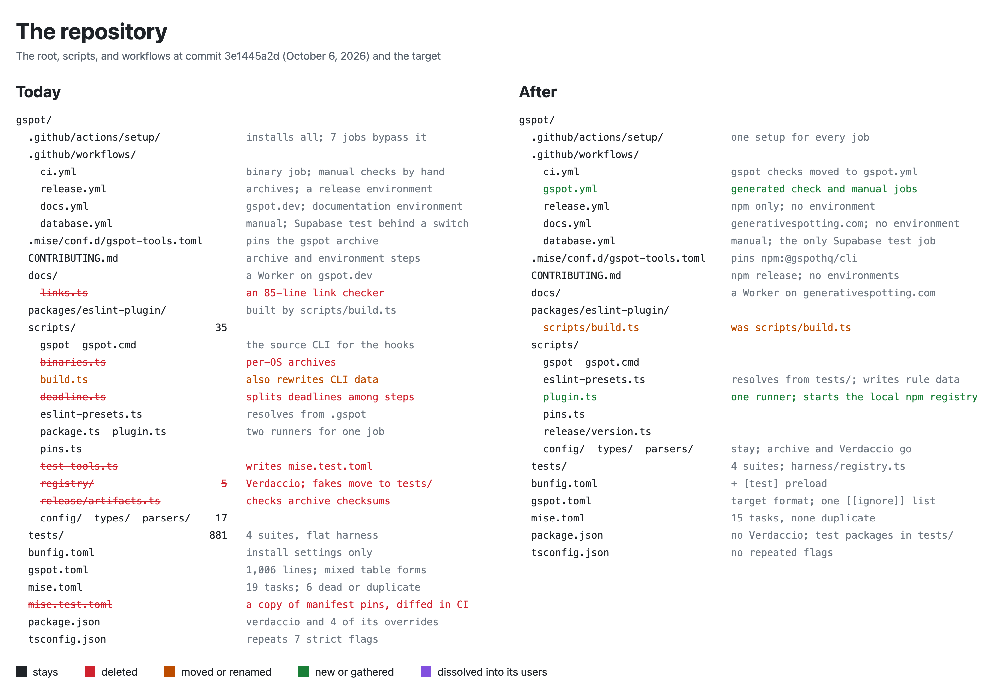
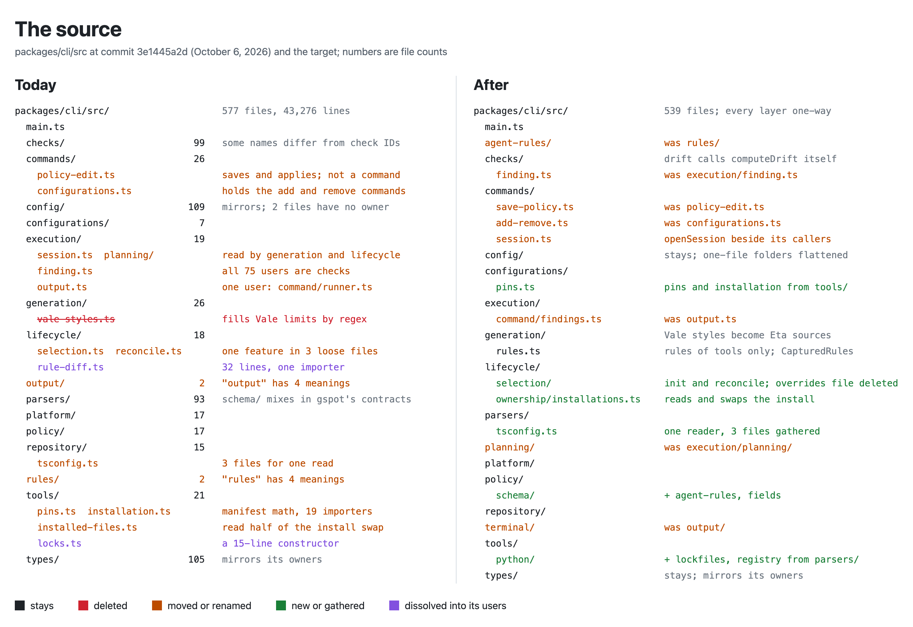
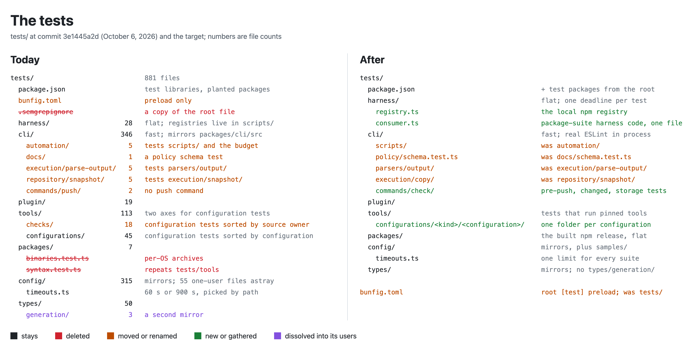
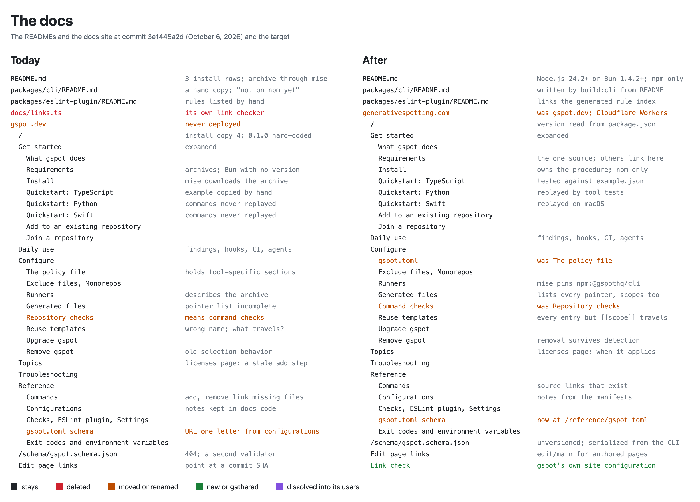
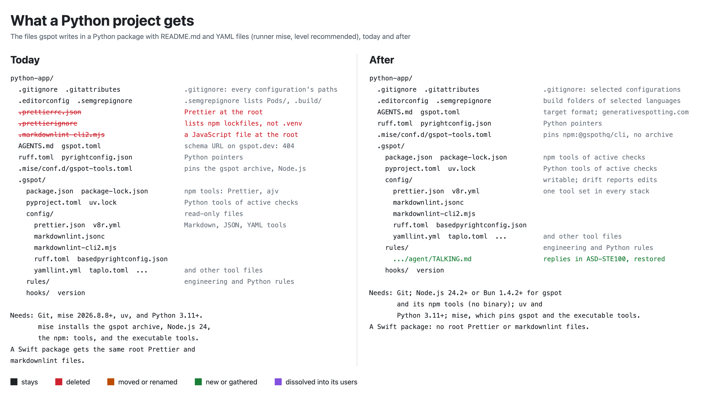

# Unresolved Findings

175 unresolved review records remain. 54 come from the review of October 6, 2026 and the owner decisions of that day. 121 are older records that the same review checked and kept open. Each record has a stable ID. Owner decisions are in [progress](findings/progress.json); they win over any record.

On October 6, 2026, a read-only verification checked all 802 older records against commit `3e1445a2d` and closed 203. The owner decisions of October 6 and 7, 2026 closed 15 more. A coherence check then compared every open record with the decisions and with every other record, and closed 272 duplicates, superseded records, and wrong records. [The closed list](findings/review/closed.md) gives the evidence for each. Each older findings file ends with a "Status on October 6, 2026" table that gives the current file and what remains; the original rows above it are history.

## Start here

1. [Owner decisions](findings/review/owner-decisions.md): what the owner decided on October 6 and 7, 2026.
    - The per-OS binaries and `CONTRIBUTING.md` go for good.
    - The ASD-STE100 rule comes back, and every banned naming term comes back at level `all` only.
    - The docs move to generativespotting.com on Cloudflare, with no GitHub environments.
    - One local npm registry in `tests/harness/registry.ts` replaces Verdaccio and the other npm test registry. The Python index stays only for the private-index credential tests.
2. [Owner questions](findings/review/owner-questions.md): every question has an answer. Its "Answers of October 6, 2026" section answers every record whose kind is decision.
3. [Vocabulary](findings/review/glossary.md): one name for each concept. Every record uses these names; where an older record says otherwise, the vocabulary wins.
4. Nothing can be installed yet. `@gspothq/cli` returns 404 on npm, and no tag or release exists (`main/001`).
5. The working tree exports authored template customization except scopes and keeps raw values through import and re-export. Full tutorial, native-tool, and platform acceptance remains pending ([commands and templates](findings/review/commands-templates.md)).
6. The working tree has a shared canonical policy writer and adopted TOML format. Comment preservation, omitted defaults, visible manual choices, and explicit empty paths have focused acceptance evidence. Native Taplo and full release validation remain pending ([format review](findings/review/policy-format.md)).
7. This repository's gspot.toml hides problems instead of fixing them. The `tests` scope selects framework configurations for plain test files. Many exceptions are dead, and the architecture layers allow two-way imports ([exceptions](findings/review/policy-exceptions.md)).
8. Carve-outs: test time limits sit in at least six places. The owner rule is one setting for each concern ([carve-outs](findings/review/carve-outs.md)).
9. File and folder names: `commands/policy-edit.ts`, `tools/installed-files.ts`, and `tools/installation.ts` are explained, with a target tree and a move table, in [the source layout review](findings/review/source-layout.md). [The test layout review](findings/review/tests-layout.md) has the same for `tests/`.

917 records are implemented and verified. The implementation commits, evidence, and current status are in each review file and [progress](findings/progress.json). Original IDs and quotations remain. Shared verification evidence is in [verification.json](findings/verification.json).

## Review of October 6, 2026

Read-only reviewers read every folder of the repository. Each file below holds a findings table and the sections its reviewer added, such as simpler designs, library replacements, carve-outs, target trees, and move tables. Each file ends with a "Not read" section that says what its reviewer did not read.

| Review                                                                                                | Open records |
| ----------------------------------------------------------------------------------------------------- | -----------: |
| [Owner decisions of October 6, 2026](findings/review/owner-decisions.md)                              |            1 |
| [Owner questions and their answers](findings/review/owner-questions.md)                               |              |
| [Vocabulary: one name for each concept](findings/review/glossary.md)                                  |            7 |
| [Commands and templates](findings/review/commands-templates.md)                                       |            1 |
| [The gspot.toml format](findings/review/policy-format.md)                                             |           16 |
| [This repository's own gspot.toml exceptions](findings/review/policy-exceptions.md)                   |            4 |
| [Carve-outs](findings/review/carve-outs.md)                                                           |            1 |
| [Source layout, names, and import graph](findings/review/source-layout.md)                            |            2 |
| [Code: commands, lifecycle, policy, generation](findings/review/code-commands.md)                     |            4 |
| [Code: execution, tools, parsers, platform, repository, checks](findings/review/code-execution.md)    |            2 |
| [Configurations and the ESLint plugin](findings/review/configurations-plugin.md)                      |            1 |
| [Test layout and wiring](findings/review/tests-layout.md)                                             |            5 |
| [Tests in tests/cli](findings/review/tests-cli.md)                                                    |            3 |
| [Tests in tests/tools, tests/plugin, tests/packages, and the harness](findings/review/tests-tools.md) |            3 |
| [READMEs, guides, and the docs site](findings/review/docs-site.md)                                    |            0 |
| [Repository root, scripts, workflows, and dependencies](findings/review/repository-root.md)           |            4 |
| [Found while verifying the older records](findings/review/verification.md)                            |            0 |

## Older reviews

These records come from the reviews of October 3, 2026. The record IDs and their original text are kept. The status table at the end of each file gives the current location and what remains.

| Review                                                                                                         | Open records |
| -------------------------------------------------------------------------------------------------------------- | -----------: |
| Pending summary records (below)                                                                                |            5 |
| [Findings From Implementation Verification](findings/additional.md)                                            |            1 |
| [Built-in Checks](findings/areas/checks.md)                                                                    |           11 |
| [Developer Experience in Non-JavaScript and Mixed Projects](findings/areas/developer-experience.md)            |            2 |
| [Integration Tests Outside the Checks Folder](findings/areas/integration-tests.md)                             |            4 |
| [Kits, Settings, and Names](findings/areas/kits.md)                                                            |           18 |
| [Repository Setup and Ceremony](findings/areas/repository.md)                                                  |            1 |
| [Native-Tool, Acceptance, and Package Tests](findings/areas/tool-tests.md)                                     |            7 |
| [Unit Tests and Check Integration Tests](findings/areas/unit-tests.md)                                         |            0 |
| [Checks: Database, Framework, Library, Platform, Tool, and the Registry](findings/slices/checks-other.md)      |            4 |
| [The Config Constants](findings/slices/config.md)                                                              |            3 |
| [Kits: Frameworks, Libraries, Platforms, Tools, and Postgres](findings/slices/kits-frameworks-tools.md)        |            7 |
| [Kits: General](findings/slices/kits-general.md)                                                               |            1 |
| [Kits: Python, Swift, Bash, and SQL](findings/slices/kits-other-languages.md)                                  |            3 |
| [Kits: JavaScript, TypeScript, CSS, HTML, and Markdown](findings/slices/kits-web-languages.md)                 |            5 |
| [Tests: Acceptance](findings/slices/tests-acceptance.md)                                                       |            3 |
| [Tests: Check Integration Tests](findings/slices/tests-integration-checks.md)                                  |            9 |
| [Tests: Command, Policy, Platform, and Tools Integration Tests](findings/slices/tests-integration-commands.md) |            7 |
| [Tests: Execution Integration Tests](findings/slices/tests-integration-execution.md)                           |            3 |
| [Tests: Generation Integration Tests](findings/slices/tests-integration-generation.md)                         |            1 |
| [Tests: Lifecycle and Repository Integration Tests](findings/slices/tests-integration-lifecycle.md)            |            6 |
| [Tests: Native-Tool Tests and Samples](findings/slices/tests-tools-samples.md)                                 |           22 |

## Pending summary records

These summary records stay open. The last row is the one open record of the repository diagram.

| ID                       | Review section                                                                                                            | Status  | What remains                                                                                                                                                                                                                                                                                                                                                                                                                                                                                                                                                                                                                                                                                                                                                                                                                                                                                                                                                                                                                                                                            |
| ------------------------ | ------------------------------------------------------------------------------------------------------------------------- | ------- | --------------------------------------------------------------------------------------------------------------------------------------------------------------------------------------------------------------------------------------------------------------------------------------------------------------------------------------------------------------------------------------------------------------------------------------------------------------------------------------------------------------------------------------------------------------------------------------------------------------------------------------------------------------------------------------------------------------------------------------------------------------------------------------------------------------------------------------------------------------------------------------------------------------------------------------------------------------------------------------------------------------------------------------------------------------------------------------- |
| `main/001`               | The biggest problems                                                                                                      | partial | Publish the first version of `@gspothq/eslint-plugin` and then `@gspothq/cli` to npm by hand with a short-lived granular npm token (`npm publish ./packages/eslint-plugin`, then `npm publish ./packages/cli`, after `mise run build:cli`), once the per-OS archives are gone (`review/owner-decisions/001`). Then configure npm trusted publishing on both packages for this repository and `.github/workflows/release.yml`, with no GitHub environment (`review/owner-decisions/006`, which also rewrites the comment at `release.yml:105-106`), and cut later releases with the manual `release.yml` run. Add `CLOUDFLARE_API_TOKEN` and `CLOUDFLARE_ACCOUNT_ID` as repository secrets, so that `docs.yml` serves the site at generativespotting.com (`review/owner-decisions/004`).                                                                                                                                                                                                                                                                                                 |
| `main/017`               | Why `check-state.ts`, `json-schema.ts`, `loosening.ts`, `normalize.ts`, `setting-surface.ts`, and `written-keys.ts` exist | partial | Name the `Policy` fields exactly as their TOML keys (answer to owner question Q10). In `buildPolicy` (`packages/cli/src/policy/normalize.ts:155-193`), rename `checks` to `check`, `agentRules` to `agent_rules`, `ignores` to `ignore`, and `scopes` to `scope`, and delete the `agent_rules: policy.agentRules` map-back in `packages/cli/src/policy/settings/entries.ts:211`. Fields that no single TOML key holds (`configurationSettings`, `scopeTables`, `declarations`) keep their names. Update the `Policy` type in `packages/cli/src/types/policy/settings.ts:102-126` and every reader.                                                                                                                                                                                                                                                                                                                                                                                                                                                                                      |
| `main/064`               | From the second pass                                                                                                      | partial | Apply the remaining agent-rule layout changes in `packages/cli/configurations/general/engineering/rules/`. Merge `prose/DOCS-REVIEW.md` into `prose/DOCS.md` as its last section and delete `DOCS-REVIEW.md`. Move the "Casing across languages" section of `code/NAMING-FILES.md` (lines 10-24, with its table) into `code/NAMING.md`, and its "Structural ownership" section (lines 60-66, which `review/configurations-plugin/066` also edits) into `agent/WORKING.md`; change the intro of `NAMING-FILES.md` to name only the two sections it keeps, "Files and directories" and "Boundaries and external names" (it has no Tests section). Run `gspot apply` so this repository's written copies of the agent rules follow. Do not merge `TALKING.md` into `WRITING.md`: `review/owner-decisions/002` restores `TALKING.md`. The `PLAYWRIGHT.md` move is `slices/kits-frameworks-tools/053`, the `NEXTINTL.md` condition is `review/verification/015`, the `NODE.md` condition is `areas/developer-experience/026`, and the `TASKS.md` move is `review/configurations-plugin/054`. |
| `main/097`               | Phase 1: fix the bugs                                                                                                     | open    | In `packages/cli/src/checks/tool/xctest.ts:225-229`, stop refusing a scope that has a `Package.swift` and no `tools.xcode.project`. Run `swift test --enable-code-coverage` there, read the coverage report at the path that `swift test --show-codecov-path` prints, and compare each target with its floor.                                                                                                                                                                                                                                                                                                                                                                                                                                                                                                                                                                                                                                                                                                                                                                           |
| `diagram/repository/015` | Repository diagram                                                                                                        | partial | Delete `"catalogue"` from `naming.banned` at `gspot.toml:45`: typos with `en-us` already reports that spelling. The ten automatic general configurations at `gspot.toml:6-25` are `review/policy-exceptions/004`, and the repeated `scripts/**` in `tools.eslint.script_files` is `review/policy-exceptions/024`.                                                                                                                                                                                                                                                                                                                                                                                                                                                                                                                                                                                                                                                                                                                                                                       |

## Architecture material

- [Built-in Checks](findings/areas/checks.md)
- [Commands, Lifecycle, Generation, and Output](findings/areas/commands.md)
- [READMEs, Guides, Reference, and the Docs Site](findings/areas/docs.md)
- [Execution, Tools, Repository, Platform, and Parsers](findings/areas/execution.md)
- [Policy, Kits, Rules, Config, and Types](findings/areas/policy.md)
- [Repository Setup and Ceremony](findings/areas/repository.md)
- [Test Structure: Tiers, Harness, and Samples](findings/areas/test-structure.md)

## Diagrams

Each image compares the tree at commit `3e1445a2d` (October 6, 2026) with the target that the owner decisions and the open records describe. Every "After" annotation comes from a decision or an open record. If an image and a record ever disagree, the record and the decisions win.

Red means deleted. Orange means moved or renamed. Green means new, or gathered from several places. Purple means dissolved into the code that uses it.

### Repository

### Source

### Tests

### Docs

### What a Python project gets

## Verified implementation status on October 8, 2026

Original IDs and quotations remain above.

| ID         | Status   | Implementation and verification                                                                                                                                                                                                                                                                                                                                                                                                                                                                                                                            |
| ---------- | -------- | ---------------------------------------------------------------------------------------------------------------------------------------------------------------------------------------------------------------------------------------------------------------------------------------------------------------------------------------------------------------------------------------------------------------------------------------------------------------------------------------------------------------------------------------------------------- |
| `main/097` | complete | Swift packages run swift test with coverage and consume its reported coverage path without Xcode project. Actual macOS native source-CLI probe: Core83percent below explicit100floor, Auxiliary100percent passes; added missing branch then both targets pass. Eleven assertions preserve authored bytes/mode. Native unrestricted probe log and evidence refs retained. Integrated staged137pass14skip0findings and normal hooks passed; broader Linux/platform acceptance remains in its own records. Commit `ca2975ca5552d3276e78bbd6d897c44cfdf70a09`. |

## Implementation checkpoint 59d271c9c of October 8, 2026

Original records and quotations remain above. These records are complete at `59d271c9ceedb7ec9b2dee75d44330a825fa1a1d`.

| ID         | Status   | Evidence                                                                                                                                                                                                                                                                                                                                                                                                                                                                                                                                      |
| ---------- | -------- | --------------------------------------------------------------------------------------------------------------------------------------------------------------------------------------------------------------------------------------------------------------------------------------------------------------------------------------------------------------------------------------------------------------------------------------------------------------------------------------------------------------------------------------------- |
| `main/017` | complete | Policy check, agent_rules, ignore and scope fields now exactly match public TOML keys. Obsolete entries owner is deleted; repository-wide reader search finds no old policy property access. Composite configurationSettings, scopeTables and declarations retain their specified ownership. Main normalized/public schema and lifecycle owner family269 cases786assertions pass; Root types0; full staged63 passing checks and corrected affected6 pass, original move failures retained. Commit `59d271c9ceedb7ec9b2dee75d44330a825fa1a1d`. |
