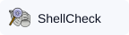
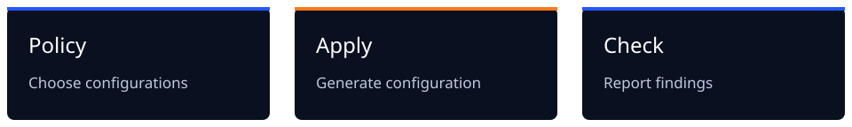

<picture>
  <source media="(prefers-color-scheme: dark)" srcset="docs/public/brand/readme/banner-dark.svg">
  <source media="(prefers-color-scheme: light)" srcset="docs/public/brand/readme/banner-light.svg">
  
</picture>

[](docs/src/content/docs/guides/install.md)
[](docs/README.md)
[](LICENSE.md)
[](docs/src/content/docs/guides/testing.md)

**Lint AI generated code.**

gspot configures linters, runs checks, and generates instructions for coding agents from one configuration file.

Edit `gspot.toml` to choose checks. See [edit and retain repository files](docs/src/content/docs/guides/generated-files.md) for what to commit and keep for recovery.

**Unreleased:** use a source checkout. Local builds and package tests do not establish a
published release or native verification on every target platform.

<p>
  
  
  
  
  
  
</p>

See the [configuration reference](https://gspot.dev/reference/configurations/) for supported technologies.

## Check a JavaScript module

A client module reads private configuration:

```javascript
"use client";
export const endpoint = process.env.PRIVATE_API_URL;
```

The `gspot/no-client-environment` rule reports the read at line 2, column 25. Keep the private
work on the server and let the client name a public route:

```javascript
"use client";
export const endpoint = "/api/search";
```

The corrected module produces no finding from this rule. The application still needs a server
implementation for the route. Follow the [executable JavaScript example](docs/src/content/docs/guides/client-environment.md)
for setup, the captured diagnostic, and verification.

## Source checkout setup

Complete the [source installation](docs/src/content/docs/guides/install.md), including Git,
mise, and the pinned Bun and Node runtimes. The guide defines a `gspot` shell function for
the checkout.

Change to the repository you want to configure. Preview the proposal, then initialize and check:

```shell
gspot init --dry-run
gspot init
gspot check
```

Review the proposed files and integrations before accepting. Initialization installs selected
tools unless you pass `--no-install`; lock resolution can still use the network. Initialization
runs no checks. For a disposable example, follow [your first check](docs/src/content/docs/guides/quick-start.md).

## Set repository policy

A complete policy can select one language:

```toml
version = 1
configurations = ["javascript"]
level = "recommended"
```



`recommended` is the default. `all` adds further naming, ordering, and style checks. Mandatory
trivial-file and trivial-function rules remain enabled at both levels. Change policy with
`gspot set` or `gspot ignore`; those commands apply their changes. Run `gspot apply` after
editing `gspot.toml` directly. Do not edit generated files under `.gspot/`.

Use [scopes](docs/src/content/docs/guides/scopes.md) for nested projects and
[profiles](docs/src/content/docs/guides/profiles.md) to share policy between repositories.
The [customization guide](docs/src/content/docs/guides/customize.md) covers settings and narrow exceptions.

## Daily commands

| Command                 | Purpose                                                                 |
| ----------------------- | ----------------------------------------------------------------------- |
| `gspot check`           | Run selected checks.                                                    |
| `gspot check --staged`  | Check staged content while preserving unstaged edits.                   |
| `gspot check --changed` | Select affected checks from working-tree changes.                       |
| `gspot install`         | Install the repository's locked tools and selected hooks after cloning. |
| `gspot doctor`          | Diagnose missing tools, configuration drift, and check coverage.        |

An affected project check can report defects in unchanged files. Local hooks can be bypassed;
[CI checks](docs/src/content/docs/guides/hooks-and-ci.md) run independently.
For removal, preview `gspot uninstall --dry-run` and follow
[restoration and recovery](docs/src/content/docs/guides/uninstall.md).
If setup or a check cannot run, use the
[troubleshooting guide](docs/src/content/docs/guides/troubleshooting.md) to diagnose the failure.

## Contribute

Read the [build and testing guide](docs/src/content/docs/guides/build.md) and the
[documentation conventions](docs/README.md). The [standalone ESLint plugin](packages/eslint-plugin/README.md)
can also run without the CLI.

See [artwork sources and licenses](docs/README.md#identity-and-layout-assets) for the generated mark,
upstream logos, and adapted layout.

## License

[Apache-2.0](LICENSE.md).
