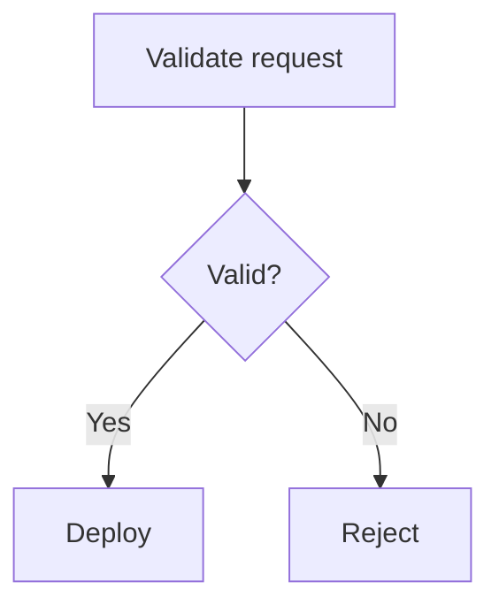

# Documentation Media

User interface instructions, keyboard input, illustrations, and accessibility.

## Document user interfaces precisely

User interface instructions must match the current product.

### Reproduce labels exactly

Match the visible:

- Wording.
- Capitalization.
- Punctuation.

Use bold for interactive labels:

```markdown
Select **Create project**.
```

Use sentence case in prose even when the visual interface uses all-uppercase
styling, unless the uppercase letters are part of the actual label.

### Use consistent interaction verbs

- Select: Choose a button, tab, menu, checkbox, radio option, or dropdown value
  in general product documentation.
- Click: Use when mouse interaction is relevant and the project style chooses
  device-specific language.
- Enter: Supply text in a user interface field.
- Run: Execute a command.
- Press: Use a keyboard key.
- Open: Navigate to a page, file, or application.
- Expand: Reveal a collapsed section.
- Deselect: Clear a selected checkbox or option.

Choose one project convention for buttons and menus. Do not alternate between
"click," "press," "hit," and "tap" without a device-specific reason.

### Write location before action

Use:

```text
In **Visibility**, select **Private**.
```

For navigation paths:

```markdown
In the left sidebar, select **Settings** > **Access control**.
```

Keep the separator outside bold formatting.

### Do not rely only on position or appearance

Name the element. Do not say only:

- The button on the right.
- The green icon.
- The box below.
- The second menu.

Position changes in responsive layouts, and appearance is not available to
every reader.

Use position only as secondary orientation:

```text
In the upper-right corner, select **Account**.
```

### Document responsive differences only when needed

Describe a responsive state when the action becomes ambiguous:

```text
Select **Security**. If **Security** is not visible, expand the repository menu.
```

Do not document every visual arrangement at every viewport size.

### Document fields efficiently

When field labels and help text are self-explanatory, use:

```text
Complete the fields.
```

Explain only fields with non-obvious requirements.

When several fields need details, use a list or configuration reference instead
of one overloaded step.

### State permissions and availability

Before the procedure, state:

- Required role or access level.
- Required product, plan, or feature availability.
- Deployment-mode limits.
- Whether an administrator must enable the feature.

Do not confuse a role with a permission. Use the level that directly controls
the action.

## Document keyboard input consistently

Use an HTML `<kbd>` element for each key:

```html
<kbd>Command</kbd>+<kbd>B</kbd>
```

Rules:

- Put no spaces around `+` in a simultaneous key combination.
- Capitalize letter keys.
- Spell out action keys, such as `Control`, `Command`, `Shift`, and `Delete`.
- Use `Command`, `Option`, and `Control` for macOS.
- Use `Ctrl` and `Alt` for Windows and Linux when that matches platform
  conventions.
- Use arrow symbols `↑`, `↓`, `←`, and `→`.
- Distinguish a simultaneous combination from a sequence.

Use:

```text
Press <kbd>Command</kbd>+<kbd>B</kbd>.
```

For platform variants, present macOS first when the project is Apple-first.
Otherwise, order variants by the project's primary audience and use the same
order throughout the documentation.

Prefer a visible user interface procedure when both the interface and shortcut
exist. Document shortcuts when they are the primary or more efficient path.

## Use illustrations only when they add meaning

Illustrations include screenshots, diagrams, charts, and other static images.

Use an illustration when it materially clarifies:

- A complex relationship.
- A multi-step flow.
- A spatial user interface state.
- An architecture boundary.
- A comparison that prose cannot express as clearly.

Do not add an illustration merely to make a page look less textual.

Every illustration must supplement text, not replace it.

### Screenshots

Use a screenshot when exact visual context is important and text alone cannot
orient the reader.

Before capture:

- Use a current product build.
- Set the interface to the standard project theme.
- Use realistic but fictional data.
- Remove personal and secret information.
- Close irrelevant panels and notifications.
- Resize the window to reduce empty space.

During capture:

- Include only the relevant interface.
- Preserve enough context to orient the reader.
- Avoid browser chrome unless it matters.
- Avoid sidebars that add no value and change frequently.
- Use one consistent scale across a page.

After capture:

- Crop unused space.
- Confirm text remains legible.
- Compress the image.
- Preview it at the rendered size.
- Check both light and dark documentation themes when relevant.

Use a red or otherwise project-standard arrow callout when a visual highlight is
necessary. Do not rely on the callout color alone. Mention the highlighted
element in alt text.

### Image files

Use:

- PNG for user interface screenshots.
- SVG for diagrams and line art when the source is safe and editable.
- JPEG or WebP for photographic material when the renderer supports it and the
  smaller file provides a real benefit.

Keep images in a local documentation-owned image directory. Do not hotlink
essential images from an external host.

Use lowercase kebab-case filenames that describe the subject, action, and
important interface element:

```text
repository-create-button.png
deployment-request-flow.drawio.svg
```

Do not use names such as `image1.png` or `new-screenshot.png`.

For a screenshot without a project-specific budget, target:

- Width of 1000 pixels or less.
- Height of 500 pixels or less.
- File size of 100 KB or less when legibility permits.

These are maintenance targets, not permission to make text unreadable.

When the interface changes frequently, add a version suffix only if the
documentation workflow uses versions to track image refreshes consistently.

### Animated images

Avoid animated GIFs.

Animations:

- Distract readers.
- Are difficult to pause and inspect.
- Increase page weight.
- Are difficult to localize.
- Can create accessibility problems.
- Become stale quickly.

Use a static screenshot, a small sequence of screenshots, or an accessible
video with text instructions.

### Diagrams

Use a diagram for processes, state transitions, architecture, or entity
relationships that are difficult to understand from prose.

Prefer Mermaid when the renderer supports it because the source is searchable,
reviewable, and versioned with the text.

Use an editable SVG created by an approved diagram tool when Mermaid cannot
produce a clear layout. Store the editable diagram definition with the asset.

Diagram rules:

- Include only essential elements.
- Use rectangles for processes and diamonds for decisions.
- Use arrows for direction.
- Use solid and dotted lines consistently for defined relationship types.
- Use shape and labels, not color alone, to distinguish meaning.
- Give equal concepts equal shapes and sizes.
- Keep labels short.
- Leave enough space around text.
- Break one complex diagram into several focused diagrams.
- Do not embed untestable links.
- Check small-screen rendering.
- Update the diagram with the behavior it represents.

For Mermaid, include accessibility metadata when supported:

````markdown

````

### Videos

Videos may reinforce text but must not replace it.

For every video:

- Document the complete essential procedure in text.
- Provide captions.
- Provide a transcript or equivalent text for unique information.
- State the publication date when staleness is likely.
- Link instead of embedding unless the embed provides a clear reader benefit.
- Use `privacy-enhanced` embedding when the platform supports it.
- Do not commit large video files to the product repository without an
  established asset workflow.

Remove or replace outdated videos.

## Make all documentation accessible

Accessibility is a content requirement, not an optional review pass.

### Use semantic structure

- Use headings for hierarchy.
- Use lists for list relationships.
- Use tables only for tabular data.
- Use code formatting for code.
- Use alerts for defined alert meanings.
- Do not imitate structure with bold text, spaces, or blank lines.

### Do not rely on visual styling

Never communicate essential meaning only through:

- Color.
- Bold.
- Italics.
- Position.
- Shape.
- An icon.
- An image.

Name the state or action in text.

### Write useful alt text

Every meaningful image needs alt text.

Alt text:

- Express the image's purpose in the current context.
- Include the most relevant state or relationship.
- Be between 40 and 155 characters.
- Use sentence case.
- End with punctuation.
- Mention a visible highlight when the highlight matters.
- Avoid formatting syntax.
- Avoid repeating the surrounding paragraph.

For screenshots, begin with the useful visual type and product context:

```markdown

```

For diagrams:

```markdown

```

Do not start with "Image of" or "Graphic of." Screen readers already identify an
image.

For complex diagrams, provide a short alt description, and explain the complete
flow in nearby text.

Use empty alt text for a purely decorative image:

```markdown

```

Do not omit the alt attribute accidentally.

### Keep links accessible

- Use descriptive link text.
- Do not rely on color alone to distinguish links.
- Avoid several adjacent links with no separating text.
- Do not open a new window without a platform-standard reason and visible
  indication.

### Keep tables accessible

- Provide headers.
- Keep reading order logical.
- Avoid merged cells.
- Avoid blank cells.
- State the meaning of icons in text or accessible labels.
- Break wide tables into smaller structures.

### Keep instructions input-neutral

Use general verbs such as "select" unless a specific device action matters.
Do not assume every reader uses a mouse, touchscreen, or physical keyboard.

### Check cognitive accessibility

- Keep steps short.
- Put prerequisites first.
- Explain unfamiliar terms.
- Avoid unnecessary choices.
- Use consistent names.
- Avoid surprise navigation.
- Keep warnings close to the risky action.
