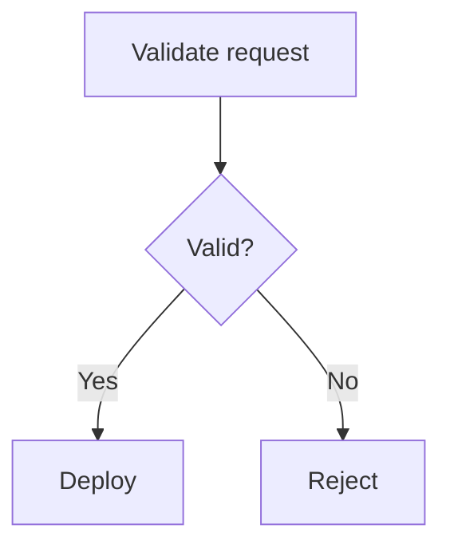

# Documentation Media

User interface instructions, keyboard input, illustrations, and accessibility.

## Document user interfaces precisely

User interface instructions must match the current product.

### Reproduce labels exactly

Match the visible:

- Wording. `unenforced`
- Capitalization. `unenforced`
- Punctuation. `enforced-by: prose/vale gspot.dashes`

Use bold for interactive labels:

```markdown
Select **Create project**.
```

Use sentence case in prose even when the visual interface uses all-uppercase `unenforced`
styling, unless the uppercase letters are part of the actual label.

### Use consistent interaction verbs

- Select: Choose a button, tab, menu, checkbox, radio option, or dropdown value
  in general product documentation. `enforced-by: prose/vale gspot.interface-verbs`
- Click: Use when mouse interaction is relevant and the project style chooses
  device-specific language. `enforced-by: prose/vale gspot.interface-verbs`
- Enter: Supply text in a user interface field. `enforced-by: prose/vale gspot.interface-verbs`
- Run: Execute a command. `unenforced`
- Press: Use a keyboard key. `enforced-by: prose/vale gspot.interface-verbs`
- Open: Navigate to a page, file, or application. `unenforced`
- Expand: Reveal a collapsed section. `unenforced`
- Deselect: Clear a selected checkbox or option. `enforced-by: prose/vale gspot.interface-verbs`

Choose one project convention for buttons and menus. Do not alternate between `unenforced`
"click," "press," "hit," and "tap" without a device-specific reason.

### Write location before action

Use:

```text
In **Visibility**, select **Private**.
```

For navigation paths:

```markdown
In the left sidebar, select **Settings** > **Access control**.
```

Keep the separator outside bold formatting. `unenforced`

### Do not rely only on position or appearance

Name the element. Do not say only:

- The button on the right. `unenforced`
- The green icon. `enforced-by: prose/vale gspot.symbols`
- The box below. `unenforced`
- The second menu. `unenforced`

Position changes in responsive layouts, and appearance is not available to
every reader.

Use position only as secondary orientation:

```text
In the upper-right corner, select **Account**.
```

### Document responsive differences only when needed

Describe a responsive state when the action becomes ambiguous:

```text
Select **Security**. If **Security** is not visible, expand the repository menu.
```

Do not document every visual arrangement at every viewport size. `unenforced`

### Document fields efficiently

When field labels and help text are self-explanatory, use:

```text
Complete the fields.
```

Explain only fields with non-obvious requirements. `unenforced`

When several fields need details, use a list or configuration reference instead
of one overloaded step.

### State permissions and availability

Before the procedure, state:

- Required role or access level. `unenforced`
- Required product, plan, or feature availability. `unenforced`
- Deployment-mode limits. `unenforced`
- Whether an administrator must enable the feature. `unenforced`

Do not confuse a role with a permission. Use the level that directly controls `unenforced`
the action.

## Document keyboard input consistently

Use an HTML `<kbd>` element for each key:

```html
<kbd>Command</kbd>+<kbd>B</kbd>
```

Rules:

- Put no spaces around `+` in a simultaneous key combination. `unenforced`
- Capitalize letter keys. `unenforced`
- Spell out action keys, such as `Control`, `Command`, `Shift`, and `Delete`. `enforced-by: prose/vale gspot.acronyms`
- Use `Command`, `Option`, and `Control` for macOS. `unenforced`
- Use `Ctrl` and `Alt` for Windows and Linux when that matches platform
  conventions. `enforced-by: prose/vale gspot.alt-text`
- Use arrow symbols `↑`, `↓`, `←`, and `→`. `enforced-by: prose/vale gspot.symbols`
- Distinguish a simultaneous combination from a sequence. `unenforced`

Use:

```text
Press <kbd>Command</kbd>+<kbd>B</kbd>.
```

For platform variants, present macOS first when the project is Apple-first.
Otherwise, order variants by the project's primary audience and use the same
order throughout the documentation.

Prefer a visible user interface procedure when both the interface and shortcut `unenforced`
exist. Document shortcuts when they are the primary or more efficient path.

## Use illustrations only when they add meaning

Illustrations include screenshots, diagrams, charts, and other static images.

Use an illustration when it materially clarifies:

- A complex relationship. `unenforced`
- A multi-step flow. `unenforced`
- A spatial user interface state. `unenforced`
- An architecture boundary. `enforced-by: prose/vale gspot.interface-verbs`
- A comparison that prose cannot express as clearly. `enforced-by: prose/vale gspot.interface-verbs`

Do not add an illustration merely to make a page look less textual. `unenforced`

Every illustration must supplement text, not replace it. `unenforced`

### Screenshots

Use a screenshot when exact visual context is important and text alone cannot `unenforced`
orient the reader.

Before capture:

- Use a current product build. `unenforced`
- Set the interface to the standard project theme. `unenforced`
- Use realistic but fictional data. `unenforced`
- Remove personal and secret information. `enforced-by: secrets/gitleaks`
- Close irrelevant panels and notifications. `unenforced`
- Resize the window to reduce empty space. `unenforced`

During capture:

- Include only the relevant interface. `unenforced`
- Preserve enough context to orient the reader. `unenforced`
- Avoid browser chrome unless it matters. `unenforced`
- Avoid sidebars that add no value and change frequently. `unenforced`
- Use one consistent scale across a page. `unenforced`

After capture:

- Crop unused space. `unenforced`
- Confirm text remains legible. `unenforced`
- Compress the image. `enforced-by: prose/vale gspot.interface-verbs`
- Preview it at the rendered size. `unenforced`
- Check both light and dark documentation themes when relevant. `unenforced`

Use a red or otherwise project-standard arrow callout when a visual highlight is `unenforced`
necessary. Do not rely on the callout color alone. Mention the highlighted
element in alt text.

### Image files

Use:

- PNG for user interface screenshots. `unenforced`
- SVG for diagrams and line art when the source is safe and editable. `unenforced`
- JPEG or WebP for photographic material when the renderer supports it and the
  smaller file provides a real benefit. `unenforced`

Keep images in a local documentation-owned image directory. Do not hotlink `unenforced`
essential images from an external host.

Use lowercase kebab-case filenames that describe the subject, action, and `unenforced`
important interface element:

```text
repository-create-button.png
deployment-request-flow.drawio.svg
```

Do not use names such as `image1.png` or `new-screenshot.png`. `unenforced`

For a screenshot without a project-specific budget, target:

- Width of 1000 pixels or less. `unenforced`
- Height of 500 pixels or less. `unenforced`
- File size of 100 KB or less when legibility permits. `unenforced`

These are maintenance targets, not permission to make text unreadable.

When the interface changes frequently, add a version suffix only if the
documentation workflow uses versions to track image refreshes consistently.

### Animated images

Avoid animated GIFs. `unenforced`

Animations:

- Distract readers. `unenforced`
- Are difficult to pause and inspect. `unenforced`
- Increase page weight. `unenforced`
- Are difficult to localize. `unenforced`
- Can create accessibility problems. `unenforced`
- Become stale quickly. `unenforced`

Use a static screenshot, a small sequence of screenshots, or an accessible `unenforced`
video with text instructions.

### Diagrams

Use a diagram for processes, state transitions, architecture, or entity `enforced-by: prose/vale gspot.interface-verbs`
relationships that are difficult to understand from prose.

Prefer Mermaid when the renderer supports it because the source is searchable, `unenforced`
reviewable, and versioned with the text.

Use an editable SVG created by an approved diagram tool when Mermaid cannot `unenforced`
produce a clear layout. Store the editable diagram definition with the asset.

Diagram rules:

- Include only essential elements. `unenforced`
- Use rectangles for processes and diamonds for decisions. `unenforced`
- Use arrows for direction. `unenforced`
- Use solid and dotted lines consistently for defined relationship types. `unenforced`
- Use shape and labels, not color alone, to distinguish meaning. `unenforced`
- Give equal concepts equal shapes and sizes. `unenforced`
- Keep labels short. `unenforced`
- Leave enough space around text. `unenforced`
- Break one complex diagram into several focused diagrams. `unenforced`
- Do not embed untestable links. `unenforced`
- Check small-screen rendering. `unenforced`
- Update the diagram with the behavior it represents. `unenforced`

For Mermaid, include accessibility metadata when supported:

````markdown

````

### Videos

Videos may reinforce text but must not replace it.

For every video:

- Document the complete essential procedure in text. `unenforced`
- Provide captions. `unenforced`
- Provide a transcript or equivalent text for unique information. `unenforced`
- State the publication date when staleness is likely. `enforced-by: prose/vale gspot.dates`
- Link instead of embedding unless the embed provides a clear reader benefit. `unenforced`
- Use privacy-enhanced embedding when the platform supports it. `unenforced`
- Do not commit large video files to the product repository without an
  established asset workflow. `unenforced`

Remove or replace outdated videos. `unenforced`

## Make all documentation accessible

Accessibility is a content requirement, not an optional review pass.

### Use semantic structure

- Use headings for hierarchy. `unenforced`
- Use lists for list relationships. `unenforced`
- Use tables only for tabular data. `unenforced`
- Use code formatting for code. `unenforced`
- Use alerts for defined alert meanings. `unenforced`
- Do not imitate structure with bold text, spaces, or blank lines. `enforced-by: markdown/markdownlint`

### Do not rely on visual styling

Never communicate essential meaning only through:

- Color. `unenforced`
- Bold. `unenforced`
- Italics. `unenforced`
- Position. `unenforced`
- Shape. `unenforced`
- An icon. `enforced-by: prose/vale gspot.symbols`
- An image. `unenforced`

Name the state or action in text. `unenforced`

### Write useful alt text

Every meaningful image needs alt text. `enforced-by: prose/vale gspot.alt-text`

Alt text:

- Express the image's purpose in the current context. `enforced-by: prose/vale gspot.interface-verbs`
- Include the most relevant state or relationship. `unenforced`
- Be between 40 and 155 characters. `unenforced`
- Use sentence case. `unenforced`
- End with punctuation. `enforced-by: prose/vale gspot.dashes`
- Mention a visible highlight when the highlight matters. `unenforced`
- Avoid formatting syntax. `unenforced`
- Avoid repeating the surrounding paragraph. `enforced-by: prose/vale gspot.paragraph-length`

For screenshots, begin with the useful visual type and product context:

```markdown

```

For diagrams:

```markdown

```

Do not start with "Image of" or "Graphic of." Screen readers already identify an `unenforced`
image.

For complex diagrams, provide a short alt description and explain the complete
flow in nearby text.

Use empty alt text for a purely decorative image:

```markdown

```

Do not omit the alt attribute accidentally. `unenforced`

### Keep links accessible

- Use descriptive link text. `enforced-by: prose/vale gspot.link-text`
- Do not rely on color alone to distinguish links. `unenforced`
- Avoid several adjacent links with no separating text. `unenforced`
- Do not open a new window without a platform-standard reason and visible
  indication. `unenforced`

### Keep tables accessible

- Provide headers. `unenforced`
- Keep reading order logical. `unenforced`
- Avoid merged cells. `unenforced`
- Avoid blank cells. `unenforced`
- State the meaning of icons in text or accessible labels. `enforced-by: prose/vale gspot.symbols`
- Break wide tables into smaller structures. `unenforced`

### Keep instructions input-neutral

Use general verbs such as "select" unless a specific device action matters. `enforced-by: prose/vale gspot.interface-verbs`
Do not assume every reader uses a mouse, touchscreen, or physical keyboard.

### Check cognitive accessibility

- Keep steps short. `unenforced`
- Put prerequisites first. `unenforced`
- Explain unfamiliar terms. `unenforced`
- Avoid unnecessary choices. `unenforced`
- Use consistent names. `unenforced`
- Avoid surprise navigation. `unenforced`
- Keep warnings close to the risky action. `unenforced`
